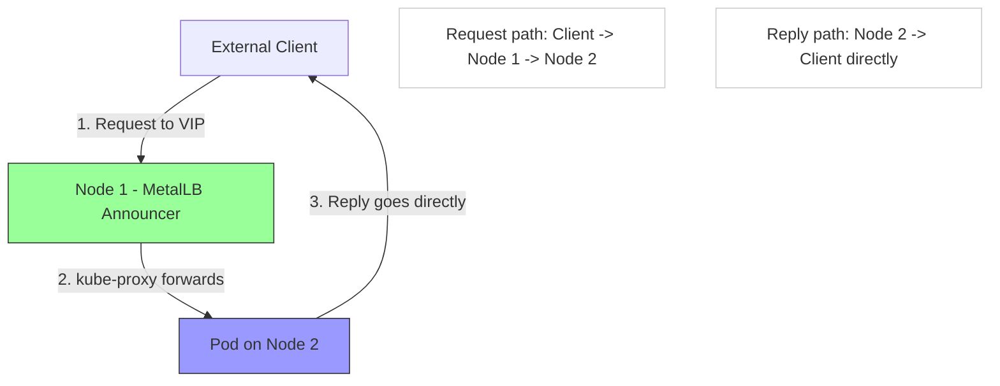
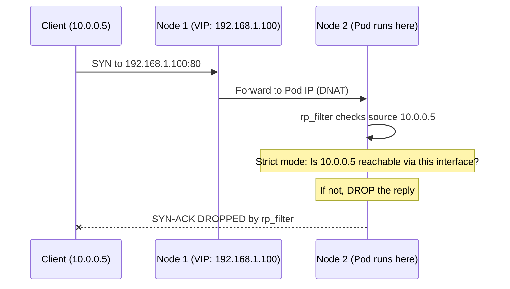
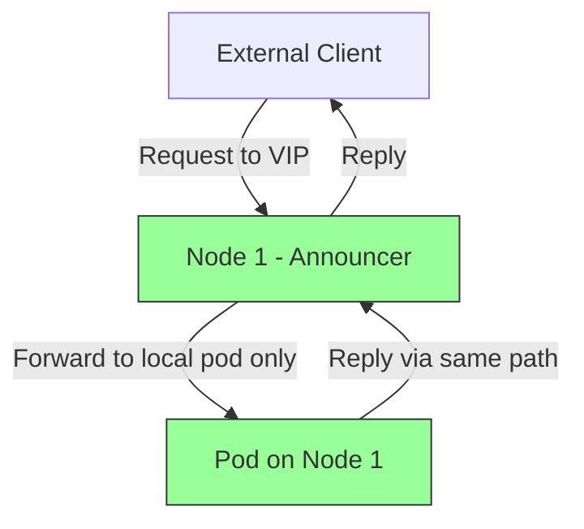
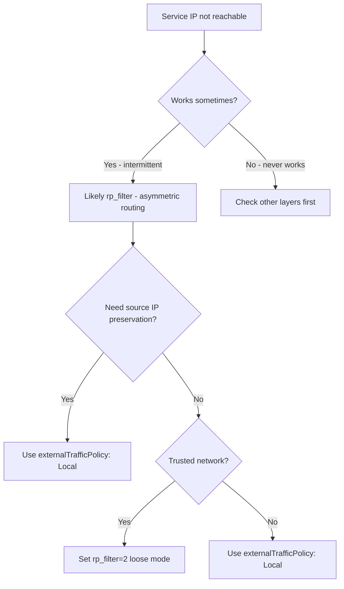

# How to Troubleshoot MetalLB Asymmetric Return Path with rp_filter

Author: [nawazdhandala](https://www.github.com/nawazdhandala)

Tags: Kubernetes, MetalLB, rp_filter, Asymmetric Routing, Troubleshooting

Description: Learn how to fix MetalLB traffic issues caused by Linux reverse path filtering (rp_filter) dropping return packets due to asymmetric routing.

---

One of the trickiest MetalLB issues to debug is when traffic arrives at a node but the response is silently dropped. The culprit is often Linux's reverse path filtering (`rp_filter`), which drops packets that arrive on unexpected interfaces. This post explains the problem, how to diagnose it, and how to fix it safely.

## What Is rp_filter?

Linux's reverse path filter (`rp_filter`) is a security feature that validates the source address of incoming packets. When a packet arrives on an interface, the kernel checks if the source address would be routable back through the same interface. If not, the packet is dropped.

There are three modes:

| Value | Mode | Behavior |
|-------|------|----------|
| 0 | No validation | Accept all packets regardless of source |
| 1 | Strict mode | Drop if source not reachable via receiving interface |
| 2 | Loose mode | Drop only if source not reachable via any interface |

## How This Affects MetalLB

In MetalLB L2 mode, ARP replies direct traffic to one specific node. But kube-proxy may forward the traffic to a pod on a different node. The return traffic from that pod takes a different path back, creating an asymmetric route.



The problem occurs when the reply packet from Node 2 has the VIP as the source address. Node 2's `rp_filter` may drop this packet because the VIP is not a local address on Node 2 - it is only assigned to Node 1 via MetalLB.



## Diagnosing the Problem

### Symptom

- Service has an external IP assigned
- ARP/NDP works correctly (you can see the MAC address)
- TCP connections time out (SYN sent, no SYN-ACK received)
- The issue may be intermittent - works when the pod is on the announcing node, fails when on another node

### Check Current rp_filter Settings

```bash
# SSH into each node and check rp_filter settings
# Check the default and per-interface settings
sysctl net.ipv4.conf.all.rp_filter
sysctl net.ipv4.conf.default.rp_filter

# Check specific interfaces
sysctl net.ipv4.conf.eth0.rp_filter
sysctl net.ipv4.conf.cni0.rp_filter
sysctl net.ipv4.conf.flannel.1.rp_filter
```

If any of these return `1` (strict mode), that is likely causing the issue.

### Verify with Packet Capture

```bash
# On the announcing node (Node 1), capture incoming traffic
sudo tcpdump -i any host 192.168.1.100 -n

# On the pod's node (Node 2), check for dropped packets
sudo tcpdump -i any host 192.168.1.100 -n

# Check kernel drop statistics
cat /proc/net/stat/ip_conntrack 2>/dev/null
netstat -s | grep -i "dropped\|filter"
```

### Check Kernel Logs for Drops

Some kernels log rp_filter drops. Enable logging:

```bash
# Enable logging of martian packets (rp_filter drops)
sudo sysctl -w net.ipv4.conf.all.log_martians=1

# Check kernel logs for drops
sudo dmesg | grep -i "martian\|rp_filter"

# Disable logging when done to avoid log spam
sudo sysctl -w net.ipv4.conf.all.log_martians=0
```

## Fix 1: Set rp_filter to Loose Mode

The safest fix is to switch from strict (1) to loose (2) mode. Loose mode still provides protection against spoofed source addresses but allows asymmetric routing:

```bash
# Set rp_filter to loose mode on all interfaces
sudo sysctl -w net.ipv4.conf.all.rp_filter=2
sudo sysctl -w net.ipv4.conf.default.rp_filter=2
```

To make this persistent across reboots:

```bash
# Create a sysctl config file for MetalLB networking requirements
cat <<EOF | sudo tee /etc/sysctl.d/90-metallb.conf
# Allow asymmetric routing for MetalLB
# Loose mode (2) validates source is reachable via ANY interface
# instead of requiring the SAME interface the packet arrived on
net.ipv4.conf.all.rp_filter = 2
net.ipv4.conf.default.rp_filter = 2
EOF

# Apply the settings
sudo sysctl --system
```

## Fix 2: Disable rp_filter Entirely

In isolated cluster networks where security risk is low, you can disable rp_filter:

```bash
# Disable rp_filter entirely - only for isolated networks
sudo sysctl -w net.ipv4.conf.all.rp_filter=0
sudo sysctl -w net.ipv4.conf.default.rp_filter=0
```

**Warning**: Disabling rp_filter removes protection against IP spoofing attacks. Only do this in trusted network environments.

## Fix 3: Use externalTrafficPolicy: Local

An alternative approach that avoids asymmetric routing entirely is to set `externalTrafficPolicy: Local` on your service:

```yaml
apiVersion: v1
kind: Service
metadata:
  name: my-service
spec:
  type: LoadBalancer
  # Only forward traffic to pods on the node that receives it
  # This eliminates the second hop and asymmetric routing
  externalTrafficPolicy: Local
  selector:
    app: my-app
  ports:
    - port: 80
      targetPort: 8080
```



**Trade-off**: With `externalTrafficPolicy: Local`, MetalLB only announces from nodes that have at least one pod running. If a node has no local pods, it will not advertise the service. This can lead to uneven load distribution.

## Fix 4: Configure via Kubernetes Node Tuning

On clusters using the Node Tuning Operator (like OpenShift), you can set sysctl parameters declaratively:

```yaml
# tuning.yaml
# Configure rp_filter via a DaemonSet that applies sysctl settings
apiVersion: apps/v1
kind: DaemonSet
metadata:
  name: metallb-sysctl
  namespace: metallb-system
spec:
  selector:
    matchLabels:
      app: metallb-sysctl
  template:
    metadata:
      labels:
        app: metallb-sysctl
    spec:
      # Run as an init container that sets sysctl and exits
      initContainers:
        - name: set-rp-filter
          image: busybox:1.36
          # Set rp_filter to loose mode for all interfaces
          command:
            - sh
            - -c
            - |
              sysctl -w net.ipv4.conf.all.rp_filter=2
              sysctl -w net.ipv4.conf.default.rp_filter=2
          securityContext:
            privileged: true
      containers:
        - name: pause
          image: registry.k8s.io/pause:3.9
      hostNetwork: true
      tolerations:
        - operator: Exists
```

## Verifying the Fix

After applying any fix:

```bash
# Verify rp_filter is set correctly on all nodes
for NODE in $(kubectl get nodes -o name); do
  echo "=== $NODE ==="
  kubectl debug node/${NODE#node/} -it --image=busybox -- \
    sysctl net.ipv4.conf.all.rp_filter 2>/dev/null
done

# Test service connectivity
curl --connect-timeout 5 http://192.168.1.100

# Test multiple times to hit pods on different nodes
for i in $(seq 1 10); do
  curl -s --connect-timeout 5 http://192.168.1.100 -o /dev/null -w "%{http_code}\n"
done
```

## Summary Decision Tree



## Monitoring with OneUptime

Asymmetric routing issues are notoriously intermittent - they depend on which node the pod is scheduled on. [OneUptime](https://oneuptime.com) provides continuous external monitoring that catches these intermittent failures by testing your MetalLB services repeatedly from outside the cluster. When connectivity drops due to rp_filter issues, OneUptime creates an incident, alerts your on-call team, and tracks the issue until resolution. This gives you confidence that your services are consistently reachable, not just when pods happen to land on the right node.
