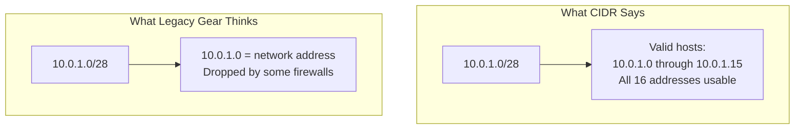
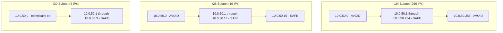

# How to Avoid Buggy IPs (.0 and .255) in MetalLB Address Pools

Author: [nawazdhandala](https://www.github.com/nawazdhandala)

Tags: Kubernetes, MetalLB, IP Address, Networking, Best Practices

Description: Learn why .0 and .255 IP addresses can cause problems with some network equipment and how to exclude them from MetalLB address pools.

---

> Some network devices, firewalls, and legacy routers treat IPs ending in .0 as network addresses and .255 as broadcast addresses - even in CIDR blocks where they are perfectly valid hosts. Assigning these IPs to Kubernetes services can cause intermittent connectivity issues that are painful to debug. This guide explains the problem and shows how to structure your MetalLB pools to avoid it.

---

## The Problem

In classful networking (the old Class A/B/C system), `.0` was always the network address and `.255` was always the broadcast address for a /24 subnet. Modern CIDR eliminated these rules, but some equipment and software still enforces them:



| IP Ending | Legacy Interpretation | Actual Risk |
|-----------|----------------------|------------|
| .0 | Network address | Some routers drop traffic to/from it |
| .255 | Broadcast address | Some firewalls block it as broadcast |
| .1 | Default gateway | May conflict with router expectations |

---

## Real-World Symptoms

When a MetalLB-assigned .0 or .255 IP hits a buggy device:

- Traffic works from some clients but not others.
- Connections time out intermittently.
- Ping works but TCP connections fail.
- The issue only appears on certain network paths.

These symptoms make the problem extremely hard to diagnose because the IP works from most locations but fails from networks with legacy equipment.

---

## Solution 1: Use Range Notation to Skip .0 and .255

The simplest fix is to use explicit range notation that avoids .0 and .255:

```yaml
# pool-safe-range.yaml
# Pool that avoids .0 and .255 addresses
apiVersion: metallb.io/v1beta1
kind: IPAddressPool
metadata:
  name: safe-pool
  namespace: metallb-system
spec:
  addresses:
    # Start at .1, end at .254 - skipping .0 and .255
    - 10.0.50.1-10.0.50.254
```

Compare this with a naive /24 CIDR that includes the problematic addresses:

```yaml
# pool-risky.yaml
# WARNING: This includes .0 and .255 which may cause issues
apiVersion: metallb.io/v1beta1
kind: IPAddressPool
metadata:
  name: risky-pool
  namespace: metallb-system
spec:
  addresses:
    # /24 includes 10.0.50.0 and 10.0.50.255
    - 10.0.50.0/24
```

---

## Solution 2: Split CIDR Into Safe Ranges

If you prefer CIDR notation for most of the range, split it to exclude the edges:

```yaml
# pool-split.yaml
# Pool that uses two ranges to avoid .0 and .255
apiVersion: metallb.io/v1beta1
kind: IPAddressPool
metadata:
  name: split-pool
  namespace: metallb-system
spec:
  addresses:
    # First safe segment: .1 through .127
    - 10.0.50.1-10.0.50.127
    # Second safe segment: .128 through .254
    - 10.0.50.128-10.0.50.254
```

---

## Solution 3: Also Avoid .1 (Gateway Conflicts)

In many networks, .1 is the default gateway. To be extra cautious:

```yaml
# pool-extra-safe.yaml
# Pool that avoids .0, .1, and .255
apiVersion: metallb.io/v1beta1
kind: IPAddressPool
metadata:
  name: extra-safe-pool
  namespace: metallb-system
spec:
  addresses:
    # Start at .2 to avoid .0 (network) and .1 (common gateway)
    # End at .254 to avoid .255 (broadcast)
    - 10.0.50.2-10.0.50.254
```

---

## Which Addresses to Avoid by Subnet Size

The risk varies by subnet size. For small subnets (/28, /29, /30), .0 and .255 may not even be in your range:



| Subnet Size | Contains .0? | Contains .255? | Action Needed |
|-------------|-------------|---------------|---------------|
| /24 | Yes | Yes | Exclude both |
| /25 | Depends on base | Depends on base | Check your base address |
| /28 | Depends on base | No | Check your base address |
| /30 | Depends on base | No | Usually safe |

---

## Checking Your Current Pools

Audit existing pools for potentially buggy IPs:

```bash
# List all pools with their address ranges
kubectl get ipaddresspool -n metallb-system -o jsonpath='{range .items[*]}{.metadata.name}: {.spec.addresses[*]}{"\n"}{end}'

# Check if any service was assigned a .0 or .255 IP
kubectl get svc -A -o jsonpath='{range .items[?(@.spec.type=="LoadBalancer")]}{.metadata.namespace}/{.metadata.name}: {.status.loadBalancer.ingress[0].ip}{"\n"}{end}' | grep -E '\.(0|255)$'
```

---

## Migrating an Existing Pool

If you already have a /24 pool and need to fix it:

```yaml
# Step 1: Create the new safe pool
apiVersion: metallb.io/v1beta1
kind: IPAddressPool
metadata:
  name: safe-pool-v2
  namespace: metallb-system
spec:
  addresses:
    - 10.0.50.1-10.0.50.254
```

```bash
# Step 2: Apply the new pool
kubectl apply -f safe-pool-v2.yaml

# Step 3: Check if any service is using .0 or .255
kubectl get svc -A -o wide | grep -E '\.0 |\.255 '

# Step 4: If no services use the buggy IPs, delete the old pool
kubectl delete ipaddresspool risky-pool -n metallb-system
```

If a service is already using a .0 or .255 IP, you will need to recycle that service to get a new IP from the safe range.

---

## IPv6 Considerations

IPv6 does not have the same .0/.255 problem because:

- There is no broadcast address in IPv6.
- Network addresses (all-zeros host part) are reserved but handled differently.
- Legacy classful routing does not apply.

You can safely use full CIDR blocks for IPv6 pools:

```yaml
# pool-ipv6-safe.yaml
# IPv6 pool - no .0/.255 concerns
apiVersion: metallb.io/v1beta1
kind: IPAddressPool
metadata:
  name: ipv6-pool
  namespace: metallb-system
spec:
  addresses:
    # Full /120 block is safe for IPv6
    - fd00:1::0/120
```

---

## Wrapping Up

Avoiding .0 and .255 addresses in MetalLB pools is a defensive networking practice that prevents hard-to-debug connectivity issues with legacy equipment. Use range notation instead of CIDR when you need to exclude specific addresses, and audit existing pools if you are experiencing intermittent reachability problems.

For proactive monitoring of service reachability and instant alerts when a MetalLB-managed endpoint goes dark, check out **[OneUptime](https://oneuptime.com)**.
