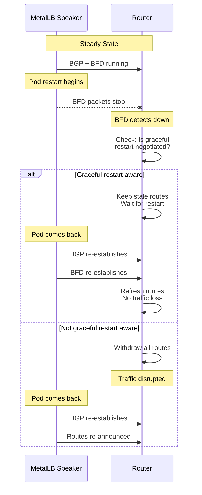
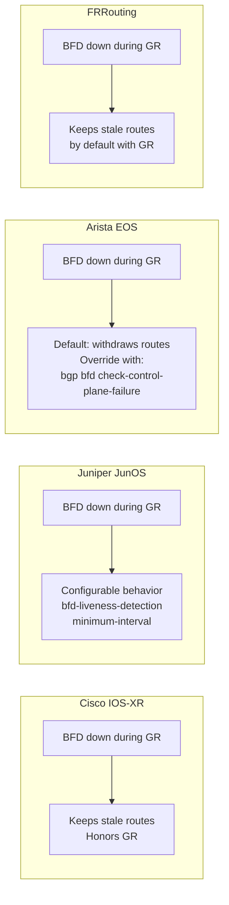

# How to Understand BFD and Graceful Restart Compatibility in MetalLB

Author: [nawazdhandala](https://www.github.com/nawazdhandala)

Tags: Kubernetes, MetalLB, BFD, Graceful Restart, BGP

Description: Understand the interaction between BFD and BGP graceful restart in MetalLB and how to configure them together without conflicts.

---

BGP graceful restart and BFD are both designed to improve network resilience, but they approach the problem from opposite directions. Graceful restart tells a router to keep forwarding traffic using stale routes while a BGP session is restarting. BFD tells a router to tear down the session immediately when it detects a failure. When both features are enabled on the same peering session, they can conflict with each other if not configured carefully.

This guide explains how BFD and graceful restart interact, where the conflicts arise, and how to configure MetalLB so both features work together correctly.

## The Fundamental Conflict

The conflict is straightforward:

- **Graceful restart** says: "The peer restarted. Keep forwarding traffic using the old routes. Wait for the peer to come back."
- **BFD** says: "The peer is unreachable. Tear down the session immediately. Withdraw all routes."

When a MetalLB speaker pod restarts (for example, during a rolling upgrade), BFD detects the interruption and signals BGP to tear down the session. This defeats the purpose of graceful restart, which was supposed to preserve routes during the restart.

```mermaid
flowchart TD
    subgraph Without BFD
        GR1[Speaker pod restarts] --> GR2[BGP hold timer<br/>continues counting]
        GR2 --> GR3[Router keeps routes<br/>via graceful restart]
        GR3 --> GR4[Speaker pod comes back]
        GR4 --> GR5[BGP session re-establishes<br/>No traffic disruption]
    end
    subgraph With BFD - Naive Config
        BF1[Speaker pod restarts] --> BF2[BFD detects failure<br/>in milliseconds]
        BF2 --> BF3[BFD signals BGP<br/>Session torn down]
        BF3 --> BF4[Router withdraws routes<br/>Traffic disrupted]
        BF4 --> BF5[Speaker pod comes back]
        BF5 --> BF6[Routes re-announced<br/>Traffic restored]
    end
```



In the naive configuration, BFD triggers a session teardown before graceful restart has a chance to preserve routes.

## When Each Feature Is Appropriate

Not every scenario needs both features. Understanding the use case helps you decide.

### Use BFD Only

- Node hardware failure or network partition
- You want the fastest possible failover to a different node
- You have multiple speaker nodes and can tolerate brief route withdrawal

### Use Graceful Restart Only

- Rolling upgrades of MetalLB speaker pods
- Planned maintenance where the pod restarts quickly
- Single-speaker setups where route withdrawal means total outage

### Use Both Together

- Production environments that need fast failover for real failures but also smooth rolling upgrades
- Multi-node clusters where some disruption is acceptable during upgrades but hard failures must be detected quickly

## How Routers Handle the Interaction

Most modern routers implement RFC 5882, which defines how BFD interacts with graceful restart. The key behavior is:

1. When BGP graceful restart is negotiated, the router enters "graceful restart helper mode" during a peer restart.
2. When BFD detects a failure, the router checks whether graceful restart is active.
3. If graceful restart is active, the router **may** ignore the BFD down signal and keep stale routes (this is vendor-specific).



## Configuration Strategy for MetalLB

The recommended approach is to enable both features but configure them so that BFD triggers only on real failures, not on planned restarts.

### Step 1: Enable Graceful Restart on the BGPPeer

MetalLB does not expose a dedicated graceful restart field in the BGPPeer CRD. Graceful restart is controlled through the FRR configuration. However, MetalLB's FRR backend enables graceful restart by default when the peer supports it.

Verify that your router has graceful restart enabled:

```bash
# Cisco IOS - enable graceful restart
router bgp 64513
  bgp graceful-restart
  bgp graceful-restart restart-time 120
  bgp graceful-restart stalepath-time 360
  neighbor 10.0.0.100 remote-as 64512
  neighbor 10.0.0.100 fall-over bfd
```

```bash
# FRRouting (on the router side) - enable graceful restart
router bgp 64513
  bgp graceful-restart
  bgp graceful-restart restart-time 120
  bgp graceful-restart stalepath-time 360
  neighbor 10.0.0.100 remote-as 64512
  neighbor 10.0.0.100 bfd
```

### Step 2: Configure a BFD Profile with Reasonable Timers

Do not use extremely aggressive BFD timers when graceful restart is enabled. If BFD fires within a few milliseconds of a pod restart, the router may not have time to enter graceful restart helper mode.

```yaml
# BFDProfile tuned for compatibility with graceful restart
# Detection time: 300ms x 3 = 900ms
# This gives the router enough time to recognize a graceful restart
apiVersion: metallb.io/v1beta1
kind: BFDProfile
metadata:
  name: gr-compatible-bfd
  namespace: metallb-system
spec:
  # 300ms intervals provide sub-second detection
  receiveInterval: 300
  transmitInterval: 300
  # Multiplier of 3 gives 900ms detection time
  detectMultiplier: 3
  # Disable echo mode to avoid complications with GR
  echoMode: false
  # Active mode
  passiveMode: false
  minimumTtl: 254
```

Apply it:

```bash
# Create the BFD profile
kubectl apply -f bfdprofile-gr.yaml
```

### Step 3: Reference the Profile from the BGPPeer

```yaml
# BGPPeer with BFD profile for graceful restart compatibility
apiVersion: metallb.io/v1beta2
kind: BGPPeer
metadata:
  name: tor-router
  namespace: metallb-system
spec:
  myASN: 64512
  peerASN: 64513
  peerAddress: 10.0.0.1
  # Use the GR-compatible BFD profile
  bfdProfile: gr-compatible-bfd
```

### Step 4: Verify Graceful Restart Negotiation

Check that graceful restart has been negotiated between MetalLB and the router.

```bash
# Check graceful restart status from the MetalLB speaker
kubectl exec -n metallb-system <speaker-pod> -c frr -- \
  vtysh -c "show bgp neighbor 10.0.0.1" | grep -i graceful

# Expected output should include:
# Graceful restart information:
#   Graceful restart: advertised and received
#   Remote Restart timer: 120 seconds
```

### Step 5: Test a Rolling Upgrade

Simulate a rolling upgrade of the MetalLB speakers and observe the behavior.

```bash
# Trigger a rolling restart of speaker pods
kubectl rollout restart daemonset/speaker -n metallb-system

# In a separate terminal, watch BFD and BGP status from the router
# Cisco IOS example:
# debug bfd events
# debug bgp events

# Watch for route withdrawals during the restart
kubectl exec -n metallb-system <speaker-pod> -c frr -- \
  vtysh -c "show bgp ipv4 unicast summary"
```

## Decision Matrix

Use this matrix to decide your configuration:

| Scenario | BFD | Graceful Restart | Notes |
|---|---|---|---|
| Fast failover for hard failures only | Yes | No | Simplest setup for multi-node clusters |
| Smooth rolling upgrades, no fast failover | No | Yes | Best for single-speaker setups |
| Both fast failover and smooth upgrades | Yes | Yes | Requires GR-aware router (RFC 5882) |
| Lab or non-critical environment | No | No | BGP hold timer handles failures |

## Vendor-Specific Behavior

Different router vendors handle the BFD + graceful restart interaction differently:



### Arista EOS Special Case

Arista EOS by default will withdraw routes when BFD goes down, even if graceful restart is active. To change this behavior:

```bash
# Arista EOS - honor graceful restart when BFD goes down
router bgp 64513
  neighbor 10.0.0.100 remote-as 64512
  neighbor 10.0.0.100 bfd
  neighbor 10.0.0.100 graceful-restart
  # This flag prevents BFD from overriding GR
  no neighbor 10.0.0.100 bfd check-control-plane-failure
```

## Troubleshooting the Interaction

### Routes withdrawn during rolling upgrade despite GR being enabled

```bash
# Check if graceful restart was actually negotiated
kubectl exec -n metallb-system <speaker-pod> -c frr -- \
  vtysh -c "show bgp neighbor 10.0.0.1" | grep -A5 "Graceful restart"

# Check if the router honored GR or if BFD overrode it
# On the router:
# show bgp ipv4 unicast summary
# Look for stale routes vs withdrawn routes
```

### BFD session re-establishes but BGP does not

This can happen if the graceful restart timer on the router has expired before the MetalLB speaker pod came back up.

```bash
# Check the router's restart-time setting
# It should be longer than the time it takes for a speaker pod to restart
# Default is typically 120 seconds

# Check how long the pod restart takes
kubectl rollout status daemonset/speaker -n metallb-system
```

## Summary

BFD and graceful restart serve different purposes and can conflict if not configured carefully. The key is to ensure your router supports RFC 5882 (BFD interaction with graceful restart) and that your BFD timers are not so aggressive that they fire before the router enters graceful restart helper mode. Test rolling upgrades in a staging environment before relying on this configuration in production.

For monitoring your MetalLB BGP sessions, BFD health, and Kubernetes service availability during rolling upgrades, [OneUptime](https://oneuptime.com) provides comprehensive infrastructure monitoring and alerting. OneUptime can notify your team when BFD sessions drop or BGP routes are withdrawn unexpectedly, helping you catch issues before they affect end users.
