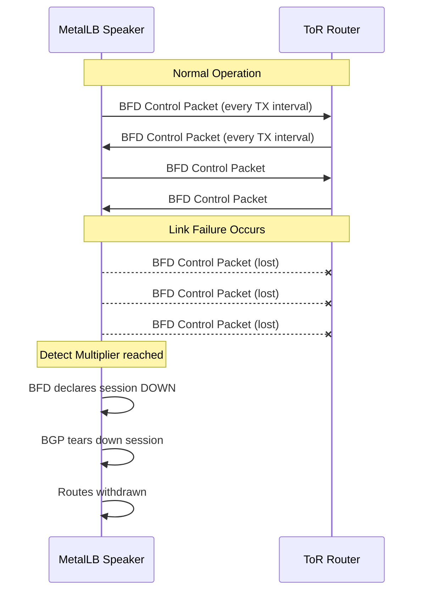
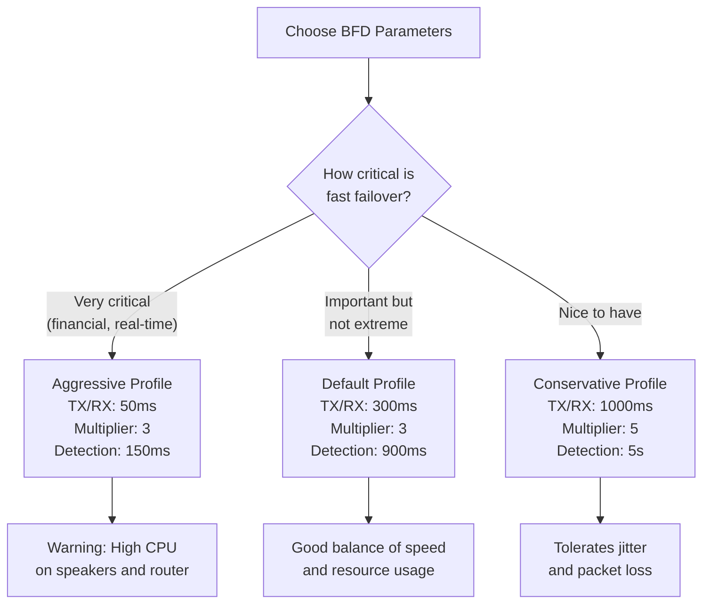

# How to Configure BFD Profile Parameters in MetalLB

Author: [nawazdhandala](https://www.github.com/nawazdhandala)

Tags: Kubernetes, MetalLB, BFD, BGP, Fast Failover

Description: Learn how to configure BFD (Bidirectional Forwarding Detection) profile parameters in MetalLB for tuning fast failover behavior.

---

BGP's default keepalive and hold timers operate on the order of seconds to minutes. When a link fails, it can take up to three minutes for BGP to detect the failure and withdraw routes. In environments where fast failover matters, this delay is unacceptable. Bidirectional Forwarding Detection (BFD) solves this by running a lightweight heartbeat protocol alongside BGP. BFD can detect link failures in milliseconds, triggering an immediate BGP session teardown and route withdrawal.

MetalLB supports BFD through its FRR (Free Range Routing) backend. You configure BFD by creating a `BFDProfile` custom resource and referencing it from your `BGPPeer`. This guide walks through every BFD parameter that MetalLB exposes and explains how to tune them for your environment.

## How BFD Works with MetalLB

BFD runs as a separate session between the same endpoints as BGP. When BFD detects that the path between two peers has failed, it notifies BGP, which then tears down the session immediately instead of waiting for hold timer expiry.



## BFD Profile Parameters

MetalLB exposes the following BFD parameters through the `BFDProfile` custom resource:

| Parameter | Description | Default | Range |
|---|---|---|---|
| `receiveInterval` | How often the local side expects to receive BFD packets (ms) | 300 | 10-60000 |
| `transmitInterval` | How often the local side sends BFD packets (ms) | 300 | 10-60000 |
| `detectMultiplier` | Number of missed packets before declaring session down | 3 | 2-255 |
| `echoInterval` | Interval for BFD echo packets (ms) | 50 | 10-60000 |
| `echoMode` | Whether to enable BFD echo mode | false | true/false |
| `passiveMode` | Whether the local side waits for the remote to initiate | false | true/false |
| `minimumTtl` | Minimum TTL for incoming BFD packets (multi-hop) | 254 | 1-254 |

## Detection Time Calculation

The detection time is the maximum time before BFD declares a session down. It is calculated as:

$$T_{detect} = \text{receiveInterval} \times \text{detectMultiplier}$$

For example, with a `receiveInterval` of 300ms and a `detectMultiplier` of 3:

$$T_{detect} = 300\text{ms} \times 3 = 900\text{ms}$$

This means BFD will detect a failure within 900 milliseconds.

## Prerequisites

- Kubernetes cluster with MetalLB installed in FRR mode
- At least one BGPPeer configured
- The upstream router must also support BFD
- BFD must be enabled on the router interface facing the Kubernetes nodes

## Step 1: Create a BFDProfile with Default Parameters

Start with a baseline profile using MetalLB's defaults. This is a good starting point before tuning.

```yaml
# BFDProfile with default parameters
# This provides sub-second failure detection (900ms)
apiVersion: metallb.io/v1beta1
kind: BFDProfile
metadata:
  name: default-bfd
  namespace: metallb-system
spec:
  # Expect a BFD packet from the peer every 300ms
  receiveInterval: 300
  # Send a BFD packet to the peer every 300ms
  transmitInterval: 300
  # Declare the session down after 3 missed packets
  detectMultiplier: 3
  # Echo mode disabled by default
  echoMode: false
  # Active mode - initiate the BFD session
  passiveMode: false
  # Minimum TTL for incoming packets (254 for single-hop)
  minimumTtl: 254
```

Apply the profile:

```bash
# Create the BFDProfile
kubectl apply -f bfdprofile-default.yaml

# Verify the profile exists
kubectl get bfdprofile -n metallb-system
```

## Step 2: Reference the BFDProfile from a BGPPeer

The BFDProfile is activated by referencing it from a BGPPeer resource.

```yaml
# BGPPeer with BFD enabled via profile reference
apiVersion: metallb.io/v1beta2
kind: BGPPeer
metadata:
  name: tor-router
  namespace: metallb-system
spec:
  myASN: 64512
  peerASN: 64513
  peerAddress: 10.0.0.1
  # Reference the BFDProfile by name to enable BFD on this session
  bfdProfile: default-bfd
```

Apply the peer:

```bash
# Create or update the BGPPeer with BFD
kubectl apply -f bgppeer.yaml

# Verify the peer references the BFD profile
kubectl get bgppeer -n metallb-system -o yaml | grep bfdProfile
```

## Step 3: Create an Aggressive BFD Profile

For environments that demand the fastest possible failover, reduce the intervals and keep the multiplier low. This increases CPU usage on both the MetalLB speakers and the router.

```yaml
# Aggressive BFDProfile for sub-100ms detection
# Detection time: 50ms x 3 = 150ms
# WARNING: This puts significant load on the control plane
apiVersion: metallb.io/v1beta1
kind: BFDProfile
metadata:
  name: aggressive-bfd
  namespace: metallb-system
spec:
  # Expect packets every 50ms
  receiveInterval: 50
  # Send packets every 50ms
  transmitInterval: 50
  # 3 missed packets triggers session down
  detectMultiplier: 3
  echoMode: false
  passiveMode: false
  minimumTtl: 254
```

## Step 4: Create a Conservative BFD Profile

For environments where CPU overhead is a concern or the network has occasional jitter, use longer intervals and a higher multiplier.

```yaml
# Conservative BFDProfile for stable but slower detection
# Detection time: 1000ms x 5 = 5000ms (5 seconds)
# Good for networks with occasional packet loss or jitter
apiVersion: metallb.io/v1beta1
kind: BFDProfile
metadata:
  name: conservative-bfd
  namespace: metallb-system
spec:
  # Expect packets every 1000ms (1 second)
  receiveInterval: 1000
  # Send packets every 1000ms
  transmitInterval: 1000
  # Tolerate up to 5 missed packets before declaring down
  detectMultiplier: 5
  echoMode: false
  passiveMode: false
  minimumTtl: 254
```

## Choosing the Right Parameters

Use the following decision flow to pick the right profile for your environment:



## Step 5: Enable Echo Mode

BFD echo mode sends packets that are looped back by the remote peer. This offloads failure detection to the forwarding plane and can reduce CPU usage on the remote side. Not all routers support echo mode.

```yaml
# BFDProfile with echo mode enabled
# Echo packets are looped back by the remote peer's forwarding plane
apiVersion: metallb.io/v1beta1
kind: BFDProfile
metadata:
  name: echo-bfd
  namespace: metallb-system
spec:
  receiveInterval: 300
  transmitInterval: 300
  detectMultiplier: 3
  # Enable echo mode for forwarding-plane detection
  echoMode: true
  # Interval between echo packets (ms)
  echoInterval: 50
  passiveMode: false
  minimumTtl: 254
```

## Step 6: Verify BFD Session Status

Check that BFD sessions are established and running with the correct parameters.

```bash
# List MetalLB speaker pods
kubectl get pods -n metallb-system -l component=speaker

# Check BFD session status inside FRR
kubectl exec -n metallb-system <speaker-pod> -c frr -- \
  vtysh -c "show bfd peers"
```

Expected output for a healthy session:

```
BFD Peers:
    peer 10.0.0.1 vrf default
        ID: 1
        Remote ID: 1
        Active mode
        Status: up
        Uptime: 2 hour(s), 15 minute(s)
        Diagnostics: ok
        Remote diagnostics: ok
        Peer Type: configured
        Local timers:
            Detect-multiplier: 3
            Receive interval: 300ms
            Transmission interval: 300ms
        Remote timers:
            Detect-multiplier: 3
            Receive interval: 300ms
            Transmission interval: 300ms
```

## Multiple Profiles for Different Peers

You can create different BFD profiles and assign them to different BGPPeers. This is useful when some peers are on fast local links and others are on slower or less reliable paths.

```yaml
# Peer on a fast local link gets aggressive BFD
apiVersion: metallb.io/v1beta2
kind: BGPPeer
metadata:
  name: local-tor
  namespace: metallb-system
spec:
  myASN: 64512
  peerASN: 64513
  peerAddress: 10.0.0.1
  bfdProfile: aggressive-bfd
---
# Peer on a longer path gets conservative BFD
apiVersion: metallb.io/v1beta2
kind: BGPPeer
metadata:
  name: remote-router
  namespace: metallb-system
spec:
  myASN: 64512
  peerASN: 64514
  peerAddress: 10.1.0.1
  bfdProfile: conservative-bfd
```

## Common Mistakes

| Mistake | Consequence | Fix |
|---|---|---|
| Setting intervals too low on slow links | BFD flaps constantly | Increase intervals or raise the detect multiplier |
| Mismatched parameters between MetalLB and router | BFD session may not establish | Ensure both sides agree on intervals and multiplier |
| Enabling echo mode on a router that does not support it | Echo packets are dropped, session flaps | Disable echo mode or upgrade the router firmware |
| Forgetting to enable BFD on the router side | BFD session never comes up | Configure BFD on the router's BGP neighbor config |

## Summary

BFD profiles in MetalLB give you fine-grained control over failure detection speed. By tuning `receiveInterval`, `transmitInterval`, and `detectMultiplier`, you can balance between millisecond-level failover and CPU efficiency. Start with the default profile (900ms detection) and adjust based on your requirements.

If you are running Kubernetes on bare metal and need to monitor your BGP sessions, BFD status, and service availability, consider using [OneUptime](https://oneuptime.com). OneUptime provides real-time infrastructure monitoring, alerting, and incident management so you can detect and respond to network failures before they impact your users.
