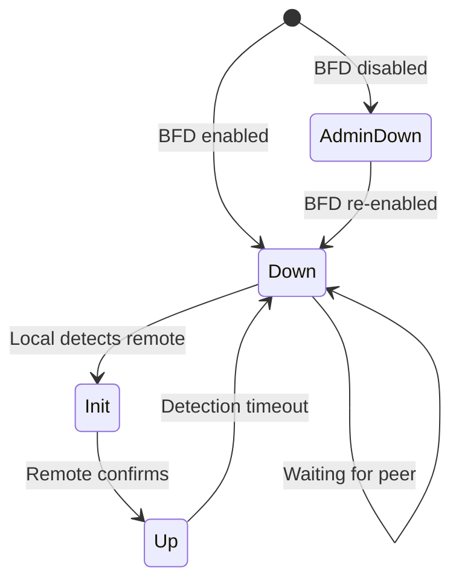
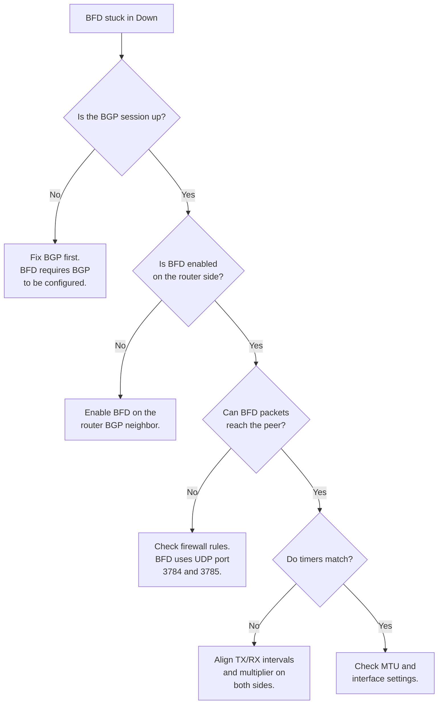
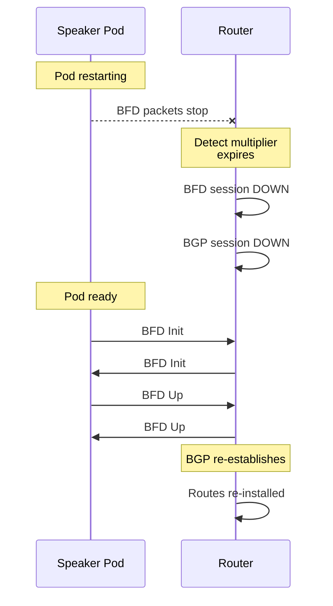

# How to Troubleshoot BFD Session Failures in MetalLB

Author: [nawazdhandala](https://www.github.com/nawazdhandala)

Tags: Kubernetes, MetalLB, BFD, Troubleshooting, BGP

Description: Troubleshooting guide for BFD session failures in MetalLB including common causes, diagnostic commands, and resolution steps.

---

BFD (Bidirectional Forwarding Detection) runs alongside BGP to provide sub-second failure detection. When BFD works correctly, link failures are detected in milliseconds. When BFD itself fails or flaps, the consequences are worse than not having BFD at all - BGP sessions tear down and rebuild repeatedly, causing route withdrawals and service disruptions.

This guide covers how to diagnose and fix BFD session failures in MetalLB. It walks through the common failure modes, the diagnostic commands to pinpoint the root cause, and the resolution steps for each scenario.

## BFD Session Lifecycle

Understanding the BFD state machine is essential for troubleshooting. A BFD session goes through four states:



- **AdminDown**: BFD is administratively disabled on one side.
- **Down**: The session is not established. This is the initial state.
- **Init**: The local side has detected the remote peer but the remote has not yet confirmed.
- **Up**: Both sides have confirmed the session. This is the healthy state.

## Diagnostic Commands

Before diving into specific failure scenarios, here are the commands you will use throughout this guide.

### Check BFD Peer Status

```bash
# List all MetalLB speaker pods
kubectl get pods -n metallb-system -l component=speaker

# Check BFD session status from inside the FRR container
kubectl exec -n metallb-system <speaker-pod> -c frr -- \
  vtysh -c "show bfd peers"

# Get detailed BFD counters for a specific peer
kubectl exec -n metallb-system <speaker-pod> -c frr -- \
  vtysh -c "show bfd peers counters"
```

### Check BGP Session Status

```bash
# Verify BGP sessions - BFD failures will show up here too
kubectl exec -n metallb-system <speaker-pod> -c frr -- \
  vtysh -c "show bgp summary"

# Detailed BGP neighbor info including BFD status
kubectl exec -n metallb-system <speaker-pod> -c frr -- \
  vtysh -c "show bgp neighbor 10.0.0.1"
```

### Check MetalLB Speaker Logs

```bash
# View recent logs from a speaker pod
kubectl logs -n metallb-system <speaker-pod> -c speaker --tail=100

# View FRR logs for BFD-specific messages
kubectl logs -n metallb-system <speaker-pod> -c frr --tail=100

# Stream logs in real time while reproducing an issue
kubectl logs -n metallb-system <speaker-pod> -c frr -f
```

## Failure Scenario 1: BFD Session Stuck in Down State

The most common issue is a BFD session that never transitions from Down to Up.

### Symptoms

```
BFD Peers:
    peer 10.0.0.1 vrf default
        Status: down
        Diagnostics: ok
        Remote diagnostics: ok
```

### Root Cause Flowchart



### Resolution Steps

**Check if BFD is enabled on the router:**

```bash
# Cisco IOS example - verify BFD is enabled for the BGP neighbor
show running-config | section router bgp
# Look for: neighbor 10.x.x.x fall-over bfd
```

**Check firewall rules:**

```bash
# BFD uses UDP ports 3784 (single-hop) and 4784 (multi-hop)
# Echo mode uses UDP port 3785
# Verify these ports are not blocked

# On the Kubernetes node, check iptables
iptables -L INPUT -n | grep -E "3784|3785|4784"

# Test UDP connectivity (from a node to the router)
nc -u -z 10.0.0.1 3784
```

**Verify the BFDProfile is referenced correctly:**

```bash
# Check that the BGPPeer has the bfdProfile field set
kubectl get bgppeer -n metallb-system -o yaml | grep -A1 bfdProfile
```

## Failure Scenario 2: BFD Session Flapping

The session alternates between Up and Down repeatedly.

### Symptoms

```
BFD Peers:
    peer 10.0.0.1 vrf default
        Status: up
        Uptime: 0 minute(s), 12 second(s)
        Diagnostics: control detection time expired
```

The short uptime and the diagnostic message "control detection time expired" indicate flapping.

### Common Causes

1. **Intervals too aggressive for the link quality** - If the network has jitter or occasional packet loss, aggressive BFD timers will cause false positives.
2. **CPU overload on the speaker pod** - If the MetalLB speaker pod cannot process BFD packets on time, sessions will time out.
3. **Interface congestion** - Heavy traffic on the link can delay BFD packets past the detection threshold.

### Resolution

**Increase the detection time:**

```yaml
# Increase intervals and multiplier to tolerate jitter
# New detection time: 500ms x 5 = 2500ms
apiVersion: metallb.io/v1beta1
kind: BFDProfile
metadata:
  name: stable-bfd
  namespace: metallb-system
spec:
  # Increase from 300ms to 500ms
  receiveInterval: 500
  transmitInterval: 500
  # Increase from 3 to 5 to tolerate more missed packets
  detectMultiplier: 5
  echoMode: false
  passiveMode: false
  minimumTtl: 254
```

**Check speaker pod CPU usage:**

```bash
# Check resource usage of speaker pods
kubectl top pods -n metallb-system -l component=speaker

# If CPU is consistently high, increase resource limits
kubectl get daemonset speaker -n metallb-system -o yaml | \
  grep -A5 resources
```

## Failure Scenario 3: BFD Up but BGP Not Using It

BFD shows as Up but BGP does not tear down when the link fails. It still waits for the hold timer.

### Symptoms

```
# BFD shows up
BFD Peers:
    peer 10.0.0.1
        Status: up

# But BGP neighbor does not show BFD
BGP neighbor is 10.0.0.1
    BFD: not configured
```

### Resolution

This happens when the BGPPeer resource does not reference the BFDProfile. Even though the BFDProfile exists, it is not linked to the BGP session.

```bash
# Check the BGPPeer resource
kubectl get bgppeer tor-router -n metallb-system -o yaml

# Look for the bfdProfile field in the spec
# If it is missing, patch the BGPPeer
kubectl patch bgppeer tor-router -n metallb-system --type merge \
  -p '{"spec":{"bfdProfile":"stable-bfd"}}'
```

## Failure Scenario 4: Multi-hop BFD Not Working

When MetalLB and the router are not directly connected (multi-hop BFD), additional configuration is needed.

### Symptoms

BFD packets are dropped because the TTL is too low for multi-hop or the wrong UDP port is used.

### Resolution

Adjust the `minimumTtl` in the BFD profile for multi-hop scenarios:

```yaml
# BFDProfile for multi-hop BFD
# Lower minimumTtl to allow packets that traverse multiple hops
apiVersion: metallb.io/v1beta1
kind: BFDProfile
metadata:
  name: multihop-bfd
  namespace: metallb-system
spec:
  receiveInterval: 300
  transmitInterval: 300
  detectMultiplier: 3
  echoMode: false
  passiveMode: false
  # For multi-hop, set minimumTtl lower than 254
  # Value = 255 - number_of_hops
  # For 3 hops: 255 - 3 = 252
  minimumTtl: 252
```

Ensure the router is also configured for multi-hop BFD:

```bash
# Cisco IOS example for multi-hop BFD
# Under the BGP neighbor configuration:
neighbor 10.x.x.x fall-over bfd multi-hop
```

## Failure Scenario 5: BFD Session Down After MetalLB Restart

After restarting or upgrading MetalLB, BFD sessions may take time to re-establish.

### Symptoms

BFD sessions show Down for several seconds after a speaker pod restart. During this time, BGP may also drop, causing brief route withdrawals.

### Timeline



### Resolution

Use passive mode on the MetalLB side so the router initiates BFD. This can reduce the time to re-establish after a restart.

```yaml
# BFDProfile with passive mode
# MetalLB waits for the router to initiate the BFD session
apiVersion: metallb.io/v1beta1
kind: BFDProfile
metadata:
  name: passive-bfd
  namespace: metallb-system
spec:
  receiveInterval: 300
  transmitInterval: 300
  detectMultiplier: 3
  echoMode: false
  # Passive mode: wait for the router to initiate
  passiveMode: true
  minimumTtl: 254
```

Also consider configuring BGP graceful restart to preserve routes during speaker pod restarts (see the companion post on BFD and Graceful Restart compatibility).

## Diagnostic Checklist

Use this checklist when BFD is not working:

```bash
# 1. Is the BFDProfile created?
kubectl get bfdprofile -n metallb-system

# 2. Does the BGPPeer reference the BFDProfile?
kubectl get bgppeer -n metallb-system -o yaml | grep bfdProfile

# 3. Is the BFD session established?
kubectl exec -n metallb-system <speaker-pod> -c frr -- \
  vtysh -c "show bfd peers"

# 4. Are BFD packets being sent and received?
kubectl exec -n metallb-system <speaker-pod> -c frr -- \
  vtysh -c "show bfd peers counters"

# 5. Is BFD enabled on the router side?
# (Run on the router)
# show bfd neighbors

# 6. Are UDP ports 3784/3785 open?
# (Run on the Kubernetes node)
ss -ulnp | grep -E "3784|3785"

# 7. Is the speaker pod healthy and not CPU-starved?
kubectl top pods -n metallb-system -l component=speaker
```

## Summary

BFD troubleshooting in MetalLB comes down to four main areas: verifying both sides have BFD enabled, ensuring network connectivity on UDP ports 3784/3785, matching timer parameters, and checking resource availability on the speaker pods. When BFD flaps, the most common fix is increasing the detection time by raising the intervals or the multiplier.

If you run Kubernetes on bare metal and need continuous monitoring of your BFD sessions, BGP peering health, and service availability, [OneUptime](https://oneuptime.com) can help. OneUptime provides real-time monitoring, alerting, and incident management designed for infrastructure teams running critical workloads.
