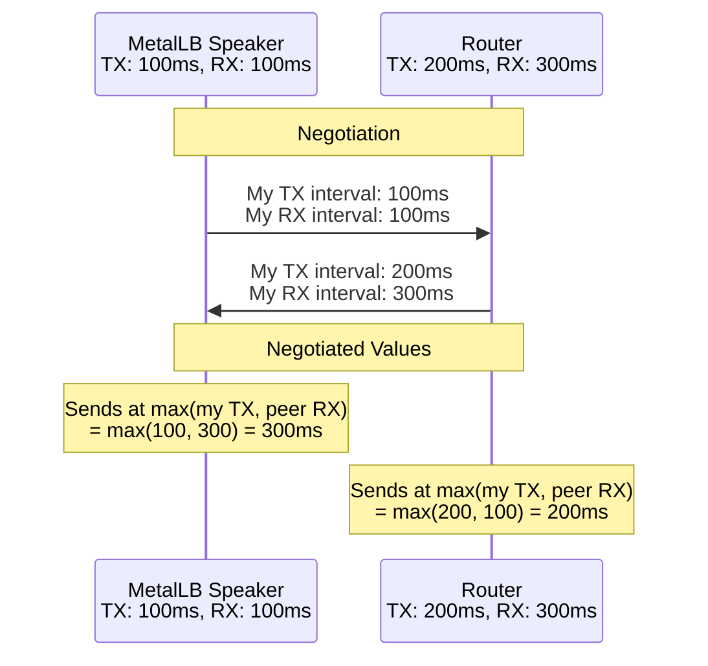
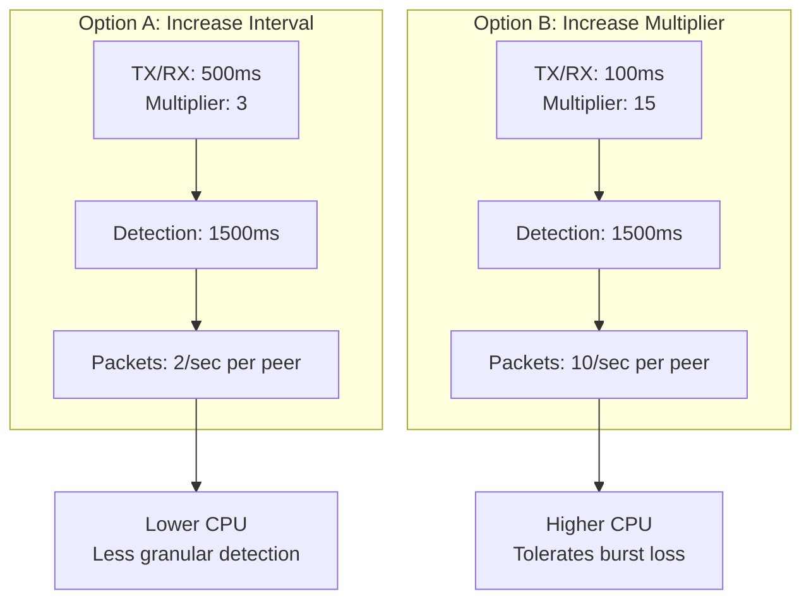
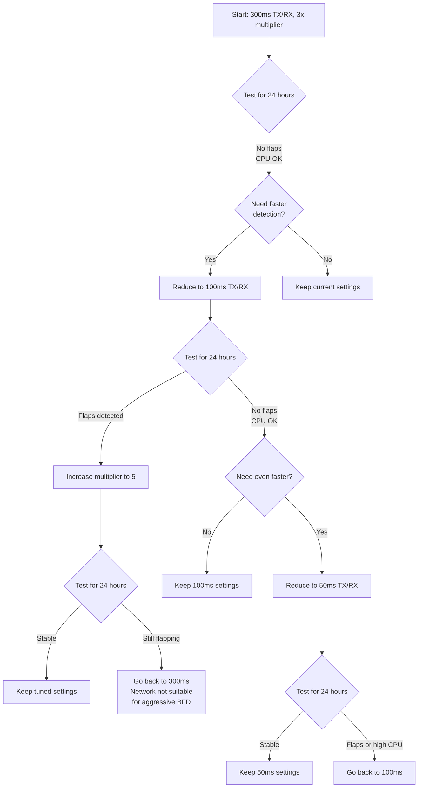

# How to Tune BFD Receive and Transmit Intervals in MetalLB

Author: [nawazdhandala](https://www.github.com/nawazdhandala)

Tags: Kubernetes, MetalLB, BFD, Timers, Performance

Description: Learn how to tune BFD receive and transmit intervals in MetalLB to balance between fast failover detection and CPU overhead.

---

BFD (Bidirectional Forwarding Detection) achieves fast failure detection by exchanging lightweight control packets at a configurable rate. The two most important parameters are the receive interval and the transmit interval. Setting these too low consumes CPU and can cause false positives on busy systems. Setting them too high defeats the purpose of BFD by slowing down detection. This guide explains how to find the right balance for your MetalLB deployment.

## Understanding Receive and Transmit Intervals

The BFD protocol negotiates intervals between the two endpoints. Each side advertises the minimum interval at which it can send packets and the minimum interval at which it can receive them. The final operating intervals are the higher of the two sides' requirements.



The negotiation formula for the actual operating intervals:

$$\text{Actual TX}_{local} = \max(\text{TX}_{local}, \text{RX}_{remote})$$

$$\text{Actual TX}_{remote} = \max(\text{TX}_{remote}, \text{RX}_{local})$$

This means the slower side always wins. If your router requires a minimum receive interval of 300ms, setting MetalLB's transmit interval to 50ms will have no effect - packets will still be sent at 300ms.

## The Impact of Interval Choices

Each BFD packet is small (about 24 bytes of BFD payload plus UDP/IP headers), but the processing cost is in the scheduling and handling. Here is how different intervals affect CPU and detection time:

| TX/RX Interval | Packets per Second | Detection Time (multiplier=3) | CPU Impact |
|---|---|---|---|
| 50ms | 20 pps per peer | 150ms | High |
| 100ms | 10 pps per peer | 300ms | Moderate |
| 300ms | ~3.3 pps per peer | 900ms | Low |
| 1000ms | 1 pps per peer | 3000ms | Minimal |

For a cluster with 10 BGP peers, the packet rates multiply by 10. At 50ms intervals, that is 200 packets per second just for BFD. On resource-constrained speaker pods, this can be significant.

## Prerequisites

- Kubernetes cluster with MetalLB installed in FRR mode
- At least one BGPPeer configured with a BFDProfile
- Access to the router CLI to verify negotiated intervals
- Basic understanding of your network's latency and jitter characteristics

## Step 1: Measure Your Network Baseline

Before tuning BFD intervals, measure the round-trip latency and jitter between MetalLB speakers and the router. The intervals must be larger than the worst-case latency to avoid false positives.

```bash
# Measure round-trip time to the router from a Kubernetes node
# Run at least 100 pings to get a meaningful sample
ping -c 100 10.0.0.1 | tail -1

# Example output:
# rtt min/avg/max/mdev = 0.234/0.412/1.892/0.187 ms

# Record these values:
# - Average RTT: 0.412ms
# - Max RTT: 1.892ms
# - Standard deviation (jitter): 0.187ms
```

The BFD interval should be significantly larger than the maximum RTT. A good rule of thumb:

$$\text{Minimum safe interval} = \text{max RTT} \times 3$$

For the example above: $1.892\text{ms} \times 3 \approx 6\text{ms}$. However, this ignores processing delays, so practical minimums are typically 50ms or higher.

## Step 2: Start with the Default Profile

Begin with the default 300ms intervals and verify everything works before tuning.

```yaml
# Baseline BFDProfile - start here before tuning
# Detection time: 300ms x 3 = 900ms
apiVersion: metallb.io/v1beta1
kind: BFDProfile
metadata:
  name: baseline-bfd
  namespace: metallb-system
spec:
  # 300ms is a safe starting point for most networks
  receiveInterval: 300
  transmitInterval: 300
  # 3 is the standard multiplier
  detectMultiplier: 3
  echoMode: false
  passiveMode: false
  minimumTtl: 254
```

```bash
# Apply the baseline profile
kubectl apply -f bfdprofile-baseline.yaml

# Link it to your BGPPeer (if not already done)
kubectl patch bgppeer tor-router -n metallb-system \
  --type merge -p '{"spec":{"bfdProfile":"baseline-bfd"}}'
```

## Step 3: Monitor BFD Counters

Before changing intervals, collect BFD packet counters to understand the current behavior.

```bash
# Get BFD packet counters
kubectl exec -n metallb-system <speaker-pod> -c frr -- \
  vtysh -c "show bfd peers counters"

# Example output:
# peer 10.0.0.1
#   Control packet input: 12345 packets
#   Control packet output: 12346 packets
#   Echo packet input: 0 packets
#   Echo packet output: 0 packets
#   Session up events: 1
#   Session down events: 0
#   Zebra notifications: 1

# Wait 60 seconds and check again to calculate packet rate
sleep 60
kubectl exec -n metallb-system <speaker-pod> -c frr -- \
  vtysh -c "show bfd peers counters"
```

The packet rate should match your configured interval. At 300ms intervals, you should see roughly 200 packets per minute (3.33 per second).

## Step 4: Reduce Intervals for Faster Detection

If your network baseline shows low latency and jitter, you can safely reduce the intervals.

```yaml
# Faster BFDProfile - 100ms intervals
# Detection time: 100ms x 3 = 300ms
# Suitable for low-latency, low-jitter links
apiVersion: metallb.io/v1beta1
kind: BFDProfile
metadata:
  name: fast-bfd
  namespace: metallb-system
spec:
  # Send and expect packets every 100ms
  receiveInterval: 100
  transmitInterval: 100
  # Keep the multiplier at 3
  detectMultiplier: 3
  echoMode: false
  passiveMode: false
  minimumTtl: 254
```

After applying, verify the negotiated intervals match your configuration:

```bash
# Check the actual negotiated intervals
kubectl exec -n metallb-system <speaker-pod> -c frr -- \
  vtysh -c "show bfd peers"

# Look at the "Local timers" and "Remote timers" sections
# If the router's minimum receive interval is higher than your
# transmit interval, the actual operating interval will be higher
```

## Step 5: Increase the Multiplier Instead of the Interval

An alternative to increasing the interval is increasing the detect multiplier. This gives you the same detection time but with higher packet rates, which can be useful for catching intermittent issues.



**Option A** uses fewer packets but is less tolerant of brief bursts of packet loss. **Option B** sends more packets but can tolerate longer bursts of loss without declaring the session down.

```yaml
# High-multiplier BFDProfile
# Detection time: 100ms x 10 = 1000ms
# Sends 10 pps but tolerates up to 9 consecutive lost packets
apiVersion: metallb.io/v1beta1
kind: BFDProfile
metadata:
  name: high-multiplier-bfd
  namespace: metallb-system
spec:
  receiveInterval: 100
  transmitInterval: 100
  # High multiplier tolerates burst packet loss
  detectMultiplier: 10
  echoMode: false
  passiveMode: false
  minimumTtl: 254
```

## Step 6: Use Asymmetric Intervals

MetalLB allows you to set different receive and transmit intervals. This is useful when the two sides have different processing capacities.

```yaml
# Asymmetric BFDProfile
# MetalLB sends slowly (saves CPU) but expects fast packets from router
# Useful when the router has more CPU headroom than the speaker pods
apiVersion: metallb.io/v1beta1
kind: BFDProfile
metadata:
  name: asymmetric-bfd
  namespace: metallb-system
spec:
  # MetalLB expects packets from the router every 100ms
  receiveInterval: 100
  # MetalLB sends packets every 500ms (saves CPU on speaker pods)
  transmitInterval: 500
  detectMultiplier: 3
  echoMode: false
  passiveMode: false
  minimumTtl: 254
```

With this configuration:

- MetalLB detects router failure in: $100\text{ms} \times 3 = 300\text{ms}$
- The router detects MetalLB failure in: $500\text{ms} \times 3 = 1500\text{ms}$

This asymmetry is acceptable if fast detection of router failures is more important than fast detection of speaker failures (which is common when you have multiple speaker nodes).

## Step 7: Measure the Impact

After applying a tuned profile, measure the CPU impact on the speaker pods.

```bash
# Before and after CPU comparison
# Run this before changing the profile
kubectl top pods -n metallb-system -l component=speaker

# Change the profile
kubectl apply -f bfdprofile-fast.yaml

# Wait a few minutes for metrics to stabilize
sleep 180

# Measure again
kubectl top pods -n metallb-system -l component=speaker
```

## Interval Tuning Cheat Sheet



## Common Pitfalls

| Pitfall | Why It Happens | How to Avoid |
|---|---|---|
| Setting intervals below the router's minimum | Router silently rounds up to its minimum | Check the router's BFD minimum interval capability |
| Testing only during low traffic | BFD may flap under load due to CPU contention | Test during peak traffic hours |
| Forgetting that intervals are negotiated | MetalLB setting of 50ms may operate at 300ms due to router | Always check negotiated intervals with `show bfd peers` |
| Changing intervals without updating the multiplier | Detection time changes without considering the impact | Calculate the detection time before applying |

## Summary

Tuning BFD intervals in MetalLB is a process of measuring your network baseline, setting conservative initial values, and iteratively reducing intervals while monitoring for stability. The key formula is $T_{detect} = \text{interval} \times \text{multiplier}$, and the negotiated interval is always the maximum of both sides' requirements. Always test changes for at least 24 hours before considering them stable.

For comprehensive monitoring of your MetalLB BFD sessions, BGP peering health, and Kubernetes service uptime, consider using [OneUptime](https://oneuptime.com). OneUptime can track your infrastructure health, alert on BFD session flaps, and provide dashboards that show the state of your network in real time.
