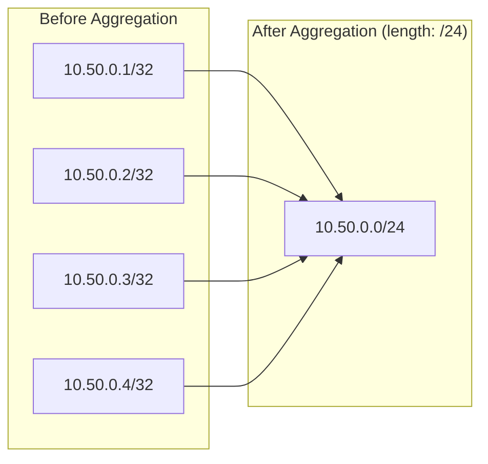
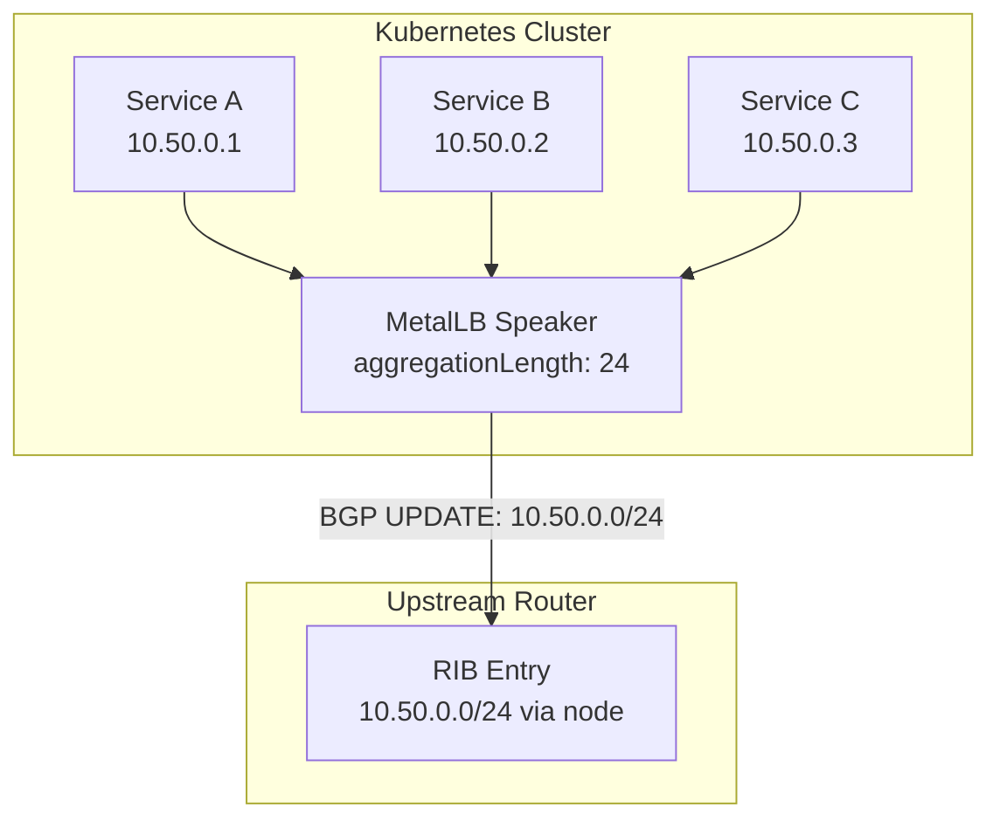
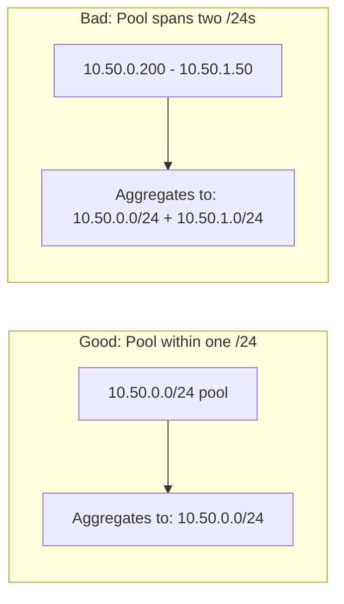

# How to Configure BGP Aggregation Length for Route Summarization in MetalLB

Author: [nawazdhandala](https://www.github.com/nawazdhandala)

Tags: Kubernetes, MetalLB, BGP, Route Aggregation, Networking

Description: Learn how to use BGP aggregation length in MetalLB to summarize routes and reduce the number of prefixes advertised to your upstream routers.

---

When MetalLB runs in BGP mode, every LoadBalancer service gets its own IP address and that address is advertised as an individual /32 route to your upstream routers. In a cluster with dozens or hundreds of services, this floods router memory and slows down convergence. BGP route aggregation solves this by combining many specific routes into fewer, broader prefixes before advertising them.

MetalLB supports this through the `aggregationLength` field on `BGPAdvertisement` resources. This guide covers what aggregation length does, how to configure it, and how to verify that your upstream routers receive summarized prefixes.

## What Is BGP Route Aggregation?

Route aggregation (also called route summarization) replaces multiple specific prefixes with a single, shorter prefix that covers all of them. For example, instead of advertising four /32 routes, you advertise one /24 that contains all four addresses.



The upstream router receives one route instead of four. As you add more services within the same /24 range, the number of advertised prefixes stays the same.

## Why It Matters

Every prefix a router carries consumes memory and CPU during path computation. In large clusters, unaggregated /32 routes create real problems:

- **Router memory pressure**: Each prefix adds an entry to the RIB and FIB. Hundreds of /32s from a single cluster adds up.
- **Slow convergence**: More prefixes means more BGP UPDATE messages during failover, which delays traffic restoration.
- **Prefix limits**: Many upstream providers enforce a maximum prefix count per BGP session. Hitting that limit tears down the session entirely.

Aggregation keeps prefix counts low and predictable regardless of how many services you deploy.

## Architecture Overview

The following diagram shows how MetalLB aggregation fits between your cluster and the upstream router. The speaker process groups /32 allocations by their containing prefix and advertises the summary.



## Prerequisites

Before you begin, make sure you have:

- A Kubernetes cluster running on bare metal or VMs.
- MetalLB v0.13+ installed and configured in BGP mode.
- At least one BGP peer (upstream router) already established.
- `kubectl` configured with cluster access.
- Basic familiarity with CIDR notation and BGP concepts.

## Step 1: Plan Your IP Pool with Aggregation in Mind

Aggregation only works cleanly when your IP pool aligns with CIDR boundaries. If you want to aggregate to /24, your pool should be a full /24 or a subset of one. Mixing IPs across CIDR boundaries leads to multiple aggregated prefixes instead of one.



## Step 2: Create the IPAddressPool

Define an IP pool that fits within your desired aggregation boundary.

```yaml
# metallb-bgp-pool.yaml
# IP address pool for BGP-advertised services
# The range fits entirely within a /24, making aggregation clean
apiVersion: metallb.io/v1beta1
kind: IPAddressPool
metadata:
  name: bgp-pool
  namespace: metallb-system
spec:
  # All addresses fall within 10.50.0.0/24
  # This ensures a single aggregated prefix when aggregationLength is 24
  addresses:
    - 10.50.0.1-10.50.0.254
```

Apply it:

```bash
# Create the IP address pool
kubectl apply -f metallb-bgp-pool.yaml
```

## Step 3: Create a BGPAdvertisement with aggregationLength

The `aggregationLength` field tells MetalLB to advertise a summary prefix instead of individual /32 routes. Set it to the CIDR prefix length you want advertised.

```yaml
# metallb-bgp-advertisement.yaml
# BGPAdvertisement with route aggregation enabled
apiVersion: metallb.io/v1beta1
kind: BGPAdvertisement
metadata:
  name: bgp-aggregated
  namespace: metallb-system
spec:
  # Link this advertisement to the pool defined above
  ipAddressPools:
    - bgp-pool

  # Aggregate all /32 routes into a /24 prefix
  # Instead of advertising 10.50.0.1/32, 10.50.0.2/32, etc.,
  # MetalLB will advertise 10.50.0.0/24 as a single route
  aggregationLength: 24

  # Optional: set localpref to influence inbound path selection
  # Higher values are preferred by BGP routers
  localPref: 100
```

Apply it:

```bash
# Create the BGP advertisement with aggregation
kubectl apply -f metallb-bgp-advertisement.yaml
```

## Step 4: IPv6 Aggregation with aggregationLengthV6

If you run a dual-stack cluster, you can aggregate IPv6 prefixes separately using `aggregationLengthV6`. IPv6 pools are typically much larger, so aggregation is even more important.

```yaml
# metallb-bgp-dualstack.yaml
# Dual-stack BGP advertisement with aggregation for both address families
apiVersion: metallb.io/v1beta1
kind: IPAddressPool
metadata:
  name: bgp-pool-v6
  namespace: metallb-system
spec:
  # IPv6 range within a /112 subnet
  addresses:
    - fd00:10:50::1-fd00:10:50::fffe
---
apiVersion: metallb.io/v1beta1
kind: BGPAdvertisement
metadata:
  name: bgp-aggregated-dualstack
  namespace: metallb-system
spec:
  ipAddressPools:
    - bgp-pool
    - bgp-pool-v6

  # Aggregate IPv4 /32 routes into a /24
  aggregationLength: 24

  # Aggregate IPv6 /128 routes into a /112
  # Without this, each service would be a /128 in the routing table
  aggregationLengthV6: 112
```

## Step 5: Multiple Pools with Different Aggregation Levels

You can create separate BGPAdvertisements for different pools, each with its own aggregation length. This is useful when you have pools for different purposes that need different summary sizes.

```yaml
# metallb-multi-pool.yaml
# Two pools with different aggregation strategies
apiVersion: metallb.io/v1beta1
kind: BGPAdvertisement
metadata:
  name: infra-advertisement
  namespace: metallb-system
spec:
  ipAddressPools:
    - infra-pool
  # Infrastructure services change rarely, aggregate tightly
  aggregationLength: 24
---
apiVersion: metallb.io/v1beta1
kind: BGPAdvertisement
metadata:
  name: tenant-advertisement
  namespace: metallb-system
spec:
  ipAddressPools:
    - tenant-pool
  # Tenant services span a wider range, aggregate to /20
  aggregationLength: 20
```

## Step 6: Verify Aggregated Routes

After deploying services, check that your upstream router receives the aggregated prefix rather than individual /32 routes.

```bash
# Check which IPs MetalLB has assigned to services
kubectl get svc -A -o wide | grep LoadBalancer

# View the MetalLB speaker logs for BGP advertisement details
# Look for lines indicating the aggregated prefix being announced
kubectl logs -n metallb-system -l component=speaker --tail=100 | grep -i "advertis"

# On the upstream router (example using FRRouting / vtysh)
# Verify a single /24 prefix instead of many /32s
# vtysh -c "show ip bgp neighbors <node-ip> received-routes"
```

If everything is correct, you should see a single `10.50.0.0/24` prefix on the router instead of individual host routes.

## How Aggregation Interacts with Communities and LocalPref

You can combine `aggregationLength` with BGP communities and `localPref` on the same BGPAdvertisement. The aggregated prefix will carry all the attributes you configure.

```yaml
# metallb-bgp-full.yaml
# BGPAdvertisement combining aggregation with communities and localPref
apiVersion: metallb.io/v1beta1
kind: BGPAdvertisement
metadata:
  name: bgp-full-config
  namespace: metallb-system
spec:
  ipAddressPools:
    - bgp-pool
  # Summarize to /24
  aggregationLength: 24
  # Set local preference for path selection
  localPref: 200
  # Attach BGP communities to the aggregated route
  # These can be used by upstream routers for policy decisions
  communities:
    - 65000:100
```

## Troubleshooting

**Router still shows /32 routes**: Confirm that your `aggregationLength` value is shorter than or equal to the pool's natural mask. A /24 pool with `aggregationLength: 28` will produce /28 summaries, not /24s. Also verify the BGPAdvertisement references the correct pool name.

**No routes advertised at all**: Check that a BGP peer session is established. Run `kubectl get bgppeers -n metallb-system` and inspect speaker logs for connection errors.

**Multiple aggregated prefixes when expecting one**: Your IP pool likely crosses a CIDR boundary. Realign the pool range to fit within a single prefix at your desired aggregation length.

**IPv6 routes not aggregated**: Make sure you set `aggregationLengthV6` separately. The `aggregationLength` field only applies to IPv4.

## Summary

BGP aggregation length in MetalLB lets you control how specific the routes advertised to your upstream routers are. Setting `aggregationLength` on a `BGPAdvertisement` resource collapses individual /32 service routes into broader prefixes, reducing routing table size and improving convergence. Plan your IP pools to align with CIDR boundaries, and use `aggregationLengthV6` for dual-stack clusters.

If you run Kubernetes on bare metal with BGP networking, [OneUptime](https://oneuptime.com) can help you monitor both your services and the infrastructure underneath. With built-in support for uptime monitoring, alerting, incident management, and status pages, OneUptime gives you full visibility into your cluster health from a single platform.
