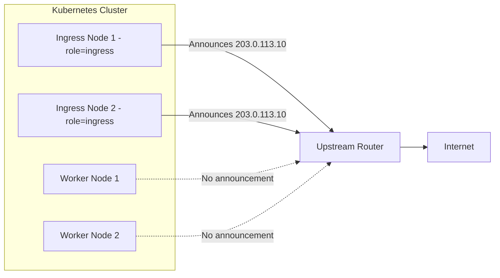
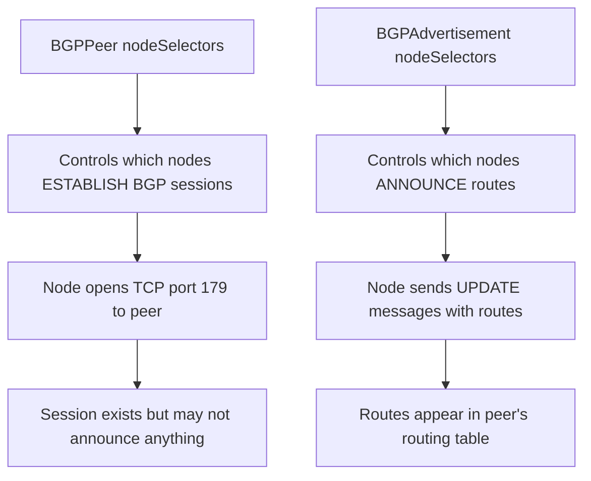

# How to Announce Services from a Subset of Nodes in MetalLB BGP Mode

Author: [nawazdhandala](https://www.github.com/nawazdhandala)

Tags: Kubernetes, MetalLB, BGP, Node Selection, BGPAdvertisement

Description: Learn how to configure MetalLB to announce service routes from only a subset of nodes in BGP mode using node selectors and BGPAdvertisement resources.

---

### Why Announce from a Subset of Nodes?

When MetalLB runs in BGP mode, every node with a MetalLB speaker will announce routes for allocated service IPs by default. In many environments, you want to restrict announcements to specific nodes for several reasons:

- Only certain nodes sit on the external-facing network
- You want to concentrate ingress traffic on dedicated nodes with more bandwidth
- Compliance or security policies require traffic to enter through specific nodes
- You are running a mixed cluster where some nodes are compute-only

The `BGPAdvertisement` resource supports a `nodeSelectors` field that controls which nodes originate route announcements.

### Architecture Overview



Only the ingress nodes advertise the service IP. Worker nodes still run workloads but do not originate BGP announcements.

### Step 1: Label Your Ingress Nodes

Choose which nodes will originate BGP announcements and label them.

```bash
# Label nodes designated for ingress traffic.
# These are the only nodes that will announce service IPs via BGP.
kubectl label node node-1 node-role=ingress
kubectl label node node-2 node-role=ingress

# Verify labels are set.
kubectl get nodes -l node-role=ingress
```

### Step 2: Create the IP Address Pool

Define the pool of IPs that MetalLB will allocate to LoadBalancer services.

```yaml
# ip-pool.yaml
# Pool of external IPs available for service allocation.
apiVersion: metallb.io/v1beta1
kind: IPAddressPool
metadata:
  name: external-pool
  namespace: metallb-system
spec:
  # Replace with your actual external IP range.
  addresses:
    - 203.0.113.0/28
```

Apply it:

```bash
# Create the IP address pool.
kubectl apply -f ip-pool.yaml
```

### Step 3: Create a BGPPeer

You need at least one BGPPeer for the announcements to be sent somewhere. This peer can also have node selectors, but for this example we will focus on the advertisement-level selection.

```yaml
# bgp-peer.yaml
# Defines the upstream router that MetalLB peers with.
apiVersion: metallb.io/v1beta2
kind: BGPPeer
metadata:
  name: upstream-router
  namespace: metallb-system
spec:
  # Your cluster's BGP AS number.
  myASN: 64512
  # The upstream router's AS number.
  peerASN: 64513
  # The upstream router's IP address.
  peerAddress: 10.0.0.1
```

Apply it:

```bash
# Create the BGP peer.
kubectl apply -f bgp-peer.yaml
```

### Step 4: Create a BGPAdvertisement with Node Selectors

This is the key step. The `nodeSelectors` field on the `BGPAdvertisement` resource controls which nodes originate route announcements.

```yaml
# bgp-advertisement.yaml
# Configures route announcements to originate only from ingress nodes.
# Worker nodes with MetalLB speakers will NOT announce these routes.
apiVersion: metallb.io/v1beta1
kind: BGPAdvertisement
metadata:
  name: ingress-only
  namespace: metallb-system
spec:
  # Which address pools to advertise.
  ipAddressPools:
    - external-pool

  # Only nodes matching these selectors will originate announcements.
  # Nodes without the "node-role=ingress" label will stay silent.
  nodeSelectors:
    - matchLabels:
        node-role: ingress

  # Advertise individual /32 host routes for each service IP.
  aggregationLength: 32
```

Apply it:

```bash
# Apply the advertisement configuration.
# Only ingress-labeled nodes will now announce routes.
kubectl apply -f bgp-advertisement.yaml
```

### Step 5: Verify the Announcement Behavior

Confirm that only the ingress nodes are advertising routes.

```bash
# Check MetalLB speaker logs on an ingress node.
# Look for "announcing" messages that confirm route advertisement.
kubectl logs -n metallb-system -l component=speaker --all-containers | grep -i "announce"

# Describe the BGPAdvertisement to see node selector details.
kubectl describe bgpadvertisement ingress-only -n metallb-system
```

On the upstream router (if you have access), verify that BGP routes are only received from ingress node IPs:

```bash
# Example command on a router running FRRouting.
# Shows the BGP routing table with next-hop information.
# You should only see next-hops pointing to ingress node IPs.
vtysh -c "show bgp ipv4 unicast"
```

### Understanding the Difference: BGPPeer vs BGPAdvertisement Node Selectors

Both `BGPPeer` and `BGPAdvertisement` support `nodeSelectors`, but they control different things:



- **BGPPeer nodeSelectors**: Which nodes open a BGP TCP session with the peer
- **BGPAdvertisement nodeSelectors**: Which nodes actually send route announcements through their sessions

A node must have both a BGP session (matched by BGPPeer) and be selected by the BGPAdvertisement to actually announce routes.

### Step 6: Multiple Advertisements for Different Node Groups

You can create separate advertisements for different node groups. This is useful when different nodes announce different pools.

```yaml
# bgp-advert-ingress.yaml
# Ingress nodes announce external service IPs.
apiVersion: metallb.io/v1beta1
kind: BGPAdvertisement
metadata:
  name: ingress-external
  namespace: metallb-system
spec:
  ipAddressPools:
    - external-pool
  nodeSelectors:
    - matchLabels:
        node-role: ingress

---
# bgp-advert-internal.yaml
# Internal nodes announce internal service IPs.
apiVersion: metallb.io/v1beta1
kind: BGPAdvertisement
metadata:
  name: internal-services
  namespace: metallb-system
spec:
  ipAddressPools:
    - internal-pool
  nodeSelectors:
    - matchLabels:
        node-role: internal
```

### Common Mistakes to Avoid

1. **No matching nodes**: If no nodes match the advertisement's node selector, the service IP will never be announced. The service will be unreachable from outside the cluster.
2. **Forgetting the BGPPeer**: A node must also be selected by a BGPPeer to have a session. Node selectors on the advertisement alone are not sufficient.
3. **Selector overlap**: If multiple advertisements cover the same pool with different node selectors, the route will be announced from all matched nodes across all advertisements. This can cause unexpected ECMP behavior.
4. **Node removal**: If a labeled node goes down, routes will be withdrawn. Make sure you have at least two nodes selected for redundancy.

### Cleaning Up

Remove the resources when done:

```bash
# Delete all MetalLB resources created in this guide.
kubectl delete bgpadvertisement ingress-only -n metallb-system
kubectl delete bgppeer upstream-router -n metallb-system
kubectl delete ipaddresspool external-pool -n metallb-system

# Remove node labels.
kubectl label node node-1 node-role-
kubectl label node node-2 node-role-
```

### Summary

Using `nodeSelectors` on `BGPAdvertisement` resources gives you precise control over which nodes announce service routes in MetalLB BGP mode. This is critical for clusters where only certain nodes have external connectivity or where you want to funnel ingress traffic through dedicated infrastructure.

For monitoring your MetalLB deployment and getting alerts when service routes stop being announced, check out [OneUptime](https://oneuptime.com). It provides uptime monitoring, alerting, and incident management for your bare-metal Kubernetes infrastructure.
