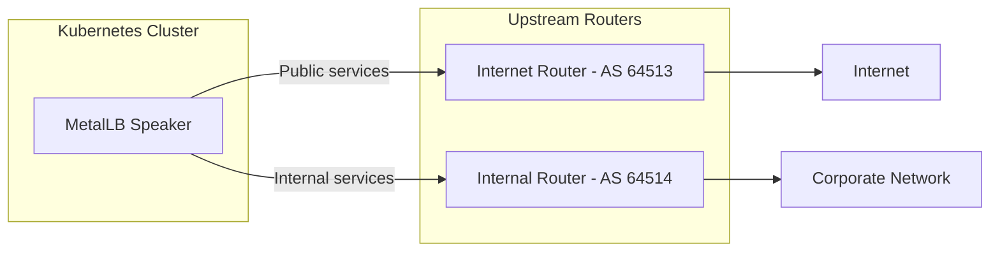
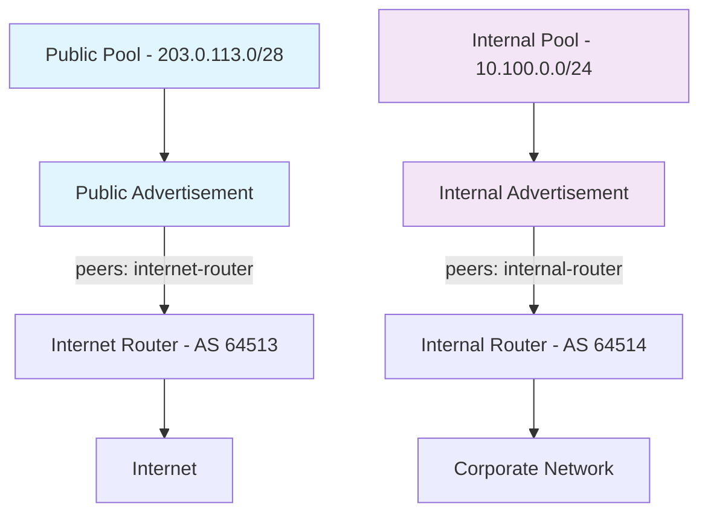

# How to Announce Services to a Subset of BGP Peers in MetalLB

Author: [nawazdhandala](https://www.github.com/nawazdhandala)

Tags: Kubernetes, MetalLB, BGP, Peers, BGPAdvertisement

Description: Learn how to selectively announce MetalLB service routes to specific BGP peers using peer selectors in BGPAdvertisement resources.

---

### Why Announce to a Subset of Peers?

In production bare-metal Kubernetes clusters, you often peer with multiple upstream routers. Not every service should be announced to every peer. Common scenarios include:

- Announcing public services to internet-facing routers but not to internal fabric routers
- Sending different service pools to different transit providers
- Keeping management services visible only to a specific network segment
- Implementing active/standby routing by advertising to primary and backup peers separately

MetalLB's `BGPAdvertisement` resource supports a `peers` field that lets you select which BGPPeer resources receive specific route announcements.

### Architecture Overview



Different address pools are advertised to different peers based on the intended traffic path.

### Step 1: Define Multiple BGP Peers

Start by creating BGPPeer resources for each upstream router.

```yaml
# bgp-peers.yaml
# Defines two upstream routers: one for internet traffic, one for internal.
apiVersion: metallb.io/v1beta2
kind: BGPPeer
metadata:
  # This name is what you reference in the BGPAdvertisement peers field.
  name: internet-router
  namespace: metallb-system
spec:
  myASN: 64512
  peerASN: 64513
  # IP of the internet-facing upstream router.
  peerAddress: 10.0.0.1

---
apiVersion: metallb.io/v1beta2
kind: BGPPeer
metadata:
  # A second peer for internal network traffic.
  name: internal-router
  namespace: metallb-system
spec:
  myASN: 64512
  peerASN: 64514
  # IP of the internal fabric router.
  peerAddress: 10.0.0.2
```

Apply both peers:

```bash
# Create both BGP peer resources.
kubectl apply -f bgp-peers.yaml
```

### Step 2: Create Separate IP Address Pools

Create distinct pools for public-facing and internal services.

```yaml
# ip-pools.yaml
# Two address pools: one for public services, one for internal.
apiVersion: metallb.io/v1beta1
kind: IPAddressPool
metadata:
  name: public-pool
  namespace: metallb-system
spec:
  # External IPs routable from the internet.
  addresses:
    - 203.0.113.0/28

---
apiVersion: metallb.io/v1beta1
kind: IPAddressPool
metadata:
  name: internal-pool
  namespace: metallb-system
spec:
  # Internal IPs routable only within the corporate network.
  addresses:
    - 10.100.0.0/24
```

Apply both pools:

```bash
# Create the IP address pools.
kubectl apply -f ip-pools.yaml
```

### Step 3: Create Targeted BGP Advertisements

Use the `peers` field in `BGPAdvertisement` to control which peers receive which routes.

```yaml
# bgp-advertisements.yaml
# Public services are announced only to the internet router.
apiVersion: metallb.io/v1beta1
kind: BGPAdvertisement
metadata:
  name: public-advert
  namespace: metallb-system
spec:
  # Announce IPs from the public pool.
  ipAddressPools:
    - public-pool

  # Only announce to the internet-facing router.
  # The peer name must match the metadata.name of a BGPPeer resource.
  peers:
    - internet-router

  aggregationLength: 32

---
# Internal services are announced only to the internal router.
apiVersion: metallb.io/v1beta1
kind: BGPAdvertisement
metadata:
  name: internal-advert
  namespace: metallb-system
spec:
  # Announce IPs from the internal pool.
  ipAddressPools:
    - internal-pool

  # Only announce to the internal fabric router.
  peers:
    - internal-router

  aggregationLength: 32
```

Apply the advertisements:

```bash
# Apply both advertisement configurations.
kubectl apply -f bgp-advertisements.yaml
```

### How It All Fits Together

Here is the complete flow showing which routes go to which peers:



### Step 4: Announcing to Multiple Peers

You can list multiple peers in the `peers` field when a service should be reachable from more than one network segment.

```yaml
# bgp-advert-multi-peer.yaml
# Announce the same pool to both routers.
# Useful for services that need to be reachable from both internet and corporate.
apiVersion: metallb.io/v1beta1
kind: BGPAdvertisement
metadata:
  name: shared-services
  namespace: metallb-system
spec:
  ipAddressPools:
    - public-pool

  # Announce to both peers.
  # Both routers will receive route updates for this pool.
  peers:
    - internet-router
    - internal-router

  aggregationLength: 32
```

### Step 5: Verify Peer-Specific Announcements

Check that routes are going to the correct peers.

```bash
# Describe the advertisement to confirm peer selection.
kubectl describe bgpadvertisement public-advert -n metallb-system

# Check speaker logs for announcement details.
# Look for which peer IP receives which prefix.
kubectl logs -n metallb-system -l component=speaker --all-containers | grep "announce"

# List all BGPPeer resources to confirm names.
kubectl get bgppeer -n metallb-system
```

### Common Mistakes to Avoid

1. **Wrong peer name**: The values in the `peers` list must exactly match the `metadata.name` of your BGPPeer resources. A typo means the route is never announced to that peer.
2. **Missing peer**: If a peer name in the list does not correspond to any existing BGPPeer, MetalLB will silently skip it. No error is raised.
3. **Overlapping advertisements**: If two advertisements cover the same pool and point to the same peer, the route is announced once. However, conflicting settings (different aggregation lengths) can cause unpredictable behavior.
4. **No default advertisement**: If every BGPAdvertisement has a `peers` field, and a new BGPPeer is added later, no existing advertisements will send routes to it automatically.

### Cleaning Up

Remove all resources:

```bash
# Delete advertisements, peers, and pools.
kubectl delete bgpadvertisement public-advert internal-advert -n metallb-system
kubectl delete bgppeer internet-router internal-router -n metallb-system
kubectl delete ipaddresspool public-pool internal-pool -n metallb-system
```

### Summary

The `peers` field on `BGPAdvertisement` resources gives you precise control over which upstream routers receive which route announcements. This is essential for multi-homed setups where different services need to be reachable through different network paths. Combined with node selectors and community strings, you can build sophisticated routing policies entirely through Kubernetes-native resources.

To monitor your MetalLB BGP sessions and get alerted when routes are withdrawn or peers go down, try [OneUptime](https://oneuptime.com). It offers comprehensive monitoring, incident management, and status pages for your infrastructure.
