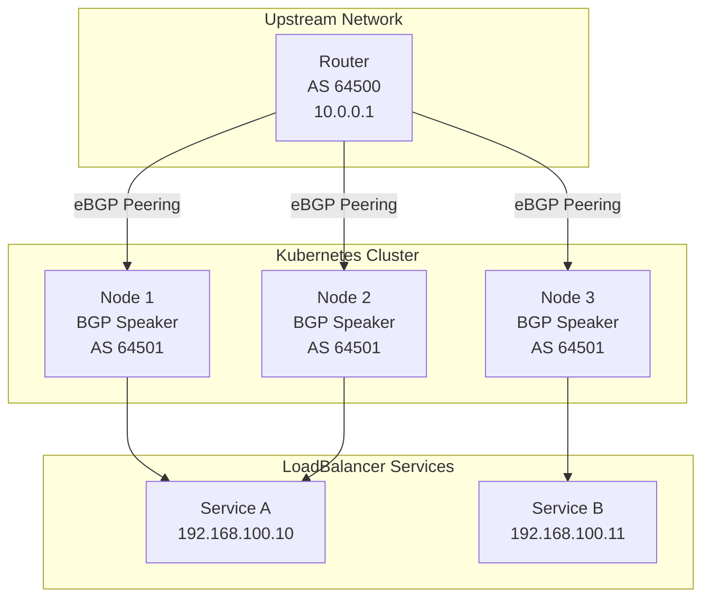
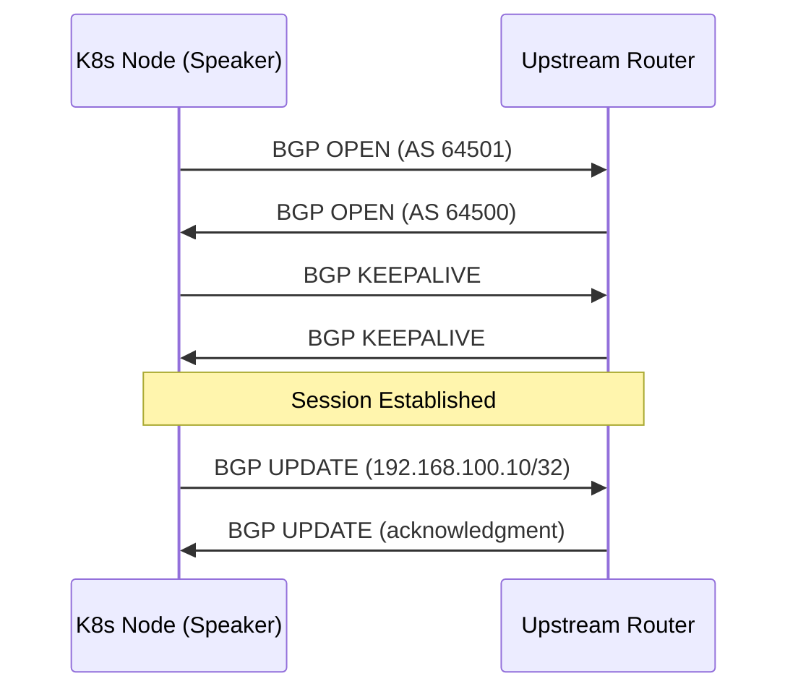
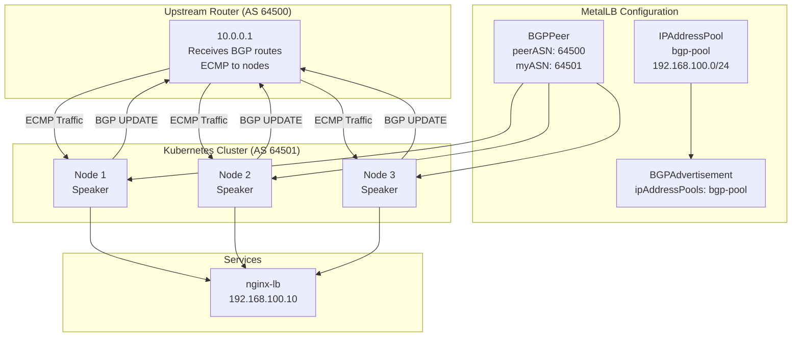

# How to Configure MetalLB BGP Mode with BGPPeer and BGPAdvertisement

Author: [nawazdhandala](https://www.github.com/nawazdhandala)

Tags: Kubernetes, MetalLB, BGP, BGPPeer, BGPAdvertisement, Routing

Description: A hands-on guide to configuring MetalLB in BGP mode using BGPPeer and BGPAdvertisement custom resources. Learn peering setup, route advertisement, and service exposure.

---

MetalLB in Layer 2 mode is the quickest way to get LoadBalancer services working on bare metal. But L2 has limits. It relies on ARP/NDP, which restricts traffic to a single node at a time and does not scale across network segments. BGP mode solves these problems by advertising service IPs as routes to upstream routers, enabling true multi-node load distribution and cross-subnet reachability.

This guide covers everything you need to set up MetalLB in BGP mode: creating an IP address pool, configuring BGPPeer resources to establish peering sessions with your routers, and defining BGPAdvertisement resources to control how routes are announced.

## How BGP Mode Works in MetalLB

In BGP mode, each Kubernetes node runs a BGP speaker that peers with one or more upstream routers. When a LoadBalancer service gets an external IP, MetalLB announces that IP as a route through BGP. The upstream router learns the route and forwards traffic to the announcing node.

Because multiple nodes can announce the same IP, the router can use Equal-Cost Multi-Path (ECMP) routing to spread traffic across them.



The router sees multiple next-hops for each service IP and distributes incoming traffic across the available nodes. If a node goes down, BGP withdraws the route and the router stops sending traffic to it.

## Prerequisites

Before starting, make sure you have:

- A Kubernetes cluster running on bare metal or VMs (not a cloud provider).
- MetalLB installed in your cluster (v0.13 or later for CRD-based configuration).
- An upstream router that supports BGP (FRRouting, VyOS, Cisco, Juniper, or similar).
- The router configured to accept BGP peering from your node IPs.
- `kubectl` installed and configured.

## Step 1: Install MetalLB

If MetalLB is not already installed, deploy it with the official manifests:

```bash
# Apply the MetalLB namespace and deployment manifests
# This creates the metallb-system namespace and deploys the controller and speakers
kubectl apply -f https://raw.githubusercontent.com/metallb/metallb/v0.14.9/config/manifests/metallb-native.yaml
```

Wait for all pods to be running before proceeding:

```bash
# Verify that the MetalLB controller and speaker pods are ready
kubectl get pods -n metallb-system
```

You should see output similar to:

```
NAME                          READY   STATUS    RESTARTS   AGE
controller-7d7f8d7b9c-x4k2n  1/1     Running   0          45s
speaker-abc12                 1/1     Running   0          45s
speaker-def34                 1/1     Running   0          45s
speaker-ghi56                 1/1     Running   0          45s
```

## Step 2: Create an IP Address Pool

Define the range of IP addresses that MetalLB can assign to LoadBalancer services. These IPs must be routable from your upstream network.

```yaml
# ip-address-pool.yaml
# Defines the pool of external IPs available for BGP advertisement
apiVersion: metallb.io/v1beta1
kind: IPAddressPool
metadata:
  name: bgp-pool
  namespace: metallb-system
spec:
  addresses:
    # Use a range that your upstream router can route to your cluster
    # This range should not overlap with node IPs or pod CIDRs
    - 192.168.100.0/24
```

Apply it:

```bash
# Create the IP address pool in the cluster
kubectl apply -f ip-address-pool.yaml
```

## Step 3: Configure the BGPPeer

The BGPPeer resource tells MetalLB which router to establish a BGP session with. You need one BGPPeer for each upstream router you want to peer with.



Create the BGPPeer resource:

```yaml
# bgp-peer.yaml
# Establishes a BGP peering session between MetalLB speakers and the upstream router
apiVersion: metallb.io/v1beta2
kind: BGPPeer
metadata:
  name: upstream-router
  namespace: metallb-system
spec:
  # The IP address of the upstream router to peer with
  peerAddress: 10.0.0.1

  # The Autonomous System Number of the upstream router
  # Must match the ASN configured on the router
  peerASN: 64500

  # The ASN that MetalLB speakers will use to identify themselves
  # Use a private ASN range (64512-65534 for 16-bit, or 4200000000-4294967294 for 32-bit)
  myASN: 64501

  # Interval in seconds between BGP keepalive messages
  # Lower values detect failures faster but generate more traffic
  keepaliveTime: 30s

  # Time in seconds before the peer is considered dead if no keepalive is received
  # Must be at least 3x the keepalive time
  holdTime: 90s

  # Optional: restrict which nodes peer with this router using a label selector
  # Useful when only certain nodes have network access to the router
  nodeSelectors:
    - matchLabels:
        kubernetes.io/os: linux
```

Apply it:

```bash
# Create the BGP peering configuration
kubectl apply -f bgp-peer.yaml
```

### Peering with Multiple Routers

For redundancy, peer with more than one router. Create a separate BGPPeer for each:

```yaml
# bgp-peer-secondary.yaml
# Second BGP peer for redundancy - traffic continues if one router fails
apiVersion: metallb.io/v1beta2
kind: BGPPeer
metadata:
  name: upstream-router-secondary
  namespace: metallb-system
spec:
  peerAddress: 10.0.0.2
  peerASN: 64500
  myASN: 64501
  keepaliveTime: 30s
  holdTime: 90s
```

## Step 4: Configure the BGPAdvertisement

The BGPAdvertisement resource controls how MetalLB announces IP addresses to the router. You can filter which pools are advertised, add BGP communities, and set a local preference.

```yaml
# bgp-advertisement.yaml
# Controls how IPs from the pool are advertised via BGP
apiVersion: metallb.io/v1beta1
kind: BGPAdvertisement
metadata:
  name: bgp-advertisement
  namespace: metallb-system
spec:
  # List of IPAddressPool names to advertise
  # Only IPs from these pools will be announced through this advertisement
  ipAddressPools:
    - bgp-pool

  # Optional: BGP communities to attach to the advertised routes
  # Communities are used by routers for policy decisions (filtering, preference, etc.)
  communities:
    - "65535:65282"  # NO_EXPORT - prevents the route from being exported outside the AS

  # Optional: aggregation length for route summarization
  # /32 means each IP is announced individually (most specific)
  # A shorter prefix like /24 announces the whole block as one route
  aggregationLength: 32

  # Optional: delay before advertising a newly assigned IP
  # Gives time for the service to be fully ready before receiving traffic
  # localPref: 100
```

Apply it:

```bash
# Create the BGP advertisement configuration
kubectl apply -f bgp-advertisement.yaml
```

### Advanced: Selective Advertisement Per Pool

You can create multiple pools and advertisements to control which IPs are advertised with which settings:

```yaml
# advanced-setup.yaml
# Separate pools and advertisements for different use cases
---
# Pool for public-facing services
apiVersion: metallb.io/v1beta1
kind: IPAddressPool
metadata:
  name: public-pool
  namespace: metallb-system
spec:
  addresses:
    - 203.0.113.0/28  # 16 public IPs for external services
---
# Pool for internal services
apiVersion: metallb.io/v1beta1
kind: IPAddressPool
metadata:
  name: internal-pool
  namespace: metallb-system
spec:
  addresses:
    - 10.10.50.0/24  # Internal range for cluster-to-cluster communication
---
# Advertisement for public pool - no community restrictions
apiVersion: metallb.io/v1beta1
kind: BGPAdvertisement
metadata:
  name: public-advertisement
  namespace: metallb-system
spec:
  ipAddressPools:
    - public-pool
  aggregationLength: 32
---
# Advertisement for internal pool - NO_EXPORT keeps routes inside the AS
apiVersion: metallb.io/v1beta1
kind: BGPAdvertisement
metadata:
  name: internal-advertisement
  namespace: metallb-system
spec:
  ipAddressPools:
    - internal-pool
  communities:
    - "65535:65282"
  aggregationLength: 24
```

## Step 5: Verify BGP Sessions

Check that MetalLB speakers have established BGP sessions with the upstream router.

```bash
# Check the MetalLB speaker logs for BGP session status
# Look for "sessionUp" messages indicating successful peering
kubectl logs -n metallb-system -l component=speaker --tail=50 | grep -i bgp
```

You should see log entries like:

```
{"caller":"bgp.go:63","event":"sessionUp","localASN":64501,"msg":"BGP session established","peerASN":64500,"peerIP":"10.0.0.1"}
```

If sessions are not coming up, verify these common issues:

```bash
# Confirm the BGPPeer resources are created
kubectl get bgppeers -n metallb-system

# Check the full speaker logs for error details
kubectl logs -n metallb-system -l component=speaker --tail=100

# Verify network connectivity from a node to the router
# Run this from one of your Kubernetes nodes
ping 10.0.0.1
```

## Step 6: Deploy a Test Service

Create a simple deployment and LoadBalancer service to test the full setup:

```yaml
# test-service.yaml
# A minimal nginx deployment and LoadBalancer service for testing BGP advertisement
---
apiVersion: apps/v1
kind: Deployment
metadata:
  name: nginx-test
  namespace: default
spec:
  replicas: 3
  selector:
    matchLabels:
      app: nginx-test
  template:
    metadata:
      labels:
        app: nginx-test
    spec:
      containers:
        - name: nginx
          image: nginx:1.27
          ports:
            - containerPort: 80
---
apiVersion: v1
kind: Service
metadata:
  name: nginx-lb
  namespace: default
spec:
  type: LoadBalancer
  selector:
    app: nginx-test
  ports:
    - protocol: TCP
      port: 80
      targetPort: 80
```

Apply and verify:

```bash
# Deploy the test application and service
kubectl apply -f test-service.yaml

# Wait a few seconds, then check the service for an external IP
kubectl get svc nginx-lb
```

Expected output:

```
NAME       TYPE           CLUSTER-IP     EXTERNAL-IP      PORT(S)        AGE
nginx-lb   LoadBalancer   10.96.45.123   192.168.100.10   80:31234/TCP   10s
```

The EXTERNAL-IP should come from your bgp-pool range. Test connectivity from a machine on the upstream network:

```bash
# Verify the service is reachable through the BGP-advertised IP
curl http://192.168.100.10
```

## Complete Architecture

Here is the full picture of all resources working together:



## Troubleshooting

Here are the most common issues and how to resolve them:

**BGP session stays in "Active" state (not established):** The router is not accepting the connection. Verify that the router has a matching neighbor configuration with the correct ASN and that no firewall is blocking TCP port 179.

**Service stuck in "Pending" state with no external IP:** The IP pool may be exhausted or the BGPAdvertisement does not reference the correct pool name. Check pool capacity with `kubectl get ipaddresspools -n metallb-system` and verify your advertisement configuration.

**Traffic reaches only one node:** The upstream router may not be configured for ECMP. Check the router's routing table to confirm multiple next-hops exist for the service IP, and enable ECMP in the router's BGP configuration.

## Conclusion

BGP mode in MetalLB gives you production-grade load balancing on bare metal Kubernetes. By configuring BGPPeer resources for router peering and BGPAdvertisement resources for route control, you get multi-node traffic distribution, fast failover, and cross-subnet reachability. Start with a single peer and pool, verify the session, and expand from there.

Once your services are externally reachable, you need visibility into their health and performance. [OneUptime](https://oneuptime.com) provides monitoring, alerting, and incident management for your Kubernetes workloads, so you can detect issues before your users do.
