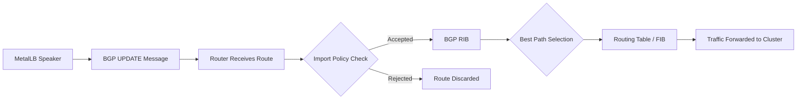
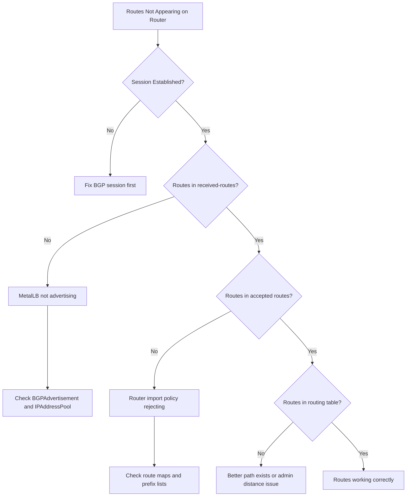
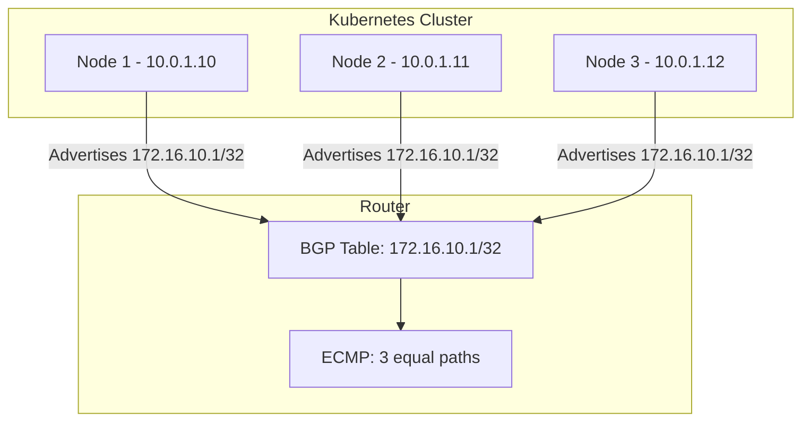

# How to Check BGP Route Advertisements from MetalLB on Your Router

Author: [nawazdhandala](https://www.github.com/nawazdhandala)

Tags: Kubernetes, MetalLB, BGP, Router, Route Verification

Description: Learn how to verify that MetalLB BGP route advertisements are being received correctly on your upstream routers using common router CLI commands.

---

You have configured MetalLB, defined your IPAddressPool, created a BGPAdvertisement, and your BGP session shows as Established. But how do you confirm that your router is actually receiving and installing the routes that MetalLB is advertising?

This guide shows you how to verify MetalLB BGP route advertisements on the router side using CLI commands for the most common router platforms: Cisco IOS, Juniper JunOS, MikroTik RouterOS, VyOS, and Linux-based routers running FRR or BIRD.

## The Verification Flow

Before diving into router commands, understand the path a route takes from MetalLB to your router's forwarding table.



A route can be lost at any step. You need to check each stage to find where the problem is.

## Step 1: Confirm the Session is Established (MetalLB Side)

Always start from the MetalLB side to confirm that routes are being sent.

```bash
# Get the speaker pod name
SPEAKER_POD=$(kubectl get pods -n metallb-system \
  -l component=speaker \
  -o jsonpath='{.items[0].metadata.name}')

# Verify the BGP session is established
kubectl exec -n metallb-system $SPEAKER_POD -- \
  vtysh -c "show bgp summary"

# Check what routes MetalLB is advertising to the peer
kubectl exec -n metallb-system $SPEAKER_POD -- \
  vtysh -c "show bgp ipv4 unicast neighbors 10.0.0.1 advertised-routes"

# The output should list the service IPs from your IPAddressPool
# Example output:
#   Network          Next Hop         Metric  LocPrf  Path
#   172.16.10.1/32   10.0.1.10             0         i
#   172.16.10.2/32   10.0.1.10             0         i
```

## Step 2: Check on Cisco IOS / IOS-XE Routers

Cisco routers are one of the most common upstream peers for MetalLB deployments.

```bash
# Show all BGP neighbors and their status
show bgp ipv4 unicast summary

# View routes received from the MetalLB peer
# Replace 10.0.1.10 with your MetalLB speaker node IP
show bgp ipv4 unicast neighbors 10.0.1.10 received-routes

# View routes accepted from the MetalLB peer (after policy filtering)
show bgp ipv4 unicast neighbors 10.0.1.10 routes

# Check if a specific prefix is in the BGP table
show bgp ipv4 unicast 172.16.10.1/32

# Verify the route is installed in the routing table (RIB)
show ip route 172.16.10.1

# Check the forwarding table (CEF) to confirm the route is being used
show ip cef 172.16.10.1

# If routes are received but not installed, check the import policy
show route-map
show ip prefix-list
```

## Step 3: Check on Juniper JunOS Routers

For Juniper routers, the command structure is different but the verification steps are the same.

```bash
# Show BGP neighbor summary
show bgp summary

# View routes received from the MetalLB peer
show route receive-protocol bgp 10.0.1.10

# View accepted routes from the MetalLB peer
show route protocol bgp neighbor 10.0.1.10

# Check a specific prefix in the routing table
show route 172.16.10.1/32 detail

# View the BGP table entry for the prefix
show route table inet.0 172.16.10.1/32

# Check if a policy is rejecting the routes
show policy
show configuration policy-options
```

## Step 4: Check on MikroTik RouterOS

MikroTik routers are popular in smaller data center and homelab setups.

```bash
# Show BGP peer status (RouterOS v7)
/routing/bgp/session print detail

# View received routes from the MetalLB peer
/routing/bgp/advertisements print where peer="metallb-peer"

# Check the routing table for BGP-learned routes
/ip/route print where routing-table=main and bgp

# Look for a specific prefix
/ip/route print where dst-address="172.16.10.1/32"

# Check BGP connection configuration
/routing/bgp/connection print detail

# View BGP input/output filters
/routing/filter/rule print where chain="bgp-in"
```

## Step 5: Check on VyOS Routers

VyOS uses a FRR backend, so the commands are similar to standard FRR.

```bash
# Show BGP summary
show bgp summary

# View routes received from MetalLB peer
show bgp ipv4 unicast neighbors 10.0.1.10 received-routes

# View accepted routes
show bgp ipv4 unicast neighbors 10.0.1.10 routes

# Check the routing table
show ip route bgp

# Look for a specific prefix
show ip route 172.16.10.1

# Check route maps and prefix lists
show route-map
show ip prefix-list
```

## Step 6: Check on Linux Routers Running FRR

If your upstream router is a Linux box running FRR (common in software-defined data centers), use vtysh.

```bash
# Enter the FRR shell
sudo vtysh

# Show BGP summary
show bgp summary

# View routes received from the MetalLB peer
show bgp ipv4 unicast neighbors 10.0.1.10 received-routes

# View the full BGP table
show bgp ipv4 unicast

# Check the kernel routing table for BGP routes
show ip route bgp

# Check a specific prefix
show ip route 172.16.10.1

# From outside vtysh, check the kernel routing table directly
ip route show proto bgp
ip route get 172.16.10.1
```

## Step 7: Check on Linux Routers Running BIRD

BIRD is another common BGP daemon used on Linux routers.

```bash
# Enter the BIRD client
sudo birdc

# Show BGP protocol status for the MetalLB peer
show protocols all metallb_peer

# View routes received from MetalLB
show route protocol metallb_peer

# Check if a specific route exists
show route for 172.16.10.1/32

# View route details including path attributes
show route for 172.16.10.1/32 all

# Check the export filter
show route export metallb_peer
```

## Diagnostic Decision Tree

Use this tree when routes are not appearing on the router:



## Common Issues and Fixes

| Issue | Router Symptom | Fix |
|-------|---------------|-----|
| No routes received | `received-routes` is empty | Check MetalLB BGPAdvertisement config |
| Routes received but filtered | `received-routes` shows routes, `routes` is empty | Update router import policy |
| Routes in BGP table but not RIB | Route shows in BGP table but not in `show ip route` | Check for duplicate routes with lower admin distance |
| Routes flapping | Routes appear and disappear | Check MetalLB speaker pod stability and health checks |
| Wrong next-hop | Route points to wrong IP | Configure `next-hop-self` or check MetalLB source address |

## Step 8: Verify ECMP When Using Multiple Nodes

If MetalLB is advertising the same prefix from multiple nodes, verify that your router is installing all paths for ECMP load balancing.

```bash
# On Cisco IOS - check for multiple paths
show bgp ipv4 unicast 172.16.10.1/32
# Look for "multipath" in the output

# On Linux FRR - check multipath routes
show ip route 172.16.10.1
# You should see multiple next-hops listed

# Verify ECMP is enabled on the router
# Cisco: maximum-paths <number> under router bgp
# FRR: maximum-paths <number> under address-family
# JunOS: set protocols bgp multipath multiple-as
```



## Step 9: Automate Route Verification

For ongoing verification, set up a simple script that checks route presence.

```bash
#!/bin/bash
# verify_metallb_routes.sh
# This script checks if expected MetalLB routes are present on the router
# Run from a host that can SSH to the router

ROUTER_IP="10.0.0.1"
EXPECTED_PREFIXES=("172.16.10.1/32" "172.16.10.2/32" "172.16.10.3/32")

# Loop through each expected prefix and check if it exists
for prefix in "${EXPECTED_PREFIXES[@]}"; do
  # Using SSH to check the route on a Linux/FRR router
  result=$(ssh admin@$ROUTER_IP "sudo vtysh -c 'show ip route $prefix'" 2>/dev/null)

  if echo "$result" | grep -q "via"; then
    echo "[OK] Route $prefix is present on the router"
  else
    echo "[FAIL] Route $prefix is MISSING from the router"
  fi
done
```

## Conclusion

Verifying BGP route advertisements on the router side is a critical step in any MetalLB deployment. Always check the full path: from MetalLB's advertised routes, through the router's received routes, past the import policy, into the BGP table, and finally into the forwarding table.

For continuous monitoring of your BGP route advertisements, session health, and service reachability, [OneUptime](https://oneuptime.com) offers infrastructure monitoring with custom checks, alerting, and dashboards that can track your MetalLB and router metrics in one place.
