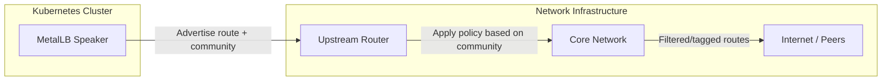
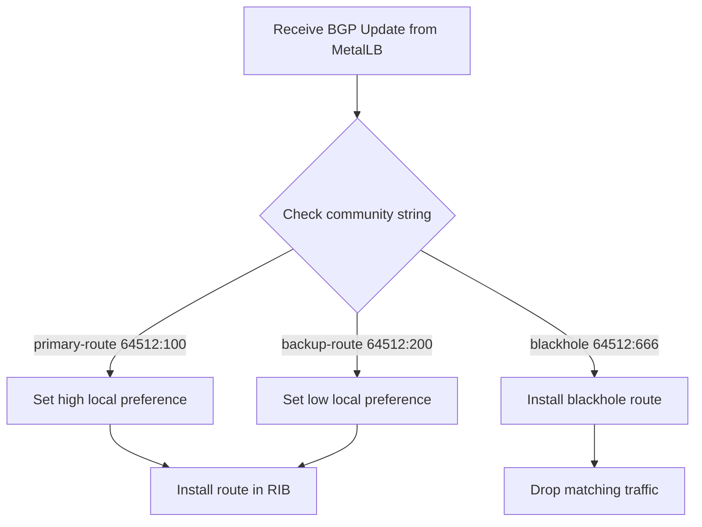

# How to Configure BGP Community Aliases in MetalLB

Author: [nawazdhandala](https://www.github.com/nawazdhandala)

Tags: Kubernetes, MetalLB, BGP, Communities, Routing

Description: Learn how to configure BGP community strings and aliases in MetalLB for advanced route control and traffic policy enforcement.

---

### What Are BGP Communities?

BGP communities are tags attached to route advertisements that signal intent to upstream routers. They let you influence how your routes are treated by peers, transit providers, and Internet exchanges without changing the routes themselves.

A community is a 32-bit value usually written as two 16-bit integers separated by a colon, like `65535:666`. Some well-known communities include `no-export` (65535:65281) and `no-advertise` (65535:65282). Large communities extend this to three 32-bit values for more flexibility.

### Why Use Communities in MetalLB?

When you run MetalLB in BGP mode on bare metal, you often peer with upstream routers that make decisions based on community strings. Common use cases include:

- Signaling route preference (primary vs. backup)
- Requesting blackhole routing for DDoS mitigation
- Controlling route propagation scope
- Tagging routes for traffic engineering

MetalLB supports attaching community strings to BGP advertisements through the `Community` and `BGPAdvertisement` custom resources.

### Architecture Overview

Here is how community strings flow from MetalLB to upstream routers:



### Step 1: Define a Community Resource

MetalLB uses a `Community` custom resource to define named aliases for numeric community values. This keeps your advertisements readable and maintainable.

Create a file called `community.yaml`:

```yaml
# community.yaml
# Defines named aliases for BGP community strings.
# These aliases can be referenced by BGPAdvertisement resources
# instead of repeating raw numeric values everywhere.
apiVersion: metallb.io/v1beta1
kind: Community
metadata:
  # Name of this Community resource - referenced by BGPAdvertisements
  name: my-communities
  # Must be in the metallb-system namespace
  namespace: metallb-system
spec:
  communities:
    # Alias for a standard community value.
    # "primary-route" is the human-readable name you use in advertisements.
    # The value follows the format ASN:value (two 16-bit integers).
    - name: primary-route
      value: "64512:100"

    # Alias for a backup route signal.
    # Upstream routers can match on this to lower local preference.
    - name: backup-route
      value: "64512:200"

    # Alias for blackhole community.
    # Useful for DDoS mitigation - upstream drops traffic to this prefix.
    - name: blackhole
      value: "64512:666"

    # Large community example using the extended format.
    # Large communities use three 32-bit integers: global:local1:local2
    - name: region-us-east
      value: "large:64512:1:100"
```

Apply the resource:

```bash
# Apply the community definitions to the cluster.
# This makes the aliases available for BGPAdvertisement resources.
kubectl apply -f community.yaml
```

### Step 2: Create an IP Address Pool

Before advertising routes, you need an IP address pool for MetalLB to allocate from.

```yaml
# ip-pool.yaml
# Defines the pool of IP addresses MetalLB can assign to LoadBalancer services.
apiVersion: metallb.io/v1beta1
kind: IPAddressPool
metadata:
  name: production-pool
  namespace: metallb-system
spec:
  # CIDR ranges or individual IPs available for allocation.
  # Replace with your actual public or private IP ranges.
  addresses:
    - 203.0.113.0/28
```

Apply it:

```bash
# Create the address pool in the cluster.
kubectl apply -f ip-pool.yaml
```

### Step 3: Attach Communities to a BGP Advertisement

Now create a `BGPAdvertisement` that references your community aliases.

```yaml
# bgp-advertisement.yaml
# Attaches community strings to route advertisements.
# MetalLB will include these communities when announcing routes to BGP peers.
apiVersion: metallb.io/v1beta1
kind: BGPAdvertisement
metadata:
  name: primary-advert
  namespace: metallb-system
spec:
  # Which IP address pools this advertisement applies to.
  ipAddressPools:
    - production-pool

  # Reference community aliases defined in the Community resource.
  # Use the alias name, not the raw numeric value.
  communities:
    - primary-route
    - region-us-east

  # Optional: aggregate routes to reduce the number of prefixes advertised.
  # A value of 32 means advertise individual /32 host routes.
  aggregationLength: 32
```

Apply it:

```bash
# Apply the BGP advertisement with community tags.
kubectl apply -f bgp-advertisement.yaml
```

### Step 4: Create a Backup Advertisement with Different Communities

You can create multiple advertisements for the same pool with different communities. This is useful for active/backup setups.

```yaml
# bgp-advertisement-backup.yaml
# A second advertisement for the same pool but tagged as backup.
# Upstream routers should prefer the primary-route community.
apiVersion: metallb.io/v1beta1
kind: BGPAdvertisement
metadata:
  name: backup-advert
  namespace: metallb-system
spec:
  ipAddressPools:
    - production-pool

  # Tag this advertisement as a backup route.
  communities:
    - backup-route

  aggregationLength: 32
```

### Step 5: Verify the Configuration

Check that all resources are created correctly:

```bash
# List all Community resources in the metallb-system namespace.
kubectl get community -n metallb-system

# List all BGPAdvertisement resources.
kubectl get bgpadvertisement -n metallb-system

# Describe a specific advertisement to see its community references.
kubectl describe bgpadvertisement primary-advert -n metallb-system
```

### How Communities Flow Through the Network

Here is the decision flow when an upstream router receives a route with communities:



### Common Mistakes to Avoid

1. **Wrong namespace**: Community and BGPAdvertisement resources must be in the `metallb-system` namespace.
2. **Mismatched alias names**: The community name in your BGPAdvertisement must exactly match the name in your Community resource.
3. **Missing BGPPeer**: Communities only matter if you have a working BGPPeer session established. Verify your peering first.
4. **Provider-specific values**: Check with your upstream provider which community values they support before tagging routes.

### Cleaning Up

To remove the community configuration:

```bash
# Delete the advertisement and community resources.
kubectl delete bgpadvertisement primary-advert backup-advert -n metallb-system
kubectl delete community my-communities -n metallb-system
```

### Summary

BGP community aliases in MetalLB let you tag route advertisements with meaningful labels that upstream routers can act on. By defining communities in a dedicated resource and referencing them in advertisements, you keep your configuration clean and maintainable. This is essential for production bare-metal Kubernetes clusters where you need fine-grained control over how your routes propagate through the network.

If you are running MetalLB on bare metal and want full observability over your Kubernetes infrastructure, consider using [OneUptime](https://oneuptime.com) to monitor your services, track uptime, and get alerted when BGP sessions drop or routes stop being advertised.
