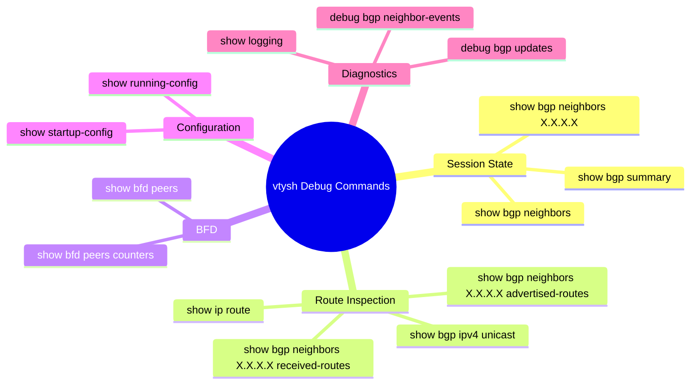
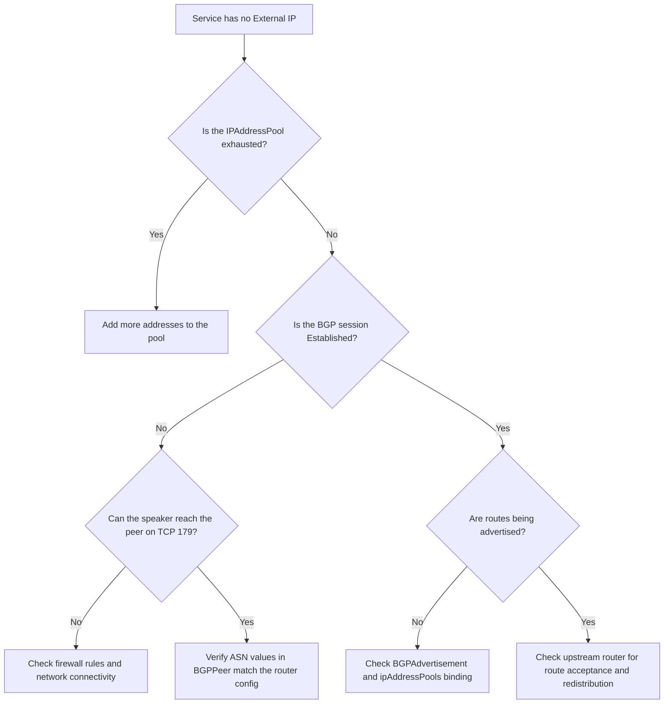

# How to Debug MetalLB BGP Sessions Using vtysh Commands

Author: [nawazdhandala](https://www.github.com/nawazdhandala)

Tags: Kubernetes, MetalLB, BGP, vtysh, FRR, Debugging

Description: Learn how to use vtysh commands inside MetalLB FRR containers to debug BGP sessions, check routing tables, and troubleshoot peering issues.

---

When MetalLB runs in FRR mode, each speaker pod contains a full FRR routing stack. The primary tool for inspecting that stack is vtysh, the FRR unified shell. It gives you direct access to BGP session state, routing tables, BFD status, and the running configuration - all from inside the container.

This guide covers the most useful vtysh commands for debugging MetalLB BGP issues, organized by the type of problem you are trying to solve.

### Accessing vtysh in a MetalLB Speaker Pod

First, identify the speaker pod and exec into the FRR container:

```bash
# List all MetalLB speaker pods
kubectl get pods -n metallb-system -l component=speaker

# Store the name of one speaker pod
SPEAKER_POD=$(kubectl get pod -n metallb-system -l component=speaker \
  -o jsonpath='{.items[0].metadata.name}')

# Open an interactive vtysh session inside the frr container
kubectl exec -it -n metallb-system "$SPEAKER_POD" -c frr -- vtysh
```

You are now in the FRR shell. All commands below can be run interactively, or you can pass them as one-liners using `vtysh -c "command"`.

### Command Reference by Category



### Checking BGP Session Status

The most common first step is to check whether your BGP sessions are established:

```bash
# Run from outside the pod as a one-liner
kubectl exec -n metallb-system "$SPEAKER_POD" -c frr -- \
  vtysh -c "show bgp summary"
```

Sample output:

```
IPv4 Unicast Summary:
BGP router identifier 10.0.1.10, local AS number 64513
Neighbor        V   AS   MsgRcvd MsgSent   TblVer  InQ OutQ  Up/Down  State/PfxRcd
10.0.0.1        4 64512      142     138        0    0    0 01:12:34            3
```

Key things to look for:

- **State/PfxRcd column**: A number means the session is established and that many prefixes were received. If it shows `Active`, `Connect`, or `OpenSent`, the session has not come up.
- **Up/Down column**: Shows how long the session has been up (or down).
- **InQ/OutQ**: Should both be 0. Non-zero values indicate message processing delays.

### Inspecting a Specific Neighbor

For detailed information about a single peer:

```bash
# Get full details about the neighbor at 10.0.0.1
kubectl exec -n metallb-system "$SPEAKER_POD" -c frr -- \
  vtysh -c "show bgp neighbors 10.0.0.1"
```

This shows:

- The BGP state machine state (Idle, Connect, Active, OpenSent, OpenConfirm, Established)
- Hold time and keepalive interval
- Number of prefixes sent and received
- Last error or notification message
- BFD status if configured

### Viewing Advertised Routes

To see what prefixes MetalLB is announcing to a peer:

```bash
# Show routes advertised to the upstream router
kubectl exec -n metallb-system "$SPEAKER_POD" -c frr -- \
  vtysh -c "show bgp neighbors 10.0.0.1 advertised-routes"
```

If this list is empty but you have LoadBalancer services with external IPs assigned, something is wrong with the BGPAdvertisement configuration or the IP address pool binding.

### Viewing Received Routes

To see what routes the upstream router is sending to MetalLB:

```bash
# Show routes received from the upstream router
kubectl exec -n metallb-system "$SPEAKER_POD" -c frr -- \
  vtysh -c "show bgp neighbors 10.0.0.1 received-routes"
```

MetalLB typically does not import routes from peers, but this is useful for verifying that the router is sending the expected prefixes back (for example, in ECMP setups).

### Inspecting the Routing Table

```bash
# Show the full IP routing table as FRR sees it
kubectl exec -n metallb-system "$SPEAKER_POD" -c frr -- \
  vtysh -c "show ip route"

# Filter to show only BGP-learned routes
kubectl exec -n metallb-system "$SPEAKER_POD" -c frr -- \
  vtysh -c "show ip route bgp"
```

### Checking BFD Status

If you have configured a BFD profile, verify that the BFD session is up:

```bash
# Show all BFD peers and their status
kubectl exec -n metallb-system "$SPEAKER_POD" -c frr -- \
  vtysh -c "show bfd peers"

# Show BFD packet counters for debugging timing issues
kubectl exec -n metallb-system "$SPEAKER_POD" -c frr -- \
  vtysh -c "show bfd peers counters"
```

A healthy BFD session shows `Status: up`. If it shows `Status: down`, check that BFD is also enabled on the upstream router and that UDP ports 3784 and 3785 are not blocked.

### Viewing the Running Configuration

To see the full FRR configuration that MetalLB generated:

```bash
# Dump the active FRR configuration
kubectl exec -n metallb-system "$SPEAKER_POD" -c frr -- \
  vtysh -c "show running-config"
```

This is invaluable for verifying that your Kubernetes CRDs (BGPPeer, BGPAdvertisement, BFDProfile) were correctly translated into FRR directives.

### Enabling Debug Logging

For transient issues that are hard to reproduce, enable BGP debug logging temporarily:

```bash
# Enable debug logging for BGP updates (route advertisements)
kubectl exec -n metallb-system "$SPEAKER_POD" -c frr -- \
  vtysh -c "debug bgp updates"

# Enable debug logging for neighbor state changes
kubectl exec -n metallb-system "$SPEAKER_POD" -c frr -- \
  vtysh -c "debug bgp neighbor-events"

# View the FRR log output
kubectl exec -n metallb-system "$SPEAKER_POD" -c frr -- \
  vtysh -c "show logging"
```

Remember to disable debug logging when you are done, as it can generate a large volume of output:

```bash
# Disable all BGP debug logging
kubectl exec -n metallb-system "$SPEAKER_POD" -c frr -- \
  vtysh -c "no debug bgp updates"

kubectl exec -n metallb-system "$SPEAKER_POD" -c frr -- \
  vtysh -c "no debug bgp neighbor-events"
```

### Troubleshooting Flowchart



### Quick Reference Table

| What you want to check | vtysh command |
|---|---|
| All BGP sessions | `show bgp summary` |
| Single peer detail | `show bgp neighbors <IP>` |
| Routes sent to peer | `show bgp neighbors <IP> advertised-routes` |
| Routes received from peer | `show bgp neighbors <IP> received-routes` |
| Full routing table | `show ip route` |
| BGP-only routes | `show ip route bgp` |
| BFD session status | `show bfd peers` |
| Running FRR config | `show running-config` |
| Enable update debug | `debug bgp updates` |
| Enable neighbor debug | `debug bgp neighbor-events` |

### Summary

The vtysh shell is the most powerful tool you have for debugging MetalLB BGP issues. Every session state, route advertisement, and configuration detail is accessible from inside the FRR container. Make it part of your standard troubleshooting workflow.

For proactive monitoring of your MetalLB infrastructure, [OneUptime](https://oneuptime.com) can track service availability, alert on endpoint failures, and provide dashboards that surface BGP-related issues before they impact your users.
