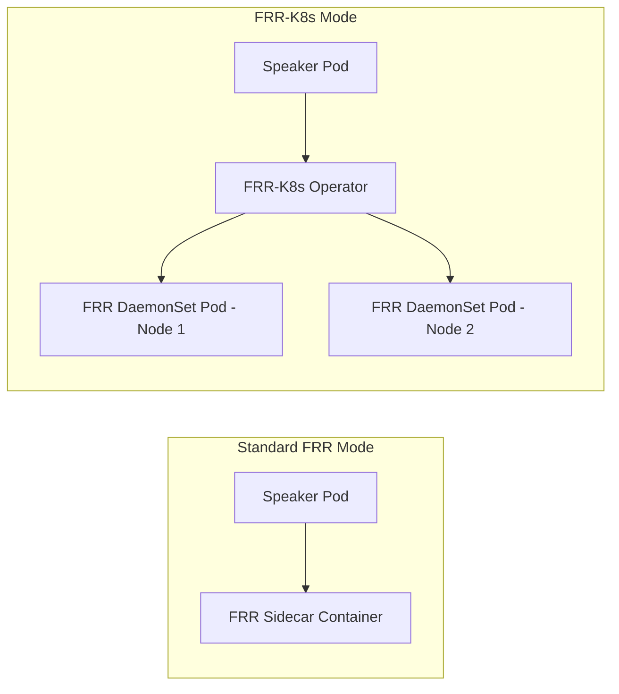
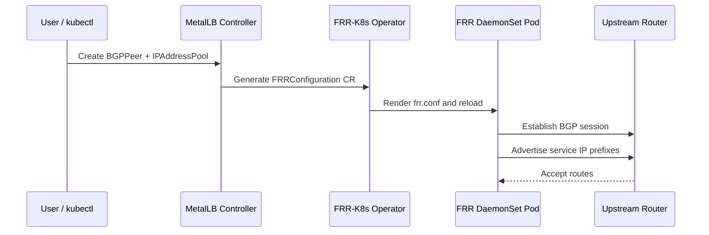

# How to Configure MetalLB BGP with the Experimental FRR-K8s Mode

Author: [nawazdhandala](https://www.github.com/nawazdhandala)

Tags: Kubernetes, MetalLB, BGP, FRR-K8s, Experimental

Description: Learn how to configure MetalLB with the experimental FRR-K8s mode for native Kubernetes integration of FRR routing capabilities.

---

MetalLB's standard FRR mode runs an FRR sidecar inside each speaker pod. The experimental FRR-K8s mode takes a different approach: it deploys FRR as a standalone DaemonSet managed by a dedicated Kubernetes operator. This means FRR configuration is driven entirely by Kubernetes custom resources, and the FRR lifecycle is decoupled from the MetalLB speaker.

This guide covers what FRR-K8s mode is, how it differs from standard FRR mode, and how to set it up end-to-end.

### FRR Mode vs FRR-K8s Mode

Before diving into the setup, it helps to understand the architectural difference between the two modes:



| Feature | FRR Mode | FRR-K8s Mode |
|---|---|---|
| FRR lifecycle | Tied to speaker pod | Independent DaemonSet |
| Configuration | Rendered by speaker | Driven by CRDs via operator |
| Scalability | Per-speaker sidecar | Shared FRR instances |
| Maturity | Stable | Experimental |
| Extra FRR config | Limited | Full CRD-based control |

FRR-K8s mode is useful when you want other components (not just MetalLB) to share the same FRR instance on each node. It also makes it easier to inject custom FRR configuration without patching the speaker.

### Prerequisites

- Kubernetes v1.26 or later
- Helm v3 installed
- An upstream BGP router
- kubectl access to the cluster
- Familiarity with basic BGP concepts (ASN, peering, prefixes)

### Step 1: Install the FRR-K8s Operator

The FRR-K8s operator manages the FRR DaemonSet and watches for FRRConfiguration custom resources. Install it before MetalLB:

```bash
# Add the FRR-K8s Helm repository
helm repo add frr-k8s https://metallb.github.io/frr-k8s

# Update your local chart index
helm repo update

# Install the FRR-K8s operator into its own namespace
helm install frr-k8s frr-k8s/frr-k8s \
  --namespace frr-k8s-system \
  --create-namespace
```

Verify the operator and FRR pods are running:

```bash
# Check the FRR-K8s operator pod
kubectl get pods -n frr-k8s-system

# Confirm the FRR DaemonSet is deployed - one pod per node
kubectl get daemonset -n frr-k8s-system
```

### Step 2: Install MetalLB in FRR-K8s Mode

Now install MetalLB and tell it to use the external FRR-K8s operator instead of its own sidecar:

```bash
# Install MetalLB with FRR-K8s mode enabled
# This disables the built-in FRR sidecar and connects to the FRR-K8s operator
helm install metallb metallb/metallb \
  --namespace metallb-system \
  --create-namespace \
  --set speaker.frr.enabled=false \
  --set frrk8s.enabled=true
```

```bash
# Verify MetalLB pods are running
kubectl get pods -n metallb-system

# Confirm the speaker pods do NOT have an frr container
kubectl get pod -n metallb-system -l component=speaker \
  -o jsonpath='{.items[0].spec.containers[*].name}'
# Expected output: speaker (no frr container)
```

### Step 3: Create an IP Address Pool

Define the addresses MetalLB can allocate:

```yaml
# ip-pool.yaml
# The pool of IPs MetalLB will assign to LoadBalancer services
apiVersion: metallb.io/v1beta1
kind: IPAddressPool
metadata:
  name: frr-k8s-pool
  namespace: metallb-system
spec:
  addresses:
    # Replace with your routable IP range
    - 10.200.0.0/24
```

```bash
# Apply the address pool
kubectl apply -f ip-pool.yaml
```

### Step 4: Configure a BGP Peer

Create the BGPPeer resource. MetalLB will translate this into an FRRConfiguration CR that the FRR-K8s operator picks up:

```yaml
# bgp-peer.yaml
# Tells MetalLB which router to peer with
apiVersion: metallb.io/v1beta2
kind: BGPPeer
metadata:
  name: tor-switch
  namespace: metallb-system
spec:
  # Remote ASN of your top-of-rack switch or router
  peerASN: 65000
  # Local ASN for MetalLB
  myASN: 65001
  # IP address of the upstream router
  peerAddress: 10.0.0.1
```

```bash
# Apply the BGP peer
kubectl apply -f bgp-peer.yaml
```

### Step 5: Create a BGP Advertisement

```yaml
# bgp-advertisement.yaml
# Controls how routes are announced to the peer
apiVersion: metallb.io/v1beta1
kind: BGPAdvertisement
metadata:
  name: frr-k8s-advert
  namespace: metallb-system
spec:
  ipAddressPools:
    - frr-k8s-pool
  # Advertise each IP as a /32 host route
  aggregationLength: 32
```

```bash
# Apply the advertisement
kubectl apply -f bgp-advertisement.yaml
```

### Step 6: Inspect the Generated FRRConfiguration

The MetalLB controller creates an FRRConfiguration CR in the FRR-K8s namespace. Inspect it to see what was generated:

```bash
# List FRRConfiguration resources created by MetalLB
kubectl get frrconfiguration -n frr-k8s-system

# View the full spec of the generated configuration
kubectl get frrconfiguration -n frr-k8s-system -o yaml
```

The output will look similar to this (simplified):

```yaml
# Auto-generated by MetalLB - do not edit directly
apiVersion: frrk8s.metallb.io/v1beta1
kind: FRRConfiguration
metadata:
  name: metallb-tor-switch
  namespace: frr-k8s-system
spec:
  bgp:
    routers:
      - asn: 65001
        neighbors:
          - address: 10.0.0.1
            asn: 65000
            toAdvertise:
              allowed:
                prefixes:
                  - 10.200.0.0/24
```

### Step 7: Add Custom FRR Configuration

One of the key advantages of FRR-K8s mode is that you can create your own FRRConfiguration resources alongside the ones MetalLB generates. For example, to add a static route or a route map:

```yaml
# custom-frr-config.yaml
# Custom FRR configuration that coexists with MetalLB's generated config
apiVersion: frrk8s.metallb.io/v1beta1
kind: FRRConfiguration
metadata:
  name: custom-config
  namespace: frr-k8s-system
spec:
  bgp:
    routers:
      - asn: 65001
        prefixes:
          # Announce an additional prefix not managed by MetalLB
          - 10.201.0.0/24
        neighbors:
          - address: 10.0.0.1
            asn: 65000
            toAdvertise:
              allowed:
                prefixes:
                  - 10.201.0.0/24
```

```bash
# Apply the custom configuration
kubectl apply -f custom-frr-config.yaml
```

The FRR-K8s operator merges all FRRConfiguration resources and renders a single FRR config file for each node.

### Step 8: Verify the BGP Session

```bash
# Find an FRR pod on a specific node
FRR_POD=$(kubectl get pod -n frr-k8s-system -l app=frr-k8s -o jsonpath='{.items[0].metadata.name}')

# Check BGP session status
kubectl exec -n frr-k8s-system "$FRR_POD" -c frr -- vtysh -c "show bgp summary"

# Verify advertised routes
kubectl exec -n frr-k8s-system "$FRR_POD" -c frr -- vtysh -c "show bgp neighbors 10.0.0.1 advertised-routes"
```

### Data Flow in FRR-K8s Mode



### When to Use FRR-K8s Mode

Consider FRR-K8s mode when:

- You want to share FRR instances with other networking tools (e.g., Cilium BGP, custom route injection)
- You need full control over FRR configuration via Kubernetes CRDs
- You want to decouple the FRR lifecycle from MetalLB speaker restarts

Avoid FRR-K8s mode when:

- You need a stable, production-proven setup (standard FRR mode is more mature)
- You prefer a simpler deployment with fewer moving parts

### Summary

FRR-K8s mode gives you the flexibility of a standalone FRR routing stack managed entirely through Kubernetes resources. It is still experimental, but it opens the door to multi-component routing configurations that standard FRR mode cannot support.

For end-to-end visibility into your MetalLB and BGP infrastructure, [OneUptime](https://oneuptime.com) provides monitoring, alerting, and status pages that help you catch peering issues before they affect your users.
