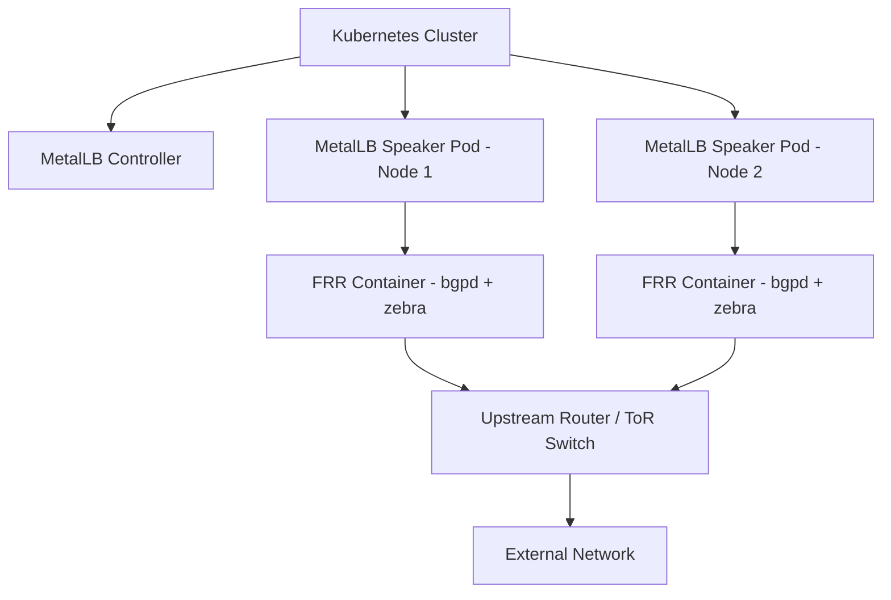
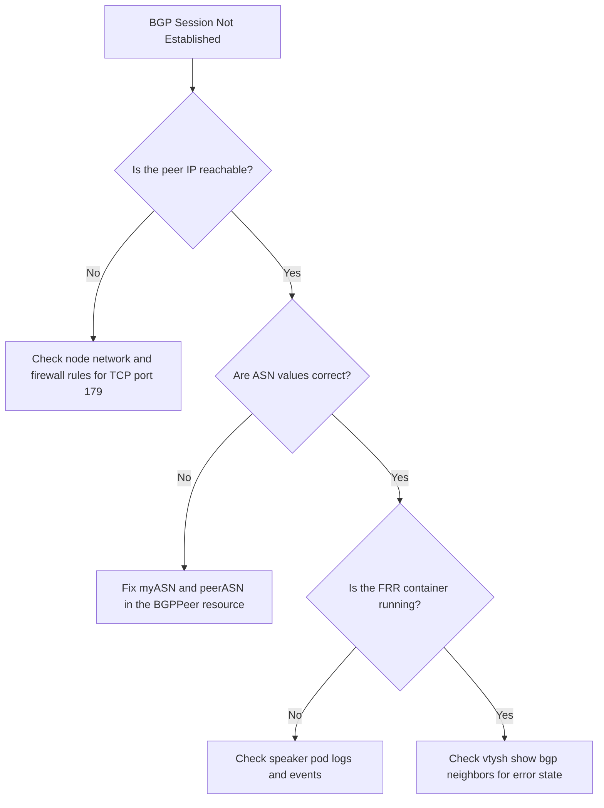

# How to Set Up MetalLB BGP with FRR (Free Range Routing) Mode

Author: [nawazdhandala](https://www.github.com/nawazdhandala)

Tags: Kubernetes, MetalLB, BGP, FRR, Free Range Routing

Description: Learn how to configure MetalLB with FRR mode for full-featured BGP support including BFD, VRF, and advanced route policies.

---

MetalLB ships with a native BGP implementation that handles basic peering well, but it lacks support for advanced features like BFD (Bidirectional Forwarding Detection), VRF (Virtual Routing and Forwarding), and fine-grained route policies. FRR mode replaces the built-in speaker with a full FRR routing stack, giving you production-grade BGP capabilities inside your Kubernetes cluster.

This guide walks you through deploying MetalLB in FRR mode from scratch, configuring BGP peers, and verifying that routes are advertised correctly.

### Why FRR Mode?

The default MetalLB speaker handles simple BGP peering, but it cannot do the following:

- Run BFD for sub-second failure detection
- Peer through a VRF
- Apply community strings or local preference policies
- Support IPv4 and IPv6 dual-stack in a single session

FRR mode solves all of these by running an actual FRR daemon (with zebra and bgpd) inside each speaker pod.

### Architecture Overview



Each speaker pod runs an FRR sidecar container. The controller translates your Kubernetes CRDs into FRR configuration that bgpd consumes.

### Prerequisites

Before you begin, make sure you have:

- A Kubernetes cluster (v1.25 or later)
- Helm v3 installed
- At least one upstream router that supports BGP
- kubectl configured and pointing at your cluster

### Step 1: Install MetalLB with FRR Mode Enabled

Add the MetalLB Helm repository and install with the FRR flag:

```bash
# Add the official MetalLB Helm chart repository
helm repo add metallb https://metallb.universe.tf

# Update local chart cache
helm repo update

# Install MetalLB with FRR mode enabled
# The speaker.frr.enabled flag swaps the native BGP implementation for FRR
helm install metallb metallb/metallb \
  --namespace metallb-system \
  --create-namespace \
  --set speaker.frr.enabled=true
```

Verify that the speaker pods are running and each has an FRR container:

```bash
# Check that speaker pods are running with the frr container
kubectl get pods -n metallb-system -l app=metallb,component=speaker

# Inspect the containers inside a speaker pod
# You should see both "speaker" and "frr" containers listed
kubectl get pod -n metallb-system -l component=speaker -o jsonpath='{.items[0].spec.containers[*].name}'
```

You should see output that includes both `speaker` and `frr` containers.

### Step 2: Create an IP Address Pool

Define the pool of addresses MetalLB can hand out to LoadBalancer services:

```yaml
# ip-address-pool.yaml
# Defines the IP range MetalLB is allowed to allocate
apiVersion: metallb.io/v1beta1
kind: IPAddressPool
metadata:
  name: bgp-pool
  namespace: metallb-system
spec:
  addresses:
    # Replace with your actual routable IP range
    - 10.100.0.0/24
```

```bash
# Apply the IP address pool to the cluster
kubectl apply -f ip-address-pool.yaml
```

### Step 3: Configure a BGP Peer

Create a BGPPeer resource that tells MetalLB which upstream router to peer with:

```yaml
# bgp-peer.yaml
# Configures MetalLB to establish a BGP session with your upstream router
apiVersion: metallb.io/v1beta2
kind: BGPPeer
metadata:
  name: upstream-router
  namespace: metallb-system
spec:
  # The AS number of your upstream router
  peerASN: 64512
  # The AS number MetalLB will use
  myASN: 64513
  # IP address of the upstream router
  peerAddress: 10.0.0.1
  # BFD profile name - enables sub-second failure detection
  bfdProfile: fast-detect
```

```bash
# Apply the BGP peer configuration
kubectl apply -f bgp-peer.yaml
```

### Step 4: Enable BFD (Optional but Recommended)

BFD lets MetalLB detect link failures in milliseconds instead of waiting for BGP hold timers. Create a BFD profile:

```yaml
# bfd-profile.yaml
# Defines BFD timing parameters for fast failure detection
apiVersion: metallb.io/v1beta1
kind: BFDProfile
metadata:
  name: fast-detect
  namespace: metallb-system
spec:
  # Time between BFD packets (in milliseconds)
  receiveInterval: 300
  transmitInterval: 300
  # Number of missed packets before declaring the peer down
  detectMultiplier: 3
  # Use echo mode for lower CPU overhead
  echoMode: true
  # Passive mode means MetalLB waits for the router to initiate BFD
  passiveMode: false
  # Minimum echo receive interval in milliseconds
  minimumTtl: 254
```

```bash
# Apply the BFD profile
kubectl apply -f bfd-profile.yaml
```

### Step 5: Advertise Routes with a BGPAdvertisement

Control how MetalLB announces your IP pool to the upstream router:

```yaml
# bgp-advertisement.yaml
# Controls route advertisement behavior
apiVersion: metallb.io/v1beta1
kind: BGPAdvertisement
metadata:
  name: bgp-advert
  namespace: metallb-system
spec:
  # Which IP pools to advertise
  ipAddressPools:
    - bgp-pool
  # Optional: set communities on advertised routes
  communities:
    - 64512:100
  # Optional: aggregate routes into a single prefix
  aggregationLength: 32
  # Optional: only advertise from specific nodes
  # nodeSelectors:
  #   - matchLabels:
  #       node-role.kubernetes.io/worker: ""
```

```bash
# Apply the BGP advertisement
kubectl apply -f bgp-advertisement.yaml
```

### Step 6: Verify the BGP Session

Check that FRR has established a session with your upstream router:

```bash
# Exec into the FRR container of a speaker pod
# Replace the pod name with an actual pod from your cluster
SPEAKER_POD=$(kubectl get pod -n metallb-system -l component=speaker -o jsonpath='{.items[0].metadata.name}')

# Show the BGP summary - you should see "Established" state
kubectl exec -n metallb-system "$SPEAKER_POD" -c frr -- vtysh -c "show bgp summary"

# Show advertised routes to your peer
kubectl exec -n metallb-system "$SPEAKER_POD" -c frr -- vtysh -c "show bgp neighbors 10.0.0.1 advertised-routes"

# Check BFD session status
kubectl exec -n metallb-system "$SPEAKER_POD" -c frr -- vtysh -c "show bfd peers"
```

### Step 7: Deploy a Test Service

Create a simple service to confirm that MetalLB assigns an external IP and the route is propagated:

```yaml
# test-service.yaml
# A simple LoadBalancer service to verify MetalLB is working
apiVersion: v1
kind: Service
metadata:
  name: test-lb
spec:
  type: LoadBalancer
  selector:
    app: nginx
  ports:
    - port: 80
      targetPort: 80
      protocol: TCP
```

```bash
# Apply the test service
kubectl apply -f test-service.yaml

# Wait a few seconds, then check the external IP
# The EXTERNAL-IP column should show an address from your bgp-pool
kubectl get svc test-lb
```

### Troubleshooting

If the BGP session does not come up, check these common issues:



Common commands for diagnosing problems:

```bash
# Check speaker pod logs for errors
kubectl logs -n metallb-system "$SPEAKER_POD" -c frr

# View the generated FRR configuration
kubectl exec -n metallb-system "$SPEAKER_POD" -c frr -- vtysh -c "show running-config"

# Check if the MetalLB controller has processed your CRDs
kubectl get events -n metallb-system --sort-by='.lastTimestamp'
```

### Summary

FRR mode transforms MetalLB from a basic BGP speaker into a full-featured routing platform. You get BFD for fast failover, community strings for policy control, and the reliability of a battle-tested routing daemon. For production bare-metal clusters, FRR mode is the recommended approach.

If you are running bare-metal Kubernetes and need full observability into your network and services, [OneUptime](https://oneuptime.com) can monitor your MetalLB endpoints, alert on BGP session drops, and give you a single dashboard for infrastructure health.
