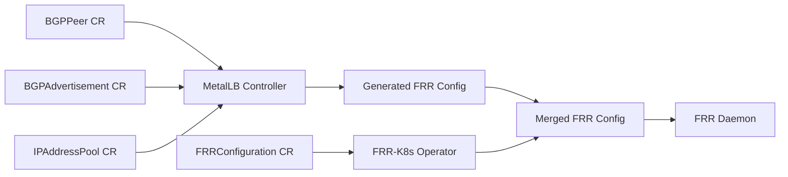
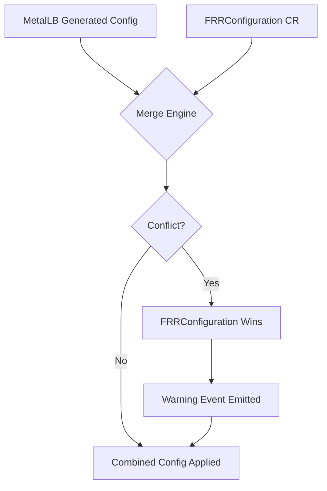

# How to Merge FRRConfiguration with MetalLB BGP Configuration

Author: [nawazdhandala](https://www.github.com/nawazdhandala)

Tags: Kubernetes, MetalLB, BGP, FRR, FRRConfiguration

Description: Learn how to merge custom FRRConfiguration resources with MetalLB's BGP configuration for advanced routing scenarios.

---

MetalLB generates FRR (Free Range Routing) configuration automatically when you define BGPPeer and BGPAdvertisement resources. However, there are scenarios where you need to inject custom FRR directives - like route maps, prefix lists, or community strings - that MetalLB does not expose natively. The FRRConfiguration custom resource lets you do exactly that.

This guide walks you through merging a custom FRRConfiguration with MetalLB's auto-generated BGP config so you can take full control of your routing behavior without losing MetalLB's management capabilities.

## How MetalLB Generates FRR Config

When MetalLB runs in FRR mode, it translates your Kubernetes resources into an FRR configuration file. The flow looks like this:



MetalLB produces a base configuration that covers peer definitions, address families, and network statements. The FRRConfiguration resource is processed by the FRR-K8s operator and merged on top of this base.

## Prerequisites

Before you begin, make sure you have:

- A running Kubernetes cluster with MetalLB installed in FRR mode
- MetalLB v0.14.0 or later (FRRConfiguration support)
- `kubectl` configured to access your cluster
- A BGP peer already configured and establishing sessions

## Step 1: Verify Your Existing MetalLB BGP Setup

First, confirm that MetalLB is running in FRR mode and your BGP sessions are healthy.

```bash
# Check that the MetalLB speaker pods are running
kubectl get pods -n metallb-system -l app=metallb,component=speaker

# Verify your existing BGPPeer resources
kubectl get bgppeers -A

# Check that sessions are established
kubectl exec -n metallb-system <speaker-pod> -- vtysh -c "show bgp summary"
```

You should see your peers listed with an established state before proceeding.

## Step 2: Understand the FRRConfiguration Resource

The FRRConfiguration custom resource definition lets you specify raw FRR config sections that get merged with MetalLB's generated config. Here is the basic structure:

```yaml
# FRRConfiguration resource structure
# This resource is processed by the FRR-K8s operator
apiVersion: frrk8s.metallb.io/v1beta1
kind: FRRConfiguration
metadata:
  name: custom-bgp-config
  namespace: metallb-system
spec:
  bgp:
    # List of routers to configure
    routers:
      - asn: 64512          # Your local ASN
        neighbors:
          - address: 10.0.0.1
            asn: 64513       # Remote peer ASN
            toReceive:
              allowed:
                mode: filtered
                prefixes:
                  - prefix: 192.168.0.0/16
            toAdvertise:
              allowed:
                mode: filtered
                prefixes:
                  - 172.16.10.0/24
        prefixes:
          - 172.16.10.0/24   # Prefixes this router owns
```

## Step 3: Create a Route Map via FRRConfiguration

One common reason to merge custom config is to apply route maps. MetalLB does not expose route-map creation natively, but you can add them through the raw config section.

```yaml
# FRRConfiguration with a custom route map
# This applies a local-preference of 200 to routes from peer 10.0.0.1
apiVersion: frrk8s.metallb.io/v1beta1
kind: FRRConfiguration
metadata:
  name: route-map-config
  namespace: metallb-system
spec:
  bgp:
    routers:
      - asn: 64512
        neighbors:
          - address: 10.0.0.1
            asn: 64513
            toReceive:
              allowed:
                mode: all    # Accept all prefixes from this peer
  raw:
    # Raw FRR configuration to inject a route map
    # This section is appended verbatim to the FRR config file
    rawConfig: |
      route-map PREFER-PRIMARY permit 10
        set local-preference 200
      !
      router bgp 64512
        neighbor 10.0.0.1 route-map PREFER-PRIMARY in
      !
```

## Step 4: Apply and Verify the Merge

Apply your FRRConfiguration and verify that the merge was successful.

```bash
# Apply the FRRConfiguration resource
kubectl apply -f frrconfiguration.yaml

# Wait a few seconds for the FRR-K8s operator to process the merge
sleep 5

# Check the merged FRR config inside a speaker pod
kubectl exec -n metallb-system <speaker-pod> -- \
  vtysh -c "show running-config"

# Verify the route map was applied
kubectl exec -n metallb-system <speaker-pod> -- \
  vtysh -c "show route-map PREFER-PRIMARY"
```

## Merge Behavior and Conflict Resolution

Understanding how the merge works is critical. The following diagram shows the merge priority:



Key rules to remember:

1. **Additive sections** like route maps and prefix lists are appended without conflict
2. **Overlapping neighbor config** in the FRRConfiguration takes precedence over MetalLB's generated config
3. **Raw config** is appended at the end of the generated configuration
4. **Invalid raw config** will cause FRR to reject the entire merged file, so always validate first

## Step 5: Add Community Strings

Another common use case is tagging routes with BGP community strings for traffic engineering.

```yaml
# FRRConfiguration that adds community strings to advertised routes
apiVersion: frrk8s.metallb.io/v1beta1
kind: FRRConfiguration
metadata:
  name: community-config
  namespace: metallb-system
spec:
  bgp:
    routers:
      - asn: 64512
        neighbors:
          - address: 10.0.0.1
            asn: 64513
            toAdvertise:
              allowed:
                mode: all
  raw:
    rawConfig: |
      route-map ADD-COMMUNITY permit 10
        set community 64512:100 additive
      !
      router bgp 64512
        neighbor 10.0.0.1 route-map ADD-COMMUNITY out
      !
```

## Step 6: Validate Before Applying

Always validate your raw config before applying it to a production cluster.

```bash
# Test the FRR config syntax locally using a container
# This runs FRR in dry-run mode to catch syntax errors
docker run --rm -v $(pwd)/frr.conf:/etc/frr/frr.conf \
  quay.io/frrouting/frr:stable \
  /usr/lib/frr/zebra --config_file /etc/frr/frr.conf --dryrun

# After applying, check for error events
kubectl get events -n metallb-system --field-selector reason=FRRConfigError
```

## Step 7: Monitor the Merged Configuration

After the merge is live, monitor the health of your BGP sessions and route advertisements.

```bash
# Confirm BGP sessions are still established after the merge
kubectl exec -n metallb-system <speaker-pod> -- \
  vtysh -c "show bgp summary"

# Verify that routes carry the expected community strings
kubectl exec -n metallb-system <speaker-pod> -- \
  vtysh -c "show bgp ipv4 unicast community 64512:100"

# Check that the route map is being applied
kubectl exec -n metallb-system <speaker-pod> -- \
  vtysh -c "show ip bgp neighbors 10.0.0.1 received-routes"
```

## Common Pitfalls

| Pitfall | Symptom | Fix |
|---------|---------|-----|
| Invalid raw config syntax | FRR fails to start, pod restarts | Validate config with dry-run before applying |
| Duplicate router bgp block | Config rejected by FRR | Use raw config to add to existing block, not create new |
| Missing prefix in prefixes list | Routes not advertised | Ensure prefixes match your IPAddressPool ranges |
| Wrong namespace | FRRConfiguration ignored | Must be in metallb-system namespace |

## Cleanup

If you need to remove your custom FRRConfiguration and revert to MetalLB's default generated config:

```bash
# Delete the FRRConfiguration resource
kubectl delete frrconfiguration custom-bgp-config -n metallb-system

# Verify MetalLB reverts to its generated config
kubectl exec -n metallb-system <speaker-pod> -- \
  vtysh -c "show running-config"
```

## Conclusion

Merging FRRConfiguration with MetalLB's BGP configuration gives you the flexibility of raw FRR directives while keeping MetalLB's automated service-to-route management intact. Use it for route maps, community strings, prefix lists, and any other FRR feature that MetalLB does not expose through its native CRDs.

If you are running MetalLB in production and need to monitor your BGP sessions, route advertisements, and Kubernetes infrastructure, [OneUptime](https://oneuptime.com) provides full-stack observability with built-in alerting and incident management for your bare-metal and cloud-native environments.
