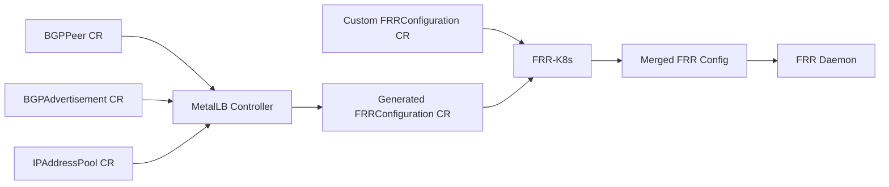
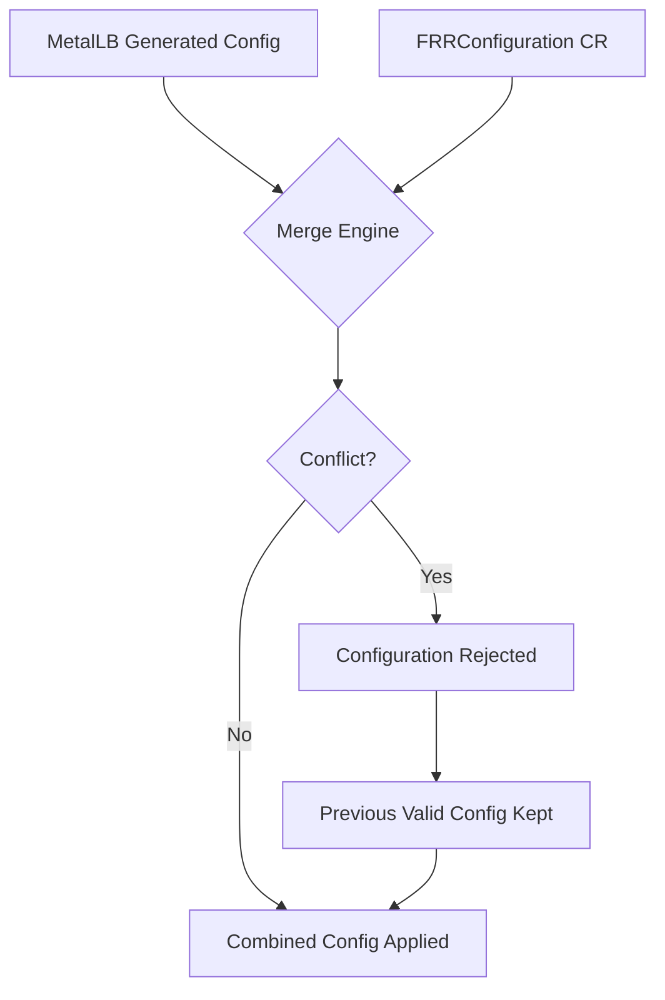

# How to Merge FRRConfiguration with MetalLB BGP Configuration

Author: [nawazdhandala](https://www.github.com/nawazdhandala)

Tags: Kubernetes, MetalLB, BGP, FRR, FRRConfiguration

Description: Learn how to merge custom FRRConfiguration resources with MetalLB's BGP configuration for advanced routing scenarios.

---

MetalLB generates FRR (Free Range Routing) configuration automatically when you define BGPPeer and BGPAdvertisement resources in FRR-K8s mode. However, there are scenarios where you need to add FRR-K8s configuration that MetalLB does not expose natively. The FRRConfiguration custom resource lets you do exactly that.

This guide walks you through merging a custom FRRConfiguration with MetalLB's auto-generated BGP config so you can take full control of your routing behavior without losing MetalLB's management capabilities.

## How MetalLB Generates FRR Config

When MetalLB runs in FRR-K8s mode, it translates your Kubernetes resources into FRRConfiguration resources. FRR-K8s then merges those resources with any additional FRRConfiguration resources and renders the final FRR configuration. The flow looks like this:


```mermaid
flowchart LR
    A[BGPPeer CR] --> B[MetalLB Controller]
    C[BGPAdvertisement CR] --> B
    D[IPAddressPool CR] --> B
    B --> E[Generated FRRConfiguration CR]
    F[Custom FRRConfiguration CR] --> G[FRR-K8s]
    E --> G
    G --> H[Merged FRR Config]
    H --> I[FRR Daemon]
```

MetalLB produces FRRConfiguration resources that cover peer definitions, address families, and network statements. FRR-K8s collects compatible FRRConfiguration resources for each node and renders the resulting FRR configuration.

## Prerequisites

Before you begin, make sure you have:

- A running Kubernetes cluster with MetalLB installed in FRR-K8s mode
- MetalLB v0.14.2 or later for FRR-K8s support, or a current release where FRR-K8s is the recommended BGP backend
- `kubectl` configured to access your cluster
- A BGP peer already configured and establishing sessions

## Step 1: Verify Your Existing MetalLB BGP Setup

First, confirm that MetalLB is running in FRR-K8s mode and your BGP sessions are healthy.

```bash
# Check that the MetalLB speaker and FRR-K8s pods are running
kubectl get pods -n metallb-system -l app=metallb,component=speaker
kubectl get pods -n metallb-system -l app=frr-k8s

# Verify your existing BGPPeer resources
kubectl get bgppeers -A

# Check that sessions are established
kubectl get bgpsessionstates -n metallb-system -o wide
```

You should see your peers listed with an established state before proceeding.

## Step 2: Understand the FRRConfiguration Resource

The FRRConfiguration custom resource definition lets you specify type-safe BGP settings that get merged with MetalLB's generated FRRConfiguration resources. Here is the basic structure:

```yaml
# FRRConfiguration resource structure
# This resource is processed by the FRR-K8s operator
apiVersion: frrk8s.metallb.io/v1beta1
kind: FRRConfiguration
metadata:
  name: custom-bgp-config
  namespace: metallb-system
spec:
  bgp:
    # List of routers to configure
    routers:
      - asn: 64512          # Your local ASN
        neighbors:
          - address: 10.0.0.1
            asn: 64513       # Remote peer ASN
            toReceive:
              allowed:
                mode: filtered
                prefixes:
                  - prefix: 192.168.0.0/16
            toAdvertise:
              allowed:
                mode: filtered
                prefixes:
                  - 172.16.10.0/24
        prefixes:
          - 172.16.10.0/24   # Prefixes this router owns
```

## Step 3: Create a Route Map via FRRConfiguration

One common reason to merge custom config is to experiment with route maps. MetalLB does not expose arbitrary route-map creation natively, but FRR-K8s has an unsupported raw config section that appends FRR configuration to the rendered file. Because rawConfig is unsupported and intended only for experimentation, avoid relying on it for production changes unless you have validated the behavior for your FRR-K8s version.

```yaml
# FRRConfiguration with a custom route map
# This applies a local-preference of 200 to routes from peer 10.0.0.1
apiVersion: frrk8s.metallb.io/v1beta1
kind: FRRConfiguration
metadata:
  name: route-map-config
  namespace: metallb-system
spec:
  bgp:
    routers:
      - asn: 64512
        neighbors:
          - address: 10.0.0.1
            asn: 64513
            toReceive:
              allowed:
                mode: all    # Accept all prefixes from this peer
  raw:
    # Raw FRR configuration to inject a route map
    # This section is appended to the rendered FRR config file
    priority: 5
    rawConfig: |
      route-map PREFER-PRIMARY permit 10
        set local-preference 200
      !
      router bgp 64512
        neighbor 10.0.0.1 route-map PREFER-PRIMARY in
      !
```

## Step 4: Apply and Verify the Merge

Apply your FRRConfiguration and verify that the merge was successful.

```bash
# Apply the FRRConfiguration resource
kubectl apply -f frrconfiguration.yaml

# Wait a few seconds for FRR-K8s to process the merge
sleep 5

# Check the merged FRR config reported by FRR-K8s
kubectl get frrnodestates -n metallb-system -o yaml

# Verify that the last reload and conversion succeeded
kubectl get frrnodestates -n metallb-system -o wide
```

## Merge Behavior and Conflict Resolution

Understanding how the merge works is critical. The following diagram shows the merge priority:


```mermaid
flowchart TD
    A[MetalLB Generated Config] --> C{Merge Engine}
    B[FRRConfiguration CR] --> C
    C --> D{Conflict?}
    D -- No --> E[Combined Config Applied]
    D -- Yes --> F[Configuration Rejected]
    F --> G[Previous Valid Config Kept]
    G --> E
```

Key rules to remember:

1. **Compatible sections** are merged by combining routers, prefixes, neighbors, and filters
2. **Filters are merged permissively**, so accepting all prefixes is more permissive than accepting a subset
3. **Conflicting config** such as different ASNs for the same router or neighbor is rejected, and FRR-K8s keeps the previous valid configuration
4. **Raw config** is appended at the end of the rendered configuration, ordered by rawConfig priority when multiple raw snippets exist
5. **Invalid raw config** can cause FRR to reject the merged file, so always validate first

## Step 5: Add Community Strings

Another common use case is tagging routes with BGP community strings for traffic engineering.

```yaml
# FRRConfiguration that adds community strings to advertised routes
apiVersion: frrk8s.metallb.io/v1beta1
kind: FRRConfiguration
metadata:
  name: community-config
  namespace: metallb-system
spec:
  bgp:
    routers:
      - asn: 64512
        neighbors:
          - address: 10.0.0.1
            asn: 64513
            toAdvertise:
              allowed:
                mode: all
  raw:
    priority: 5
    rawConfig: |
      route-map ADD-COMMUNITY permit 10
        set community 64512:100 additive
      !
      router bgp 64512
        neighbor 10.0.0.1 route-map ADD-COMMUNITY out
      !
```

## Step 6: Validate Before Applying

Always validate your raw config before applying it to a production cluster.

```bash
# Test the FRR config syntax locally using a container
# This runs vtysh in dry-run mode to catch syntax errors
docker run --rm -v $(pwd)/frr.conf:/etc/frr/frr.conf \
  quay.io/frrouting/frr:stable \
  vtysh -C -f /etc/frr/frr.conf

# After applying, check FRR-K8s status for conversion or reload errors
kubectl get frrnodestates -n metallb-system -o yaml
```

## Step 7: Monitor the Merged Configuration

After the merge is live, monitor the health of your BGP sessions and route advertisements.

```bash
# Confirm BGP sessions are still established after the merge
kubectl get bgpsessionstates -n metallb-system -o wide

# Inspect the running FRR config rendered by FRR-K8s
kubectl get frrnodestates -n metallb-system -o yaml

# If you need FRR CLI output, run vtysh inside an FRR-K8s pod
kubectl exec -n metallb-system <frr-k8s-pod> -c frr -- \
  vtysh -c "show bgp summary"
```

## Common Pitfalls

| Pitfall | Symptom | Fix |
|---------|---------|-----|
| Invalid raw config syntax | FRR-K8s reports reload errors and keeps the previous valid config | Validate config with dry-run before applying |
| Conflicting router or neighbor values | FRR-K8s rejects the merged configuration | Keep overlapping routers and neighbors compatible |
| Missing prefix in prefixes list | Routes not advertised | Ensure prefixes match your IPAddressPool ranges |
| Wrong namespace | FRRConfiguration ignored | Must be in the same namespace where FRR-K8s runs |

## Cleanup

If you need to remove your custom FRRConfiguration and revert to MetalLB's default generated config:

```bash
# Delete the FRRConfiguration resource
kubectl delete frrconfiguration custom-bgp-config -n metallb-system

# Verify MetalLB reverts to its generated config
kubectl get frrnodestates -n metallb-system -o yaml
```

## Conclusion

Merging FRRConfiguration with MetalLB's BGP configuration gives you the flexibility of FRR-K8s configuration while keeping MetalLB's automated service-to-route management intact. Use the type-safe API where possible, and treat raw FRR directives as an experimental escape hatch for features that MetalLB and FRR-K8s do not expose through their native CRDs.

If you are running MetalLB in production and need to monitor your BGP sessions, route advertisements, and Kubernetes infrastructure, [OneUptime](https://oneuptime.com) provides full-stack observability with built-in alerting and incident management for your bare-metal and cloud-native environments.
