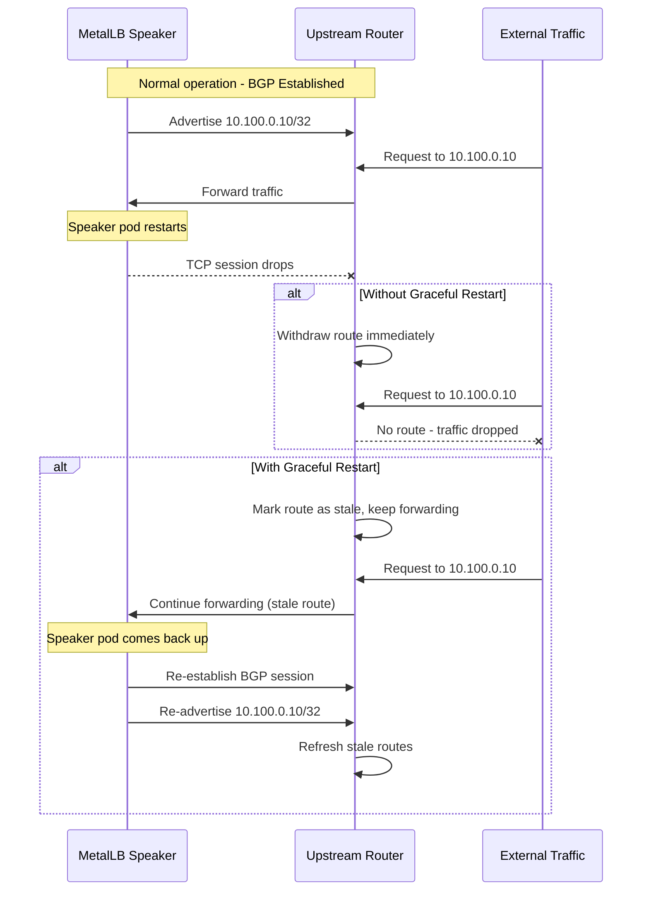

# How to Enable Graceful Restart for BGP Peers in MetalLB

Author: [nawazdhandala](https://www.github.com/nawazdhandala)

Tags: Kubernetes, MetalLB, BGP, Graceful Restart, High Availability

Description: Learn how to enable BGP graceful restart in MetalLB to maintain traffic forwarding during speaker pod restarts and node maintenance.

---

When a MetalLB speaker pod restarts, the BGP session with the upstream router goes down. Without graceful restart, the router immediately withdraws all routes learned from that speaker, causing a traffic blackhole until the session re-establishes and routes are re-advertised. In production, this gap can last several seconds and drop active connections.

BGP graceful restart solves this by telling the upstream router to keep forwarding traffic to the previously advertised routes for a configurable window while the speaker comes back up. This guide shows you how to enable and tune graceful restart in MetalLB.

### How Graceful Restart Works



The key parameters are:

- **Restart Time**: How long the router waits for the speaker to come back before withdrawing routes. Typical values are 120 to 300 seconds.
- **Stale Route Time**: How long the router keeps stale routes in its table after the session recovers, waiting for them to be refreshed.

### Prerequisites

- MetalLB installed in FRR mode (graceful restart requires FRR)
- Upstream router that supports BGP graceful restart (most modern routers do)
- kubectl access to the cluster

### Step 1: Verify FRR Mode is Active

Graceful restart is only available when MetalLB uses FRR mode. Confirm that FRR containers are running:

```bash
# Check that speaker pods have the frr container
SPEAKER_POD=$(kubectl get pod -n metallb-system -l component=speaker \
  -o jsonpath='{.items[0].metadata.name}')

# List containers in the speaker pod
kubectl get pod -n metallb-system "$SPEAKER_POD" \
  -o jsonpath='{.spec.containers[*].name}'
# Expected output should include: frr
```

### Step 2: Enable Graceful Restart on the BGP Peer

Add the `enableGracefulRestart` field to your BGPPeer resource:

```yaml
# bgp-peer-graceful.yaml
# BGP peer with graceful restart enabled
apiVersion: metallb.io/v1beta2
kind: BGPPeer
metadata:
  name: upstream-router
  namespace: metallb-system
spec:
  # Remote AS number
  peerASN: 64512
  # Local AS number
  myASN: 64513
  # Upstream router IP
  peerAddress: 10.0.0.1
  # Enable graceful restart on this peer
  enableGracefulRestart: true
```

```bash
# Apply the updated peer configuration
kubectl apply -f bgp-peer-graceful.yaml
```

### Step 3: Verify Graceful Restart is Negotiated

After applying the configuration, check that the BGP session has negotiated graceful restart capability:

```bash
# Check neighbor details for graceful restart capability
kubectl exec -n metallb-system "$SPEAKER_POD" -c frr -- \
  vtysh -c "show bgp neighbors 10.0.0.1" | grep -A 5 -i "graceful restart"
```

You should see output similar to:

```
  Graceful restart information:
    Local GR Mode: Restart
    Remote GR Mode: Restart
    R bit: True
    N bit: True
    Timers:
      Configured Restart Time(sec): 120
      Received Restart Time(sec): 120
    IPv4 Unicast:
      F bit: False
      End-of-RIB sent: Yes
      End-of-RIB received: Yes
```

Both "Local GR Mode" and "Remote GR Mode" should show "Restart". If the remote side shows "Helper", it means the router will preserve routes but will not request the same from MetalLB. If it shows "NotApplicable", the router does not support graceful restart and you need to enable it on the router side.

### Step 4: Configure the Upstream Router

Graceful restart is a bilateral negotiation. The upstream router must also have it enabled. Here is an example for a router running FRR or Quagga:

```bash
# Example FRR configuration on the upstream router
# Enter the router's vtysh shell and configure graceful restart
vtysh
configure terminal
router bgp 64512
  bgp graceful-restart
  bgp graceful-restart restart-time 120
  bgp graceful-restart stalepath-time 360
  neighbor 10.0.1.10 remote-as 64513
  address-family ipv4 unicast
    neighbor 10.0.1.10 activate
  exit-address-family
end
write memory
```

For Cisco IOS-XE, the equivalent is:

```
! Enable graceful restart on a Cisco router
router bgp 64512
  bgp graceful-restart
  bgp graceful-restart restart-time 120
  bgp graceful-restart stalepath-time 360
  neighbor 10.0.1.10 remote-as 64513
```

### Step 5: Test Graceful Restart

Simulate a speaker restart and observe the router behavior:

```bash
# Delete the speaker pod to trigger a restart
kubectl delete pod -n metallb-system "$SPEAKER_POD"

# Immediately check the router's BGP table
# The routes should still be present with a stale marker
# On the upstream router (if it runs FRR):
# vtysh -c "show bgp ipv4 unicast"
# Look for routes marked with 'S' (stale)

# Wait for the speaker pod to come back
kubectl get pods -n metallb-system -l component=speaker -w

# Once the new pod is running, verify the session re-established
NEW_SPEAKER_POD=$(kubectl get pod -n metallb-system -l component=speaker \
  -o jsonpath='{.items[0].metadata.name}')

kubectl exec -n metallb-system "$NEW_SPEAKER_POD" -c frr -- \
  vtysh -c "show bgp summary"
```

### Graceful Restart Timeline

```mermaid
gantt
    title BGP Graceful Restart Timeline
    dateFormat  ss
    axisFormat %S s

    section Speaker
    Running              :a1, 00, 05
    Pod restart           :crit, a2, 05, 10
    Re-establishing BGP   :a3, 15, 05
    Advertising routes    :a4, 20, 05

    section Router
    Normal forwarding     :b1, 00, 05
    Stale route forwarding :active, b2, 05, 20
    Routes refreshed      :b3, 25, 05
```



During the "Stale route forwarding" window, traffic continues to flow even though the BGP session is down.

### Tuning Restart Timers

The default restart time (120 seconds) works for most cases, but you may need to adjust it based on how long your speaker pods take to restart:

```bash
# Check how long a speaker pod takes to become ready
# This gives you the baseline for setting the restart timer
kubectl get pod -n metallb-system "$NEW_SPEAKER_POD" \
  -o jsonpath='{.status.conditions[?(@.type=="Ready")].lastTransitionTime}'
```

If your pods consistently restart in under 30 seconds, a restart time of 60 seconds provides a comfortable margin. If your cluster is slow (large images, slow scheduling), increase it to 180 or 300 seconds.

### Multiple Peers with Graceful Restart

If you have multiple upstream routers, enable graceful restart on each peer independently:

```yaml
# multi-peer-graceful.yaml
# Two BGP peers, both with graceful restart
apiVersion: metallb.io/v1beta2
kind: BGPPeer
metadata:
  name: router-a
  namespace: metallb-system
spec:
  peerASN: 64512
  myASN: 64513
  peerAddress: 10.0.0.1
  enableGracefulRestart: true
---
apiVersion: metallb.io/v1beta2
kind: BGPPeer
metadata:
  name: router-b
  namespace: metallb-system
spec:
  peerASN: 64512
  myASN: 64513
  peerAddress: 10.0.0.2
  enableGracefulRestart: true
```

```bash
# Apply both peers
kubectl apply -f multi-peer-graceful.yaml
```

### Combining Graceful Restart with BFD

You can use both BFD and graceful restart together. BFD handles fast detection of genuine link failures, while graceful restart handles planned restarts:

```yaml
# peer-with-bfd-and-gr.yaml
apiVersion: metallb.io/v1beta2
kind: BGPPeer
metadata:
  name: upstream-full
  namespace: metallb-system
spec:
  peerASN: 64512
  myASN: 64513
  peerAddress: 10.0.0.1
  enableGracefulRestart: true
  # BFD detects real link failures quickly
  bfdProfile: fast-detect
```

When a speaker pod restarts (no actual link failure), BFD may detect the session drop before the graceful restart timer kicks in. Most modern routers handle this correctly by distinguishing between BFD-triggered downs and TCP session drops, but test this in your environment to be sure.

### Summary

BGP graceful restart is a critical feature for production MetalLB deployments. It eliminates traffic disruption during routine operations like rolling updates, node drains, and pod evictions. Enable it on every BGP peer and make sure your upstream routers negotiate it successfully.

To monitor your MetalLB services and get alerted when BGP sessions drop or traffic patterns change, [OneUptime](https://oneuptime.com) provides infrastructure monitoring, alerting, and incident management that integrates with your Kubernetes environment.
