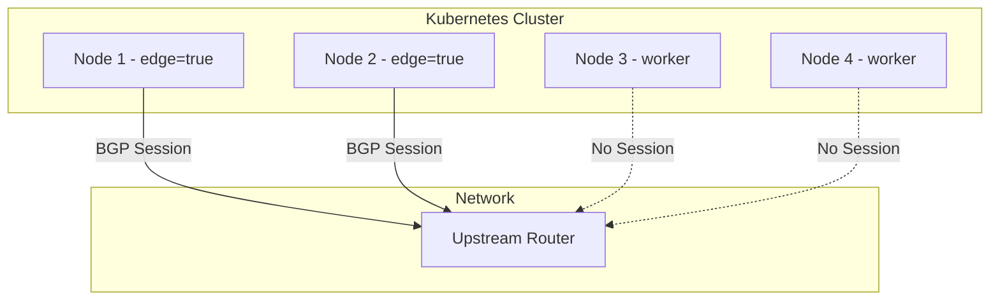
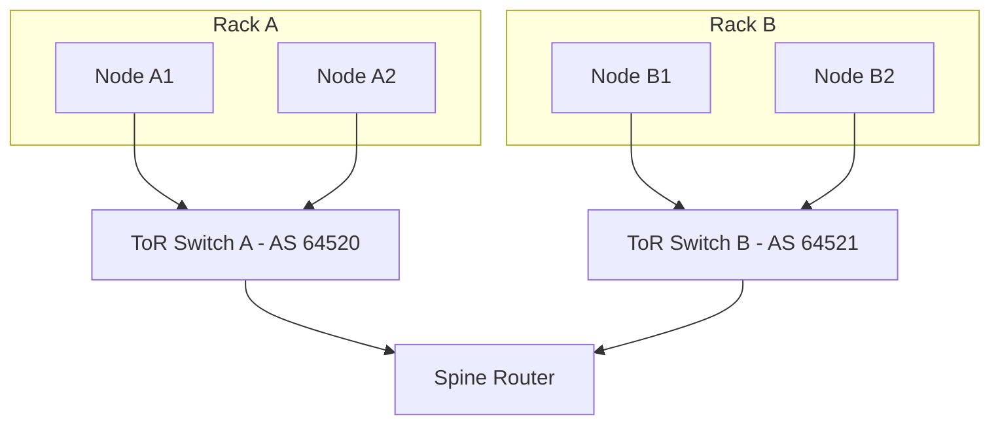

# How to Limit BGP Peers to Specific Nodes in MetalLB

Author: [nawazdhandala](https://www.github.com/nawazdhandala)

Tags: Kubernetes, MetalLB, BGP, Node Selection, BGPPeer

Description: Learn how to use node selectors in MetalLB BGPPeer resources to limit which nodes establish BGP sessions with upstream routers.

---

### Why Limit BGP Peers to Specific Nodes?

By default, every node running a MetalLB speaker will try to establish a BGP session with every configured BGPPeer. In large clusters, this creates unnecessary sessions and can overwhelm upstream routers that have limited peer capacity.

Common reasons to limit peering to specific nodes:

- Only edge or gateway nodes have network connectivity to the upstream router
- You want to reduce the number of BGP sessions on the upstream router
- Different nodes connect to different network segments or data center pods
- Worker nodes in private subnets cannot reach the BGP peer address

### Architecture Overview

Here is how node selectors filter which nodes peer with which routers:



Only nodes labeled `edge=true` establish BGP sessions. Worker nodes without the label are excluded.

### Step 1: Label Your Nodes

First, add labels to the nodes that should participate in BGP peering.

```bash
# Label specific nodes as edge nodes.
# Only these nodes will establish BGP sessions with the upstream router.
kubectl label node node-1 network-role=edge
kubectl label node node-2 network-role=edge

# Verify the labels are applied correctly.
kubectl get nodes --show-labels | grep network-role
```

### Step 2: Create a BGPPeer with Node Selectors

The `BGPPeer` resource supports a `nodeSelectors` field that restricts which nodes establish sessions with this peer.

```yaml
# bgp-peer-edge.yaml
# Configures a BGP peer that only nodes with the "network-role=edge" label
# will connect to. Other nodes will ignore this peer entirely.
apiVersion: metallb.io/v1beta2
kind: BGPPeer
metadata:
  name: upstream-router
  namespace: metallb-system
spec:
  # IP address of the upstream BGP router.
  # Replace with your actual router address.
  myASN: 64512
  peerASN: 64513
  peerAddress: 10.0.0.1

  # Node selectors restrict which nodes peer with this router.
  # Only nodes matching ALL selectors will establish a session.
  nodeSelectors:
    - matchLabels:
        # Only nodes with this label will open a BGP session.
        network-role: edge
```

Apply the peer configuration:

```bash
# Apply the BGPPeer resource.
# Only nodes with network-role=edge will attempt to connect.
kubectl apply -f bgp-peer-edge.yaml
```

### Step 3: Using Match Expressions for More Flexibility

If you need more complex selection logic, use `matchExpressions` instead of or in addition to `matchLabels`.

```yaml
# bgp-peer-expressions.yaml
# Uses match expressions for flexible node selection.
# This example selects nodes in specific zones that are also edge nodes.
apiVersion: metallb.io/v1beta2
kind: BGPPeer
metadata:
  name: zone-a-router
  namespace: metallb-system
spec:
  myASN: 64512
  peerASN: 64513
  peerAddress: 10.0.1.1

  nodeSelectors:
    - matchExpressions:
        # Select nodes where the zone label is either "zone-a" or "zone-b".
        # The In operator matches any value in the list.
        - key: topology.kubernetes.io/zone
          operator: In
          values:
            - zone-a
            - zone-b

        # Also require the node to have the edge role.
        # Multiple expressions in the same selector are ANDed together.
        - key: network-role
          operator: In
          values:
            - edge
```

### Step 4: Multiple Peers for Different Node Groups

In multi-rack or multi-zone setups, different nodes peer with different routers. Create separate BGPPeer resources with different node selectors.

```yaml
# bgp-peer-rack-a.yaml
# Nodes in rack A peer with their local top-of-rack switch.
apiVersion: metallb.io/v1beta2
kind: BGPPeer
metadata:
  name: tor-rack-a
  namespace: metallb-system
spec:
  myASN: 64512
  peerASN: 64520
  peerAddress: 10.10.1.1

  nodeSelectors:
    - matchLabels:
        rack: rack-a

---
# bgp-peer-rack-b.yaml
# Nodes in rack B peer with their local top-of-rack switch.
apiVersion: metallb.io/v1beta2
kind: BGPPeer
metadata:
  name: tor-rack-b
  namespace: metallb-system
spec:
  myASN: 64512
  peerASN: 64521
  peerAddress: 10.10.2.1

  nodeSelectors:
    - matchLabels:
        rack: rack-b
```

This topology looks like:



### Step 5: Verify BGP Session Status

After applying the configuration, verify that only the correct nodes have established sessions.

```bash
# Check the MetalLB speaker logs on an edge node.
# You should see BGP session establishment messages.
kubectl logs -n metallb-system -l component=speaker --all-containers | grep "BGP"

# List all BGPPeer resources and their configuration.
kubectl get bgppeer -n metallb-system -o yaml

# Check which nodes have the edge label.
kubectl get nodes -l network-role=edge
```

### Common Mistakes to Avoid

1. **Missing labels**: If no nodes match the selector, MetalLB will not establish any BGP sessions for that peer. Double-check your labels.
2. **Empty selectors**: An empty `nodeSelectors` list means all nodes will peer. Omitting the field entirely also means all nodes peer.
3. **Label typos**: Kubernetes labels are case-sensitive. Ensure consistency between your node labels and selector values.
4. **API version**: Node selectors on BGPPeer require `metallb.io/v1beta2`. The older `v1beta1` API does not support this field.

### Cleaning Up

Remove the BGP peer and node labels when no longer needed:

```bash
# Delete the BGPPeer resource.
kubectl delete bgppeer upstream-router -n metallb-system

# Remove the node labels.
kubectl label node node-1 network-role-
kubectl label node node-2 network-role-
```

### Summary

Limiting BGP peers to specific nodes in MetalLB prevents unnecessary sessions, reduces load on upstream routers, and lets you model real network topologies where only certain nodes have connectivity to certain peers. Use `nodeSelectors` with `matchLabels` for simple cases and `matchExpressions` for complex selection logic.

For full visibility into your bare-metal Kubernetes networking, use [OneUptime](https://oneuptime.com) to monitor BGP session health, track node availability, and receive alerts when peering sessions drop.
