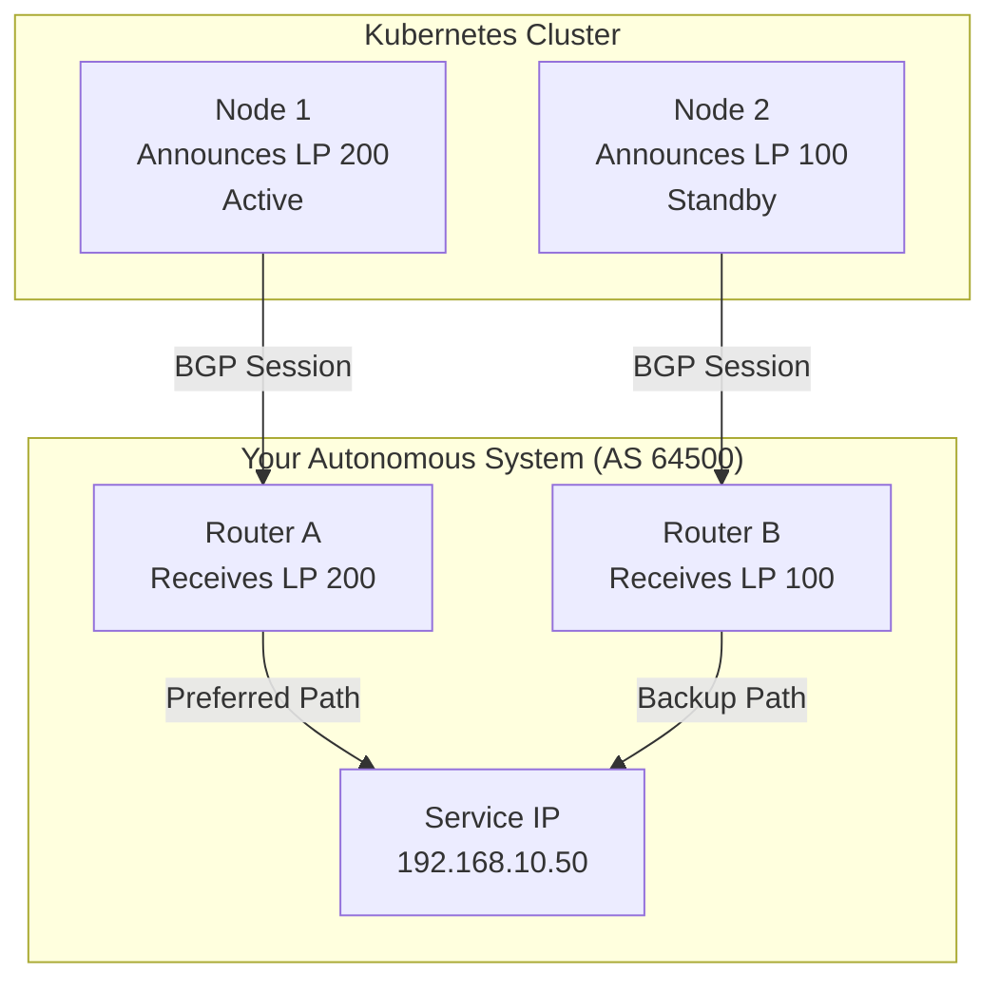
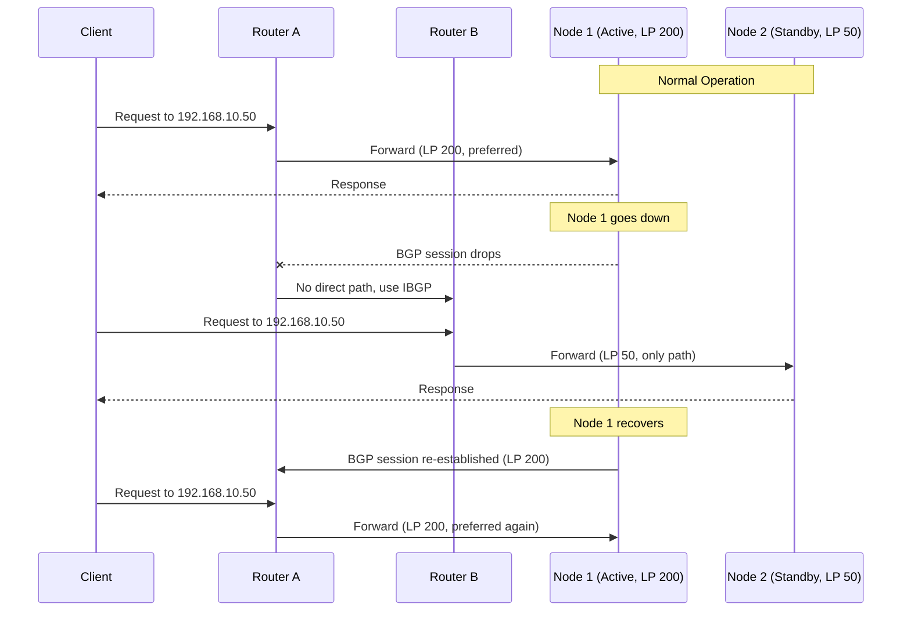

# How to Use BGP Local Preference in MetalLB for Traffic Engineering

Author: [nawazdhandala](https://www.github.com/nawazdhandala)

Tags: Kubernetes, MetalLB, BGP, Local Preference, Traffic Engineering

Description: Learn how to use BGP local preference in MetalLB BGPAdvertisement resources to influence inbound traffic paths and implement active-standby load balancer setups.

---

When you run MetalLB in BGP mode across multiple Kubernetes nodes or sites, every node announces the same service IP to its upstream router. By default, routers treat all those paths as equal. Traffic spreads across all announcing nodes with no preference for one path over another. BGP local preference gives you a way to change that. It lets you tell routers which path to prefer, so you can build active-standby patterns, steer traffic to specific nodes, or drain a node before maintenance.

This guide covers how BGP local preference works, how to configure it in MetalLB using BGPAdvertisement resources, and how to set up an active-standby load balancer topology.

## How BGP Local Preference Works

Local preference is a BGP path attribute that influences route selection within an autonomous system (AS). When a router receives multiple routes to the same destination, it picks the one with the highest local preference value. The default value is 100.



Key points about local preference:

- Higher values are preferred. A route with LP 200 wins over LP 100.
- It only applies within a single AS. It is not sent to external BGP peers.
- It is evaluated early in the BGP best path selection algorithm, before AS path length and MED.
- When the preferred path goes down, the router falls back to the next highest LP automatically.

## Prerequisites

Before you begin, make sure you have:

- A Kubernetes cluster with MetalLB v0.13 or later installed.
- At least two nodes with BGP sessions to upstream routers.
- BGP peers configured in MetalLB using BGPPeer resources.
- Basic familiarity with BGP concepts (AS numbers, peering, route announcements).

## Setting Up BGP Peers

First, define the BGP peers that MetalLB will establish sessions with. Each node peers with its local upstream router.

```yaml
# bgp-peer-router-a.yaml
# Peer configuration for Router A, connected to Node 1
apiVersion: metallb.io/v1beta2
kind: BGPPeer
metadata:
  name: router-a
  namespace: metallb-system
spec:
  # The IP address of the upstream router
  peerAddress: 10.0.0.1
  # The AS number of the upstream router
  peerASN: 64500
  # The AS number MetalLB will use
  myASN: 64501
  # Only establish this peer from Node 1
  nodeSelectors:
    - matchLabels:
        kubernetes.io/hostname: node-1
---
apiVersion: metallb.io/v1beta2
kind: BGPPeer
metadata:
  name: router-b
  namespace: metallb-system
spec:
  peerAddress: 10.0.0.2
  peerASN: 64500
  myASN: 64501
  # Only establish this peer from Node 2
  nodeSelectors:
    - matchLabels:
        kubernetes.io/hostname: node-2
```

Apply the peer configuration:

```bash
# Apply both peer configs and verify sessions are established
kubectl apply -f bgp-peers.yaml
kubectl get bgppeers -n metallb-system
```

## Creating the IP Address Pool

Define the pool of IPs that MetalLB can assign to LoadBalancer services.

```yaml
# ip-pool.yaml
# Pool of virtual IPs for BGP-advertised services
apiVersion: metallb.io/v1beta1
kind: IPAddressPool
metadata:
  name: bgp-pool
  namespace: metallb-system
spec:
  # Range of IPs available for services
  addresses:
    - 192.168.10.50-192.168.10.60
```

```bash
# Apply the IP pool to the cluster
kubectl apply -f ip-pool.yaml
```

## Configuring BGP Advertisements with Local Preference

This is where traffic engineering happens. You create two BGPAdvertisement resources: one with a higher local preference for the active node, and one with a lower value for the standby node.

```yaml
# bgp-advertisements.yaml
apiVersion: metallb.io/v1beta1
kind: BGPAdvertisement
metadata:
  name: active-path
  namespace: metallb-system
spec:
  ipAddressPools:
    - bgp-pool
  localPref: 200           # High LP makes this the preferred path
  nodeSelectors:
    - matchLabels:
        kubernetes.io/hostname: node-1
---
apiVersion: metallb.io/v1beta1
kind: BGPAdvertisement
metadata:
  name: standby-path
  namespace: metallb-system
spec:
  ipAddressPools:
    - bgp-pool
  localPref: 50            # Low LP makes this the backup path
  nodeSelectors:
    - matchLabels:
        kubernetes.io/hostname: node-2
```

```bash
# Apply the advertisements and verify
kubectl apply -f bgp-advertisements.yaml
kubectl get bgpadvertisements -n metallb-system
```

## How Failover Works

The diagram below shows what happens when the active node goes down. The router automatically shifts traffic to the standby path because it is the only remaining route.



When Node 1 recovers and re-establishes its BGP session, the router sees the LP 200 route again and shifts traffic back automatically.

## Verifying the Setup

Deploy any LoadBalancer service and confirm that BGP advertisements carry the correct local preference values.

```bash
# Deploy a test service to get an external IP from the pool
kubectl create deployment web-app --image=nginx:1.27 --port=80
kubectl expose deployment web-app --type=LoadBalancer --port=80

# Wait for the external IP to be assigned from the bgp-pool
kubectl get svc web-app --watch

# Check MetalLB speaker logs for BGP advertisement details
kubectl logs -n metallb-system -l component=speaker --tail=100 | grep -i "local"

# On your upstream router, check the BGP routing table (FRRouting example)
# vtysh -c "show bgp ipv4 unicast 192.168.10.50"
# You should see two paths with LP 200 and LP 50
```

## Switching Active and Standby Nodes

To perform planned maintenance on Node 1, you can swap the local preference values. Update the advertisements so Node 2 becomes the active path.

```bash
# Patch the active-path advertisement to lower its local preference
kubectl patch bgpadvertisement active-path \
  -n metallb-system \
  --type merge \
  -p '{"spec":{"localPref":50}}'

# Patch the standby-path advertisement to raise its local preference
kubectl patch bgpadvertisement standby-path \
  -n metallb-system \
  --type merge \
  -p '{"spec":{"localPref":200}}'

# Verify the swap took effect
kubectl get bgpadvertisements -n metallb-system -o yaml | grep localPref
```

Traffic will shift to Node 2 within a few seconds as routers process the updated BGP announcements.

## Troubleshooting

**No external IP assigned**: Confirm that your BGPPeer sessions are established. Run `kubectl get bgppeers -n metallb-system` and check speaker logs for session errors.

**Traffic not following the preferred path**: Verify the local preference values in your router's BGP table. If both paths show LP 100, your BGPAdvertisement `localPref` field may not be applied. Check that the advertisement's `nodeSelectors` match the correct nodes.

**Failover not happening**: Make sure both nodes are announcing the same service IP prefix. The standby node must have an active BGP session for the router to have a backup path.

**Traffic not returning after recovery**: Some routers have dampening configured that delays re-acceptance of a route after a flap. Check your router's BGP dampening settings.

## Summary

BGP local preference in MetalLB gives you control over which node handles traffic for your LoadBalancer services. By assigning different `localPref` values in BGPAdvertisement resources, you can build active-standby topologies, perform graceful maintenance drains, and implement predictable failover patterns. The key steps are: configure BGP peers per node, create separate advertisements with different local preference values, and use node selectors to bind each advertisement to the right node.

If you are running Kubernetes on bare metal with BGP and need to monitor service availability across your active and standby paths, [OneUptime](https://oneuptime.com) provides end-to-end monitoring with uptime checks, incident management, and status pages. It helps you verify that failover works as expected and that your services stay reachable regardless of which node is handling traffic.
