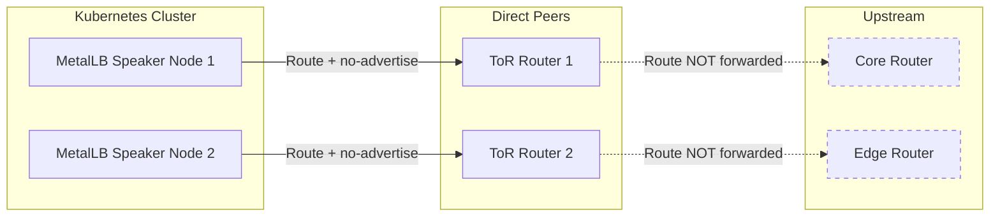
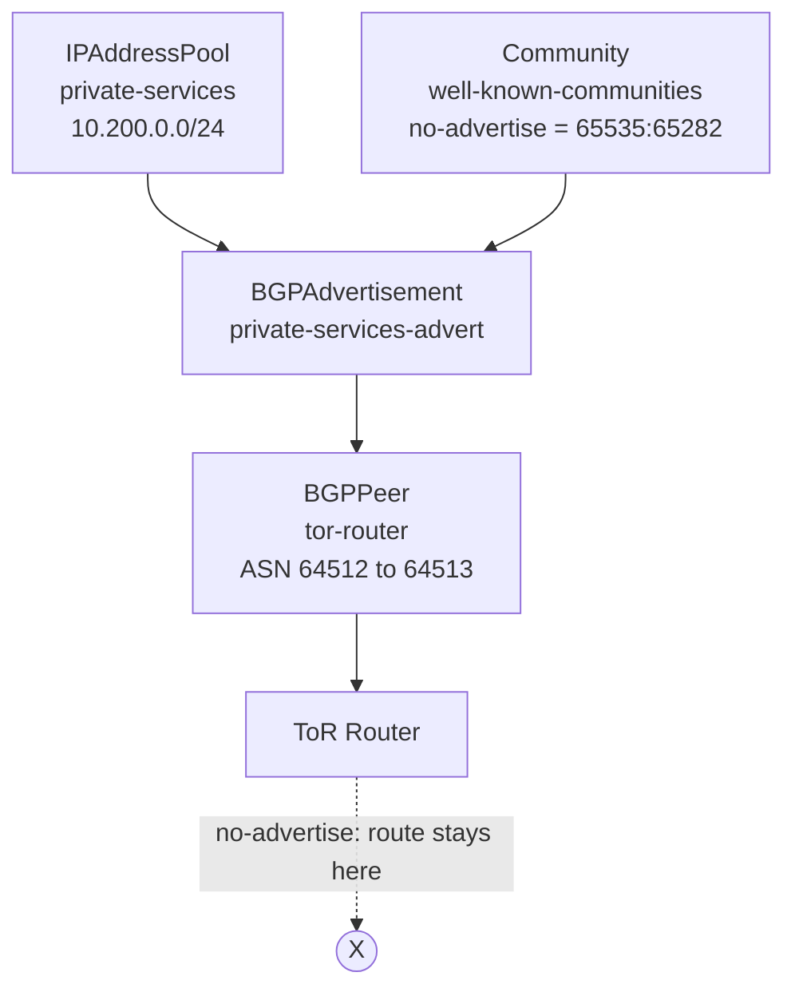

# How to Use the no-advertise BGP Community with MetalLB

Author: [nawazdhandala](https://www.github.com/nawazdhandala)

Tags: Kubernetes, MetalLB, BGP, Communities, no-advertise

Description: Learn how to use the well-known no-advertise BGP community with MetalLB to prevent routes from being propagated beyond your direct BGP peers.

---

BGP communities are optional transitive attributes that tag routes with metadata. Routers along the path read these tags and apply policy decisions such as filtering, preference tuning, or propagation control. The well-known community `no-advertise` (65535:65282) tells a receiving router to accept the route but never re-advertise it to any other BGP peer. This is extremely useful when you want MetalLB service IPs to be reachable from your directly connected routers but invisible to the rest of the network.

This guide explains what the `no-advertise` community does, when to use it with MetalLB, and how to configure it step by step.

## What Is the no-advertise Community?

The Internet Engineering Task Force (IETF) defines several well-known BGP communities in RFC 1997. The `no-advertise` community instructs a router to keep a route local and never propagate it further.



Without the `no-advertise` community, R1 and R2 would normally propagate MetalLB routes to R3 and R4. With the community attached, the routes stop at the direct peers.

## When to Use no-advertise with MetalLB

Common scenarios where this community is helpful:

- **Private service IPs**: You want services reachable only from the local network segment, not from upstream or peered networks.
- **Avoiding route leaks**: In multi-tenant data centers, you do not want your Kubernetes service IPs leaking into shared routing tables.
- **Lab or staging environments**: Prevent test routes from accidentally reaching production routers.
- **Dual-stack failover**: Announce a VIP to direct peers only and rely on a different mechanism for wider reachability.

## Prerequisites

- Kubernetes cluster with MetalLB installed in FRR mode
- At least one BGPPeer configured and session established
- An IPAddressPool for your service IPs
- Basic understanding of BGP peering

## Step 1: Create the IPAddressPool

Define the pool of service IPs that MetalLB can allocate.

```yaml
# IPAddressPool defines the range of IPs for LoadBalancer services
# These IPs will be announced via BGP with the no-advertise community
apiVersion: metallb.io/v1beta1
kind: IPAddressPool
metadata:
  name: private-services
  namespace: metallb-system
spec:
  addresses:
    # CIDR block for private service IPs
    - 10.200.0.0/24
```

Apply the pool:

```bash
# Create the IPAddressPool in the cluster
kubectl apply -f ipaddresspool.yaml

# Verify the pool was created
kubectl get ipaddresspool -n metallb-system
```

## Step 2: Create a BGPPeer with the Community

Configure the BGPPeer and reference a community that includes `no-advertise`.

```yaml
# BGPPeer establishes a session to the ToR router
# The 'communities' field is not set here - it goes on the BGPAdvertisement
apiVersion: metallb.io/v1beta2
kind: BGPPeer
metadata:
  name: tor-router
  namespace: metallb-system
spec:
  # The ASN MetalLB uses to identify itself
  myASN: 64512
  # The ASN of the ToR router
  peerASN: 64513
  # IP address of the ToR router
  peerAddress: 10.0.0.1
```

Apply the peer:

```bash
# Create the BGPPeer resource
kubectl apply -f bgppeer.yaml

# Check that the peer was created
kubectl get bgppeer -n metallb-system
```

## Step 3: Define the BGP Community Resource

MetalLB uses a dedicated `Community` custom resource to define community values. The well-known `no-advertise` community has the numeric value `65535:65282`.

```yaml
# Community resource defines named BGP community values
# These names can be referenced in BGPAdvertisement resources
apiVersion: metallb.io/v1beta1
kind: Community
metadata:
  name: well-known-communities
  namespace: metallb-system
spec:
  communities:
    # Map a friendly name to the well-known no-advertise value
    - name: no-advertise
      value: "65535:65282"
```

Apply the community:

```bash
# Create the Community resource
kubectl apply -f community.yaml

# Verify it exists
kubectl get community -n metallb-system
```

## Step 4: Create a BGPAdvertisement with the Community

The `BGPAdvertisement` resource controls how MetalLB announces routes. Attach the community here.

```yaml
# BGPAdvertisement controls route announcements for an IPAddressPool
# Attaching the no-advertise community prevents peers from re-advertising
apiVersion: metallb.io/v1beta1
kind: BGPAdvertisement
metadata:
  name: private-services-advert
  namespace: metallb-system
spec:
  # Reference the IPAddressPool whose IPs should be announced
  ipAddressPools:
    - private-services
  # Attach the no-advertise community to every route from this pool
  communities:
    - no-advertise
  # Optional: aggregate routes to reduce the number of announcements
  aggregationLength: 32
```

Apply the advertisement:

```bash
# Create the BGPAdvertisement resource
kubectl apply -f bgpadvertisement.yaml

# Confirm the advertisement is active
kubectl get bgpadvertisement -n metallb-system
```

## Full Configuration Flow

Here is the relationship between all the resources:



## Step 5: Verify the Community Is Attached

Check the FRR logs inside the MetalLB speaker pods to confirm the community is being sent.

```bash
# List the MetalLB speaker pods
kubectl get pods -n metallb-system -l app=metallb,component=speaker

# Exec into a speaker pod and check FRR's BGP output
kubectl exec -n metallb-system <speaker-pod> -c frr -- \
  vtysh -c "show bgp ipv4 unicast 10.200.0.0/24"
```

You should see output similar to:

```
BGP routing table entry for 10.200.0.0/24
  Community: no-advertise
  Last update: ...
```

## Step 6: Verify on the Router Side

On your ToR router, check that the route is received with the community and is not being re-advertised to upstream peers.

```bash
# On the ToR router (Cisco IOS example)
# Confirm the route is received with the community
show ip bgp 10.200.0.0/24

# Check that the route is NOT in the outbound table to upstream peers
show ip bgp neighbors <upstream-peer-ip> advertised-routes | include 10.200.0
```

If the `no-advertise` community is working correctly, the route should appear in the local BGP table but not in the advertised-routes output toward upstream peers.

## Combining no-advertise with Other Communities

You can attach multiple communities to the same BGPAdvertisement. For example, you might combine `no-advertise` with a custom community that triggers a local traffic policy.

```yaml
# Community resource with multiple community values
apiVersion: metallb.io/v1beta1
kind: Community
metadata:
  name: mixed-communities
  namespace: metallb-system
spec:
  communities:
    # Well-known no-advertise community
    - name: no-advertise
      value: "65535:65282"
    # Custom community for local traffic engineering
    - name: local-pref-high
      value: "64512:100"
```

Then reference both in the BGPAdvertisement:

```yaml
# BGPAdvertisement with multiple communities
apiVersion: metallb.io/v1beta1
kind: BGPAdvertisement
metadata:
  name: private-high-pref
  namespace: metallb-system
spec:
  ipAddressPools:
    - private-services
  communities:
    # Prevent re-advertisement beyond direct peers
    - no-advertise
    # Signal high local preference to the receiving router
    - local-pref-high
```

## Common Mistakes

| Mistake | Consequence | Fix |
|---|---|---|
| Putting the community on BGPPeer instead of BGPAdvertisement | Community is ignored | Move the `communities` field to the BGPAdvertisement resource |
| Using the wrong numeric value | Router ignores or misinterprets the tag | Use `65535:65282` for no-advertise |
| Forgetting the Community CR | BGPAdvertisement references a name that does not exist | Create the Community resource first |
| Not using FRR mode | Community support requires FRR mode | Set MetalLB to FRR mode during installation |

## Summary

The `no-advertise` BGP community is a simple but powerful tool for controlling route propagation. By attaching it to MetalLB BGPAdvertisements, you can ensure that your Kubernetes service IPs stay within your direct peering boundary and never leak into upstream routing tables.

If you are running Kubernetes on bare metal and need to monitor whether your BGP sessions, service IPs, and route advertisements are healthy, consider using [OneUptime](https://oneuptime.com). OneUptime provides infrastructure monitoring, alerting, and status pages so you can catch BGP misconfigurations and service disruptions before they affect your users.
