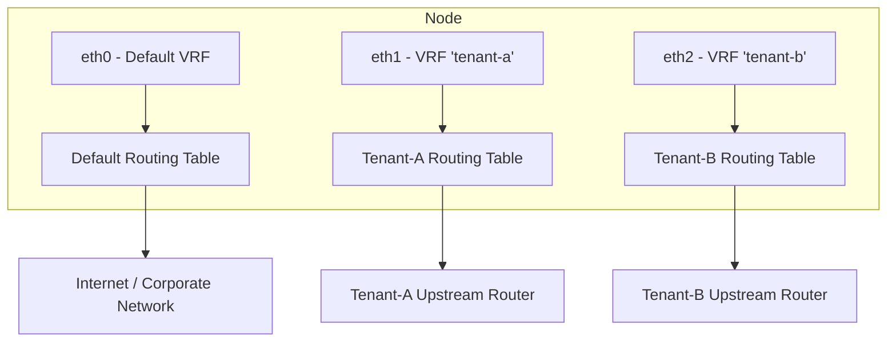
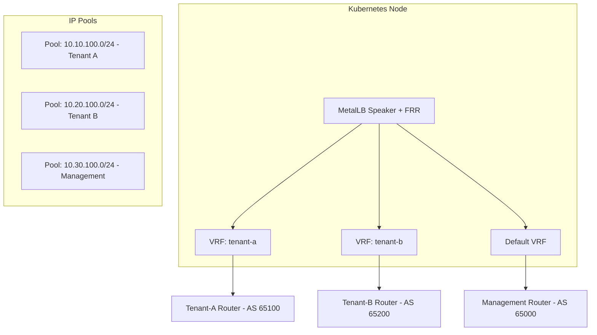
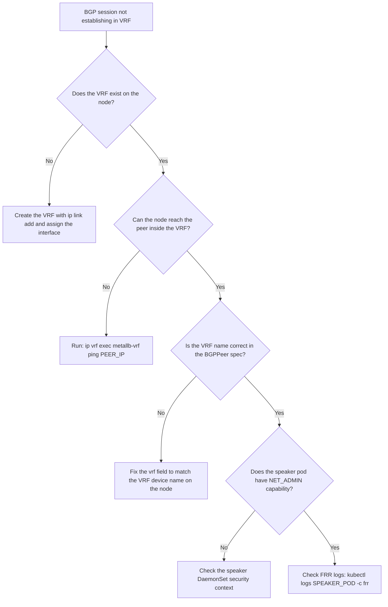

# How to Configure MetalLB BGP Peering via a VRF

Author: [nawazdhandala](https://www.github.com/nawazdhandala)

Tags: Kubernetes, MetalLB, BGP, VRF, Network Isolation

Description: Learn how to configure MetalLB BGP peering through a VRF (Virtual Routing and Forwarding) for network isolation in multi-tenant environments.

---

In multi-tenant data centers or environments with overlapping IP spaces, you often need to run BGP sessions inside a VRF (Virtual Routing and Forwarding) instance rather than the default routing table. MetalLB supports VRF-based peering when running in FRR mode. This lets you isolate MetalLB's BGP traffic from the node's main routing table and peer through a dedicated network segment.

This guide walks through setting up a Linux VRF on your Kubernetes nodes, configuring MetalLB to peer through it, and verifying that routes are advertised in the correct routing domain.

### What is a VRF?

A VRF creates a separate routing table on a Linux host. Interfaces assigned to a VRF have their own forwarding table, ARP entries, and routing decisions that are isolated from the default table. This is the same concept used in enterprise routers for multi-tenancy.



MetalLB can peer through any VRF that exists on the node. The BGP session, route advertisements, and next-hop resolution all happen within that VRF's routing table.

### Prerequisites

- MetalLB installed in FRR mode (VRF support requires FRR)
- Linux kernel 4.15 or later (for full VRF support)
- A network interface on each node connected to the VRF's network segment
- An upstream router expecting BGP sessions inside the VRF
- kubectl access to the cluster

### Step 1: Create the VRF on Each Kubernetes Node

The VRF must exist on the node before MetalLB can use it. Create it using iproute2 commands or a network configuration tool like Netplan or NetworkManager.

```bash
# Create a VRF device named 'metallb-vrf' with routing table ID 100
# Run this on each node that runs a MetalLB speaker pod
sudo ip link add metallb-vrf type vrf table 100

# Bring the VRF device up
sudo ip link set metallb-vrf up

# Assign the physical interface to the VRF
# Replace eth1 with your actual interface name
sudo ip link set eth1 master metallb-vrf

# Assign an IP address to the interface (within the VRF)
sudo ip addr add 10.10.0.10/24 dev eth1

# Verify the VRF is active
ip vrf show
```

To make this persistent across reboots, add it to your network configuration. Here is a Netplan example for Ubuntu:

```yaml
# /etc/netplan/60-metallb-vrf.yaml
# Persistent VRF configuration for MetalLB BGP peering
network:
  version: 2
  renderer: networkd
  vrfs:
    metallb-vrf:
      table: 100
      interfaces:
        - eth1
      routes:
        # Default route within the VRF pointing to the upstream router
        - to: 0.0.0.0/0
          via: 10.10.0.1
          table: 100
  ethernets:
    eth1:
      addresses:
        - 10.10.0.10/24
```

```bash
# Apply the Netplan configuration
sudo netplan apply

# Verify the interface is in the VRF
ip link show eth1
# Output should include: master metallb-vrf
```

### Step 2: Verify VRF Connectivity

Before configuring MetalLB, confirm that the node can reach the upstream router through the VRF:

```bash
# Ping the upstream router from within the VRF
# The -I flag binds the ping to the VRF device
sudo ip vrf exec metallb-vrf ping -c 3 10.10.0.1

# Check the VRF routing table
ip route show table 100
```

### Step 3: Configure MetalLB to Peer via the VRF

Add the `vrf` field to your BGPPeer resource:

```yaml
# bgp-peer-vrf.yaml
# BGP peer configured to use the metallb-vrf VRF
apiVersion: metallb.io/v1beta2
kind: BGPPeer
metadata:
  name: vrf-peer
  namespace: metallb-system
spec:
  # Remote AS of the upstream router
  peerASN: 65100
  # Local AS for MetalLB
  myASN: 65200
  # IP address of the upstream router (reachable within the VRF)
  peerAddress: 10.10.0.1
  # The VRF to peer through - must match the VRF name on the node
  vrf: metallb-vrf
```

```bash
# Apply the VRF-aware BGP peer
kubectl apply -f bgp-peer-vrf.yaml
```

### Step 4: Create an IP Address Pool for the VRF

The IP pool should contain addresses that are routable within the VRF's network:

```yaml
# ip-pool-vrf.yaml
# IP pool for services that will be advertised via the VRF
apiVersion: metallb.io/v1beta1
kind: IPAddressPool
metadata:
  name: vrf-pool
  namespace: metallb-system
spec:
  addresses:
    # These addresses should be routable within the VRF's routing domain
    - 10.10.100.0/24
```

```bash
# Apply the IP address pool
kubectl apply -f ip-pool-vrf.yaml
```

### Step 5: Create a BGP Advertisement

Bind the advertisement to the VRF pool:

```yaml
# bgp-advertisement-vrf.yaml
# Advertisement configuration for the VRF pool
apiVersion: metallb.io/v1beta1
kind: BGPAdvertisement
metadata:
  name: vrf-advert
  namespace: metallb-system
spec:
  ipAddressPools:
    - vrf-pool
  # Advertise each service IP as a host route
  aggregationLength: 32
```

```bash
# Apply the advertisement
kubectl apply -f bgp-advertisement-vrf.yaml
```

### Step 6: Verify the BGP Session in the VRF

Check that FRR established the session inside the correct VRF:

```bash
# Get the speaker pod name
SPEAKER_POD=$(kubectl get pod -n metallb-system -l component=speaker \
  -o jsonpath='{.items[0].metadata.name}')

# Check BGP summary - look for the VRF name in the output
kubectl exec -n metallb-system "$SPEAKER_POD" -c frr -- \
  vtysh -c "show bgp vrf metallb-vrf summary"

# Check routes advertised within the VRF
kubectl exec -n metallb-system "$SPEAKER_POD" -c frr -- \
  vtysh -c "show bgp vrf metallb-vrf ipv4 unicast"

# View the running config to confirm VRF association
kubectl exec -n metallb-system "$SPEAKER_POD" -c frr -- \
  vtysh -c "show running-config" | grep -A 20 "vrf metallb-vrf"
```

The BGP summary should show the session as Established within the `metallb-vrf` context.

### Multi-VRF Architecture

In environments with multiple tenants, you can create separate VRFs and BGP peers for each:



```yaml
# multi-vrf-peers.yaml
# Separate BGP peers for each tenant VRF
apiVersion: metallb.io/v1beta2
kind: BGPPeer
metadata:
  name: tenant-a-peer
  namespace: metallb-system
spec:
  peerASN: 65100
  myASN: 65200
  peerAddress: 10.10.0.1
  vrf: tenant-a
---
apiVersion: metallb.io/v1beta2
kind: BGPPeer
metadata:
  name: tenant-b-peer
  namespace: metallb-system
spec:
  peerASN: 65300
  myASN: 65200
  peerAddress: 10.20.0.1
  vrf: tenant-b
```

```bash
# Apply multi-VRF peer configuration
kubectl apply -f multi-vrf-peers.yaml
```

### Step 7: Deploy a Service and Validate

Create a LoadBalancer service and verify it gets an IP from the VRF pool:

```yaml
# test-service-vrf.yaml
# Test service to validate VRF-based BGP advertisement
apiVersion: v1
kind: Service
metadata:
  name: vrf-test-svc
  annotations:
    # Pin this service to the VRF pool
    metallb.universe.tf/address-pool: vrf-pool
spec:
  type: LoadBalancer
  selector:
    app: nginx
  ports:
    - port: 80
      targetPort: 80
```

```bash
# Apply the test service
kubectl apply -f test-service-vrf.yaml

# Check the assigned external IP
kubectl get svc vrf-test-svc
# The EXTERNAL-IP should be from the 10.10.100.0/24 range

# Verify the route is advertised in the VRF
kubectl exec -n metallb-system "$SPEAKER_POD" -c frr -- \
  vtysh -c "show bgp vrf metallb-vrf neighbors 10.10.0.1 advertised-routes"
```

### Troubleshooting VRF Peering

Common issues and how to diagnose them:



```bash
# Check that the VRF is visible from inside the speaker pod
kubectl exec -n metallb-system "$SPEAKER_POD" -c frr -- ip vrf show

# Check FRR logs for VRF-related errors
kubectl logs -n metallb-system "$SPEAKER_POD" -c frr | grep -i vrf
```

### Summary

VRF-based BGP peering lets you run MetalLB in network-isolated environments where the default routing table is not suitable for service IP advertisement. By binding BGP sessions to specific VRFs, you can support multi-tenant architectures, overlapping address spaces, and strict network segmentation requirements.

For comprehensive monitoring of your multi-VRF MetalLB setup, [OneUptime](https://oneuptime.com) provides service monitoring, alerting, and incident management that helps you maintain visibility across isolated network domains.
