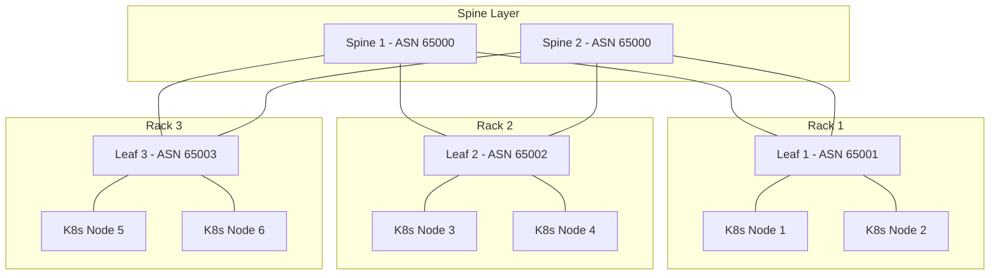
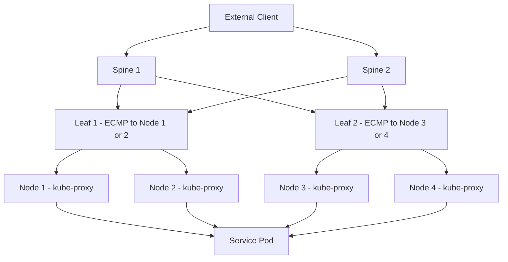

# How to Configure MetalLB BGP for Rack-and-Spine Network Topologies

Author: [nawazdhandala](https://www.github.com/nawazdhandala)

Tags: Kubernetes, MetalLB, BGP, Rack and Spine, Data Center

Description: Learn how to configure MetalLB BGP for rack-and-spine (leaf-spine) network topologies with multi-hop peering and ECMP load balancing.

---

Rack-and-spine (also called leaf-spine) is the standard network architecture for modern data centers. In this topology, every leaf (top-of-rack) switch connects to every spine switch, providing redundant paths and predictable latency. Configuring MetalLB BGP in this environment requires careful planning around multi-hop peering, ECMP, and per-rack address pools.

This guide walks through configuring MetalLB for a leaf-spine topology with BGP peering at the leaf layer, ECMP across spines, and proper address management across racks.

## Leaf-Spine Topology Overview

In a leaf-spine network, Kubernetes nodes in each rack connect to their local leaf (ToR) switch. Each leaf switch peers with all spine switches. MetalLB on each node peers with the local leaf switch.



Key design decisions:

- Each leaf switch gets its own ASN (eBGP between leaf and spine)
- MetalLB peers with the local leaf switch only
- ECMP is achieved naturally through the spine layer
- Service IPs can be announced from any rack

## Prerequisites

- Kubernetes cluster spanning multiple racks
- Leaf switches configured with BGP (one ASN per leaf)
- Spine switches configured with BGP (shared ASN)
- MetalLB installed in FRR mode
- Nodes labeled with their rack location

## Step 1: Label Nodes by Rack

First, label each Kubernetes node with its rack location. This is essential for per-rack BGPPeer targeting.

```bash
# Label nodes in Rack 1
kubectl label node k8s-node-1 topology.kubernetes.io/rack=rack-1
kubectl label node k8s-node-2 topology.kubernetes.io/rack=rack-1

# Label nodes in Rack 2
kubectl label node k8s-node-3 topology.kubernetes.io/rack=rack-2
kubectl label node k8s-node-4 topology.kubernetes.io/rack=rack-2

# Label nodes in Rack 3
kubectl label node k8s-node-5 topology.kubernetes.io/rack=rack-3
kubectl label node k8s-node-6 topology.kubernetes.io/rack=rack-3

# Verify labels
kubectl get nodes -L topology.kubernetes.io/rack
```

## Step 2: Create Per-Rack BGPPeer Resources

Each rack's nodes peer with their local leaf switch. Use nodeSelectors to ensure nodes only peer with the correct leaf.

```yaml
# BGPPeer for Rack 1 - peers with Leaf 1
# Only nodes labeled rack-1 will establish this session
apiVersion: metallb.io/v1beta2
kind: BGPPeer
metadata:
  name: leaf-rack-1
  namespace: metallb-system
spec:
  myASN: 64512          # MetalLB's ASN (same across all racks)
  peerASN: 65001        # Leaf 1's ASN
  peerAddress: 10.1.0.1 # Leaf 1's IP
  nodeSelectors:
    - matchLabels:
        topology.kubernetes.io/rack: rack-1
---
# BGPPeer for Rack 2 - peers with Leaf 2
apiVersion: metallb.io/v1beta2
kind: BGPPeer
metadata:
  name: leaf-rack-2
  namespace: metallb-system
spec:
  myASN: 64512
  peerASN: 65002        # Leaf 2's ASN
  peerAddress: 10.2.0.1 # Leaf 2's IP
  nodeSelectors:
    - matchLabels:
        topology.kubernetes.io/rack: rack-2
---
# BGPPeer for Rack 3 - peers with Leaf 3
apiVersion: metallb.io/v1beta2
kind: BGPPeer
metadata:
  name: leaf-rack-3
  namespace: metallb-system
spec:
  myASN: 64512
  peerASN: 65003        # Leaf 3's ASN
  peerAddress: 10.3.0.1 # Leaf 3's IP
  nodeSelectors:
    - matchLabels:
        topology.kubernetes.io/rack: rack-3
```

## Step 3: Create the IP Address Pool

Define a shared IP address pool that MetalLB can allocate from across all racks.

```yaml
# Shared IPAddressPool for all racks
# MetalLB will allocate IPs from this pool for LoadBalancer services
apiVersion: metallb.io/v1beta1
kind: IPAddressPool
metadata:
  name: service-pool
  namespace: metallb-system
spec:
  addresses:
    # A shared /24 subnet for service IPs across all racks
    - 172.16.10.0/24
```

Alternatively, you can create per-rack pools if you want to control which rack advertises which addresses:

```yaml
# Per-rack IP pools for controlled address distribution
apiVersion: metallb.io/v1beta1
kind: IPAddressPool
metadata:
  name: rack-1-pool
  namespace: metallb-system
spec:
  addresses:
    - 172.16.10.0/26      # .0-.63 for Rack 1
---
apiVersion: metallb.io/v1beta1
kind: IPAddressPool
metadata:
  name: rack-2-pool
  namespace: metallb-system
spec:
  addresses:
    - 172.16.10.64/26     # .64-.127 for Rack 2
---
apiVersion: metallb.io/v1beta1
kind: IPAddressPool
metadata:
  name: rack-3-pool
  namespace: metallb-system
spec:
  addresses:
    - 172.16.10.128/26    # .128-.191 for Rack 3
```

## Step 4: Configure BGP Advertisements

Create a BGPAdvertisement that controls how service IPs are announced.

```yaml
# BGPAdvertisement for the shared pool
# This advertises all service IPs from all peers
apiVersion: metallb.io/v1beta1
kind: BGPAdvertisement
metadata:
  name: service-advertisement
  namespace: metallb-system
spec:
  ipAddressPools:
    - service-pool
  # Aggregate individual /32 routes into the /24 summary
  # This reduces the number of routes advertised to the leaf switches
  aggregationLength: 24
```

For per-rack pools with targeted advertisements:

```yaml
# Per-rack BGPAdvertisement for Rack 1
# Only nodes in rack-1 advertise from rack-1-pool
apiVersion: metallb.io/v1beta1
kind: BGPAdvertisement
metadata:
  name: rack-1-advertisement
  namespace: metallb-system
spec:
  ipAddressPools:
    - rack-1-pool
  nodeSelectors:
    - matchLabels:
        topology.kubernetes.io/rack: rack-1
  peers:
    - leaf-rack-1
```

## Step 5: Configure ECMP on the Leaf and Spine Switches

For ECMP to work, both the leaf and spine switches need to be configured to use multiple equal-cost paths.

```bash
# Cisco IOS leaf switch configuration example
# Enable ECMP with maximum paths
router bgp 65001
  # Accept MetalLB's routes
  neighbor 10.1.0.10 remote-as 64512
  neighbor 10.1.0.11 remote-as 64512
  address-family ipv4 unicast
    # Allow multiple equal-cost paths from MetalLB nodes
    maximum-paths 4
    # Advertise learned routes to spine switches
    neighbor 10.0.0.1 activate
    neighbor 10.0.0.2 activate
  exit-address-family
```

```bash
# FRR leaf switch configuration example
router bgp 65001
  # Peers with MetalLB nodes in this rack
  neighbor metallb-nodes peer-group
  neighbor metallb-nodes remote-as 64512
  neighbor 10.1.0.10 peer-group metallb-nodes
  neighbor 10.1.0.11 peer-group metallb-nodes

  # Peers with spine switches
  neighbor spines peer-group
  neighbor spines remote-as 65000
  neighbor 10.0.0.1 peer-group spines
  neighbor 10.0.0.2 peer-group spines

  address-family ipv4 unicast
    # Enable ECMP across MetalLB nodes
    maximum-paths 4
    # Redistribute routes learned from MetalLB to spines
    neighbor spines activate
    neighbor metallb-nodes activate
  exit-address-family
```

## Traffic Flow Through the Topology

Here is how traffic flows from an external client to a Kubernetes service through the leaf-spine fabric:



ECMP at the spine layer distributes traffic across leaf switches. ECMP at the leaf layer distributes traffic across Kubernetes nodes. kube-proxy (or a CNI like Cilium) then routes to the actual pod.

## Step 6: Verify the Full Path

After applying all configurations, verify end-to-end connectivity.

```bash
# 1. Verify BGP sessions on all nodes
for pod in $(kubectl get pods -n metallb-system -l component=speaker \
  -o jsonpath='{.items[*].metadata.name}'); do
  echo "=== $pod ==="
  kubectl exec -n metallb-system $pod -- \
    vtysh -c "show bgp summary"
done

# 2. Verify routes on the leaf switch (from the leaf's CLI)
# Example for FRR on the leaf:
# show bgp ipv4 unicast
# show ip route bgp

# 3. Verify routes on the spine switch
# The spine should see the service prefix via multiple leaf switches

# 4. Test service connectivity from outside the cluster
curl http://172.16.10.1:80
```

## Step 7: Handle Rack Failures Gracefully

In a leaf-spine topology, losing an entire rack should not take down the service. MetalLB handles this automatically:

1. When a node goes down, MetalLB withdraws its route from the leaf
2. The leaf withdraws the route from the spines (if no other node in the rack has it)
3. The spines redirect traffic to the remaining racks
4. kube-proxy on the surviving nodes forwards to pods

```bash
# Simulate a node failure and watch route withdrawal
# On the MetalLB side:
kubectl cordon k8s-node-1
kubectl drain k8s-node-1 --ignore-daemonsets

# On the leaf switch, verify the route was withdrawn
# show bgp ipv4 unicast neighbors 10.1.0.10 routes
# The routes from node 1 should disappear
```

## Best Practices for Leaf-Spine MetalLB Deployments

| Practice | Reason |
|----------|--------|
| Use eBGP between all layers | Simpler configuration, natural loop prevention |
| Use one ASN per leaf | Enables proper path diversity detection at spines |
| Use a single ASN for all MetalLB nodes | Keeps MetalLB config simple across racks |
| Aggregate routes at the leaf | Reduces spine routing table size |
| Use BFD for fast failure detection | Reduces failover time from 90s to under 1s |
| Label nodes by rack | Enables per-rack peer and advertisement targeting |

## Conclusion

Configuring MetalLB BGP in a leaf-spine topology follows the same principles as any eBGP deployment: peer locally, aggregate where possible, and let the fabric handle ECMP. The key MetalLB-specific steps are using nodeSelectors on BGPPeers to target the correct leaf switch per rack and optionally splitting IP pools across racks for deterministic routing.

For monitoring your leaf-spine network alongside your Kubernetes workloads, [OneUptime](https://oneuptime.com) provides unified observability across infrastructure layers with support for network monitoring, Kubernetes metrics, and alerting through OpenTelemetry and custom integrations.
