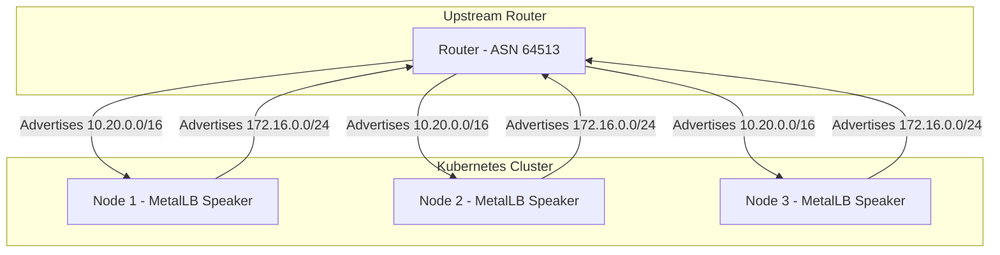
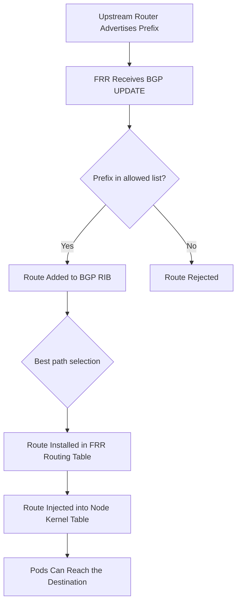

# How to Receive Incoming BGP Prefixes with MetalLB FRR-K8s Mode

Author: [nawazdhandala](https://www.github.com/nawazdhandala)

Tags: Kubernetes, MetalLB, BGP, FRR-K8s, Route Reception

Description: Learn how to configure MetalLB FRR-K8s mode to receive incoming BGP prefixes from upstream routers for advanced routing decisions.

---

MetalLB is widely known for advertising service IPs to BGP peers. What many engineers overlook is that MetalLB in FRR-K8s mode can also receive incoming BGP prefixes from upstream routers. This is useful when your Kubernetes nodes need to know about routes to external networks, on-premises subnets, or other clusters.

This guide explains how to configure MetalLB's FRR-K8s mode to accept incoming BGP prefixes, filter them, and use them for routing decisions inside your cluster.

## Why Receive BGP Prefixes?

In typical MetalLB setups, traffic flows in one direction: MetalLB advertises service IPs outward. But in multi-site or hybrid cloud deployments, your Kubernetes nodes may need to reach networks that are only reachable through BGP-learned routes.



Use cases include:

- Routing pod traffic to on-premises networks through BGP-learned paths
- Multi-cluster connectivity where each cluster advertises its pod CIDR
- Failover routing where backup paths are learned dynamically
- Network policy decisions based on received prefix information

## Prerequisites

- Kubernetes cluster with MetalLB v0.14.0 or later
- MetalLB running in FRR-K8s mode (not the legacy native BGP mode)
- An upstream BGP router configured to advertise prefixes
- `kubectl` access to the cluster

## Step 1: Confirm FRR-K8s Mode is Active

MetalLB must be running in FRR-K8s mode to support prefix reception. Check your installation:

```bash
# Check MetalLB speaker pods and their mode
kubectl get pods -n metallb-system -l component=speaker -o wide

# Verify that the FRR-K8s containers are running inside the speaker pods
kubectl get pods -n metallb-system -l component=speaker \
  -o jsonpath='{.items[0].spec.containers[*].name}'

# You should see containers like: speaker, frr, frr-metrics, reloader
```

If you see the `frr` container, MetalLB is running in FRR mode and can receive prefixes.

## Step 2: Configure the BGPPeer to Allow Receiving

By default, MetalLB's BGPPeer resource does not configure route reception. You need to create an FRRConfiguration resource to enable it.

```yaml
# BGPPeer resource - defines the peering session
# This establishes the BGP session but does not control route reception
apiVersion: metallb.io/v1beta2
kind: BGPPeer
metadata:
  name: upstream-router
  namespace: metallb-system
spec:
  myASN: 64512           # Local ASN for your cluster
  peerASN: 64513         # Remote router ASN
  peerAddress: 10.0.0.1  # Remote router IP
```

## Step 3: Create FRRConfiguration for Prefix Reception

The FRRConfiguration resource controls what prefixes MetalLB will accept from the peer.

```yaml
# FRRConfiguration to receive specific prefixes from upstream
# This tells the FRR daemon to accept routes matching the filter
apiVersion: frrk8s.metallb.io/v1beta1
kind: FRRConfiguration
metadata:
  name: receive-upstream-routes
  namespace: metallb-system
spec:
  bgp:
    routers:
      - asn: 64512
        neighbors:
          - address: 10.0.0.1
            asn: 64513
            toReceive:
              allowed:
                # "filtered" mode only accepts prefixes you explicitly list
                # Use "all" to accept everything (not recommended in production)
                mode: filtered
                prefixes:
                  # Accept the on-premises network prefix
                  - prefix: 10.20.0.0/16
                  # Accept the remote cluster pod CIDR
                  - prefix: 10.30.0.0/16
                  # Accept a specific service subnet
                  - prefix: 192.168.50.0/24
```

## Step 4: Receive All Prefixes (Development Only)

In development environments, you may want to accept all prefixes to see what the upstream router is advertising.

```yaml
# FRRConfiguration to receive ALL prefixes (use only in dev/test)
# WARNING: Accepting all routes in production can lead to route table bloat
apiVersion: frrk8s.metallb.io/v1beta1
kind: FRRConfiguration
metadata:
  name: receive-all-routes-dev
  namespace: metallb-system
spec:
  bgp:
    routers:
      - asn: 64512
        neighbors:
          - address: 10.0.0.1
            asn: 64513
            toReceive:
              allowed:
                # Accept all prefixes from this peer
                mode: all
```

## Step 5: Apply and Verify Route Reception

Apply the configuration and verify that routes are being received.

```bash
# Apply the FRRConfiguration
kubectl apply -f frrconfiguration-receive.yaml

# Wait for FRR to process the new config
sleep 5

# Check received routes from the peer
kubectl exec -n metallb-system <speaker-pod> -- \
  vtysh -c "show bgp ipv4 unicast neighbors 10.0.0.1 received-routes"

# Check the local routing table for learned routes
kubectl exec -n metallb-system <speaker-pod> -- \
  vtysh -c "show ip route bgp"
```

## Route Reception Flow

Here is how received prefixes flow through the system:



## Step 6: Verify Routes on the Node

Once FRR accepts the routes, they should appear in the node's kernel routing table.

```bash
# Check if the received route appears in the node's routing table
# SSH into a node or use a debug pod
kubectl debug node/<node-name> -it --image=busybox -- \
  ip route show | grep "10.20.0.0"

# Expected output should show something like:
# 10.20.0.0/16 via 10.0.0.1 dev eth0 proto bgp metric 20
```

## Step 7: Filter Received Routes with Prefix Length

You can further restrict received routes by specifying minimum and maximum prefix lengths.

```yaml
# FRRConfiguration with prefix length filtering
# Only accept routes within the specified prefix length range
apiVersion: frrk8s.metallb.io/v1beta1
kind: FRRConfiguration
metadata:
  name: receive-filtered-routes
  namespace: metallb-system
spec:
  bgp:
    routers:
      - asn: 64512
        neighbors:
          - address: 10.0.0.1
            asn: 64513
            toReceive:
              allowed:
                mode: filtered
                prefixes:
                  # Accept 10.20.0.0/16 but not more specific subnets
                  - prefix: 10.20.0.0/16
                    le: 16  # Maximum prefix length to accept
                  # Accept subnets of 192.168.0.0/16 between /24 and /28
                  - prefix: 192.168.0.0/16
                    ge: 24  # Minimum prefix length
                    le: 28  # Maximum prefix length
```

## Step 8: Handle Multiple Peers

When receiving routes from multiple upstream routers, create separate neighbor entries.

```yaml
# FRRConfiguration receiving from multiple peers
# Each peer can have different receive filters
apiVersion: frrk8s.metallb.io/v1beta1
kind: FRRConfiguration
metadata:
  name: multi-peer-receive
  namespace: metallb-system
spec:
  bgp:
    routers:
      - asn: 64512
        neighbors:
          # Primary upstream - accept on-prem routes
          - address: 10.0.0.1
            asn: 64513
            toReceive:
              allowed:
                mode: filtered
                prefixes:
                  - prefix: 10.20.0.0/16
          # Secondary upstream - accept cloud routes
          - address: 10.0.0.2
            asn: 64514
            toReceive:
              allowed:
                mode: filtered
                prefixes:
                  - prefix: 10.30.0.0/16
```

## Troubleshooting Received Routes

| Issue | Diagnostic Command | Common Cause |
|-------|-------------------|--------------|
| No routes received | `show bgp summary` | Session not established |
| Routes received but not installed | `show bgp ipv4 unicast` | Prefix not in allowed list |
| Routes in BGP table but not in kernel | `show ip route bgp` | FRR not redistributing to kernel |
| Stale routes after peer goes down | `show bgp neighbors` | Hold timer not expired yet |

```bash
# Full diagnostic sequence for route reception issues
# Run these inside the speaker pod's FRR container

# 1. Verify session is established
kubectl exec -n metallb-system <speaker-pod> -- \
  vtysh -c "show bgp summary"

# 2. Check what routes are being received (before filtering)
kubectl exec -n metallb-system <speaker-pod> -- \
  vtysh -c "show bgp ipv4 unicast neighbors 10.0.0.1 received-routes"

# 3. Check what routes passed the filter
kubectl exec -n metallb-system <speaker-pod> -- \
  vtysh -c "show bgp ipv4 unicast neighbors 10.0.0.1 routes"

# 4. Verify routes in the kernel
kubectl exec -n metallb-system <speaker-pod> -- \
  vtysh -c "show ip route bgp"
```

## Conclusion

Receiving BGP prefixes with MetalLB FRR-K8s mode turns your Kubernetes cluster from a route advertiser into a full BGP participant. Use filtered mode in production to control exactly which prefixes you accept, and always verify that received routes appear in both the BGP RIB and the node kernel routing table.

For monitoring your BGP sessions, tracking received route counts, and alerting on route flaps or session drops, [OneUptime](https://oneuptime.com) provides comprehensive infrastructure monitoring with support for Kubernetes, networking, and custom metrics through OpenTelemetry.
