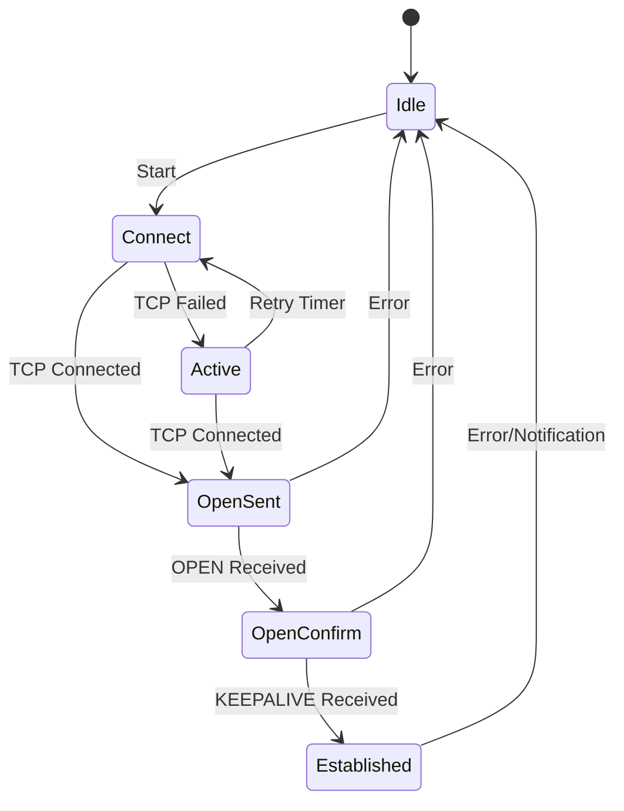
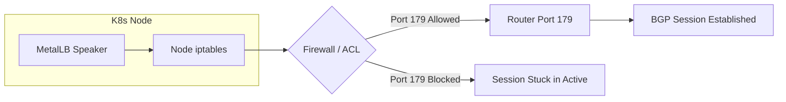
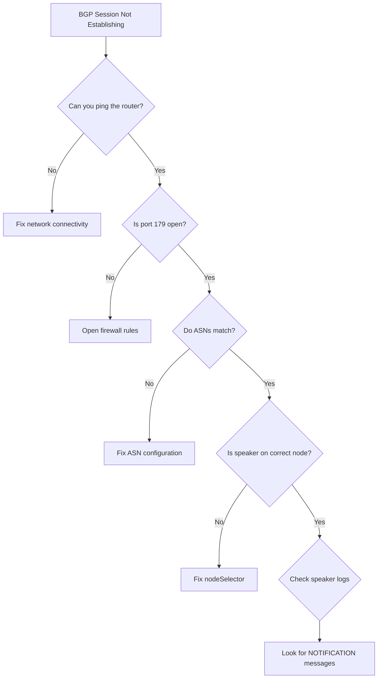

# How to Fix MetalLB BGP Session Not Establishing

Author: [nawazdhandala](https://www.github.com/nawazdhandala)

Tags: Kubernetes, MetalLB, BGP, Troubleshooting, Networking

Description: Troubleshooting guide for MetalLB BGP sessions that fail to establish. Covers common causes like firewall rules, ASN mismatches, and connectivity issues.

---

A MetalLB BGP session stuck in Active or Connect state is one of the most common issues engineers face when setting up bare-metal load balancing. The session never reaches Established, and your services remain unreachable from outside the cluster.

This guide covers the most frequent causes and their fixes, with a systematic debugging approach that will get your BGP sessions up and running.

## BGP Session State Machine

Understanding the BGP state machine helps you pinpoint where your session is failing.



If your session is stuck in **Active** or **Connect**, the TCP connection to port 179 is failing. If it reaches **OpenSent** but drops back, there is a parameter mismatch in the BGP OPEN message.

## Step 1: Check the Current Session State

Start by checking what state your BGP session is in.

```bash
# Get the MetalLB speaker pod name
SPEAKER_POD=$(kubectl get pods -n metallb-system \
  -l component=speaker \
  -o jsonpath='{.items[0].metadata.name}')

# Check BGP session summary
kubectl exec -n metallb-system $SPEAKER_POD -- \
  vtysh -c "show bgp summary"

# Get detailed neighbor information
kubectl exec -n metallb-system $SPEAKER_POD -- \
  vtysh -c "show bgp neighbors 10.0.0.1"
```

The output will show the session state and the last error or notification received.

## Step 2: Verify TCP Connectivity on Port 179

BGP runs over TCP port 179. If this port is blocked, the session will never establish.

```bash
# Test TCP connectivity from the speaker pod to the router
kubectl exec -n metallb-system $SPEAKER_POD -- \
  nc -zv 10.0.0.1 179 -w 5

# If nc is not available, try using bash's built-in TCP check
kubectl exec -n metallb-system $SPEAKER_POD -- \
  bash -c "echo > /dev/tcp/10.0.0.1/179" 2>&1

# Check if any firewall rules on the node are blocking port 179
# Run this on the Kubernetes node itself
sudo iptables -L -n | grep 179
```

## Step 3: Check Firewall Rules

Firewalls are the most common cause of BGP session failures. You need to allow TCP port 179 in both directions.

```bash
# On the Kubernetes nodes, check for iptables rules blocking BGP
sudo iptables -L INPUT -n --line-numbers | grep -E "179|bgp"
sudo iptables -L OUTPUT -n --line-numbers | grep -E "179|bgp"

# If using firewalld, check the active rules
sudo firewall-cmd --list-all

# Allow BGP traffic through firewalld
sudo firewall-cmd --permanent --add-port=179/tcp
sudo firewall-cmd --reload

# Or using iptables directly
sudo iptables -A INPUT -p tcp --dport 179 -j ACCEPT
sudo iptables -A OUTPUT -p tcp --dport 179 -j ACCEPT
```

The following diagram shows where firewall checks should pass:



## Step 4: Verify ASN Configuration

An ASN mismatch between MetalLB and the router will cause the session to drop after the OPEN message exchange.

```yaml
# BGPPeer resource - verify these values match your router config
apiVersion: metallb.io/v1beta2
kind: BGPPeer
metadata:
  name: router-peer
  namespace: metallb-system
spec:
  # This must match the ASN you configured on the router for this peer
  myASN: 64512
  # This must match the router's own ASN
  peerASN: 64513
  # This must be the router's reachable IP address
  peerAddress: 10.0.0.1
```

```bash
# Compare with the router's configuration
# On a Cisco router:
# show running-config | section router bgp

# On a Juniper router:
# show configuration protocols bgp

# On a MikroTik router:
# /routing/bgp/connection print detail
```

Common ASN mistakes:
- Swapping myASN and peerASN
- Using 2-byte ASN format when the router expects 4-byte
- Using a public ASN when you meant to use a private one (64512-65534)

## Step 5: Check Node Selector Configuration

MetalLB may not be running a speaker on the node that has connectivity to the router.

```yaml
# BGPPeer with node selector - ensure it matches your nodes
apiVersion: metallb.io/v1beta2
kind: BGPPeer
metadata:
  name: router-peer
  namespace: metallb-system
spec:
  myASN: 64512
  peerASN: 64513
  peerAddress: 10.0.0.1
  # Make sure this selector matches nodes that can reach the router
  nodeSelectors:
    - matchLabels:
        kubernetes.io/hostname: worker-node-1
```

```bash
# Check which nodes have MetalLB speakers running
kubectl get pods -n metallb-system -l component=speaker -o wide

# Check node labels to verify the selector matches
kubectl get nodes --show-labels | grep -E "hostname|bgp"
```

## Step 6: Verify the Peer Address is Reachable

The peerAddress in your BGPPeer must be directly reachable from the node where the speaker runs.

```bash
# Ping the router from the speaker pod
kubectl exec -n metallb-system $SPEAKER_POD -- \
  ping -c 3 10.0.0.1

# Check the node's routing table for a path to the router
kubectl exec -n metallb-system $SPEAKER_POD -- \
  ip route get 10.0.0.1

# Verify the source IP that the node uses to reach the router
kubectl exec -n metallb-system $SPEAKER_POD -- \
  ip route get 10.0.0.1 | grep src
```

## Step 7: Check Hold Timer and Keepalive Settings

Mismatched timers can cause sessions to drop shortly after establishing.

```yaml
# BGPPeer with explicit timer configuration
apiVersion: metallb.io/v1beta2
kind: BGPPeer
metadata:
  name: router-peer
  namespace: metallb-system
spec:
  myASN: 64512
  peerASN: 64513
  peerAddress: 10.0.0.1
  # Hold time in seconds (default is 90)
  # The negotiated hold time is the minimum of both peers
  holdTime: "90s"
  # Keepalive interval (default is 30s, must be less than holdTime)
  keepaliveTime: "30s"
```

```bash
# Check negotiated timers on the established session
kubectl exec -n metallb-system $SPEAKER_POD -- \
  vtysh -c "show bgp neighbors 10.0.0.1" | grep -A2 "timer"
```

## Step 8: Examine MetalLB Speaker Logs

The speaker logs often contain the exact reason for the failure.

```bash
# Get the speaker pod logs
kubectl logs -n metallb-system $SPEAKER_POD -c speaker --tail=100

# Look for BGP-related errors
kubectl logs -n metallb-system $SPEAKER_POD -c speaker | \
  grep -i "bgp\|peer\|session\|error\|failed"

# Check the FRR container logs separately
kubectl logs -n metallb-system $SPEAKER_POD -c frr --tail=50

# Check for events in the metallb-system namespace
kubectl get events -n metallb-system --sort-by='.lastTimestamp'
```

## Quick Reference Checklist

Use this checklist to systematically rule out common issues:



## Common Error Messages and Fixes

| Error Message | Cause | Fix |
|---------------|-------|-----|
| `connection refused` | Router not listening on 179 | Enable BGP on the router |
| `connection timed out` | Firewall blocking traffic | Open port 179 both directions |
| `NOTIFICATION: bad peer AS` | ASN mismatch | Correct myASN and peerASN |
| `NOTIFICATION: hold timer expired` | Network instability or timer mismatch | Increase hold timer, check network |
| `no route to host` | No L3 path to the router | Fix routing on the node |
| `bind: address already in use` | Another BGP daemon running | Stop conflicting BGP process |

## Step 9: Check for Multiple BGP Daemons

If another BGP daemon (like BIRD or a standalone FRR instance) is running on the same node, it will conflict with MetalLB's FRR instance.

```bash
# Check if anything else is listening on port 179
kubectl debug node/<node-name> -it --image=busybox -- \
  netstat -tlnp | grep 179

# Check for other BGP-related processes
kubectl debug node/<node-name> -it --image=busybox -- \
  ps aux | grep -E "bgpd|bird|frr|zebra"
```

## Conclusion

Most MetalLB BGP session failures come down to one of three things: firewall rules blocking port 179, ASN misconfiguration, or network connectivity issues between the node and the router. Work through each step in order, and you will identify the root cause.

For proactive monitoring of your BGP sessions and automatic alerting when sessions drop, [OneUptime](https://oneuptime.com) can monitor your Kubernetes infrastructure, track BGP session states, and notify your on-call team before users are impacted.
