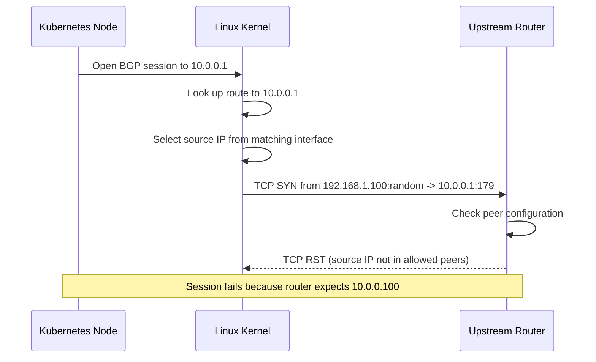
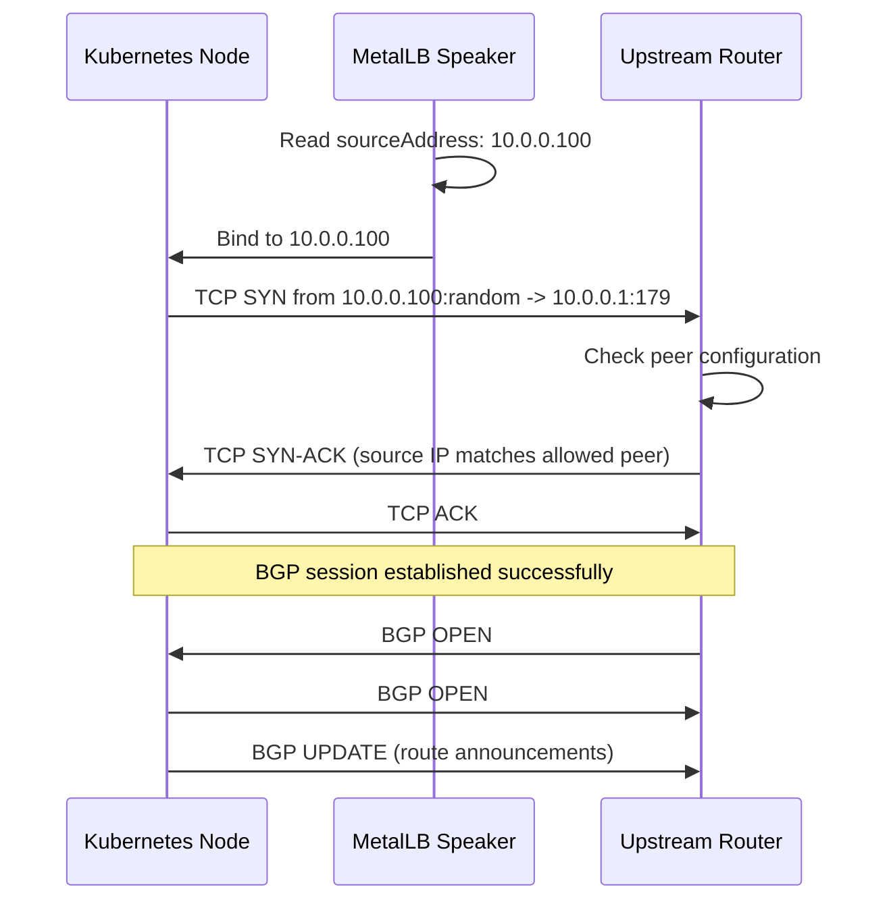

# How to Configure the BGP Source Address in MetalLB

Author: [nawazdhandala](https://www.github.com/nawazdhandala)

Tags: Kubernetes, MetalLB, BGP, Source Address, Networking

Description: Learn how to configure the BGP source address in MetalLB for multi-homed nodes where the default source address may not be correct for peering.

---

### Why Configure the BGP Source Address?

When MetalLB opens a BGP session with an upstream router, it uses a source IP address for the TCP connection on port 179. By default, the kernel picks the source address based on the routing table, which is usually the IP of the interface closest to the peer.

This default behavior breaks in several scenarios:

- Multi-homed nodes with multiple network interfaces
- Nodes with separate management and data plane networks
- Environments where the upstream router expects sessions from a specific source IP
- Overlay networks that alter the default route

In these cases, you need to explicitly set the source address in the `BGPPeer` configuration.

### The Problem with Default Source Selection

Here is what happens when the kernel picks the wrong source address:



The router rejects the connection because it is configured to accept BGP sessions only from a specific IP, and the node used a different one.

### Step 1: Identify the Correct Source Address

First, determine which IP address the upstream router expects the BGP session to come from.

```bash
# List all network interfaces and their IPs on the node.
# Identify the interface connected to the network where the BGP peer lives.
ip addr show

# Example output (abbreviated):
# 2: eth0: <BROADCAST,MULTICAST,UP>
#     inet 192.168.1.100/24    <-- management network
# 3: eth1: <BROADCAST,MULTICAST,UP>
#     inet 10.0.0.100/24       <-- data plane network (use this for BGP)

# Check the default route to see which interface the kernel would pick.
ip route get 10.0.0.1
```

### Step 2: Configure the Source Address in BGPPeer

Use the `sourceAddress` field in the `BGPPeer` resource to force MetalLB to use a specific source IP.

```yaml
# bgp-peer-source.yaml
# Configures a BGP peer with an explicit source address.
# MetalLB will bind the BGP session to this specific IP
# instead of letting the kernel choose.
apiVersion: metallb.io/v1beta2
kind: BGPPeer
metadata:
  name: upstream-router
  namespace: metallb-system
spec:
  # Your cluster's AS number.
  myASN: 64512
  # The upstream router's AS number.
  peerASN: 64513
  # The upstream router's IP address.
  peerAddress: 10.0.0.1

  # Force the BGP session to originate from this specific IP.
  # This must be an IP assigned to an interface on the node.
  # It overrides the kernel's default source selection.
  sourceAddress: 10.0.0.100
```

Apply the configuration:

```bash
# Apply the BGPPeer with the explicit source address.
kubectl apply -f bgp-peer-source.yaml
```

### How the Source Address Changes the Flow

With an explicit source address, the connection flow changes:



### Step 3: Multi-Homed Node Configuration

For nodes with multiple interfaces connecting to different peers, create separate BGPPeer resources with different source addresses.

```yaml
# bgp-peers-multi-homed.yaml
# Node has two interfaces:
#   eth0: 192.168.1.100 (connected to Router A on 192.168.1.1)
#   eth1: 10.0.0.100 (connected to Router B on 10.0.0.1)
#
# Each peer uses the source address on the matching interface.

apiVersion: metallb.io/v1beta2
kind: BGPPeer
metadata:
  name: router-a
  namespace: metallb-system
spec:
  myASN: 64512
  peerASN: 64513
  peerAddress: 192.168.1.1
  # Use the IP on the interface that connects to Router A.
  sourceAddress: 192.168.1.100

---
apiVersion: metallb.io/v1beta2
kind: BGPPeer
metadata:
  name: router-b
  namespace: metallb-system
spec:
  myASN: 64512
  peerASN: 64514
  peerAddress: 10.0.0.1
  # Use the IP on the interface that connects to Router B.
  sourceAddress: 10.0.0.100
```

Apply:

```bash
# Create both peers with their respective source addresses.
kubectl apply -f bgp-peers-multi-homed.yaml
```

### Step 4: Verify the Source Address

After applying the configuration, verify that sessions are using the correct source address.

```bash
# Check MetalLB speaker logs for connection details.
# Look for the source address in session establishment messages.
kubectl logs -n metallb-system -l component=speaker --all-containers | grep -i "session\|connect\|source"

# On the node, check active BGP connections.
# The local address should match your configured sourceAddress.
ss -tnp | grep 179

# On the upstream router (if accessible), verify the peer source.
# Example for FRRouting:
# vtysh -c "show bgp neighbors"
```

### Common Mistakes to Avoid

1. **IP not on the node**: The `sourceAddress` must be an IP actually assigned to an interface on the node. MetalLB cannot use an IP that does not exist locally.
2. **Wrong subnet**: The source address must be on the same subnet as the path to the peer, or there must be a route from the source address to the peer.
3. **Single source for multiple nodes**: If you use node selectors and the source address is node-specific, you need separate BGPPeer resources per node or per group of identically-addressed nodes.
4. **Firewall blocking**: Ensure that outbound TCP port 179 is allowed from the configured source address.

### Cleaning Up

Remove the BGP peer resources:

```bash
# Delete the peer configurations.
kubectl delete bgppeer upstream-router -n metallb-system

# For multi-homed setup:
kubectl delete bgppeer router-a router-b -n metallb-system
```

### Summary

Configuring the BGP source address in MetalLB is essential for multi-homed nodes and environments where the upstream router expects sessions from a specific IP. The `sourceAddress` field on the `BGPPeer` resource overrides the kernel's default source selection, ensuring that BGP sessions are established on the correct network interface. This is a common requirement in production bare-metal clusters with separate management and data plane networks.

For comprehensive monitoring of your MetalLB BGP sessions, network connectivity, and Kubernetes services, use [OneUptime](https://oneuptime.com). It provides real-time alerting, status pages, and incident management to keep your infrastructure reliable.
