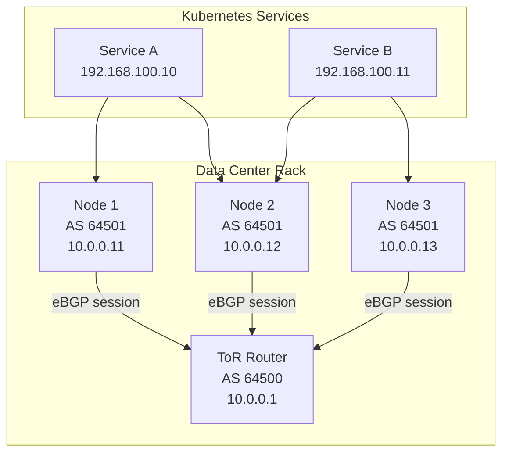
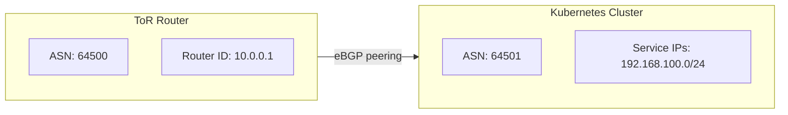
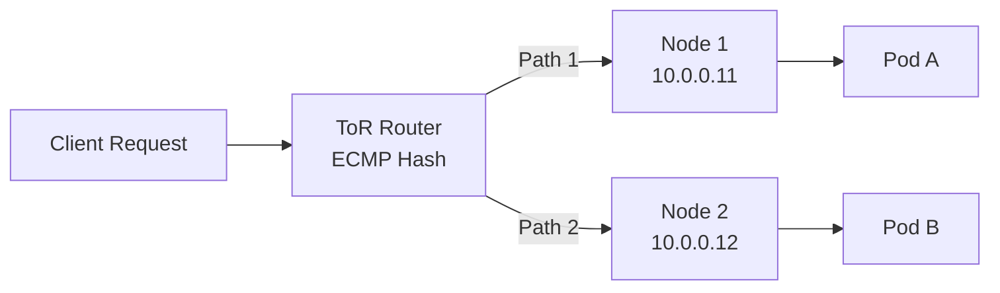

# How to Set Up MetalLB BGP Peering with a Top-of-Rack Router

Author: [nawazdhandala](https://www.github.com/nawazdhandala)

Tags: Kubernetes, MetalLB, BGP, Top-of-Rack, Data Center, Networking

Description: Learn how to configure MetalLB BGP peering with a top-of-rack (ToR) router in data center environments. Covers router configuration examples, peering setup, and route verification.

---

Data center Kubernetes clusters on bare metal need a way to advertise service IPs to the rest of the network. MetalLB in BGP mode solves this by peering directly with the top-of-rack (ToR) switch or router. Instead of relying on Layer 2 ARP announcements that only work within a single broadcast domain, BGP lets MetalLB inject routes into your data center fabric so that traffic can reach services from anywhere in the network.

This guide covers the full setup: configuring MetalLB for BGP, setting up peering on a ToR router, and verifying that routes are learned correctly.

## Why BGP Mode Over Layer 2?

Layer 2 mode works well for small clusters on a single subnet. But it has limits. Only one node owns each IP at a time, failover depends on gratuitous ARP, and traffic cannot be routed across subnets without extra work. BGP mode removes these constraints.

| Feature | L2 Mode | BGP Mode |
|---|---|---|
| Works across subnets | No | Yes |
| ECMP load balancing | No | Yes |
| Failover mechanism | Gratuitous ARP | BGP route withdrawal |
| Requires router config | No | Yes |
| Scalability | Limited | High |

## Architecture Overview

In a typical data center rack, each Kubernetes node connects to a ToR router. MetalLB speakers on every node establish BGP sessions with the router. When a LoadBalancer service gets an external IP, all nodes with healthy endpoints announce that IP via BGP. The ToR router learns multiple paths and can use ECMP (Equal-Cost Multi-Path) to distribute traffic.



## Prerequisites

Before you start, make sure you have the following:

- A Kubernetes cluster running on bare metal (v1.24 or later).
- MetalLB installed in the cluster (v0.13 or later).
- A ToR router that supports BGP (examples below use FRRouting syntax).
- IP connectivity between each node and the ToR router.
- An IP address range reserved for LoadBalancer services.

## Step 1: Plan Your ASN and IP Layout

BGP requires each side of the peering session to have an Autonomous System Number (ASN). For private use, pick ASNs from the 64512-65534 range.



In this example:

- **ToR Router ASN**: 64500
- **Kubernetes Cluster ASN**: 64501
- **Node IPs**: 10.0.0.11, 10.0.0.12, 10.0.0.13
- **Service IP Pool**: 192.168.100.0/24

## Step 2: Configure the MetalLB IP Address Pool

Create the IP pool that MetalLB will allocate from when services request a LoadBalancer IP.

```yaml
# ip-address-pool.yaml
# Defines the range of IPs available for Kubernetes LoadBalancer services
apiVersion: metallb.io/v1beta1
kind: IPAddressPool
metadata:
  name: bgp-service-pool
  namespace: metallb-system
spec:
  addresses:
    # This range gives you 254 usable IPs for services
    # Adjust to match your allocated service IP block
    - 192.168.100.1-192.168.100.254
```

Apply it:

```bash
# Create the IP address pool in the cluster
kubectl apply -f ip-address-pool.yaml
```

## Step 3: Create the BGP Peer Configuration

Tell MetalLB how to reach the ToR router and which ASNs to use.

```yaml
# bgp-peer.yaml
# Configures MetalLB to establish a BGP session with the ToR router
apiVersion: metallb.io/v1beta2
kind: BGPPeer
metadata:
  name: tor-router-peer
  namespace: metallb-system
spec:
  # ASN of the ToR router (remote side)
  peerASN: 64500
  # IP address of the ToR router
  peerAddress: 10.0.0.1
  # ASN that MetalLB will use (local side)
  myASN: 64501
  # Source address for BGP connections (optional, useful for multi-homed nodes)
  # sourceAddress: 10.0.0.11
  # BGP hold time in seconds - router marks peer as down if no keepalive
  # received within this window. Default is 90s. Lower values mean faster
  # failover but more sensitivity to brief network blips.
  holdTime: "90s"
  # Keepalive interval - MetalLB sends keepalive messages at this rate
  keepaliveTime: "30s"
```

Apply it:

```bash
# Create the BGP peer configuration
kubectl apply -f bgp-peer.yaml
```

## Step 4: Create the BGP Advertisement

Link the IP pool to BGP so that allocated IPs are announced to the ToR router.

```yaml
# bgp-advertisement.yaml
# Tells MetalLB to announce IPs from the pool via BGP
apiVersion: metallb.io/v1beta1
kind: BGPAdvertisement
metadata:
  name: bgp-service-advertisement
  namespace: metallb-system
spec:
  # Reference the IP pool to advertise
  ipAddressPools:
    - bgp-service-pool
  # Optional: set BGP communities on announced routes
  # communities:
  #   - "64500:100"
  # Optional: aggregate routes instead of announcing /32s
  # aggregationLength: 24
```

Apply it:

```bash
# Create the BGP advertisement policy
kubectl apply -f bgp-advertisement.yaml
```

## Step 5: Configure the ToR Router

The router side needs a matching BGP configuration. Below is an example using FRRouting (FRR), which is common on white-box switches and Linux-based routers.

```text
! FRRouting configuration for the ToR router
! Enter configuration mode: vtysh -c "configure terminal"

! Set the router's BGP ASN
router bgp 64500
  ! Router ID - typically the loopback or management IP
  bgp router-id 10.0.0.1

  ! Enable ECMP - allow multiple paths to the same destination
  ! This distributes traffic across all nodes announcing the same service IP
  maximum-paths 8

  ! Peer with Kubernetes Node 1
  neighbor 10.0.0.11 remote-as 64501
  neighbor 10.0.0.11 description "k8s-node-1"

  ! Peer with Kubernetes Node 2
  neighbor 10.0.0.12 remote-as 64501
  neighbor 10.0.0.12 description "k8s-node-2"

  ! Peer with Kubernetes Node 3
  neighbor 10.0.0.13 remote-as 64501
  neighbor 10.0.0.13 description "k8s-node-3"

  ! Accept the service IP routes from the cluster
  address-family ipv4 unicast
    ! Only accept routes within the service IP range for safety
    neighbor 10.0.0.11 prefix-list k8s-services in
    neighbor 10.0.0.12 prefix-list k8s-services in
    neighbor 10.0.0.13 prefix-list k8s-services in
  exit-address-family

! Prefix list to restrict accepted routes to the service IP range
ip prefix-list k8s-services seq 10 permit 192.168.100.0/24 le 32
```

This configuration does three things: peers with each node, enables ECMP for load distribution, and filters incoming routes so the router only accepts IPs from the expected service range.

## Step 6: Verify the BGP Sessions

Once both sides are configured, check that sessions are established.

**On the ToR router (FRR):**

```bash
# Check BGP neighbor status - all peers should show "Established"
vtysh -c "show bgp summary"
```

Expected output will show each node peer with state "Established" and the number of prefixes received.

**On the Kubernetes side:**

```bash
# Check MetalLB speaker logs for BGP session status
kubectl logs -n metallb-system -l component=speaker --tail=50 | grep -i "bgp"

# Verify the BGP peer resource status
kubectl get bgppeers -n metallb-system -o wide
```

## Step 7: Test with a LoadBalancer Service

Deploy a test service to confirm that IPs are allocated and routes are advertised.

```yaml
# test-service.yaml
# A simple nginx deployment with a LoadBalancer service for testing
apiVersion: apps/v1
kind: Deployment
metadata:
  name: test-nginx
spec:
  replicas: 2
  selector:
    matchLabels:
      app: test-nginx
  template:
    metadata:
      labels:
        app: test-nginx
    spec:
      containers:
        - name: nginx
          image: nginx:1.27
          ports:
            - containerPort: 80
---
apiVersion: v1
kind: Service
metadata:
  name: test-nginx-svc
spec:
  type: LoadBalancer
  selector:
    app: test-nginx
  ports:
    - port: 80
      targetPort: 80
```

Apply and check:

```bash
# Deploy the test workload
kubectl apply -f test-service.yaml

# Wait for the external IP to be assigned
kubectl get svc test-nginx-svc --watch
```

Once the service gets an external IP (for example, 192.168.100.1), verify the route on the ToR router:

```bash
# Check that the route is present in the routing table
vtysh -c "show ip route 192.168.100.1"

# You should see multiple BGP paths if replicas are on different nodes
# Example output:
# B>* 192.168.100.1/32 [20/0] via 10.0.0.11, eth1, weight 1, 00:02:15
# *                    via 10.0.0.12, eth1, weight 1, 00:02:15
```

The `*` next to multiple entries means ECMP is active and traffic will be balanced across those nodes.

## Troubleshooting Common Issues

**Sessions stuck in "Active" or "Connect" state:**
- Verify IP connectivity between nodes and the router (`ping 10.0.0.1` from each node).
- Confirm the ASN numbers match on both sides.
- Check that no firewall is blocking TCP port 179 (BGP).

**No routes received on the router:**
- Ensure a `BGPAdvertisement` resource exists and references the correct `IPAddressPool`.
- Verify that at least one LoadBalancer service has been assigned an IP.
- Check MetalLB speaker logs for errors.

**Routes disappear after node reboot:**
- This is expected. MetalLB withdraws routes when a speaker pod goes down.
- The ToR router will remove the route after the hold timer expires.
- Other nodes with the same service endpoints will still advertise the route.

## ECMP and Traffic Flow

When multiple nodes run pods for the same service, the ToR router sees multiple BGP paths to the same /32 prefix. With ECMP enabled, traffic is distributed using a hash of the packet headers (source IP, destination IP, ports).



This provides true load balancing at the network layer, which is a significant advantage over L2 mode where only one node handles all traffic for a given IP.

## Wrapping Up

BGP peering between MetalLB and a ToR router is the production-grade approach for bare metal Kubernetes networking in data centers. It gives you proper route propagation, ECMP load balancing, and fast failover through BGP route withdrawal. The setup requires coordination between cluster and network teams, but the result is a reliable, scalable ingress path for your services.

If you are running bare metal Kubernetes and need full-stack observability, check out [OneUptime](https://oneuptime.com). It provides infrastructure monitoring, status pages, and incident management in a single platform.
