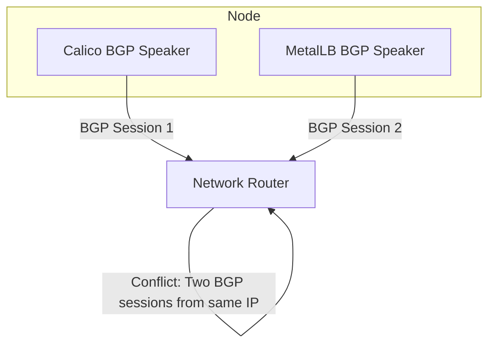
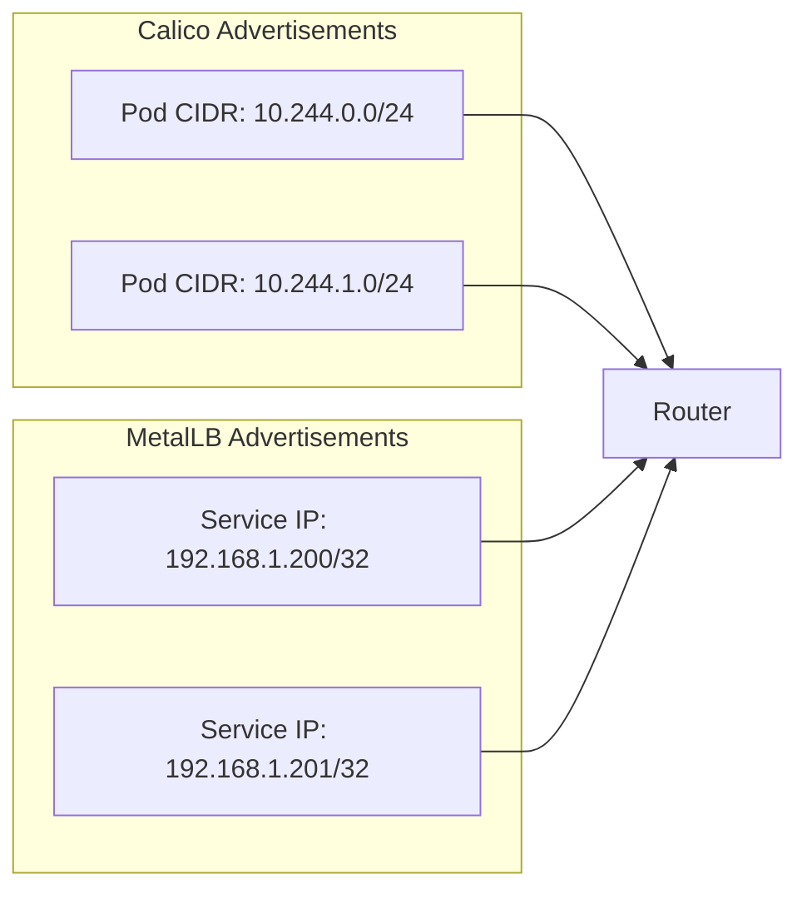
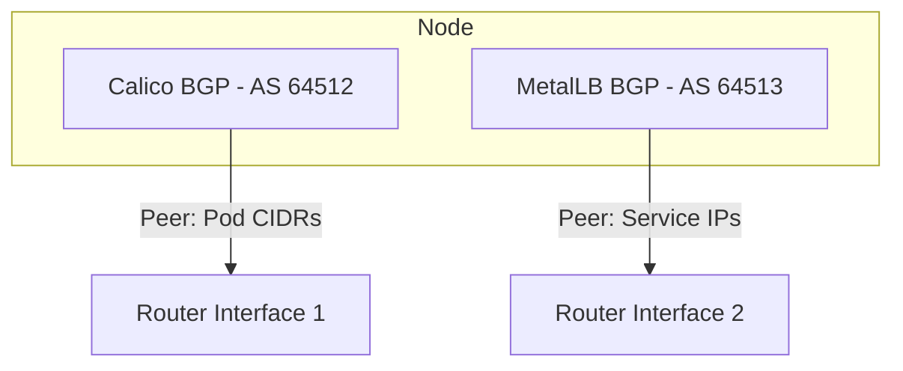
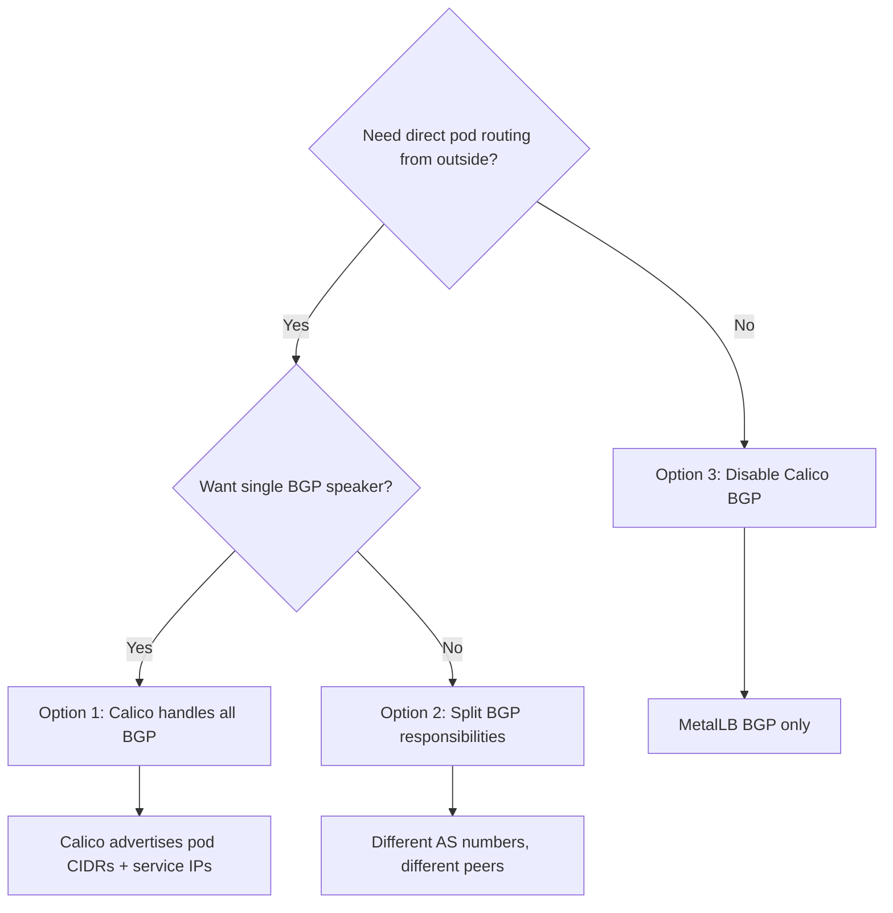

# How to Use MetalLB Alongside Calico BGP

Author: [nawazdhandala](https://www.github.com/nawazdhandala)

Tags: Kubernetes, MetalLB, Calico, BGP, CNI

Description: Learn how to run MetalLB alongside Calico when both need BGP peering, including how to avoid conflicts.

---

Calico is a popular Kubernetes CNI that can use BGP to advertise pod network routes. MetalLB can also use BGP to advertise LoadBalancer service IPs. Running both on the same cluster creates a potential conflict: both want to establish BGP sessions with your network routers.

This post explains how to run MetalLB and Calico BGP side by side without conflicts.

## The Conflict

Both Calico and MetalLB can run a BGP speaker on each node. If both try to peer with the same router on the same node, you get conflicting BGP sessions. The router receives two connections from the same IP, and depending on the BGP implementation, one or both sessions may flap.



## Understanding What Each Component Advertises

Before solving the conflict, it helps to understand what each component advertises:

- **Calico BGP**: Advertises pod CIDR routes so that pods can be reached directly from the network without NAT
- **MetalLB BGP**: Advertises individual LoadBalancer service IPs so that external traffic can reach Kubernetes services



## Option 1: Let Calico Handle All BGP (Recommended)

The simplest approach is to disable MetalLB's BGP speaker and let Calico advertise both pod CIDRs and service IPs. Calico supports advertising Kubernetes service IPs natively.

### Step 1: Configure Calico to Advertise Service IPs

```yaml
# bgp-configuration.yaml
# Tell Calico to advertise LoadBalancer and ClusterIP service ranges.
apiVersion: projectcalico.org/v3
kind: BGPConfiguration
metadata:
  name: default
spec:
  # Log level for BGP operations
  logSeverityScreen: Info
  # Your node-to-node mesh setting
  nodeToNodeMeshEnabled: true
  # AS number for your cluster
  asNumber: 64512
  # Advertise Kubernetes service ClusterIPs
  serviceClusterIPs:
    - cidr: 10.96.0.0/12
  # Advertise Kubernetes service ExternalIPs (MetalLB assigns these)
  serviceExternalIPs:
    - cidr: 192.168.1.200/29
  # Advertise LoadBalancer IPs
  serviceLoadBalancerIPs:
    - cidr: 192.168.1.200/29
```

### Step 2: Configure Calico BGP Peers

```yaml
# bgp-peer.yaml
# Tell Calico which router to peer with.
apiVersion: projectcalico.org/v3
kind: BGPPeer
metadata:
  name: router-peer
spec:
  # IP address of your network router
  peerIP: 192.168.1.1
  # AS number of the router
  asNumber: 64513
  # Peer from all nodes
  nodeSelector: all()
```

### Step 3: Use MetalLB in L2 Mode Only or Disable MetalLB BGP

If you still want MetalLB for IP allocation, run it without BGP. MetalLB can allocate IPs while Calico handles the BGP advertisement:

```yaml
# metallb-ippool.yaml
# MetalLB allocates IPs but does not advertise them via BGP.
# Calico handles BGP advertisement for these IPs.
apiVersion: metallb.io/v1beta1
kind: IPAddressPool
metadata:
  name: service-pool
  namespace: metallb-system
spec:
  addresses:
    - 192.168.1.200-192.168.1.210
  # Do not auto-assign; let services request specific IPs
  autoAssign: true
```

Do NOT create a BGPAdvertisement resource for MetalLB. Without it, MetalLB assigns IPs but does not advertise them. Calico picks up the service IPs and advertises them via its BGP sessions.

## Option 2: Split BGP Responsibilities

If you need both Calico and MetalLB to run BGP, give them different AS numbers and peer with different routers (or different router interfaces).



### Configure MetalLB with a Different AS Number

```yaml
# metallb-bgp-config.yaml
# MetalLB BGP configuration with a separate AS number.
apiVersion: metallb.io/v1beta2
kind: BGPPeer
metadata:
  name: metallb-router
  namespace: metallb-system
spec:
  # Use a different AS number than Calico
  myASN: 64513
  # Peer with the router
  peerASN: 64514
  # Use a different router IP or interface
  peerAddress: 192.168.1.2
---
apiVersion: metallb.io/v1beta1
kind: BGPAdvertisement
metadata:
  name: service-advertisement
  namespace: metallb-system
spec:
  ipAddressPools:
    - service-pool
  # Optional: add communities for route filtering
  communities:
    - 64513:100
```

### Configure Calico to Avoid Conflicting

```yaml
# calico-bgp-peer.yaml
# Calico peers with a different router or interface.
apiVersion: projectcalico.org/v3
kind: BGPPeer
metadata:
  name: calico-router
spec:
  peerIP: 192.168.1.1
  asNumber: 64515
  nodeSelector: all()
```

## Option 3: Disable Calico BGP Entirely

If you only need MetalLB for external service IPs and do not need direct pod routing from outside the cluster, disable Calico's BGP:

```yaml
# calico-config.yaml
# Disable Calico BGP by switching to VXLAN mode.
apiVersion: projectcalico.org/v3
kind: IPPool
metadata:
  name: default-ipv4-ippool
spec:
  cidr: 10.244.0.0/16
  # Use VXLAN instead of BGP for pod networking
  ipipMode: Never
  vxlanMode: Always
  natOutgoing: true
```

With Calico in VXLAN mode, it does not run a BGP speaker, so MetalLB has no conflict.

## Verifying BGP Sessions

### Check Calico BGP Status

```bash
# Install calicoctl if not already available
# Check BGP peer status on a specific node
kubectl exec -n calico-system -it calico-node-xxxxx -- birdcl show protocols

# Or use calicoctl
calicoctl node status
```

### Check MetalLB BGP Status

```bash
# Check MetalLB speaker logs for BGP session status
kubectl logs -n metallb-system -l component=speaker --tail=50 | grep -i bgp

# Look for lines like:
# "session established" or "session up"
```

### Verify Route Advertisement

```bash
# On the network router, check received BGP routes
# The exact command depends on your router OS

# For a Linux router with FRRouting:
vtysh -c "show bgp ipv4 unicast"

# You should see pod CIDRs from Calico and service IPs from MetalLB
```

## Decision Matrix

Use this matrix to decide which approach fits your environment:



## Common Mistakes to Avoid

1. **Same AS number** - Never give Calico and MetalLB the same AS number when both run BGP
2. **Same peer** - Avoid peering both with the same router IP unless you use different AS numbers
3. **Forgetting serviceLoadBalancerIPs** - When using Option 1, you must configure Calico to advertise the LoadBalancer IP range
4. **Port conflicts** - Both speakers default to TCP port 179 for BGP. Using different routers avoids this
5. **Not testing failover** - Always test that failover works correctly when a node goes down

## Troubleshooting

```bash
# Check if both BGP speakers are running on the same node
kubectl get pods -n metallb-system -o wide
kubectl get pods -n calico-system -o wide

# Look for port binding errors in the logs
kubectl logs -n metallb-system -l component=speaker | grep -i "bind\|error\|conflict"

# Verify BGP sessions from the router side
# If sessions are flapping, check for duplicate peer configurations
```

## Summary

Running MetalLB alongside Calico BGP requires careful planning to avoid conflicts. The recommended approach is to let Calico handle all BGP advertisement, including service IPs. This gives you a single BGP speaker per node and simplifies your network configuration.

To monitor the health of your services exposed through BGP-advertised IPs, use [OneUptime](https://oneuptime.com). OneUptime can monitor your service endpoints, track BGP-related outages through response time spikes, and manage incidents when failover events cause disruptions. This gives you visibility from the network layer all the way to the application layer.
