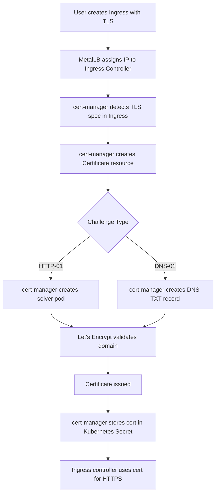
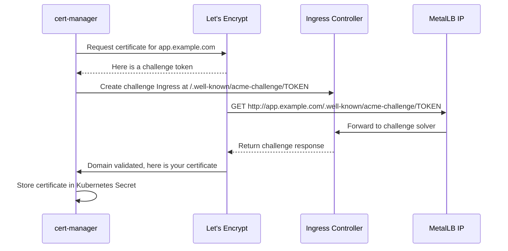

# How to Use MetalLB with cert-manager and Let's Encrypt for TLS

Author: [nawazdhandala](https://www.github.com/nawazdhandala)

Tags: Kubernetes, MetalLB, cert-manager, TLS, Let's Encrypt

Description: Learn how to combine MetalLB with cert-manager to automatically provision TLS certificates for services exposed via LoadBalancer.

---

Running services on bare-metal Kubernetes with MetalLB means you need to handle TLS certificates yourself. cert-manager automates the process of obtaining and renewing TLS certificates from Let's Encrypt. When combined with MetalLB, you get a fully automated pipeline: MetalLB assigns the IP, cert-manager provisions the TLS certificate, and your service is reachable over HTTPS with a valid certificate.

This post walks you through setting up MetalLB with cert-manager and Let's Encrypt.

## Architecture Overview

Here is how the components work together:



## Prerequisites

You need:

- A Kubernetes cluster with MetalLB installed
- An Ingress controller (Nginx, Traefik, or similar) exposed via MetalLB
- A public domain name pointing to your MetalLB IP (for Let's Encrypt validation)
- kubectl and Helm installed

## Installing cert-manager

Install cert-manager using Helm:

```bash
# Add the Jetstack Helm repository
helm repo add jetstack https://charts.jetstack.io
helm repo update

# Install cert-manager with CRDs
helm install cert-manager jetstack/cert-manager \
  --namespace cert-manager \
  --create-namespace \
  --set crds.enabled=true \
  --set prometheus.enabled=true
```

Verify the installation:

```bash
# Check that all cert-manager pods are running
kubectl get pods -n cert-manager

# You should see three pods: controller, webhook, and cainjector
```

## Configuring a ClusterIssuer

A ClusterIssuer tells cert-manager how to obtain certificates. We will create two: one for staging (testing) and one for production.

### Staging ClusterIssuer (for testing)

```yaml
# clusterissuer-staging.yaml
# Use the staging issuer first to avoid hitting Let's Encrypt rate limits.
apiVersion: cert-manager.io/v1
kind: ClusterIssuer
metadata:
  name: letsencrypt-staging
spec:
  acme:
    # Let's Encrypt staging endpoint (does not issue trusted certs)
    server: https://acme-staging-v02.api.letsencrypt.org/directory
    # Your email for certificate expiry notifications
    email: admin@example.com
    privateKeySecretRef:
      name: letsencrypt-staging-key
    solvers:
      # Use HTTP-01 challenge via the Ingress controller
      - http01:
          ingress:
            ingressClassName: nginx
```

### Production ClusterIssuer

```yaml
# clusterissuer-production.yaml
# Use this issuer for production certificates trusted by all browsers.
apiVersion: cert-manager.io/v1
kind: ClusterIssuer
metadata:
  name: letsencrypt-production
spec:
  acme:
    # Let's Encrypt production endpoint
    server: https://acme-v02.api.letsencrypt.org/directory
    email: admin@example.com
    privateKeySecretRef:
      name: letsencrypt-production-key
    solvers:
      - http01:
          ingress:
            ingressClassName: nginx
```

Apply both issuers:

```bash
# Apply the ClusterIssuers
kubectl apply -f clusterissuer-staging.yaml
kubectl apply -f clusterissuer-production.yaml

# Verify they are ready
kubectl get clusterissuer
```

## The HTTP-01 Challenge Flow

When cert-manager requests a certificate using HTTP-01, Let's Encrypt needs to reach your cluster over HTTP on port 80. This means your MetalLB IP must be publicly accessible and your domain must resolve to it.



## Creating an Ingress with TLS

Now create an Ingress resource that requests a TLS certificate automatically:

```yaml
# ingress-tls.yaml
# This Ingress triggers cert-manager to provision a TLS certificate.
apiVersion: networking.k8s.io/v1
kind: Ingress
metadata:
  name: my-app-ingress
  namespace: default
  annotations:
    # Tell cert-manager which issuer to use
    cert-manager.io/cluster-issuer: "letsencrypt-production"
spec:
  ingressClassName: nginx
  tls:
    - hosts:
        # The domain for which to issue a certificate
        - app.example.com
      # cert-manager stores the certificate in this secret
      secretName: app-example-com-tls
  rules:
    - host: app.example.com
      http:
        paths:
          - path: /
            pathType: Prefix
            backend:
              service:
                name: my-app
                port:
                  number: 80
```

Apply and monitor the certificate provisioning:

```bash
# Apply the Ingress
kubectl apply -f ingress-tls.yaml

# Watch cert-manager create and validate the Certificate
kubectl get certificate -w

# Check the certificate status
kubectl describe certificate app-example-com-tls

# Once ready, verify the secret exists
kubectl get secret app-example-com-tls
```

## Using DNS-01 Challenge (Alternative)

If your MetalLB IP is not publicly accessible (for example, on a private network), you can use DNS-01 challenges instead. This requires API access to your DNS provider.

```yaml
# clusterissuer-dns01.yaml
# Use DNS-01 challenges when HTTP-01 is not possible.
apiVersion: cert-manager.io/v1
kind: ClusterIssuer
metadata:
  name: letsencrypt-dns01
spec:
  acme:
    server: https://acme-v02.api.letsencrypt.org/directory
    email: admin@example.com
    privateKeySecretRef:
      name: letsencrypt-dns01-key
    solvers:
      - dns01:
          cloudflare:
            email: admin@example.com
            apiTokenSecretRef:
              # Reference to a secret containing Cloudflare API token
              name: cloudflare-api-token
              key: api-token
```

## Wildcard Certificates

DNS-01 also enables wildcard certificates, which cover all subdomains:

```yaml
# wildcard-certificate.yaml
# Request a wildcard certificate for all subdomains.
apiVersion: cert-manager.io/v1
kind: Certificate
metadata:
  name: wildcard-example-com
  namespace: default
spec:
  secretName: wildcard-example-com-tls
  issuerRef:
    name: letsencrypt-dns01
    kind: ClusterIssuer
  # Wildcard certificates require DNS-01 challenges
  dnsNames:
    - "*.example.com"
    - "example.com"
```

## Certificate Renewal

cert-manager automatically renews certificates before they expire. By default, renewal happens 30 days before expiry. Let's Encrypt certificates are valid for 90 days, so renewal happens around day 60.

You can monitor renewal status:

```bash
# Check certificate expiry dates
kubectl get certificates -A -o wide

# Check for upcoming renewals in cert-manager logs
kubectl logs -n cert-manager -l app=cert-manager --tail=50
```

## Monitoring Certificate Health

It is important to monitor that your certificates are valid and renewing properly. Set up alerts for:

- Certificates expiring within 14 days
- Certificate requests that failed
- Challenge solver errors

```yaml
# prometheusrule-certmanager.yaml
# Alert when certificates are close to expiry or failing.
apiVersion: monitoring.coreos.com/v1
kind: PrometheusRule
metadata:
  name: cert-manager-alerts
  namespace: cert-manager
spec:
  groups:
    - name: cert-manager
      rules:
        # Alert when a certificate is expiring within 14 days
        - alert: CertificateExpiringSoon
          expr: |
            certmanager_certificate_expiration_timestamp_seconds
            - time() < 14 * 24 * 3600
          for: 1h
          labels:
            severity: warning
          annotations:
            summary: "Certificate expiring soon"
            description: >
              Certificate {{ $labels.name }} in namespace
              {{ $labels.namespace }} expires in less than 14 days.

        # Alert when a certificate is not ready
        - alert: CertificateNotReady
          expr: |
            certmanager_certificate_ready_status{condition="False"} == 1
          for: 15m
          labels:
            severity: critical
          annotations:
            summary: "Certificate not ready"
            description: >
              Certificate {{ $labels.name }} in namespace
              {{ $labels.namespace }} has been in a not-ready state
              for more than 15 minutes.
```

## Troubleshooting

Common issues when using MetalLB with cert-manager:

1. **Challenge fails with connection timeout** - Ensure your MetalLB IP is publicly reachable on port 80
2. **Certificate stuck in "Issuing" state** - Check cert-manager logs and the Challenge resource for errors
3. **DNS-01 challenge fails** - Verify your DNS provider API credentials are correct
4. **Rate limit exceeded** - Use the staging issuer for testing before switching to production

```bash
# Debug a stuck certificate
kubectl describe certificate <cert-name>
kubectl describe certificaterequest <cert-name>
kubectl describe challenge -l cert-manager.io/certificate-name=<cert-name>
```

## Summary

Combining MetalLB with cert-manager and Let's Encrypt gives you automated TLS certificate provisioning on bare-metal Kubernetes. MetalLB provides the external IP, cert-manager handles certificate lifecycle, and Let's Encrypt issues trusted certificates at no cost. This eliminates manual certificate management entirely.

To monitor that your certificates are valid, your services are reachable over HTTPS, and your TLS configuration is correct, use [OneUptime](https://oneuptime.com). OneUptime can check TLS certificate expiry, alert you when certificates are about to expire, and track the HTTPS health of your MetalLB-exposed services.
