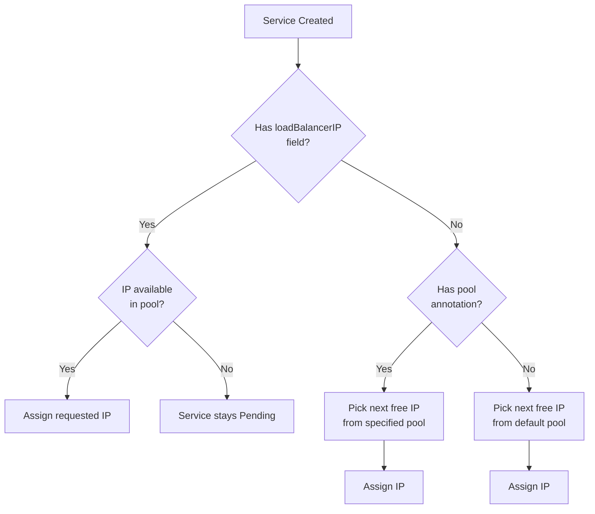
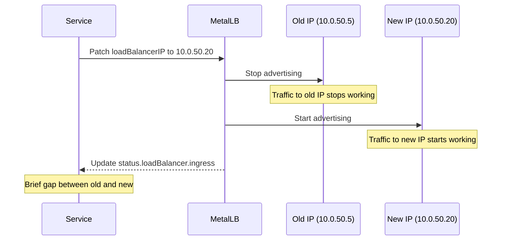

# How to Change the IP Address of an Existing Service in MetalLB

Author: [nawazdhandala](https://www.github.com/nawazdhandala)

Tags: Kubernetes, MetalLB, IP Address, Service, Configuration

Description: Learn how to change the external IP address of an existing LoadBalancer service managed by MetalLB without recreating the service.

---

> Sometimes you need to change the external IP of a running service - maybe you are migrating to a new IP range, consolidating pools, or fixing a network conflict. MetalLB supports in-place IP changes through the `spec.loadBalancerIP` field and pool annotations. This guide shows you how to do it safely with zero downtime planning.

---

## How MetalLB Assigns IPs

Before changing an IP, understand how MetalLB decides which IP a service gets:



---

## Method 1: Set a Specific IP with loadBalancerIP

The most direct approach - tell MetalLB exactly which IP you want:

```bash
# Check the current IP of your service
kubectl get svc my-service -o jsonpath='{.status.loadBalancer.ingress[0].ip}'
# Output: 10.0.50.5
```

Patch the service to request a new IP:

```bash
# Change the service to use a specific new IP
# MetalLB will release the old IP and assign the new one
kubectl patch svc my-service -p '{"spec":{"loadBalancerIP":"10.0.50.20"}}'
```

Or edit the service YAML directly:

```yaml
# service-updated.yaml
# Service with an explicit IP assignment
apiVersion: v1
kind: Service
metadata:
  name: my-service
  annotations:
    # Ensure the target pool contains the requested IP
    metallb.universe.tf/address-pool: primary-ips
spec:
  type: LoadBalancer
  # Request a specific IP from the pool
  loadBalancerIP: 10.0.50.20
  selector:
    app: my-app
  ports:
    - port: 80
      targetPort: 8080
```

```bash
# Apply the updated service definition
kubectl apply -f service-updated.yaml
```

---

## Method 2: Switch to a Different Pool

To move a service to a different IP pool, update the pool annotation:

```bash
# Change the pool annotation - MetalLB will release the old IP
# and assign a new one from the new pool
kubectl annotate svc my-service \
  metallb.universe.tf/address-pool=secondary-ips \
  --overwrite
```

---

## Method 3: Remove Fixed IP and Let MetalLB Choose

If you want MetalLB to pick any available IP:

```bash
# Remove the loadBalancerIP field to let MetalLB auto-assign
kubectl patch svc my-service --type=json \
  -p='[{"op":"remove","path":"/spec/loadBalancerIP"}]'
```

---

## What Happens During the Change



There is a brief window where neither IP is active. The duration depends on:

- L2 mode: ARP cache expiry on client machines (usually seconds).
- BGP mode: BGP convergence time (usually seconds to a minute).

---

## Zero-Downtime IP Change Strategy

For critical services, use a parallel deployment to avoid the gap:

```bash
# Step 1: Create a temporary service with the new IP
kubectl expose deployment my-app --name=my-service-new \
  --type=LoadBalancer --port=80 --target-port=8080

# Annotate with the desired pool
kubectl annotate svc my-service-new \
  metallb.universe.tf/address-pool=primary-ips

# Set the new IP
kubectl patch svc my-service-new \
  -p '{"spec":{"loadBalancerIP":"10.0.50.20"}}'

# Step 2: Verify the new service is working
curl http://10.0.50.20/health

# Step 3: Update DNS to point to the new IP
# Wait for DNS propagation

# Step 4: Delete the old service
kubectl delete svc my-service

# Step 5: Rename the new service (optional - requires delete and recreate)
kubectl get svc my-service-new -o yaml | \
  sed 's/my-service-new/my-service/' | \
  kubectl apply -f -
kubectl delete svc my-service-new
```

---

## Verifying the IP Change

```bash
# Confirm the service has the new IP
kubectl get svc my-service -o wide

# Check MetalLB speaker logs for the advertisement update
kubectl logs -n metallb-system -l app=metallb,component=speaker | grep "10.0.50.20"

# In L2 mode, check the ARP announcement
kubectl logs -n metallb-system -l app=metallb,component=speaker | grep "gratuitous"

# Test connectivity to the new IP
curl -v http://10.0.50.20/
```

---

## Troubleshooting IP Changes

| Symptom | Cause | Fix |
|---------|-------|-----|
| Service stays Pending after patch | Requested IP not in any pool | Verify the IP is within a pool's address range |
| Old IP still responding | ARP cache on clients | Wait for ARP expiry or flush client ARP cache |
| New IP not responding | BGP not converged | Check BGP session status and wait for convergence |
| IP conflict | Another device has the new IP | Check for conflicts with `arping` before assigning |

---

## Checking for IP Conflicts Before Changing

Always verify the target IP is not already in use on the network:

```bash
# Check if the target IP responds (should NOT respond)
ping -c 3 -W 1 10.0.50.20

# Check ARP table for the target IP
arp -n 10.0.50.20

# Use arping to check for conflicts (run from a node on the same L2 segment)
arping -c 3 -D 10.0.50.20
```

---

## Batch IP Migration Script

When migrating multiple services to a new pool:

```bash
#!/bin/bash
# migrate-services.sh
# Migrate all LoadBalancer services to a new IP pool

# Define the new pool name
NEW_POOL="new-primary-ips"

# Get all LoadBalancer services across all namespaces
SERVICES=$(kubectl get svc -A -o jsonpath='{range .items[?(@.spec.type=="LoadBalancer")]}{.metadata.namespace}/{.metadata.name}{"\n"}{end}')

# Loop through each service and update the pool annotation
for SVC in $SERVICES; do
  NS=$(echo "$SVC" | cut -d'/' -f1)
  NAME=$(echo "$SVC" | cut -d'/' -f2)
  echo "Migrating $NS/$NAME to pool $NEW_POOL"
  kubectl -n "$NS" annotate svc "$NAME" \
    metallb.universe.tf/address-pool="$NEW_POOL" \
    --overwrite
  # Wait briefly between services to avoid overwhelming MetalLB
  sleep 2
done

echo "Migration complete. Verify with: kubectl get svc -A -o wide"
```

---

## Wrapping Up

Changing a MetalLB-managed service IP is straightforward with `loadBalancerIP` patches or pool annotation updates. For production services, use a parallel deployment strategy to eliminate the brief connectivity gap during the switch.

To monitor your services during IP migrations and get instant alerts if any endpoint becomes unreachable, use **[OneUptime](https://oneuptime.com)** for comprehensive infrastructure monitoring.
