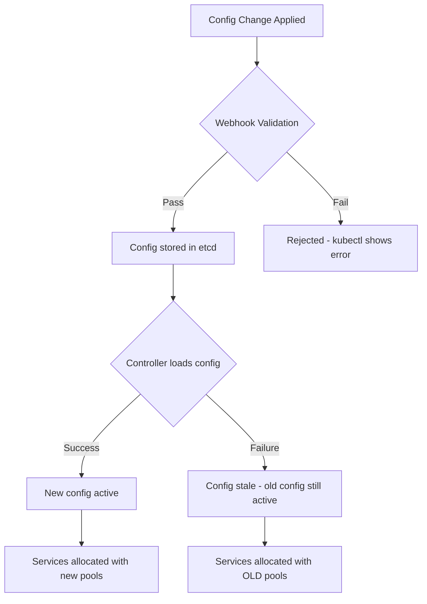
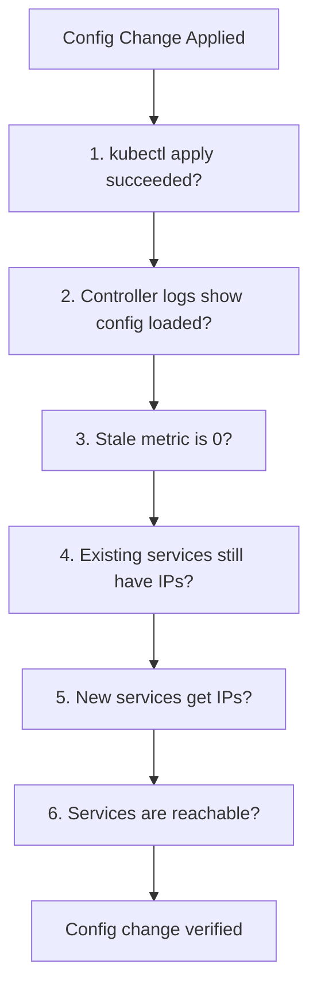

# How to Check if MetalLB Configuration Is Valid or Stale

Author: [nawazdhandala](https://www.github.com/nawazdhandala)

Tags: Kubernetes, MetalLB, Configuration, Validation, Troubleshooting

Description: Learn how to verify that MetalLB configuration is valid and not stale after making changes to IP pools or advertisements.

---

After changing MetalLB configuration - adding IP pools, modifying advertisements, or updating BGP peers - you need to verify that MetalLB has accepted the new configuration. Invalid or stale configuration can silently prevent IP allocation or advertisement. This post shows how to validate your MetalLB configuration at every level.

## What Is Stale Configuration?

MetalLB configuration becomes stale when the controller or speakers fail to load new configuration. This can happen due to:

- YAML syntax errors in CRDs
- Invalid IP ranges in address pools
- References to non-existent resources
- Webhook validation failures



## Step 1: Check CRD Validation

MetalLB uses validating webhooks to catch obvious errors before they reach etcd. Check if the webhook is running:

```bash
# Verify the MetalLB webhook service is available
kubectl get validatingwebhookconfigurations | grep metallb

# Check the webhook pod status
kubectl get pods -n metallb-system -l component=controller
```

Try applying a deliberately invalid configuration to test:

```yaml
# test-invalid-pool.yaml
# This pool has an invalid IP range - end is before start
apiVersion: metallb.io/v1beta1
kind: IPAddressPool
metadata:
  name: test-invalid
  namespace: metallb-system
spec:
  addresses:
    # Invalid: end IP is lower than start IP
    - 192.168.1.200-192.168.1.100
```

```bash
# This should be rejected by the webhook with a clear error message
kubectl apply -f test-invalid-pool.yaml
# Expected: Error from server (Invalid): ...
```

If invalid configurations are accepted without error, your webhook may not be functioning.

## Step 2: Check Controller Logs for Config Errors

Even if the webhook accepts a configuration, the controller may fail to process it:

```bash
# Check controller logs for configuration loading errors
kubectl logs -n metallb-system -l component=controller --tail=100 | grep -i "config\|error\|stale\|reload\|invalid"
```

Healthy output looks like:

```
{"level":"info","msg":"config changed","configFile":"IPAddressPool"}
{"level":"info","msg":"config changed","configFile":"L2Advertisement"}
```

Problematic output looks like:

```
{"level":"error","msg":"failed to parse config","error":"invalid CIDR"}
{"level":"warn","msg":"configuration is stale"}
```

## Step 3: Verify IP Address Pools

Check that your pools are configured correctly and have available addresses:

```bash
# List all IP address pools and their ranges
kubectl get ipaddresspool -n metallb-system -o custom-columns=\
NAME:.metadata.name,\
ADDRESSES:.spec.addresses,\
AUTO-ASSIGN:.spec.autoAssign
```

Validate each pool's address range:

```bash
# Get detailed pool configuration
kubectl get ipaddresspool -n metallb-system -o yaml
```

Check for common issues:

```yaml
# Correct: valid IPv4 range
addresses:
  - 192.168.1.200-192.168.1.250

# Correct: valid CIDR notation
addresses:
  - 192.168.1.0/24

# Correct: single IP
addresses:
  - 192.168.1.200/32

# WRONG: overlapping with node subnet can cause issues
# WRONG: IPs already in use by other devices
```

## Step 4: Verify Advertisements

Pools without matching advertisements will not be announced:

```bash
# List L2 advertisements and their pool references
kubectl get l2advertisement -n metallb-system -o yaml

# List BGP advertisements and their pool references
kubectl get bgpadvertisement -n metallb-system -o yaml
```

Check that advertisements reference existing pools:

```bash
# Get pool names
POOLS=$(kubectl get ipaddresspool -n metallb-system -o jsonpath='{.items[*].metadata.name}')

# Get pools referenced in L2 advertisements
L2_REFS=$(kubectl get l2advertisement -n metallb-system -o jsonpath='{.items[*].spec.ipAddressPools[*]}')

echo "Configured pools: $POOLS"
echo "Referenced in L2: $L2_REFS"
```

## Step 5: Check the Stale Configuration Metric

MetalLB exposes a Prometheus metric that indicates stale configuration:

```bash
# Port-forward to a speaker pod to access metrics
kubectl port-forward -n metallb-system \
  $(kubectl get pod -n metallb-system -l component=speaker -o name | head -1) \
  7472:7472 &

# Check the stale config metric
# 0 means config is current, 1 means config is stale
curl -s http://localhost:7472/metrics | grep metallb_k8s_client_config_stale_bool

# Clean up the port-forward
kill %1
```

## Step 6: Force a Config Reload

If configuration is stale, you can force a reload by restarting the MetalLB components:

```bash
# Restart the controller to force config reload
kubectl rollout restart deployment controller -n metallb-system

# Restart all speaker pods to force config reload
kubectl rollout restart daemonset speaker -n metallb-system

# Wait for rollout to complete
kubectl rollout status deployment controller -n metallb-system
kubectl rollout status daemonset speaker -n metallb-system
```

## Configuration Validation Checklist

Use this checklist after any configuration change:



```bash
#!/bin/bash
# config-check.sh - Validate MetalLB configuration after changes

echo "=== 1. IP Address Pools ==="
kubectl get ipaddresspool -n metallb-system

echo ""
echo "=== 2. L2 Advertisements ==="
kubectl get l2advertisement -n metallb-system

echo ""
echo "=== 3. BGP Advertisements ==="
kubectl get bgpadvertisement -n metallb-system

echo ""
echo "=== 4. Controller Logs (last 20 lines) ==="
kubectl logs -n metallb-system -l component=controller --tail=20

echo ""
echo "=== 5. Services with Pending IPs ==="
kubectl get svc -A -o json | jq -r '
  .items[] |
  select(.spec.type == "LoadBalancer") |
  select(.status.loadBalancer.ingress == null) |
  "\(.metadata.namespace)/\(.metadata.name) - PENDING"
'

echo ""
echo "=== 6. Services with Assigned IPs ==="
kubectl get svc -A -o json | jq -r '
  .items[] |
  select(.spec.type == "LoadBalancer") |
  select(.status.loadBalancer.ingress != null) |
  "\(.metadata.namespace)/\(.metadata.name): \(.status.loadBalancer.ingress[].ip)"
'
```

## Common Configuration Mistakes

### Overlapping Pools

Two pools with overlapping address ranges can cause unpredictable behavior:

```yaml
# WRONG: These pools overlap at 192.168.1.200
# pool-1: 192.168.1.100-192.168.1.200
# pool-2: 192.168.1.200-192.168.1.250

# CORRECT: Non-overlapping ranges
# pool-1: 192.168.1.100-192.168.1.199
# pool-2: 192.168.1.200-192.168.1.250
```

### Missing Namespace

All MetalLB CRDs must be in the `metallb-system` namespace:

```bash
# Check if any MetalLB resources are in the wrong namespace
kubectl get ipaddresspool,l2advertisement,bgpadvertisement -A
```

### Auto-Assign Disabled

If `autoAssign` is set to false, the pool is only used when explicitly requested via annotation:

```yaml
spec:
  # When false, services must use metallb.io/address-pool annotation
  # to get an IP from this pool
  autoAssign: false
```

## Monitoring with OneUptime

Configuration validation should not be a manual process. [OneUptime](https://oneuptime.com) can monitor the endpoints behind your MetalLB services continuously, catching issues that arise from stale or invalid configurations. When a configuration change breaks service reachability, OneUptime alerts your team immediately, tracks the incident, and provides a status page so stakeholders know what is happening and when it will be resolved.
