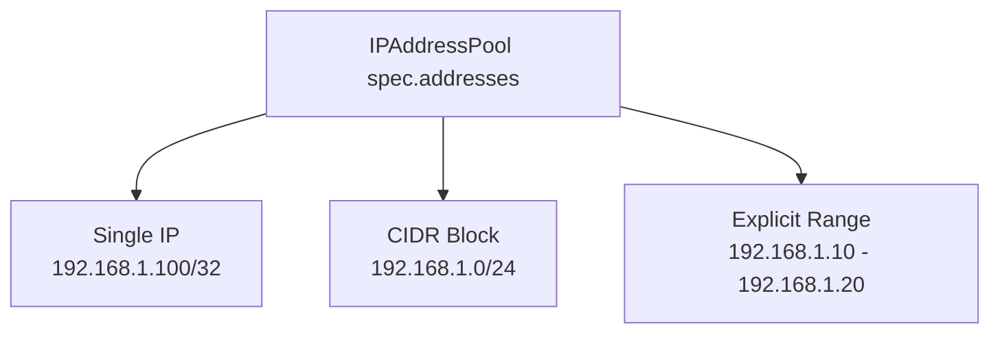
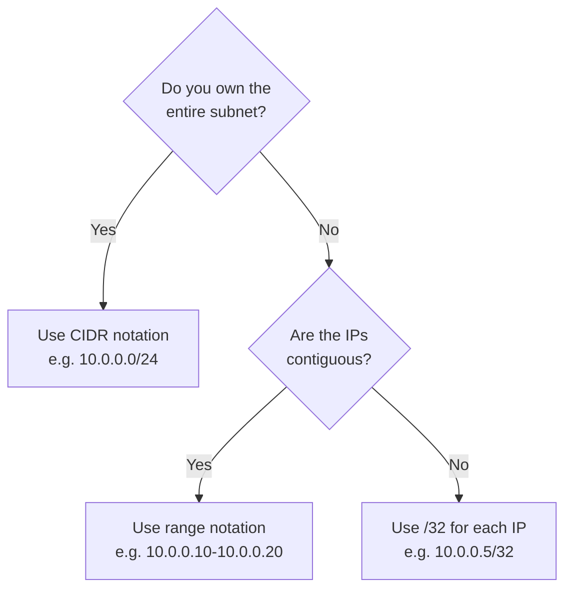

# How to Use CIDR and Range Notation for MetalLB IPAddressPools

Author: [nawazdhandala](https://www.github.com/nawazdhandala)

Tags: Kubernetes, MetalLB, CIDR, IP Address, IPAddressPool

Description: Learn the different IP address notation formats supported by MetalLB IPAddressPool resources including CIDR blocks and explicit ranges.

---

> MetalLB accepts IP addresses in three different formats inside an IPAddressPool: single IPs with a /32 mask, CIDR blocks, and explicit start-end ranges. Choosing the right notation affects readability, prevents mistakes, and makes pool management easier as your cluster grows.

This guide covers each notation style with examples, explains when to pick one over another, and shows common pitfalls.

---

## Supported Notation Formats

MetalLB supports three ways to specify addresses in the `spec.addresses` list:

| Format | Example | IPs Included |
|--------|---------|-------------|
| Single IP (CIDR /32) | `192.168.1.100/32` | 1 IP |
| CIDR block | `192.168.1.0/24` | 256 IPs |
| Explicit range | `192.168.1.10-192.168.1.20` | 11 IPs |



---

## Single IP with /32

Use /32 when you have individual IPs that are not part of a contiguous block. This is common when your hosting provider gives you a handful of specific addresses.

```yaml
# pool-single-ips.yaml
# Pool containing individual public IPs from a hosting provider
apiVersion: metallb.io/v1beta1
kind: IPAddressPool
metadata:
  name: single-ips
  namespace: metallb-system
spec:
  addresses:
    # Each address is a single IP with a /32 prefix length
    - 203.0.113.5/32
    - 203.0.113.17/32
    - 203.0.113.42/32
```

Key points about /32 notation:

- Each entry adds exactly one usable IP.
- The `/32` suffix is required - MetalLB will reject a bare IP without a mask or range.
- Good for scattered IPs that do not form a continuous block.

---

## CIDR Block Notation

CIDR blocks let you express a contiguous range of IPs compactly. Use them when you own an entire subnet.

```yaml
# pool-cidr.yaml
# Pool using CIDR notation for a /28 block (16 IPs)
apiVersion: metallb.io/v1beta1
kind: IPAddressPool
metadata:
  name: cidr-pool
  namespace: metallb-system
spec:
  addresses:
    # /28 gives 16 addresses: 10.0.100.0 through 10.0.100.15
    - 10.0.100.0/28
    # /30 gives 4 addresses: 10.0.200.0 through 10.0.200.3
    - 10.0.200.0/30
```

Common CIDR sizes:

| CIDR | Addresses | Usable for Services |
|------|-----------|-------------------|
| /32 | 1 | 1 |
| /30 | 4 | 4 |
| /28 | 16 | 16 |
| /24 | 256 | 256 |
| /20 | 4096 | 4096 |

> MetalLB uses every address in the CIDR block, including the network (.0) and broadcast (.255) addresses. Be cautious with /24 or larger blocks if your network gear treats those addresses specially.

---

## Explicit Range Notation

Ranges give you the most precise control. Specify the first and last IP separated by a hyphen.

```yaml
# pool-range.yaml
# Pool using explicit range notation
apiVersion: metallb.io/v1beta1
kind: IPAddressPool
metadata:
  name: range-pool
  namespace: metallb-system
spec:
  addresses:
    # Only IPs from .10 to .20 (11 addresses total)
    - 192.168.50.10-192.168.50.20
    # A second range in a different subnet
    - 172.16.0.100-172.16.0.110
```

Key points about range notation:

- Both IPs must be in the same subnet.
- The start IP must be numerically less than or equal to the end IP.
- Useful for carving out a slice of a larger subnet you share with other systems.

---

## Mixing Formats in One Pool

You can combine all three formats in a single IPAddressPool:

```yaml
# pool-mixed.yaml
# Pool that mixes CIDR, range, and single-IP notation
apiVersion: metallb.io/v1beta1
kind: IPAddressPool
metadata:
  name: mixed-pool
  namespace: metallb-system
spec:
  addresses:
    # A full /28 block
    - 10.10.10.0/28
    # A specific range within a different subnet
    - 10.10.20.50-10.10.20.60
    # Two individual IPs
    - 10.10.30.5/32
    - 10.10.30.9/32
```

---

## IPv6 Notation

MetalLB also supports IPv6 addresses using the same three formats:

```yaml
# pool-ipv6.yaml
# Pool with IPv6 addresses
apiVersion: metallb.io/v1beta1
kind: IPAddressPool
metadata:
  name: ipv6-pool
  namespace: metallb-system
spec:
  addresses:
    # IPv6 CIDR block
    - fd00:1::0/120
    # IPv6 explicit range
    - fd00:2::10-fd00:2::20
    # Single IPv6 address
    - fd00:3::1/128
```

---

## Choosing the Right Format



---

## Common Mistakes

| Mistake | Example | Fix |
|---------|---------|-----|
| Bare IP without mask | `192.168.1.5` | Use `192.168.1.5/32` or a range |
| Range with IPs in different subnets | `10.0.1.5-10.0.2.5` | Split into two entries |
| Overlapping entries | `/24` and a range inside it | Remove the overlap |
| Wrong CIDR math | Using /28 expecting 32 IPs | /28 = 16 IPs, /27 = 32 IPs |

---

## Verifying Your Pool

After applying, confirm MetalLB parsed the addresses correctly:

```bash
# View the pool and its parsed address list
kubectl get ipaddresspool -n metallb-system -o yaml

# Check controller logs for parse errors
kubectl logs -n metallb-system -l app=metallb,component=controller | grep -i "error\|parse\|invalid"
```

---

## Wrapping Up

Picking the right notation - CIDR for full subnets, ranges for partial blocks, and /32 for individual IPs - keeps your MetalLB configuration clean and easy to audit. When mixing formats, double-check for overlaps and verify the pool after applying.

For end-to-end monitoring of your MetalLB-managed services and instant alerts when an IP becomes unreachable, check out **[OneUptime](https://oneuptime.com)**.
