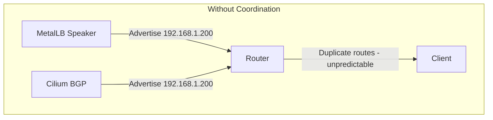
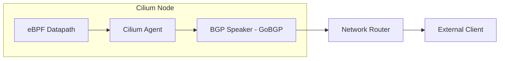
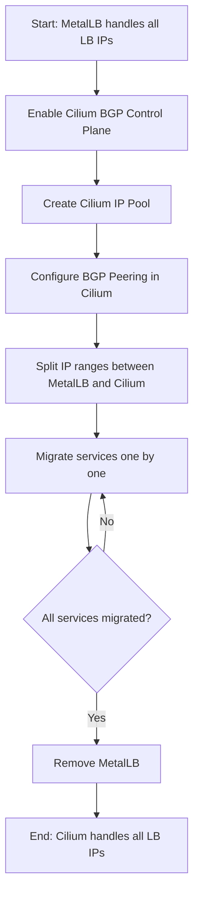
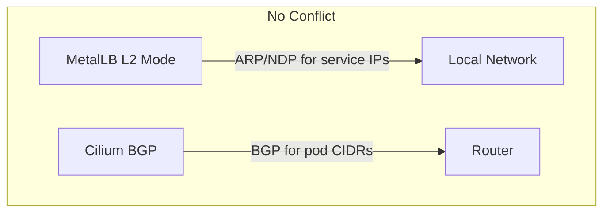

# How to Use MetalLB Alongside Cilium BGP Control Plane

Author: [nawazdhandala](https://www.github.com/nawazdhandala)

Tags: Kubernetes, MetalLB, Cilium, BGP, CNI

Description: Learn how to use MetalLB alongside Cilium's BGP Control Plane or migrate between the two for load balancer IP advertisement.

---

Cilium is a powerful eBPF-based CNI that includes its own BGP Control Plane for advertising service IPs. If you already use MetalLB for LoadBalancer IP assignment and want to adopt Cilium, you need to decide how to handle the overlap. This post covers how to run both together during a migration and how to fully migrate from MetalLB to Cilium's BGP Control Plane.

## The Overlap

Both MetalLB and Cilium's BGP Control Plane can:

- Assign IPs to LoadBalancer-type services
- Advertise those IPs via BGP to network routers
- Handle failover when a node goes down

Running both simultaneously without coordination leads to duplicate BGP advertisements and unpredictable routing.



## Understanding Cilium's BGP Control Plane

Cilium's BGP Control Plane uses CiliumBGPPeeringPolicy resources to configure BGP sessions. It can advertise:

- Pod CIDRs (replacing kube-router or Calico BGP)
- Service LoadBalancer IPs (replacing MetalLB BGP mode)
- Service ClusterIPs



Cilium embeds GoBGP as its BGP implementation, running it inside the Cilium agent process rather than as a separate daemon.

## Option 1: Use Both During Migration

During a migration from MetalLB to Cilium BGP, you can run both temporarily. The key is to avoid advertising the same IPs from both systems.

### Split the IP Pools

Give MetalLB and Cilium separate, non-overlapping IP ranges:

```yaml
# metallb-pool.yaml
# MetalLB handles this IP range (legacy services)
apiVersion: metallb.io/v1beta1
kind: IPAddressPool
metadata:
  name: legacy-pool
  namespace: metallb-system
spec:
  addresses:
    # First half of the range for MetalLB
    - 192.168.1.200-192.168.1.210
---
apiVersion: metallb.io/v1beta1
kind: BGPAdvertisement
metadata:
  name: legacy-advert
  namespace: metallb-system
spec:
  ipAddressPools:
    - legacy-pool
```

```yaml
# cilium-pool.yaml
# Cilium handles this IP range (new services)
apiVersion: cilium.io/v2alpha1
kind: CiliumLoadBalancerIPPool
metadata:
  name: new-pool
spec:
  blocks:
    # Second half of the range for Cilium
    - cidr: 192.168.1.211/28
```

### Configure Cilium BGP Peering

```yaml
# cilium-bgp-peering.yaml
# Configure Cilium's BGP Control Plane to peer with the router.
apiVersion: cilium.io/v2alpha1
kind: CiliumBGPPeeringPolicy
metadata:
  name: rack-bgp
spec:
  nodeSelector:
    matchLabels:
      # Apply to all nodes (or use specific labels)
      kubernetes.io/os: linux
  virtualRouters:
    - localASN: 64512
      exportPodCIDR: false
      neighbors:
        - peerAddress: "192.168.1.1/32"
          peerASN: 64513
          # Graceful restart for seamless failover
          gracefulRestart:
            enabled: true
            restartTimeSeconds: 120
      serviceSelector:
        matchExpressions:
          # Only advertise services with this label
          - key: bgp-advertise
            operator: In
            values:
              - cilium
```

### Label Services for Cilium

New services that should use Cilium's BGP get a label:

```yaml
# new-service.yaml
# This service uses Cilium's IP pool and BGP advertisement.
apiVersion: v1
kind: Service
metadata:
  name: new-app
  namespace: default
  labels:
    # Tell Cilium BGP to advertise this service
    bgp-advertise: cilium
spec:
  type: LoadBalancer
  selector:
    app: new-app
  ports:
    - port: 80
      targetPort: 8080
```

## Option 2: Fully Migrate to Cilium BGP

If you want to replace MetalLB entirely, follow this migration path.

### Step 1: Enable Cilium BGP Control Plane

Update your Cilium Helm values to enable the BGP Control Plane:

```bash
# Upgrade Cilium with BGP Control Plane enabled
helm upgrade cilium cilium/cilium \
  --namespace kube-system \
  --set bgpControlPlane.enabled=true \
  --set ipam.mode=kubernetes \
  --set k8sServiceHost=<api-server-ip> \
  --set k8sServicePort=6443
```

### Step 2: Create Cilium IP Pool

```yaml
# cilium-lb-pool.yaml
# Define the IP pool for Cilium to assign LoadBalancer IPs.
apiVersion: cilium.io/v2alpha1
kind: CiliumLoadBalancerIPPool
metadata:
  name: service-pool
spec:
  blocks:
    # Use the same range that MetalLB was using
    - cidr: 192.168.1.200/27
```

### Step 3: Configure BGP Peering

```yaml
# cilium-bgp-full.yaml
# Full BGP peering configuration for Cilium.
apiVersion: cilium.io/v2alpha1
kind: CiliumBGPPeeringPolicy
metadata:
  name: cluster-bgp
spec:
  nodeSelector:
    matchLabels:
      kubernetes.io/os: linux
  virtualRouters:
    - localASN: 64512
      # Advertise pod CIDRs for direct routing
      exportPodCIDR: true
      neighbors:
        - peerAddress: "192.168.1.1/32"
          peerASN: 64513
          gracefulRestart:
            enabled: true
            restartTimeSeconds: 120
      # Advertise all LoadBalancer services
      serviceSelector:
        matchExpressions:
          - key: somekey
            operator: NotIn
            values:
              - never-match-this
```

### Step 4: Migrate Services

Migrate services one at a time by removing MetalLB annotations and letting Cilium handle them:

```bash
# Remove MetalLB-specific annotations from a service
kubectl annotate svc my-service metallb.universe.tf/loadBalancerIPs- \
  metallb.universe.tf/address-pool-

# The service will get a new IP from Cilium's pool
# Update DNS records to point to the new IP

# Verify the service has a new external IP
kubectl get svc my-service
```

### Step 5: Remove MetalLB

Once all services are migrated:

```bash
# Delete MetalLB resources
kubectl delete -f https://raw.githubusercontent.com/metallb/metallb/v0.14.9/config/manifests/metallb-native.yaml

# Verify MetalLB is fully removed
kubectl get all -n metallb-system
```

## Migration Flow



## Comparing MetalLB and Cilium BGP

Here is a comparison to help you decide:

**MetalLB Strengths:**
- Mature and well-tested
- Simple configuration
- Works with any CNI
- Active community

**Cilium BGP Strengths:**
- Single component handles CNI and LB IP advertisement
- eBPF-based datapath for better performance
- Integrated with Cilium's network policies
- No extra pods needed (runs inside cilium-agent)

## Verifying BGP Sessions

### Check Cilium BGP Status

```bash
# Check BGP peering status on each node
kubectl exec -n kube-system -it cilium-xxxxx -- cilium bgp peers

# Expected output shows peer address, ASN, and session state
# Peer Address   ASN     State        Uptime
# 192.168.1.1    64513   established  3h25m

# Check advertised routes
kubectl exec -n kube-system -it cilium-xxxxx -- cilium bgp routes advertised ipv4 unicast
```

### Verify Routes on the Router

```bash
# On a Linux router running FRRouting
vtysh -c "show bgp ipv4 unicast summary"
vtysh -c "show bgp ipv4 unicast"

# You should see:
# - Pod CIDRs if exportPodCIDR is true
# - Service IPs for LoadBalancer services
```

## L2 Mode Consideration

If you are using MetalLB in L2 mode (not BGP), there is no conflict with Cilium's BGP Control Plane. Cilium BGP handles BGP while MetalLB handles L2 ARP/NDP. They operate at different network layers:



This is a valid configuration that does not require any special handling.

## Troubleshooting

1. **Duplicate routes on router** - Both MetalLB and Cilium are advertising the same IP. Split your IP ranges
2. **BGP session not establishing** - Check firewall rules for TCP port 179 and verify ASN configuration
3. **Service not getting an IP** - Check that the CiliumLoadBalancerIPPool has available addresses
4. **Routes withdrawn after node restart** - Enable graceful restart in the BGP peering configuration

```bash
# Debug Cilium BGP issues
kubectl logs -n kube-system -l k8s-app=cilium | grep -i bgp
cilium bgp peers
cilium bgp routes

# Debug MetalLB issues during migration
kubectl logs -n metallb-system -l component=speaker | grep -i bgp
```

## Summary

Running MetalLB alongside Cilium's BGP Control Plane is possible during a migration, but long-term you should choose one system to handle BGP advertisement. If you are already using Cilium as your CNI, migrating to its BGP Control Plane simplifies your stack by removing a component. If you use a different CNI, MetalLB remains the best choice for LoadBalancer IP management.

To monitor services exposed through either MetalLB or Cilium BGP, use [OneUptime](https://oneuptime.com). OneUptime provides external endpoint monitoring, incident management, and status pages that work regardless of how your LoadBalancer IPs are advertised. This gives you consistent observability as you migrate between networking components.
