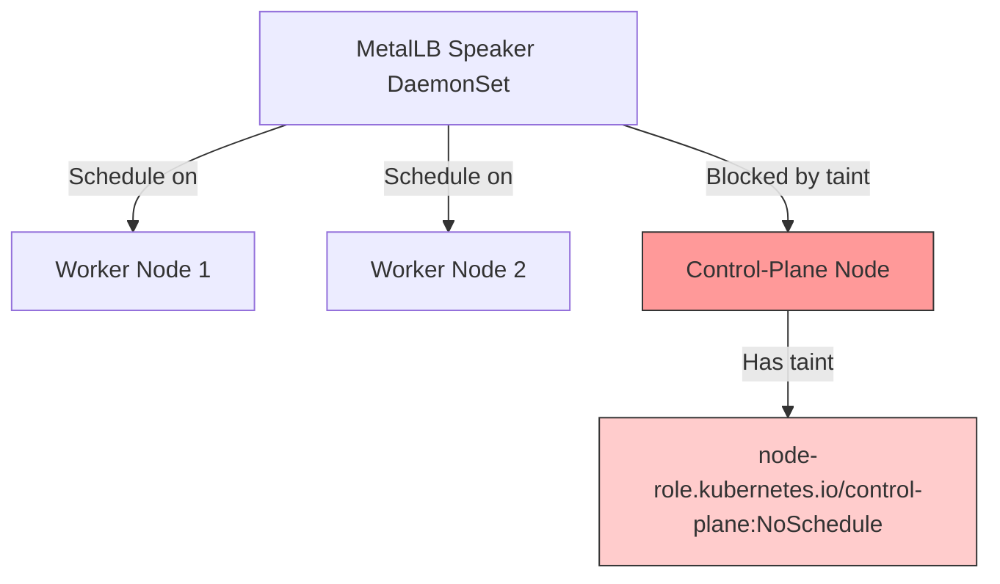
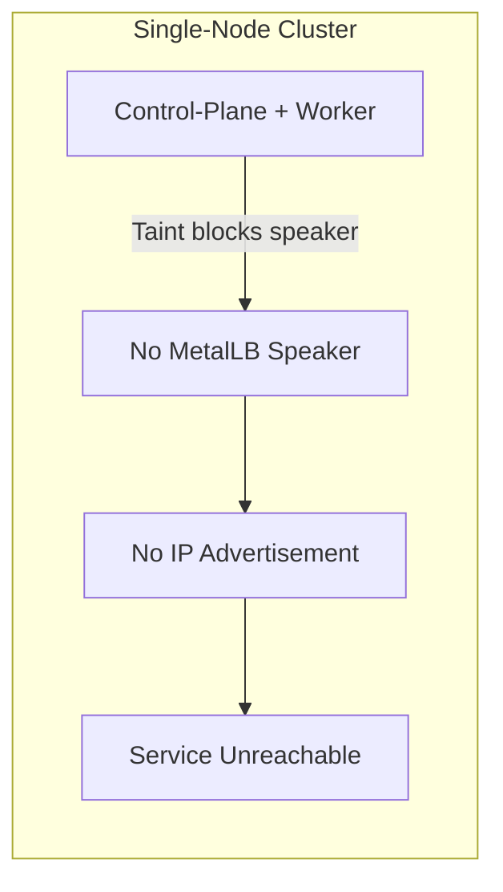
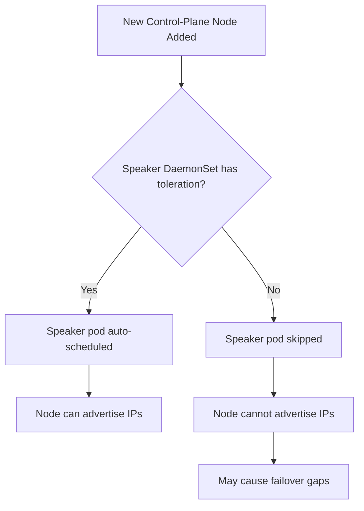

# How to Fix MetalLB Not Advertising from Control-Plane Nodes

Author: [nawazdhandala](https://www.github.com/nawazdhandala)

Tags: Kubernetes, MetalLB, Control Plane, Taints, Troubleshooting

Description: Learn why MetalLB may not advertise from control-plane nodes due to taints and tolerations, and how to fix it.

---

In many Kubernetes clusters, especially single-node or small clusters, the control-plane nodes also need to run MetalLB speakers to advertise LoadBalancer IPs. By default, control-plane nodes have taints that prevent workloads from scheduling on them, including MetalLB speaker pods. This post explains the problem and multiple ways to fix it.

## The Problem

Control-plane nodes typically have this taint:

```
node-role.kubernetes.io/control-plane:NoSchedule
```

This taint prevents any pod that does not have a matching toleration from being scheduled on the node. Since MetalLB speaker pods are DaemonSet pods, they need to run on every node that should advertise IPs.



## Detecting the Issue

### Check if Speaker Pods Are Running on Control-Plane Nodes

```bash
# List speaker pods and the nodes they are running on
kubectl get pods -n metallb-system -l component=speaker -o wide
```

If you see speaker pods on worker nodes but not on control-plane nodes, the taint is blocking scheduling.

```bash
# List control-plane nodes
kubectl get nodes -l node-role.kubernetes.io/control-plane

# Check taints on control-plane nodes
kubectl describe node <control-plane-node> | grep -A 5 Taints
```

### Check DaemonSet Status

```bash
# Check if the DaemonSet has desired pods matching available nodes
kubectl get daemonset -n metallb-system speaker

# A mismatch between DESIRED and CURRENT indicates scheduling issues
# DESIRED  CURRENT  READY  UP-TO-DATE  AVAILABLE  NODE SELECTOR
# 3        2        2      2           2           ...
```

If DESIRED is less than the total number of nodes, or CURRENT is less than DESIRED, some nodes are being skipped.

## Why This Matters

In a single-node cluster, if the speaker cannot run on the control-plane node, MetalLB cannot advertise any IPs at all.

In multi-node clusters, if the control-plane node is selected as the L2 announcer (based on node conditions and ordering), but the speaker is not running there, the service becomes unreachable until MetalLB fails over to a worker node.



## Fix 1: Add Tolerations to the MetalLB Speaker DaemonSet

If you installed MetalLB via Helm, add tolerations in your values file:

```yaml
# helm-values.yaml
# Add tolerations to allow the speaker to run on control-plane nodes
speaker:
  tolerations:
    # Tolerate the control-plane taint so speakers can schedule there
    - key: "node-role.kubernetes.io/control-plane"
      operator: "Exists"
      effect: "NoSchedule"
    # Also tolerate the older master taint for compatibility
    - key: "node-role.kubernetes.io/master"
      operator: "Exists"
      effect: "NoSchedule"
```

```bash
# Upgrade MetalLB with the new tolerations
helm upgrade metallb metallb/metallb \
  -n metallb-system \
  -f helm-values.yaml
```

If you installed MetalLB via manifests, patch the DaemonSet directly:

```bash
# Patch the speaker DaemonSet to add control-plane tolerations
kubectl patch daemonset speaker -n metallb-system --type=json -p='[
  {
    "op": "add",
    "path": "/spec/template/spec/tolerations/-",
    "value": {
      "key": "node-role.kubernetes.io/control-plane",
      "operator": "Exists",
      "effect": "NoSchedule"
    }
  }
]'
```

## Fix 2: Remove the Taint from Control-Plane Nodes

In development or single-node clusters, you may want to remove the taint entirely so all workloads can schedule on the control-plane:

```bash
# Remove the control-plane taint from a specific node
kubectl taint nodes <node-name> node-role.kubernetes.io/control-plane:NoSchedule-

# Remove from all control-plane nodes at once
kubectl taint nodes -l node-role.kubernetes.io/control-plane \
  node-role.kubernetes.io/control-plane:NoSchedule-
```

Note the trailing `-` which removes the taint.

**Warning**: This allows all pods to schedule on control-plane nodes, not just MetalLB. In production, prefer adding tolerations to MetalLB instead.

## Fix 3: Use Node Selectors in Advertisements

If you do not want MetalLB to advertise from control-plane nodes, explicitly restrict advertisements to worker nodes:

```yaml
# l2advertisement.yaml
apiVersion: metallb.io/v1beta1
kind: L2Advertisement
metadata:
  name: worker-only
  namespace: metallb-system
spec:
  ipAddressPools:
    - default-pool
  # Only advertise from nodes matching this selector
  # This excludes control-plane nodes
  nodeSelectors:
    - matchLabels:
        node-role.kubernetes.io/worker: ""
```

## Verifying the Fix

After applying any fix, verify that the speaker pods are running on all expected nodes:

```bash
# Verify speaker pods are now running on control-plane nodes
kubectl get pods -n metallb-system -l component=speaker -o wide

# Check that the DaemonSet counts match
kubectl get daemonset -n metallb-system speaker
```

Test that services get IPs and are reachable:

```bash
# Create a test service
kubectl create deployment test-web --image=nginx
kubectl expose deployment test-web --type=LoadBalancer --port=80

# Wait for IP assignment
kubectl get svc test-web --watch

# Test connectivity once IP is assigned
curl http://<assigned-ip>

# Clean up
kubectl delete svc test-web
kubectl delete deployment test-web
```

## MicroK8s and k3s Specifics

### MicroK8s

MicroK8s single-node clusters have the control-plane taint. When you enable MetalLB:

```bash
# Enable MetalLB addon in MicroK8s
microk8s enable metallb:192.168.1.200-192.168.1.250
```

MicroK8s automatically adds the correct tolerations. If you installed MetalLB manually, you need to add them yourself.

### k3s

k3s does not taint control-plane nodes by default, so MetalLB speakers schedule on all nodes without extra configuration. However, if you manually added taints, you need to add tolerations.

## Node Lifecycle Considerations



When you add new control-plane nodes to your cluster, speaker pods are automatically scheduled if tolerations are configured. Without tolerations, each new control-plane node creates a potential advertisement gap.

## Monitoring with OneUptime

Control-plane scheduling issues can cause silent failures where services appear to have IPs but are not reachable from certain network paths. [OneUptime](https://oneuptime.com) monitors your services from external vantage points, detecting reachability issues that internal cluster checks might miss. With automated alerting and incident management, you can catch and resolve MetalLB advertisement problems before they impact your users.
