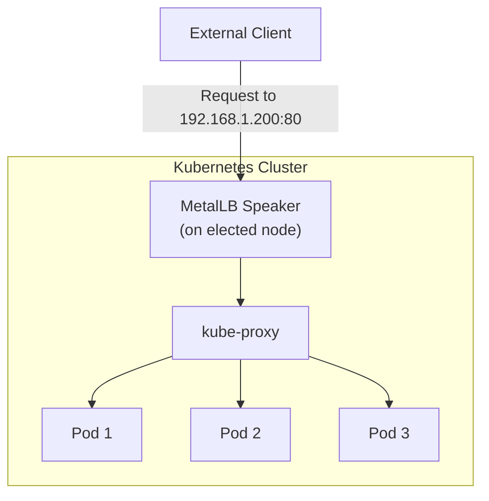
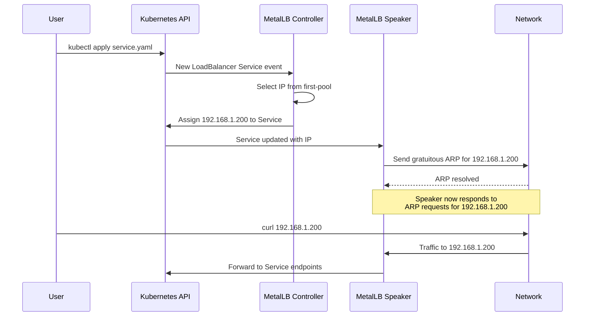

# How to Create a LoadBalancer Service with MetalLB

Author: [nawazdhandala](https://www.github.com/nawazdhandala)

Tags: Kubernetes, MetalLB, LoadBalancer, Service, Tutorial

Description: Step-by-step guide to creating a Kubernetes LoadBalancer service with MetalLB, from deployment to external access verification.

---

In cloud-managed Kubernetes clusters, creating a LoadBalancer service automatically provisions an external load balancer from your cloud provider. On bare-metal clusters, there is no cloud provider to handle this. MetalLB fills that gap by assigning external IP addresses to LoadBalancer services using either Layer 2 or BGP protocols.

This tutorial walks you through creating a complete LoadBalancer service with MetalLB, from deploying an application to verifying external access.

## Architecture Overview

Here is how MetalLB assigns an IP and routes traffic to your service:



## Prerequisites

Before starting, make sure you have:

1. A Kubernetes cluster running on bare metal
2. MetalLB installed and configured
3. At least one IPAddressPool defined
4. At least one L2Advertisement or BGPAdvertisement configured

If you have not set up MetalLB yet, here is a quick installation:

```bash
# Install MetalLB using the official manifests
kubectl apply -f https://raw.githubusercontent.com/metallb/metallb/v0.14.9/config/manifests/metallb-native.yaml

# Wait for MetalLB pods to be ready
kubectl wait --namespace metallb-system \
  --for=condition=ready pod \
  --selector=app=metallb \
  --timeout=120s
```

## Step 1: Create an IPAddressPool

Define the IP range that MetalLB can assign:

```yaml
# ip-pool.yaml
# Define the range of IPs MetalLB can hand out.
# These IPs must be routable on your network and not used by other hosts.
apiVersion: metallb.io/v1beta1
kind: IPAddressPool
metadata:
  name: first-pool
  namespace: metallb-system
spec:
  addresses:
    # Range of 31 IPs for LoadBalancer services
    - 192.168.1.200-192.168.1.230
```

```bash
# Apply the IP pool configuration
kubectl apply -f ip-pool.yaml
```

## Step 2: Create an L2Advertisement

Tell MetalLB to advertise IPs from the pool using Layer 2:

```yaml
# l2-advertisement.yaml
# Enable Layer 2 advertisement for the IP pool.
# MetalLB will respond to ARP requests for assigned IPs.
apiVersion: metallb.io/v1beta1
kind: L2Advertisement
metadata:
  name: l2-advert
  namespace: metallb-system
spec:
  ipAddressPools:
    - first-pool
```

```bash
# Apply the L2 advertisement
kubectl apply -f l2-advertisement.yaml
```

## Step 3: Deploy an Application

Create a simple web application to expose through the LoadBalancer:

```yaml
# deployment.yaml
# Deploy a simple nginx web server with 3 replicas.
# This gives us pods to route traffic to.
apiVersion: apps/v1
kind: Deployment
metadata:
  name: web-app
  namespace: default
  labels:
    app: web-app
spec:
  replicas: 3
  selector:
    matchLabels:
      app: web-app
  template:
    metadata:
      labels:
        app: web-app
    spec:
      containers:
        - name: nginx
          image: nginx:1.27
          ports:
            # Expose port 80 inside the container
            - containerPort: 80
              name: http
          resources:
            requests:
              cpu: 50m
              memory: 64Mi
            limits:
              cpu: 200m
              memory: 128Mi
```

```bash
# Deploy the application
kubectl apply -f deployment.yaml

# Wait for pods to be ready
kubectl wait --for=condition=ready pod -l app=web-app --timeout=60s

# Verify all 3 replicas are running
kubectl get pods -l app=web-app
```

## Step 4: Create the LoadBalancer Service

Now create the Service with type LoadBalancer:

```yaml
# service.yaml
# Create a LoadBalancer service that MetalLB will assign an external IP to.
# Traffic arriving at the external IP on port 80 will be forwarded to the pods.
apiVersion: v1
kind: Service
metadata:
  name: web-app
  namespace: default
spec:
  # This is the key - type LoadBalancer triggers MetalLB
  type: LoadBalancer
  selector:
    # Match the pods from our deployment
    app: web-app
  ports:
    - name: http
      protocol: TCP
      # External port clients connect to
      port: 80
      # Port on the pod to forward to
      targetPort: 80
```

```bash
# Create the LoadBalancer service
kubectl apply -f service.yaml

# Watch the service until it gets an external IP
kubectl get svc web-app --watch
```

You should see output like:

```
NAME      TYPE           CLUSTER-IP    EXTERNAL-IP     PORT(S)        AGE
web-app   LoadBalancer   10.96.12.5    192.168.1.200   80:31234/TCP   3s
```

## Step 5: Verify External Access

Test that the service is accessible from outside the cluster:

```bash
# Test HTTP access using the external IP
curl http://192.168.1.200

# Test with verbose output to see headers
curl -v http://192.168.1.200

# Test from a different machine on the same network
# ssh to another machine and curl the IP
ssh user@another-machine "curl http://192.168.1.200"
```

You should see the default nginx welcome page HTML.

## Step 6: Inspect the Service Details

Look at the full service details to understand what MetalLB configured:

```bash
# Get detailed service information
kubectl describe svc web-app

# Check the endpoints (pod IPs backing the service)
kubectl get endpoints web-app

# View the service in JSON format for all fields
kubectl get svc web-app -o json | jq '.status'
```

The describe output shows important details:

```
Name:                     web-app
Type:                     LoadBalancer
LoadBalancer Ingress:     192.168.1.200
Port:                     http  80/TCP
TargetPort:               80/TCP
NodePort:                 http  31234/TCP
Endpoints:                10.244.1.5:80,10.244.2.3:80,10.244.3.7:80
```



## Exposing Multiple Ports

You can expose multiple ports on a single LoadBalancer service:

```yaml
# multi-port-service.yaml
# Expose both HTTP and HTTPS on the same LoadBalancer IP.
apiVersion: v1
kind: Service
metadata:
  name: web-app-multi
  namespace: default
spec:
  type: LoadBalancer
  selector:
    app: web-app
  ports:
    # HTTP traffic
    - name: http
      protocol: TCP
      port: 80
      targetPort: 80
    # HTTPS traffic
    - name: https
      protocol: TCP
      port: 443
      targetPort: 443
```

## Cleaning Up

To remove the resources created in this tutorial:

```bash
# Delete the service (releases the MetalLB IP)
kubectl delete svc web-app

# Delete the deployment
kubectl delete deployment web-app

# Verify the IP is released
kubectl get svc -A --field-selector spec.type=LoadBalancer
```

## Troubleshooting Common Issues

If your service stays in `Pending` state:

```bash
# Check MetalLB controller logs for errors
kubectl logs -n metallb-system -l component=controller --tail=30

# Check MetalLB speaker logs
kubectl logs -n metallb-system -l component=speaker --tail=30

# Verify your IPAddressPool exists and has available IPs
kubectl get ipaddresspools -n metallb-system

# Verify your advertisement exists
kubectl get l2advertisements -n metallb-system
```

Common causes of Pending services:

1. No IPAddressPool configured
2. No advertisement configured for the pool
3. All IPs in the pool are already assigned
4. MetalLB pods are not running

## Monitoring LoadBalancer Services with OneUptime

Once your LoadBalancer services are running in production, you need to monitor their availability. [OneUptime](https://oneuptime.com) can continuously check your service endpoints, alert you when they become unreachable, and provide uptime dashboards for your bare-metal Kubernetes services. This is especially important for MetalLB setups where network changes can disrupt IP advertisements.
