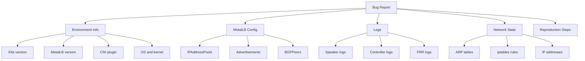
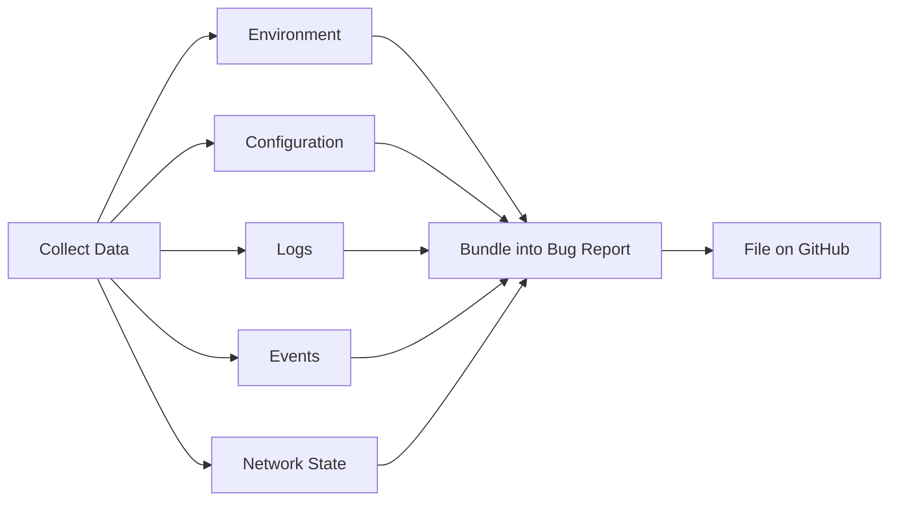

# How to Collect MetalLB Debug Information for Bug Reports

Author: [nawazdhandala](https://www.github.com/nawazdhandala)

Tags: Kubernetes, MetalLB, Debugging, Bug Reports, Logs

Description: Learn what information to collect when filing MetalLB bug reports including logs, events, configuration dumps, and network state.

---

Filing a good MetalLB bug report is the difference between getting help in one reply and going through weeks of back-and-forth. The MetalLB maintainers need specific information to reproduce and diagnose your issue. This guide covers exactly what to collect, how to collect it, and how to organize it for a clear bug report.

## What Maintainers Need

When you file a bug report, the maintainers need to understand three things: what you expected, what actually happened, and the complete state of your environment. The more precise your data, the faster the resolution.



## Step 1: Collect Environment Information

Start with the basics. The MetalLB version and Kubernetes version are critical because behavior changes between releases.

```bash
# Collect Kubernetes cluster version
# Both client and server versions matter for compatibility
kubectl version --output=yaml > /tmp/k8s-version.yaml

# Collect MetalLB version from the running containers
# This shows the exact image tag, not just what you think you deployed
kubectl get deployment -n metallb-system controller \
  -o jsonpath='{.spec.template.spec.containers[*].image}' \
  > /tmp/metallb-version.txt

kubectl get daemonset -n metallb-system speaker \
  -o jsonpath='{.spec.template.spec.containers[*].image}' \
  >> /tmp/metallb-version.txt

# Collect node information including OS, kernel, and container runtime
kubectl get nodes -o wide > /tmp/nodes.txt

# Collect the CNI plugin in use
# The CNI affects how pod networking interacts with MetalLB
kubectl get pods -n kube-system -o wide \
  | grep -E "calico|flannel|cilium|weave|antrea" \
  > /tmp/cni-info.txt
```

## Step 2: Dump MetalLB Configuration

Export every MetalLB custom resource. Missing even one resource can make the bug report incomplete.

```bash
# Export all MetalLB custom resources in one script
# These are the CRDs that define MetalLB's behavior
RESOURCES=(
  "ipaddresspool"
  "l2advertisement"
  "bgpadvertisement"
  "bgppeer"
  "community"
  "bfdprofile"
)

# Loop through each resource type and save the YAML
for resource in "${RESOURCES[@]}"; do
  echo "--- $resource ---" >> /tmp/metallb-config.yaml
  kubectl get "$resource" -n metallb-system -o yaml \
    >> /tmp/metallb-config.yaml 2>/dev/null
done

# Also export the MetalLB controller and speaker deployment specs
# These show any custom arguments or environment variables
kubectl get deployment controller -n metallb-system -o yaml \
  > /tmp/metallb-controller-deploy.yaml
kubectl get daemonset speaker -n metallb-system -o yaml \
  > /tmp/metallb-speaker-ds.yaml
```

## Step 3: Collect Logs

Logs are the most important part of any bug report. Collect logs from all MetalLB components with enough history to cover when the problem started.

```bash
# Collect controller logs with timestamps
# The controller handles IP allocation and configuration validation
kubectl logs -n metallb-system deployment/controller \
  --all-containers \
  --timestamps \
  --since=1h \
  > /tmp/controller-logs.txt

# Collect speaker logs from ALL nodes
# Each speaker pod handles announcements on its respective node
kubectl logs -n metallb-system \
  -l component=speaker \
  --all-containers \
  --timestamps \
  --since=1h \
  > /tmp/speaker-logs.txt

# If using BGP mode with FRR, collect FRR-specific logs
# FRR runs as a sidecar container in the speaker pods
kubectl logs -n metallb-system \
  -l component=speaker \
  -c frr \
  --timestamps \
  --since=1h \
  > /tmp/frr-logs.txt 2>/dev/null

# Collect FRR metrics sidecar logs as well
kubectl logs -n metallb-system \
  -l component=speaker \
  -c frr-metrics \
  --timestamps \
  --since=1h \
  > /tmp/frr-metrics-logs.txt 2>/dev/null
```

## Step 4: Collect Kubernetes Events

Events often reveal errors that do not appear in pod logs, such as failed IP allocations or configuration rejections.

```bash
# Collect events from the metallb-system namespace
# Sort by timestamp to see the chronological order
kubectl get events -n metallb-system \
  --sort-by=.metadata.creationTimestamp \
  > /tmp/metallb-events.txt

# Collect events for the affected service
# Replace "default" and "my-service" with your namespace and service name
kubectl get events -n default \
  --field-selector involvedObject.name=my-service \
  --sort-by=.metadata.creationTimestamp \
  > /tmp/service-events.txt

# Collect events cluster-wide for any MetalLB-related issues
kubectl get events -A \
  --sort-by=.metadata.creationTimestamp \
  | grep -i "metallb\|loadbalancer\|address\|pool" \
  > /tmp/metallb-related-events.txt
```

## Step 5: Collect Network State

The network state on the affected nodes provides crucial context that logs alone cannot capture.

```bash
# Run these commands on the node where the MetalLB speaker is active
# You can use kubectl debug node/ to run them without SSH access

# Collect the ARP table
# This shows whether the LoadBalancer IP has the correct MAC mapping
kubectl debug node/worker-node-1 -it \
  --image=nicolaka/netshoot \
  -- arp -an > /tmp/arp-table.txt

# Collect the IP address list
# Verify the LoadBalancer IP appears on the correct interface
kubectl debug node/worker-node-1 -it \
  --image=nicolaka/netshoot \
  -- ip addr show > /tmp/ip-addresses.txt

# Collect the routing table
kubectl debug node/worker-node-1 -it \
  --image=nicolaka/netshoot \
  -- ip route show > /tmp/routes.txt

# Collect iptables NAT rules related to the service
kubectl debug node/worker-node-1 -it \
  --image=nicolaka/netshoot \
  -- iptables -t nat -L -n -v > /tmp/iptables-nat.txt
```



## Writing the Bug Report

Structure your GitHub issue with these sections:

1. **MetalLB version and Kubernetes version** - from the collected data
2. **Mode** - Layer 2 or BGP
3. **Expected behavior** - what should happen
4. **Actual behavior** - what actually happens, with specific error messages
5. **Configuration** - attach the YAML dumps
6. **Logs** - attach the log files, highlighting the relevant lines
7. **Network state** - attach ARP tables, IP addresses, and routes
8. **Reproduction steps** - the minimal steps to reproduce the issue

## Conclusion

A well-documented bug report with complete debug information dramatically increases the chances of getting a quick resolution. The automated collection script makes it easy to gather everything in one shot. Keep the script handy and run it as soon as you notice an issue, before the logs rotate or the state changes.

Remember that the MetalLB maintainers are volunteers in many cases. Providing thorough, organized debug data shows respect for their time and helps the entire community.

For proactive monitoring that catches MetalLB issues before they become bug reports, consider using [OneUptime](https://oneuptime.com). OneUptime can monitor your LoadBalancer endpoints, track response times, and alert you when MetalLB services degrade, giving you early warning to collect debug data while the problem is still active.
