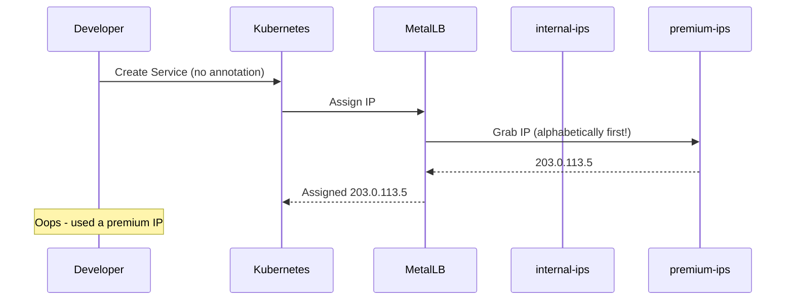
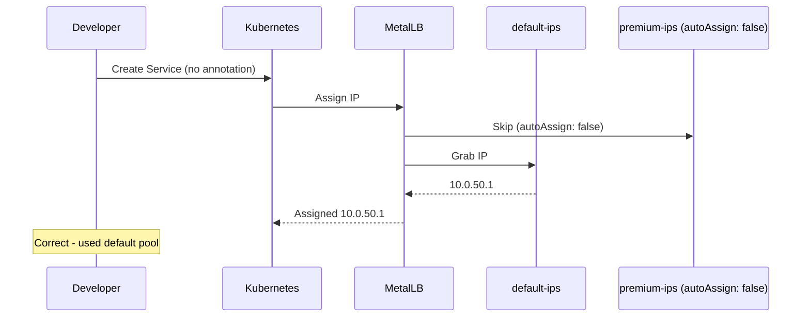

# How to Disable Automatic IP Assignment for Expensive Address Pools in MetalLB

Author: [nawazdhandala](https://www.github.com/nawazdhandala)

Tags: Kubernetes, MetalLB, IP Pools, autoAssign, Configuration

Description: Learn how to disable automatic IP assignment for premium or limited IP pools in MetalLB so that only explicitly requested services get IPs from those pools.

---

> When you have a limited number of expensive public IPs, the last thing you want is a developer deploying a test service that accidentally grabs one. MetalLB's `autoAssign` field lets you lock down premium pools so IPs are only allocated when a service explicitly asks for them.

This guide explains how `autoAssign` works, when to use it, and how to pair it with service annotations for controlled allocation.

---

## The Problem

By default, MetalLB assigns IPs from any available pool to any LoadBalancer service. If you have two pools - one with cheap internal IPs and one with expensive public IPs - an unannotated service might grab a public IP:



---

## How autoAssign Works

The `autoAssign` field on an IPAddressPool controls whether MetalLB will automatically pull IPs from that pool for services that do not specify a pool preference:

| autoAssign Value | Behavior |
|-----------------|----------|
| `true` (default) | MetalLB can assign IPs from this pool to any service |
| `false` | MetalLB only assigns from this pool when explicitly requested |

---

## Creating a Locked-Down Pool

Set `autoAssign: false` on any pool that holds limited or expensive addresses:

```yaml
# pool-premium.yaml
# Premium IP pool - locked down to prevent accidental allocation
apiVersion: metallb.io/v1beta1
kind: IPAddressPool
metadata:
  name: premium-ips
  namespace: metallb-system
spec:
  addresses:
    # Only 4 expensive public IPs
    - 203.0.113.10-203.0.113.13
  # Disable automatic assignment - services must explicitly request this pool
  autoAssign: false
```

And a default pool that handles everything else:

```yaml
# pool-default.yaml
# Default pool - MetalLB assigns from here when no pool is specified
apiVersion: metallb.io/v1beta1
kind: IPAddressPool
metadata:
  name: default-ips
  namespace: metallb-system
spec:
  addresses:
    # Large internal range for general use
    - 10.0.50.0/24
  # autoAssign defaults to true, but we set it explicitly for clarity
  autoAssign: true
```

Apply both:

```bash
# Apply both pool configurations
kubectl apply -f pool-premium.yaml
kubectl apply -f pool-default.yaml
```

---

## Correct Flow With autoAssign Disabled



---

## Requesting the Premium Pool Explicitly

When a service genuinely needs a premium IP, annotate it:

```yaml
# service-production-api.yaml
# Production API that needs a premium public IP
apiVersion: v1
kind: Service
metadata:
  name: production-api
  annotations:
    # Explicitly request an IP from the premium pool
    metallb.universe.tf/address-pool: premium-ips
spec:
  type: LoadBalancer
  selector:
    app: production-api
  ports:
    - port: 443
      targetPort: 8443
      protocol: TCP
```

You can also request a specific IP from the pool:

```yaml
# service-specific-ip.yaml
# Service requesting a specific IP from the premium pool
apiVersion: v1
kind: Service
metadata:
  name: payment-gateway
  annotations:
    metallb.universe.tf/address-pool: premium-ips
spec:
  type: LoadBalancer
  # Request a specific IP from the premium pool
  loadBalancerIP: 203.0.113.11
  selector:
    app: payment-gateway
  ports:
    - port: 443
      targetPort: 8443
      protocol: TCP
```

---

## Verifying the Setup

Confirm that unannotated services use the default pool and annotated services use the premium pool:

```bash
# Deploy a test service without any annotation
kubectl expose deployment test-app --type=LoadBalancer --port=80

# Check the assigned IP - should be from 10.0.50.0/24
kubectl get svc test-app -o jsonpath='{.status.loadBalancer.ingress[0].ip}'

# Check the production service - should be from 203.0.113.10-13
kubectl get svc production-api -o jsonpath='{.status.loadBalancer.ingress[0].ip}'

# View all pools and their autoAssign status
kubectl get ipaddresspool -n metallb-system -o custom-columns=NAME:.metadata.name,AUTO:.spec.autoAssign
```

---

## What Happens When the Default Pool Is Full

If the default pool runs out of IPs, MetalLB will NOT fall back to the premium pool. The service will remain in `Pending` state:

```bash
# A service stuck waiting for an IP
kubectl get svc stuck-service
# NAME            TYPE           CLUSTER-IP    EXTERNAL-IP   PORT(S)
# stuck-service   LoadBalancer   10.96.0.15    <pending>     80:31234/TCP
```

This is the intended behavior - you never want automatic fallback into an expensive pool.

---

## Best Practices

| Practice | Reason |
|----------|--------|
| Always set `autoAssign: false` on premium pools | Prevents accidental consumption of expensive IPs |
| Name your default pool alphabetically first | Makes the allocation order predictable |
| Use RBAC to limit who can add pool annotations | Prevents unauthorized use of premium IPs |
| Monitor pool utilization | Get alerts before you run out of default IPs |

---

## Wrapping Up

The `autoAssign: false` flag is a simple but powerful guard against accidental use of limited IP resources. Combine it with explicit pool annotations on services that genuinely need premium IPs, and your allocation stays predictable.

To monitor IP pool utilization and get alerted before your pools run dry, try **[OneUptime](https://oneuptime.com)** for full Kubernetes infrastructure observability.
