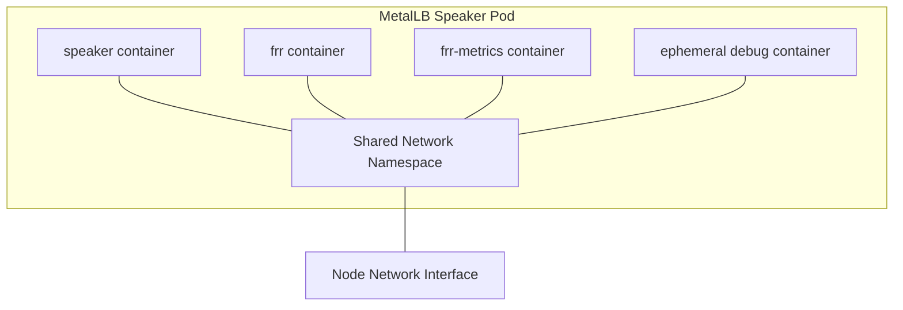
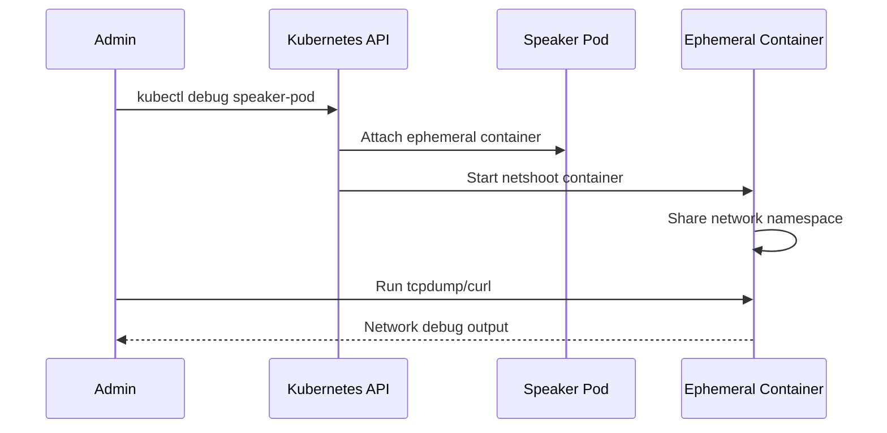
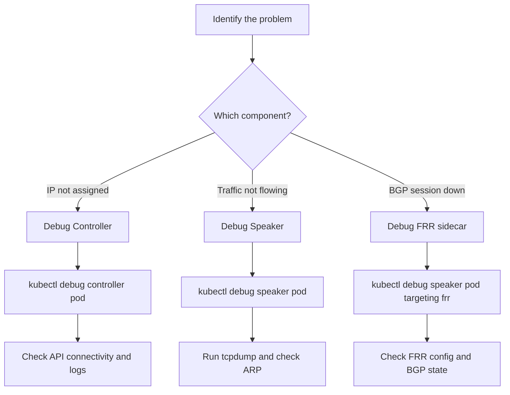

# How to Debug MetalLB Speaker and Controller with Ephemeral Containers

Author: [nawazdhandala](https://www.github.com/nawazdhandala)

Tags: Kubernetes, MetalLB, Ephemeral Containers, Debugging, kubectl

Description: Learn how to use Kubernetes ephemeral containers to debug MetalLB speaker and controller pods without modifying their deployments.

---

MetalLB pods run minimal container images that do not include debugging tools like tcpdump, curl, or nslookup. When you need to inspect network traffic, test connectivity, or examine the runtime environment of a MetalLB speaker or controller pod, Kubernetes ephemeral containers let you attach a fully equipped debug container to the running pod without restarting it or modifying its deployment.

This guide shows you how to use ephemeral containers effectively for MetalLB debugging.

## What Are Ephemeral Containers?

Ephemeral containers are temporary containers that run alongside the existing containers in a pod. They share the pod's namespaces (network, PID, IPC) but have their own filesystem. They are designed specifically for debugging and are removed when the pod is deleted.



The key advantage is that the ephemeral container shares the network namespace with the MetalLB containers. This means you can see the same network interfaces, IP addresses, and connections that the speaker or controller sees.

## Prerequisites

Ephemeral containers require Kubernetes 1.25 or later (where they became stable). Verify your cluster supports them:

```bash
# Check your Kubernetes version
# Ephemeral containers are stable in 1.25+
kubectl version --short

# Verify ephemeral containers are enabled
# This command should not return an error
kubectl debug --help | grep "ephemeral"
```

## Debugging the MetalLB Speaker

The speaker is a DaemonSet that runs on every node. It handles ARP responses (Layer 2) or BGP announcements (BGP mode). Most MetalLB networking issues involve the speaker.

### Identify the Speaker Pod

```bash
# List all speaker pods with their node assignments
# The -o wide flag shows which node each speaker runs on
kubectl get pods -n metallb-system \
  -l component=speaker \
  -o wide

# Example output:
# NAME            READY   STATUS    NODE
# speaker-abc12   4/4     Running   worker-1
# speaker-def34   4/4     Running   worker-2
# speaker-ghi56   4/4     Running   worker-3
```

### Attach a Debug Container to the Speaker

```bash
# Attach an ephemeral container with networking tools
# The netshoot image includes tcpdump, curl, nslookup, iperf, and more
kubectl debug -it \
  -n metallb-system \
  speaker-abc12 \
  --image=nicolaka/netshoot \
  --target=speaker \
  -- /bin/bash

# Explanation of flags:
# -it              : Interactive terminal
# --image          : The debug container image with tools
# --target=speaker : Share the network namespace with the speaker container
# -- /bin/bash     : The command to run in the debug container
```

Once inside the debug container, you have full access to the speaker's network namespace.

### Inspect the Network from Inside the Speaker

```bash
# Inside the ephemeral container:

# Check all network interfaces visible to the speaker
# You should see the node's interfaces, not pod-only interfaces
ip addr show

# Check the ARP table for LoadBalancer IPs
# In Layer 2 mode, the speaker responds to ARP for these IPs
arp -an

# Verify the speaker can reach the Kubernetes API server
# The speaker needs API access to watch services and endpoints
curl -k https://kubernetes.default.svc/healthz

# Check which ports the speaker is listening on
ss -tlnp

# Test connectivity to a specific backend pod
# Replace with your pod's IP and port
curl -v http://10.244.1.15:80
```

### Capture Traffic from the Speaker's Perspective

```bash
# Inside the ephemeral container:

# Capture ARP traffic to see if the speaker is responding to requests
# This is critical for Layer 2 mode debugging
tcpdump -i eth0 arp -nn -vv

# Capture all traffic for a specific LoadBalancer IP
# Replace 192.168.1.240 with your actual LB IP
tcpdump -i any host 192.168.1.240 -nn

# Capture BGP traffic on port 179 for BGP mode debugging
tcpdump -i any port 179 -nn -vv
```



## Debugging the MetalLB Controller

The controller handles IP address allocation from pools to services. If services are not getting IPs assigned, the controller is where to look.

```bash
# Find the controller pod name
kubectl get pods -n metallb-system \
  -l component=controller \
  -o name

# Attach a debug container to the controller
kubectl debug -it \
  -n metallb-system \
  controller-xyz789-abcde \
  --image=nicolaka/netshoot \
  --target=controller \
  -- /bin/bash
```

### Inspect Controller Connectivity

```bash
# Inside the ephemeral container:

# Verify the controller can reach the Kubernetes API
# The controller watches services and manages IP allocations
curl -sk https://kubernetes.default.svc/api/v1/namespaces/metallb-system/configmaps

# Check DNS resolution inside the controller's namespace
nslookup kubernetes.default.svc

# Check if the controller's webhook port is accessible
# The controller runs a webhook server for validating MetalLB resources
ss -tlnp | grep 9443

# Test connectivity to speaker pods
# The controller and speakers communicate through the API server
curl -sk https://kubernetes.default.svc/healthz
```

## Debugging FRR in BGP Mode

When MetalLB uses BGP mode with FRR (Free Range Routing), you can attach to the FRR sidecar container specifically.

```bash
# Attach to the FRR container in the speaker pod
# This lets you inspect the FRR routing daemon directly
kubectl debug -it \
  -n metallb-system \
  speaker-abc12 \
  --image=nicolaka/netshoot \
  --target=frr \
  -- /bin/bash
```

```bash
# Inside the ephemeral container targeting FRR:

# Check FRR's view of BGP neighbors
# The vtysh command connects to FRR's management interface
# Note: vtysh may not be in netshoot, use the FRR container's tools instead
cat /etc/frr/frr.conf

# Check the FRR process status
ps aux | grep -E "bgpd|zebra|bfdd"

# Check the BGP session state by looking at FRR logs
cat /var/log/frr/frr.log | tail -50
```



## Conclusion

Ephemeral containers are the cleanest way to debug MetalLB pods in production. They do not require modifying deployments, rebuilding images, or restarting pods. You get a fully equipped debugging environment that shares the exact network context of the MetalLB components.

The key patterns are: use `--target` to share the network namespace, use `nicolaka/netshoot` for a comprehensive toolset, and use `--share-processes` when you need to inspect the MetalLB processes directly.

For ongoing monitoring of your MetalLB infrastructure without manual debugging, consider [OneUptime](https://oneuptime.com). OneUptime provides automated health checks, uptime monitoring, and alerting for your Kubernetes services, reducing the need for manual debugging sessions and helping you catch issues before they impact users.
