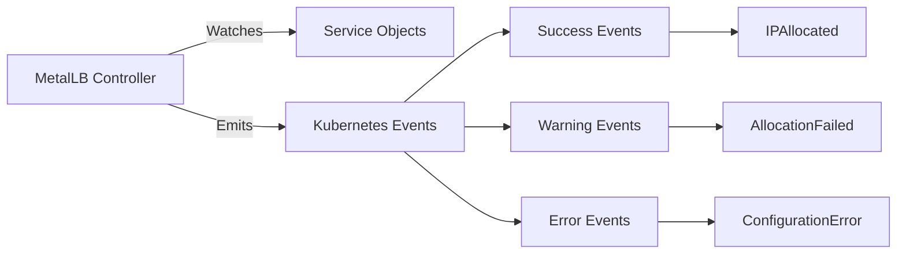
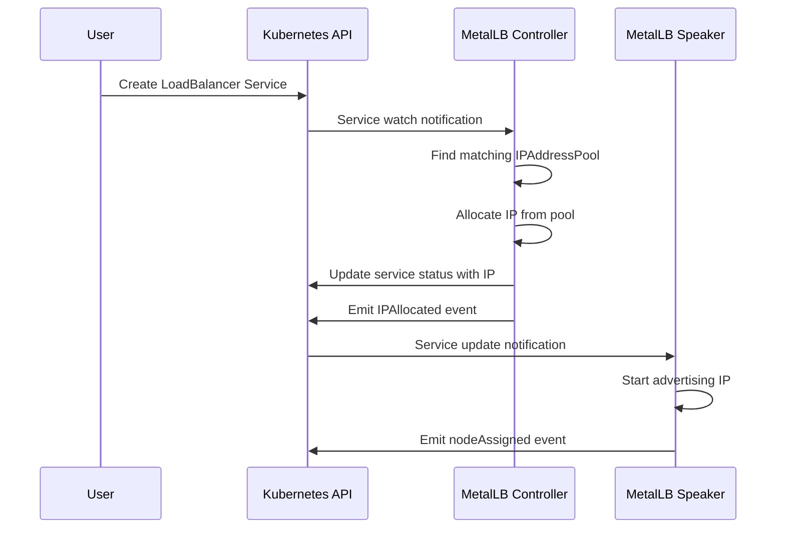

# How to Check MetalLB Events on a Service with kubectl describe

Author: [nawazdhandala](https://www.github.com/nawazdhandala)

Tags: Kubernetes, MetalLB, Events, kubectl, Debugging

Description: Learn how to use kubectl describe to check MetalLB events on LoadBalancer services for troubleshooting IP assignment and advertisement issues.

---

When MetalLB assigns or fails to assign an IP to a LoadBalancer service, it records events on the service object. These events are your first line of defense when debugging MetalLB issues. This post explains what events to look for and how to interpret them.

## Why Events Matter

MetalLB communicates its decisions through Kubernetes events. Whether it successfully assigns an IP, fails because the pool is exhausted, or cannot advertise an address, it tells you through events attached to the service.



## Checking Events with kubectl describe

The simplest way to see MetalLB events is to describe the service:

```bash
# Describe the service to see all events including MetalLB allocations
kubectl describe svc my-service
```

The output includes an `Events` section at the bottom:

```
Events:
  Type    Reason        Age   From                Message
  ----    ------        ----  ----                -------
  Normal  IPAllocated   2m    metallb-controller  Assigned IP ["192.168.1.100"]
  Normal  nodeAssigned  2m    metallb-speaker     announcing from node "worker-1" with protocol "layer2"
```

## Understanding MetalLB Event Types

MetalLB emits several types of events. Here is a breakdown of the most common ones:

### Successful Allocation Events

When MetalLB assigns an IP successfully, you see:

```
# Normal event indicating successful IP assignment
Type: Normal
Reason: IPAllocated
From: metallb-controller
Message: Assigned IP ["192.168.1.100"]
```

For L2 mode, the speaker also announces which node is advertising:

```
# Normal event indicating the node that will respond to ARP/NDP requests
Type: Normal
Reason: nodeAssigned
From: metallb-speaker
Message: announcing from node "worker-1" with protocol "layer2"
```

### Failed Allocation Events

When allocation fails, MetalLB emits warning events:

```
# Warning event when no IP addresses are available in the matching pools
Type: Warning
Reason: AllocationFailed
From: metallb-controller
Message: Failed to allocate IP for "default/my-service": no available IPs
```

### Configuration-Related Events

If your MetalLB configuration has issues:

```
# Warning when the service references a pool that does not exist
Type: Warning
Reason: AllocationFailed
From: metallb-controller
Message: Failed to allocate IP for "default/my-service": no matching IPAddressPool
```

## Event Flow Diagram

The following diagram shows the sequence of events during a typical service creation:



## Filtering Events by Source

To see only MetalLB events across all services:

```bash
# Filter events to show only those from MetalLB components
kubectl get events -A --field-selector source=metallb-controller

# Show events from the MetalLB speaker component
kubectl get events -A --field-selector source=metallb-speaker
```

## Filtering Events by Type

To find only warning or error events:

```bash
# Show only warning events from MetalLB - these indicate problems
kubectl get events -A --field-selector type=Warning,source=metallb-controller
```

## Watching Events in Real Time

When debugging, watch events as they happen:

```bash
# Watch MetalLB events in real time as they are emitted
kubectl get events -A --watch --field-selector source=metallb-controller
```

This is useful when you are applying configuration changes and want to see MetalLB react.

## Common Event Patterns and Fixes

### Pattern: No Available IPs

```
Warning  AllocationFailed  metallb-controller  Failed to allocate IP: no available IPs
```

**Fix**: Your IP pool is exhausted. Either free up IPs by deleting unused services or expand the pool.

```bash
# Check how many IPs are currently allocated from the pool
kubectl get svc -A -o json | jq '[
  .items[] |
  select(.spec.type == "LoadBalancer") |
  .status.loadBalancer.ingress[]?.ip
] | length'
```

### Pattern: No Matching Pool

```
Warning  AllocationFailed  metallb-controller  no matching IPAddressPool
```

**Fix**: Check that your `IPAddressPool` resources exist and that any `metallb.io/address-pool` annotation on your service matches a real pool name.

```bash
# List all configured IP address pools
kubectl get ipaddresspool -n metallb-system

# Check what pool the service is requesting
kubectl get svc my-service -o jsonpath='{.metadata.annotations}'
```

### Pattern: IP Already In Use

```
Warning  AllocationFailed  metallb-controller  "192.168.1.100" is already in use
```

**Fix**: Another service holds this IP. Find and release it, or choose a different IP.

```bash
# Find the service currently using the contested IP address
kubectl get svc -A -o json | jq -r '
  .items[] |
  select(.status.loadBalancer.ingress != null) |
  select(.status.loadBalancer.ingress[].ip == "192.168.1.100") |
  "\(.metadata.namespace)/\(.metadata.name)"
'
```

## Checking Events Programmatically

For automation or scripting, extract events in JSON format:

```bash
# Get MetalLB events as JSON for programmatic processing
kubectl get events -A \
  --field-selector source=metallb-controller \
  -o json | jq '.items[] | {
    namespace: .involvedObject.namespace,
    service: .involvedObject.name,
    reason: .reason,
    message: .message,
    time: .lastTimestamp
  }'
```

## Event Retention

Kubernetes events have a default TTL of one hour. If you need longer retention, consider:

```bash
# Check the current event TTL setting on the API server
# This is set via --event-ttl flag on kube-apiserver
# Default is 1h

# Export events before they expire for later analysis
kubectl get events -A --field-selector source=metallb-controller -o yaml > metallb-events-backup.yaml
```

## Monitoring Events with OneUptime

While `kubectl describe` is great for manual debugging, you need continuous monitoring to catch MetalLB issues before they affect users. [OneUptime](https://oneuptime.com) can monitor your Kubernetes services for availability, detect when LoadBalancer IPs become unresponsive, and alert your team immediately. Setting up endpoint monitors for each MetalLB-backed service ensures you catch allocation failures and advertisement problems the moment they occur.
