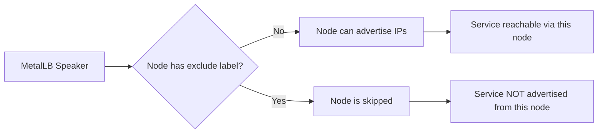
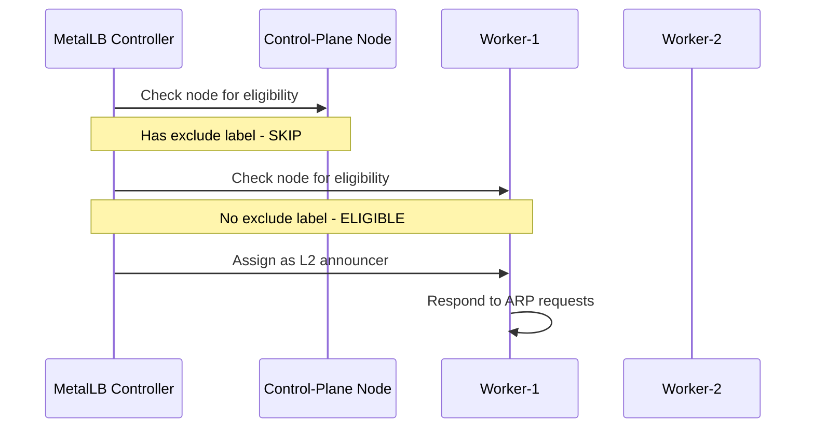
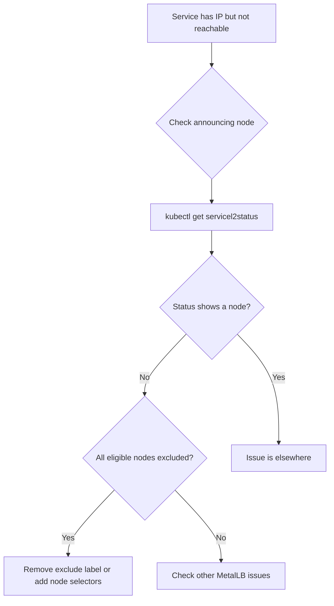

# How to Fix MetalLB exclude-from-external-load-balancers Label Issue

Author: [nawazdhandala](https://www.github.com/nawazdhandala)

Tags: Kubernetes, MetalLB, Labels, Troubleshooting, Node Exclusion

Description: Learn how the node.kubernetes.io/exclude-from-external-load-balancers label affects MetalLB and how to handle it.

---

The `node.kubernetes.io/exclude-from-external-load-balancers` label is a standard Kubernetes label that tells load balancer implementations to skip certain nodes. MetalLB respects this label, which means nodes with this label will not advertise LoadBalancer IPs. This post explains when this label appears, how it affects MetalLB, and how to handle it.

## What This Label Does

When a node has the label `node.kubernetes.io/exclude-from-external-load-balancers` set to any value, MetalLB will not select that node for L2 announcements or BGP route advertisements.



## When This Label Gets Added

Kubernetes automatically adds this label to control-plane nodes starting with Kubernetes v1.24. You can also manually add it to any node you want to exclude.

```bash
# Check which nodes have the exclude label
kubectl get nodes -L node.kubernetes.io/exclude-from-external-load-balancers
```

Example output:

```
NAME            STATUS   ROLES           AGE   VERSION   EXCLUDE-FROM-EXTERNAL-LOAD-BALANCERS
control-plane   Ready    control-plane   30d   v1.29.0   true
worker-1        Ready    worker          30d   v1.29.0
worker-2        Ready    worker          30d   v1.29.0
```

## How MetalLB Uses This Label

MetalLB checks this label when deciding which nodes can announce services. The behavior differs slightly between L2 and BGP modes.

### L2 Mode

In L2 mode, MetalLB selects a single node to respond to ARP/NDP requests. If the best candidate node has the exclude label, MetalLB skips it and selects the next eligible node.



### BGP Mode

In BGP mode, MetalLB advertises routes from all eligible nodes. Nodes with the exclude label will not establish BGP sessions for LoadBalancer service routes.

## The Problem in Small Clusters

In single-node or two-node clusters where the control-plane also serves as a worker, the exclude label can prevent MetalLB from functioning entirely.

```bash
# In a single-node cluster, check if the only node has the label
kubectl get nodes --show-labels | grep exclude-from-external
```

If your only node is excluded, no services will be reachable through MetalLB.

## Fix 1: Remove the Label

If you want a node to participate in MetalLB advertisements, remove the label:

```bash
# Remove the exclude label from a specific node
kubectl label node control-plane \
  node.kubernetes.io/exclude-from-external-load-balancers-

# Remove from all control-plane nodes
kubectl label nodes -l node-role.kubernetes.io/control-plane \
  node.kubernetes.io/exclude-from-external-load-balancers-
```

Note the trailing `-` which removes the label.

**Important**: Kubernetes may re-add this label during upgrades or when the node controller reconciles. To prevent this, you may need to address the root cause in your cluster configuration.

## Fix 2: Use Node Selectors in Advertisements

Instead of relying on the exclude label, explicitly define which nodes should advertise:

```yaml
# l2advertisement.yaml
# Explicitly select nodes that should advertise LoadBalancer IPs
apiVersion: metallb.io/v1beta1
kind: L2Advertisement
metadata:
  name: explicit-nodes
  namespace: metallb-system
spec:
  ipAddressPools:
    - default-pool
  # Use node selectors to pick specific nodes
  nodeSelectors:
    - matchLabels:
        # Only nodes with this custom label will advertise
        metallb-advertise: "true"
```

Then label the nodes you want:

```bash
# Label nodes that should participate in MetalLB advertisements
kubectl label node worker-1 metallb-advertise=true
kubectl label node worker-2 metallb-advertise=true

# If you want control-plane to advertise too
kubectl label node control-plane metallb-advertise=true
```

## Fix 3: Prevent Kubernetes from Adding the Label

On some managed Kubernetes distributions, you can configure the node lifecycle controller to not add this label. However, this is cluster-level configuration and may not be available in all environments.

For kubeadm clusters, check the controller-manager flags:

```bash
# Check if the node lifecycle controller is configured
kubectl get pods -n kube-system -l component=kube-controller-manager \
  -o jsonpath='{.items[0].spec.containers[0].command}' | tr ',' '\n' | grep node
```

## Checking if the Label Is Causing Your Issue

Here is a diagnostic flow to determine if this label is your problem:



```bash
# Quick check: list all nodes and their exclude label status
kubectl get nodes -o custom-columns=\
NAME:.metadata.name,\
ROLES:.metadata.labels.node-role\\.kubernetes\\.io/control-plane,\
EXCLUDED:.metadata.labels.node\\.kubernetes\\.io/exclude-from-external-load-balancers

# Check if MetalLB has any eligible nodes for a service
kubectl describe svc my-service | grep -A 5 Events
```

## Verifying the Fix

After removing the label or adjusting node selectors:

```bash
# Confirm the label is removed
kubectl get nodes -L node.kubernetes.io/exclude-from-external-load-balancers

# Check if the speaker is now announcing from the node
kubectl get servicel2status -A

# Test service reachability
SVC_IP=$(kubectl get svc my-service -o jsonpath='{.status.loadBalancer.ingress[0].ip}')
curl --connect-timeout 5 "http://$SVC_IP"
```

## Impact on Existing Services

When you remove the exclude label from a node, MetalLB re-evaluates all service assignments. This may cause:

- L2 services to move to the newly eligible node (brief traffic interruption during gratuitous ARP)
- BGP services to add the new node as an additional advertiser (no interruption)

```bash
# Watch for service reassignments after label changes
kubectl get servicel2status -A --watch
```

## Monitoring with OneUptime

Node label changes can cause transient connectivity issues as MetalLB reassigns service advertisements. [OneUptime](https://oneuptime.com) provides continuous monitoring of your MetalLB-backed services, alerting you the moment a service becomes unreachable during node transitions. With incident tracking and status pages, your team can coordinate responses and keep users informed when infrastructure changes affect service availability.
