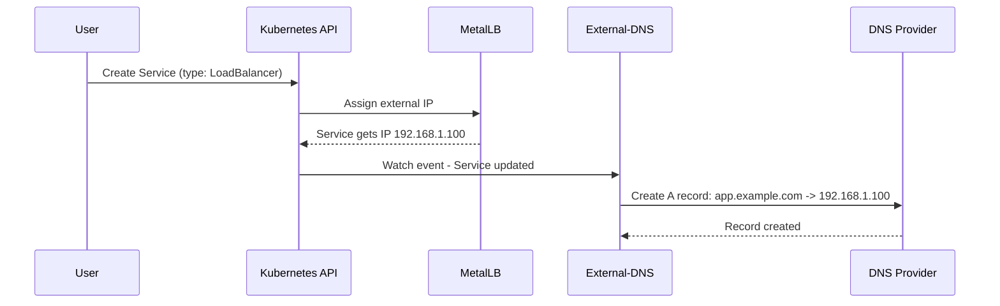
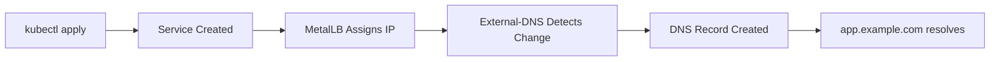

# How to Integrate MetalLB with External-DNS for Automatic DNS Records

Author: [nawazdhandala](https://www.github.com/nawazdhandala)

Tags: Kubernetes, MetalLB, External-DNS, DNS, Automation

Description: Learn how to use External-DNS with MetalLB to automatically create DNS records when LoadBalancer services are created.

---

When you create a LoadBalancer service on bare-metal Kubernetes, MetalLB assigns an IP address from your configured pool. But you still need to create DNS records manually so users can reach your service by name. External-DNS solves this by automatically creating DNS records in your DNS provider whenever a Kubernetes service gets an external IP.

This post shows you how to integrate MetalLB with External-DNS so that DNS records are created and removed automatically.

## How the Integration Works

External-DNS watches Kubernetes resources (Services, Ingresses) for annotations that specify desired DNS names. When MetalLB assigns an IP to a LoadBalancer service, External-DNS picks up the annotation and creates the corresponding DNS record in your DNS provider.



## Prerequisites

Before you begin, make sure you have:

- A Kubernetes cluster with MetalLB installed and configured
- Access to a DNS provider supported by External-DNS (Cloudflare, AWS Route53, Google Cloud DNS, and others)
- API credentials for your DNS provider
- kubectl access to your cluster

## Installing External-DNS

We will use Helm to install External-DNS. This example uses Cloudflare as the DNS provider, but the process is similar for other providers.

### Step 1: Create a Secret for DNS Provider Credentials

```yaml
# cloudflare-secret.yaml
# Store your Cloudflare API token securely in a Kubernetes secret.
apiVersion: v1
kind: Secret
metadata:
  name: cloudflare-api-token
  namespace: external-dns
type: Opaque
stringData:
  # Replace with your actual Cloudflare API token
  cloudflare_api_token: "your-cloudflare-api-token-here"
```

```bash
# Create the namespace and the secret
kubectl create namespace external-dns
kubectl apply -f cloudflare-secret.yaml
```

### Step 2: Install External-DNS via Helm

```bash
# Add the External-DNS Helm repository
helm repo add external-dns https://kubernetes-sigs.github.io/external-dns/
helm repo update

# Install External-DNS with Cloudflare configuration
helm install external-dns external-dns/external-dns \
  --namespace external-dns \
  --set provider.name=cloudflare \
  --set env[0].name=CF_API_TOKEN \
  --set env[0].valueFrom.secretKeyRef.name=cloudflare-api-token \
  --set env[0].valueFrom.secretKeyRef.key=cloudflare_api_token \
  --set policy=sync \
  --set sources[0]=service \
  --set sources[1]=ingress \
  --set txtOwnerId=my-cluster \
  --set domainFilters[0]=example.com
```

The key flags explained:

- `policy=sync` - External-DNS will create and delete records as needed
- `sources` - Watch both Services and Ingresses for DNS annotations
- `txtOwnerId` - Prevents conflicts when multiple clusters manage the same DNS zone
- `domainFilters` - Only manage records under example.com

### Step 3: Verify External-DNS Is Running

```bash
# Check that External-DNS pods are running
kubectl get pods -n external-dns

# Check the logs for any errors
kubectl logs -n external-dns -l app.kubernetes.io/name=external-dns
```

## Creating a Service with Automatic DNS

Now that External-DNS is running, create a LoadBalancer service with the annotation that tells External-DNS which DNS name to create:

```yaml
# app-service.yaml
# This service gets an IP from MetalLB and a DNS record from External-DNS.
apiVersion: v1
kind: Service
metadata:
  name: my-web-app
  namespace: default
  annotations:
    # Tell External-DNS to create this DNS record
    external-dns.alpha.kubernetes.io/hostname: "app.example.com"
    # Optionally set a custom TTL for the DNS record
    external-dns.alpha.kubernetes.io/ttl: "300"
spec:
  type: LoadBalancer
  selector:
    app: my-web-app
  ports:
    - port: 80
      targetPort: 8080
      protocol: TCP
```

```bash
# Apply the service
kubectl apply -f app-service.yaml

# Watch MetalLB assign an IP
kubectl get svc my-web-app -w
```

After a few seconds, MetalLB assigns an IP and External-DNS creates the DNS record:



## Multiple DNS Names for One Service

You can assign multiple DNS names to a single service by using a comma-separated list:

```yaml
# multi-dns-service.yaml
# Assign multiple DNS names to the same LoadBalancer IP.
apiVersion: v1
kind: Service
metadata:
  name: multi-domain-app
  namespace: default
  annotations:
    # Create records for both names pointing to the same IP
    external-dns.alpha.kubernetes.io/hostname: >-
      app.example.com,www.example.com
spec:
  type: LoadBalancer
  selector:
    app: multi-domain-app
  ports:
    - port: 443
      targetPort: 8443
      protocol: TCP
```

## Using External-DNS with Ingress

If you use an Ingress controller fronted by MetalLB, External-DNS can also create records based on Ingress resources:

```yaml
# ingress-with-dns.yaml
# External-DNS reads the host field and creates DNS records automatically.
apiVersion: networking.k8s.io/v1
kind: Ingress
metadata:
  name: my-ingress
  namespace: default
  annotations:
    # External-DNS will use the host field to create DNS records
    external-dns.alpha.kubernetes.io/ttl: "300"
spec:
  ingressClassName: nginx
  rules:
    # External-DNS creates an A record for this hostname
    - host: app.example.com
      http:
        paths:
          - path: /
            pathType: Prefix
            backend:
              service:
                name: my-web-app
                port:
                  number: 80
```

## DNS Provider Examples

### AWS Route53

```bash
# Install External-DNS for Route53
helm install external-dns external-dns/external-dns \
  --namespace external-dns \
  --set provider.name=aws \
  --set policy=sync \
  --set sources[0]=service \
  --set sources[1]=ingress \
  --set domainFilters[0]=example.com \
  --set txtOwnerId=my-cluster
```

Make sure the node IAM role or IRSA has permissions to modify Route53 hosted zones.

### Google Cloud DNS

```bash
# Install External-DNS for Google Cloud DNS
helm install external-dns external-dns/external-dns \
  --namespace external-dns \
  --set provider.name=google \
  --set google.project=my-gcp-project \
  --set policy=sync \
  --set sources[0]=service \
  --set domainFilters[0]=example.com
```

## Verifying DNS Records

After creating a service, verify that the DNS record was created:

```bash
# Check if External-DNS created the record
kubectl logs -n external-dns -l app.kubernetes.io/name=external-dns | grep app.example.com

# Verify DNS resolution
dig app.example.com +short

# You should see the MetalLB-assigned IP
# 192.168.1.100
```

## Cleanup Behavior

When you delete a LoadBalancer service, External-DNS automatically removes the DNS record (when using `policy=sync`):

```bash
# Delete the service
kubectl delete svc my-web-app

# External-DNS will remove the DNS record within its sync interval
# Check the logs to confirm
kubectl logs -n external-dns -l app.kubernetes.io/name=external-dns --tail=20
```

## Troubleshooting

Common issues and how to fix them:

1. **DNS record not created** - Check External-DNS logs for permission errors with your DNS provider
2. **Wrong IP in DNS record** - Make sure MetalLB has assigned the IP before External-DNS syncs
3. **Record not deleted on service removal** - Verify `policy=sync` is set, not `policy=upsert-only`
4. **Duplicate records** - Set a unique `txtOwnerId` per cluster to prevent conflicts

## Summary

Integrating MetalLB with External-DNS eliminates the manual step of creating DNS records for your bare-metal LoadBalancer services. Every time MetalLB assigns an IP, External-DNS automatically creates the corresponding DNS record. This makes your deployment pipeline fully automated from service creation to DNS resolution.

For monitoring the health of these DNS records and the services behind them, consider using [OneUptime](https://oneuptime.com). OneUptime can monitor your endpoints by hostname, alert you when DNS resolution fails, and provide status pages that keep your users informed about service availability.
