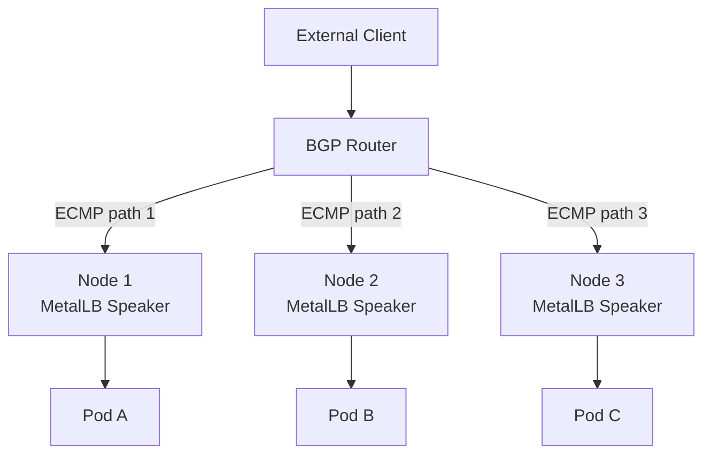
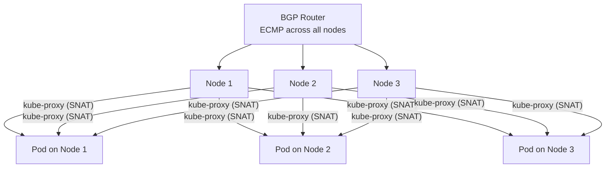
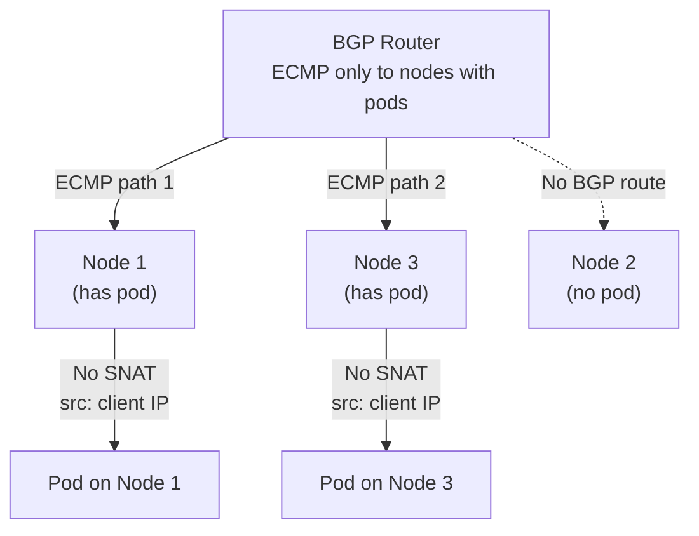
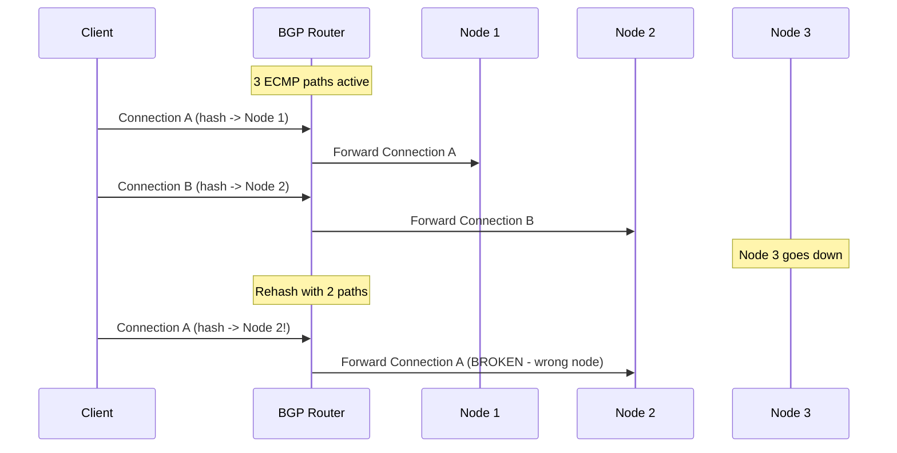

# How to Configure External Traffic Policy with MetalLB BGP Mode

Author: [nawazdhandala](https://www.github.com/nawazdhandala)

Tags: Kubernetes, MetalLB, External Traffic Policy, BGP, ECMP

Description: Learn how externalTrafficPolicy interacts with MetalLB BGP mode and ECMP load balancing for optimal traffic distribution.

---

MetalLB BGP mode works fundamentally differently from Layer 2 mode. Instead of a single leader node handling all traffic, BGP mode advertises routes to an upstream router, which then distributes traffic across multiple nodes using ECMP (Equal-Cost Multi-Path) routing. This changes how `externalTrafficPolicy` impacts your services.

This post explains the interaction between BGP mode, ECMP, and both traffic policy options.

## How BGP Mode Distributes Traffic

In BGP mode, each MetalLB speaker establishes a BGP session with your router and advertises the service VIP. The router sees multiple next-hops for the same IP and uses ECMP to spread traffic across them:



This is a major advantage over L2 mode. Traffic is distributed by the router before it even reaches the cluster, avoiding the single-node bottleneck.

## BGP Configuration Basics

Before exploring traffic policies, here is the BGP setup for reference:

```yaml
# bgp-peer.yaml
# Configure the BGP peer (your upstream router).
# MetalLB speakers will establish BGP sessions with this router.
apiVersion: metallb.io/v1beta2
kind: BGPPeer
metadata:
  name: router-peer
  namespace: metallb-system
spec:
  # Your router's IP address
  peerAddress: 192.168.1.1
  # Your router's AS number
  peerASN: 64501
  # MetalLB's AS number (must be different from router's)
  myASN: 64500
  # Source address for BGP sessions (optional)
  sourceAddress: 192.168.1.31
---
# bgp-advertisement.yaml
# Advertise IPs from the pool via BGP.
apiVersion: metallb.io/v1beta1
kind: BGPAdvertisement
metadata:
  name: bgp-advert
  namespace: metallb-system
spec:
  ipAddressPools:
    - production-pool
```

## Cluster Policy with BGP Mode

With `externalTrafficPolicy: Cluster` in BGP mode:

1. The router distributes traffic across all nodes via ECMP
2. Each node can forward traffic to pods on any node
3. kube-proxy performs SNAT, hiding the client source IP
4. Traffic distribution is very even

```yaml
# bgp-service-cluster.yaml
# Cluster policy with BGP mode gives the best traffic distribution.
# All nodes advertise the VIP, and any node can forward to any pod.
apiVersion: v1
kind: Service
metadata:
  name: api-server
  namespace: default
spec:
  type: LoadBalancer
  externalTrafficPolicy: Cluster
  selector:
    app: api-server
  ports:
    - name: http
      protocol: TCP
      port: 80
      targetPort: 8080
```



This gives excellent traffic distribution but at the cost of losing the client source IP.

## Local Policy with BGP Mode

With `externalTrafficPolicy: Local` in BGP mode, the behavior changes significantly:

1. The router distributes traffic across nodes via ECMP
2. Each node only forwards to local pods (no cross-node forwarding)
3. No SNAT - client source IP is preserved
4. Nodes without pods do not advertise the route

The key difference from L2 mode is that MetalLB BGP speakers on nodes without matching pods will withdraw their BGP route. The router then only sends traffic to nodes that have pods:

```yaml
# bgp-service-local.yaml
# Local policy with BGP preserves client source IP.
# Only nodes with pods will advertise the VIP via BGP.
apiVersion: v1
kind: Service
metadata:
  name: api-server-local
  namespace: default
spec:
  type: LoadBalancer
  externalTrafficPolicy: Local
  selector:
    app: api-server
  ports:
    - name: http
      protocol: TCP
      port: 80
      targetPort: 8080
```



## ECMP and Session Affinity

A consideration with BGP ECMP is that routers hash traffic to distribute it. When the set of next-hops changes (for example, a node goes down), the router may rehash existing connections to different nodes, breaking active sessions.



To mitigate this, use resilient ECMP on your router if supported, or configure session affinity:

```yaml
# service-with-affinity.yaml
# Use session affinity to keep client connections on the same pod.
apiVersion: v1
kind: Service
metadata:
  name: stateful-api
  namespace: default
spec:
  type: LoadBalancer
  externalTrafficPolicy: Local
  # Session affinity keeps the same client on the same pod
  sessionAffinity: ClientIP
  sessionAffinityConfig:
    clientIP:
      # Timeout for the affinity in seconds
      timeoutSeconds: 10800
  selector:
    app: stateful-api
  ports:
    - name: http
      port: 80
      targetPort: 8080
```

## Controlling Which Nodes Advertise via BGP

You can control which nodes participate in BGP advertisement using node selectors:

```yaml
# targeted-bgp-advertisement.yaml
# Only advertise from nodes labeled as edge nodes.
# This limits ECMP paths to specific nodes.
apiVersion: metallb.io/v1beta1
kind: BGPAdvertisement
metadata:
  name: edge-bgp
  namespace: metallb-system
spec:
  ipAddressPools:
    - production-pool
  nodeSelectors:
    - matchLabels:
        # Only nodes with this label will participate
        node-role: edge
```

Label your edge nodes:

```bash
# Label nodes that should participate in BGP advertisement
kubectl label node node-1 node-role=edge
kubectl label node node-3 node-role=edge

# Verify labels
kubectl get nodes --show-labels | grep edge
```

## Comparing Traffic Policies in BGP Mode

| Aspect | Cluster Policy | Local Policy |
|--------|---------------|--------------|
| Traffic distribution | Very even (ECMP + kube-proxy) | Even across nodes with pods only |
| Client source IP | Hidden (SNAT) | Preserved |
| Network hops | May cross nodes | Stays on receiving node |
| BGP route withdrawal | All nodes advertise always | Nodes without pods withdraw |
| Pod scheduling impact | None | Must ensure pods on advertising nodes |
| Resilience | Higher (any node can serve) | Lower (depends on pod placement) |

## Verifying BGP Sessions and Routes

Check your BGP setup and route advertisements:

```bash
# Check MetalLB speaker BGP session status
kubectl logs -n metallb-system -l component=speaker --tail=30 | grep -i bgp

# On your router, check BGP neighbors (example for FRRouting)
# vtysh -c "show bgp ipv4 unicast neighbors"

# Check which routes are being advertised
# vtysh -c "show bgp ipv4 unicast"

# Verify ECMP paths on the router
# vtysh -c "show ip route 192.168.1.200"
```

## Choosing the Right Policy for BGP Mode

For most BGP deployments:

- Use **Cluster** policy when you need maximum availability and even distribution
- Use **Local** policy when you need the real client source IP (for logging, rate limiting, or security)
- Combine **Local** policy with topology spread constraints to ensure pods exist on advertising nodes

## Monitoring BGP Health with OneUptime

BGP sessions can flap, routes can be withdrawn unexpectedly, and ECMP rehashing can break connections. [OneUptime](https://oneuptime.com) provides continuous monitoring of your service endpoints across all BGP paths, alerts you when a BGP session goes down, and tracks service availability from multiple vantage points to catch ECMP-related issues before they impact your users.
