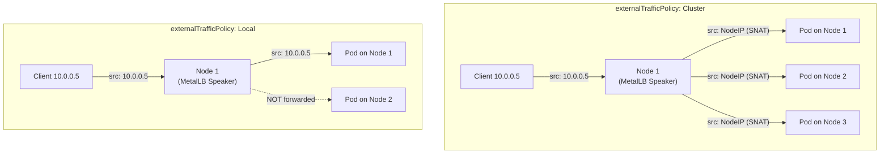
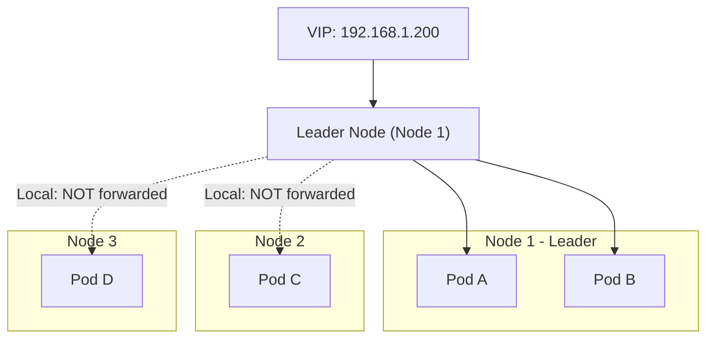

# How to Configure External Traffic Policy with MetalLB Layer 2 Mode

Author: [nawazdhandala](https://www.github.com/nawazdhandala)

Tags: Kubernetes, MetalLB, External Traffic Policy, Layer 2, Source IP

Description: Learn how externalTrafficPolicy affects MetalLB Layer 2 mode behavior including client source IP preservation and traffic distribution.

---

When you create a LoadBalancer service in Kubernetes, the `externalTrafficPolicy` field controls how external traffic is routed to pods. This setting has significant implications when using MetalLB in Layer 2 mode, affecting client source IP visibility, traffic distribution, and failover behavior.

This post explains both policy options - `Cluster` and `Local` - and how each one interacts with MetalLB L2 mode.

## Understanding externalTrafficPolicy

The `externalTrafficPolicy` field has two possible values:

- **Cluster** (default): Traffic can be routed to pods on any node. kube-proxy performs SNAT, which hides the client source IP.
- **Local**: Traffic is only routed to pods on the node receiving the traffic. The client source IP is preserved.



## Cluster Policy (Default)

With `externalTrafficPolicy: Cluster`, traffic flows like this:

1. Client sends a request to the MetalLB VIP
2. MetalLB Speaker on the elected node receives the traffic
3. kube-proxy forwards the traffic to any pod in the cluster
4. kube-proxy performs SNAT (source NAT), replacing the client IP with the node IP
5. The pod sees the node IP as the source, not the client IP

```yaml
# service-cluster-policy.yaml
# Default behavior - traffic distributed across all nodes.
# Client source IP will be masked by SNAT.
apiVersion: v1
kind: Service
metadata:
  name: web-cluster
  namespace: default
spec:
  type: LoadBalancer
  # Cluster is the default, shown here for clarity
  externalTrafficPolicy: Cluster
  selector:
    app: web-app
  ports:
    - name: http
      protocol: TCP
      port: 80
      targetPort: 8080
```

### Pros of Cluster Policy

- Even traffic distribution across all pods regardless of node placement
- No risk of traffic loss if the leader node has no local pods
- Simpler to reason about for most workloads

### Cons of Cluster Policy

- Client source IP is hidden (replaced by node IP via SNAT)
- Extra network hop when traffic crosses nodes
- Cannot use client IP for rate limiting, geo-location, or access control

## Local Policy

With `externalTrafficPolicy: Local`, traffic flows differently:

1. Client sends a request to the MetalLB VIP
2. MetalLB Speaker on the elected node receives the traffic
3. kube-proxy only forwards to pods on the same node
4. No SNAT is performed - the client source IP is preserved
5. The pod sees the real client IP

```yaml
# service-local-policy.yaml
# Traffic only goes to pods on the receiving node.
# Client source IP is preserved - no SNAT.
apiVersion: v1
kind: Service
metadata:
  name: web-local
  namespace: default
spec:
  type: LoadBalancer
  # Local policy preserves client source IP
  externalTrafficPolicy: Local
  selector:
    app: web-app
  ports:
    - name: http
      protocol: TCP
      port: 80
      targetPort: 8080
```

### Pros of Local Policy

- Client source IP is preserved
- No extra network hops for traffic
- Enables client-based rate limiting, geo-location, and access control
- Lower latency since traffic stays on the same node

### Cons of Local Policy

- Uneven traffic distribution if pods are not evenly spread
- Risk of downtime if the leader node has no local pods
- Requires careful pod scheduling

## L2 Mode and the Leader Election Problem

In MetalLB L2 mode, only one node (the leader) handles all traffic for a given VIP. This creates an important interaction with `externalTrafficPolicy: Local`:



With `Local` policy, only pods on the leader node receive traffic. If the leader node has no pods for the service, clients get connection failures.

## Handling the Leader Node Problem

To avoid the problem of no pods on the leader node, use pod anti-affinity or topology spread constraints:

```yaml
# deployment-with-spread.yaml
# Ensure pods are spread across nodes so the MetalLB leader
# node always has at least one pod.
apiVersion: apps/v1
kind: Deployment
metadata:
  name: web-app
  namespace: default
spec:
  replicas: 3
  selector:
    matchLabels:
      app: web-app
  template:
    metadata:
      labels:
        app: web-app
    spec:
      # Spread pods across nodes
      topologySpreadConstraints:
        - maxSkew: 1
          topologyKey: kubernetes.io/hostname
          whenUnsatisfiable: DoNotSchedule
          labelSelector:
            matchLabels:
              app: web-app
      containers:
        - name: nginx
          image: nginx:1.27
          ports:
            - containerPort: 8080
```

## Checking Which Node Is the Leader

In L2 mode, you can find the current leader node:

```bash
# Check MetalLB speaker logs to find the leader for a specific IP
kubectl logs -n metallb-system -l component=speaker --tail=50 | grep "leader"

# Alternative: check which node responds to ARP for the VIP
# Run this from a machine on the same network
arping -c 3 192.168.1.200

# Check endpoints to see which nodes have pods
kubectl get endpoints web-local -o yaml
```

## Verifying Source IP Preservation

Test whether the client source IP is preserved:

```yaml
# echo-server.yaml
# Deploy an echo server that shows the client IP in its response.
apiVersion: apps/v1
kind: Deployment
metadata:
  name: echo-server
spec:
  replicas: 3
  selector:
    matchLabels:
      app: echo-server
  template:
    metadata:
      labels:
        app: echo-server
    spec:
      topologySpreadConstraints:
        - maxSkew: 1
          topologyKey: kubernetes.io/hostname
          whenUnsatisfiable: DoNotSchedule
          labelSelector:
            matchLabels:
              app: echo-server
      containers:
        - name: echo
          image: ealen/echo-server:latest
          ports:
            - containerPort: 80
```

```bash
# Create a LoadBalancer service with Local policy
kubectl expose deployment echo-server --type=LoadBalancer --port=80

# Patch the service to use Local policy
kubectl patch svc echo-server -p '{"spec":{"externalTrafficPolicy":"Local"}}'

# Test from an external client
curl http://192.168.1.200 | jq '.request.headers["x-forwarded-for"]'
```

## Choosing the Right Policy for L2 Mode

| Use Case | Recommended Policy | Reason |
|----------|-------------------|--------|
| General web applications | Cluster | Even distribution is more important |
| API gateways with rate limiting | Local | Need real client IP |
| Logging and audit services | Local | Need real client IP for audit trails |
| High-availability services | Cluster | Avoid leader node dependency |
| Security-sensitive services | Local | Need client IP for access control |

## Monitoring Traffic Policy Effects with OneUptime

The choice of traffic policy directly impacts your service availability and observability. [OneUptime](https://oneuptime.com) can monitor your LoadBalancer endpoints, track which nodes are handling traffic, and alert you when traffic distribution becomes uneven or when leader failover impacts service availability. This is critical for understanding the real-world behavior of your MetalLB L2 deployment.
