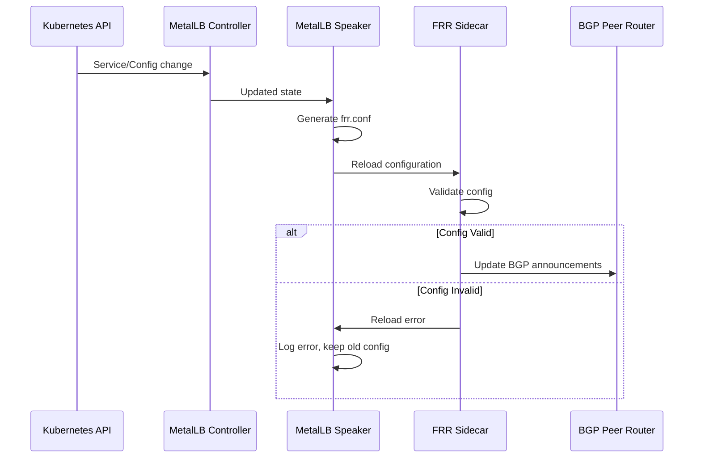
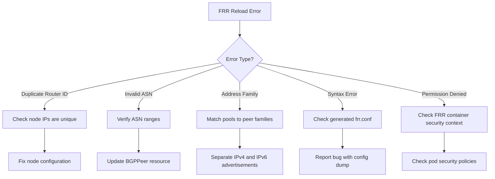

# How to Fix MetalLB Invalid FRR Configuration Reload Errors

Author: [nawazdhandala](https://www.github.com/nawazdhandala)

Tags: Kubernetes, MetalLB, FRR, Configuration, Troubleshooting

Description: Learn how to diagnose and fix MetalLB FRR configuration reload errors that prevent BGP sessions from updating.

---

MetalLB uses FRR (Free Range Routing) as its BGP backend in modern versions. When you update MetalLB configuration - adding new BGP peers, changing IP pools, or modifying advertisements - MetalLB generates a new FRR configuration and reloads FRR. If the generated configuration is invalid, FRR rejects the reload, and your BGP sessions stop updating. This guide covers how to identify, diagnose, and fix these reload errors.

## How MetalLB and FRR Work Together

MetalLB does not speak BGP directly. Instead, it generates an FRR configuration file and tells FRR to reload it. The flow looks like this:



When the reload fails, FRR continues running with the old configuration. This means new services will not get their IPs announced, and changes to existing services will not take effect.

## Identifying FRR Reload Errors

The first sign of a reload error is usually that a new LoadBalancer service does not become reachable externally, even though it has an IP assigned.

### Check Speaker Logs

```bash
# Search for FRR reload errors in the speaker logs
# The speaker logs the result of every FRR configuration reload
kubectl logs -n metallb-system \
  -l component=speaker \
  -c speaker \
  --timestamps \
  | grep -i "reload\|error\|failed\|frr"

# Common error messages to look for:
# "failed to apply FRR configuration"
# "FRR reload failed"
# "invalid configuration"
```

### Check FRR Container Logs

```bash
# The FRR sidecar container logs FRR-specific errors
# These logs show the actual FRR validation errors
kubectl logs -n metallb-system \
  -l component=speaker \
  -c frr \
  --timestamps \
  | tail -100

# Also check the reloader container logs
# This container handles the reload process
kubectl logs -n metallb-system \
  -l component=speaker \
  -c reloader \
  --timestamps \
  | tail -50
```

### Inspect the Generated FRR Configuration

```bash
# Extract the current FRR configuration from the speaker pod
# This is the configuration that MetalLB generated and tried to apply
SPEAKER_POD=$(kubectl get pods -n metallb-system \
  -l component=speaker \
  -o name | head -1)

# Read the generated FRR configuration file
kubectl exec -n metallb-system "$SPEAKER_POD" \
  -c frr \
  -- cat /etc/frr/frr.conf

# Compare with the running FRR configuration
# If these differ, a reload has failed
kubectl exec -n metallb-system "$SPEAKER_POD" \
  -c frr \
  -- vtysh -c "show running-config"
```

## Common FRR Configuration Errors

### Error 1: Duplicate Router ID

If two speaker pods on different nodes generate the same router ID, FRR will reject the configuration.

```bash
# Check the router ID in the FRR configuration
kubectl exec -n metallb-system "$SPEAKER_POD" \
  -c frr \
  -- grep "router-id" /etc/frr/frr.conf

# The router ID should be unique per node
# MetalLB typically uses the node's IP as the router ID
```

Fix this by ensuring each node has a unique IP address and that MetalLB can detect it:

```yaml
# bgppeer.yaml
# Explicitly set the router ID if auto-detection fails
apiVersion: metallb.io/v1beta2
kind: BGPPeer
metadata:
  name: peer-router
  namespace: metallb-system
spec:
  myASN: 64512
  peerASN: 64513
  peerAddress: 10.0.0.1
  # The routerID is automatically set per-node
  # If you need to override, use node-specific BGPPeer resources
```

### Error 2: Invalid ASN Ranges

FRR enforces strict ASN validation. Private ASN ranges must be within the correct boundaries.

```bash
# Valid private ASN ranges:
# 2-byte: 64512 - 65534
# 4-byte: 4200000000 - 4294967294

# Check your BGPPeer resources for ASN values
kubectl get bgppeer -n metallb-system -o yaml \
  | grep -E "myASN|peerASN"
```

```yaml
# Correct BGPPeer configuration with valid ASN
apiVersion: metallb.io/v1beta2
kind: BGPPeer
metadata:
  name: peer-router
  namespace: metallb-system
spec:
  # Use a valid private ASN for your cluster
  myASN: 64512
  # Use the ASN of your upstream router
  peerASN: 64513
  peerAddress: 10.0.0.1
  peerPort: 179
```

### Error 3: Address Family Mismatch

Announcing IPv6 prefixes over an IPv4-only BGP session or vice versa causes FRR reload failures.

```yaml
# Correct dual-stack BGP advertisement
# Make sure your BGPPeer supports the address families you advertise
apiVersion: metallb.io/v1beta1
kind: BGPAdvertisement
metadata:
  name: dual-stack-advert
  namespace: metallb-system
spec:
  ipAddressPools:
    - ipv4-pool   # Only advertise IPv4 pools over IPv4 peers
  peers:
    - ipv4-peer   # This peer must support IPv4
---
apiVersion: metallb.io/v1beta1
kind: BGPAdvertisement
metadata:
  name: ipv6-advert
  namespace: metallb-system
spec:
  ipAddressPools:
    - ipv6-pool   # Only advertise IPv6 pools over IPv6 peers
  peers:
    - ipv6-peer   # This peer must support IPv6
```



## Forcing a Configuration Reload

If you have fixed the underlying configuration issue, you can force MetalLB to regenerate and reload the FRR configuration:

```bash
# Restart the speaker pods to force a fresh configuration generation
# This is the safest way to ensure a clean reload
kubectl rollout restart daemonset/speaker -n metallb-system

# Wait for the rollout to complete
kubectl rollout status daemonset/speaker -n metallb-system

# Verify BGP sessions are established after the restart
kubectl logs -n metallb-system \
  -l component=speaker \
  -c frr \
  | grep "Established"
```

## Conclusion

FRR configuration reload errors are one of the most common causes of MetalLB BGP issues. The root cause is almost always a mismatch between what MetalLB tries to configure and what FRR accepts. By inspecting the generated FRR configuration, comparing it to the running configuration, and checking the FRR container logs, you can quickly identify and fix the problem.

The most important debugging step is extracting the generated `/etc/frr/frr.conf` and comparing it to `show running-config`. If they differ, a reload has failed, and the FRR logs will tell you why.

To catch FRR reload failures before they impact production traffic, set up monitoring with [OneUptime](https://oneuptime.com). OneUptime can monitor your BGP-exposed services and alert you when they become unreachable, giving you early warning of FRR configuration issues that need attention.
