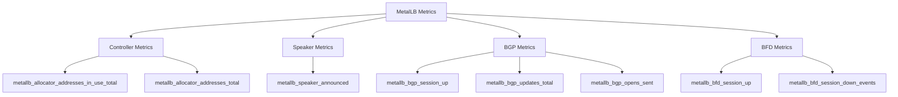
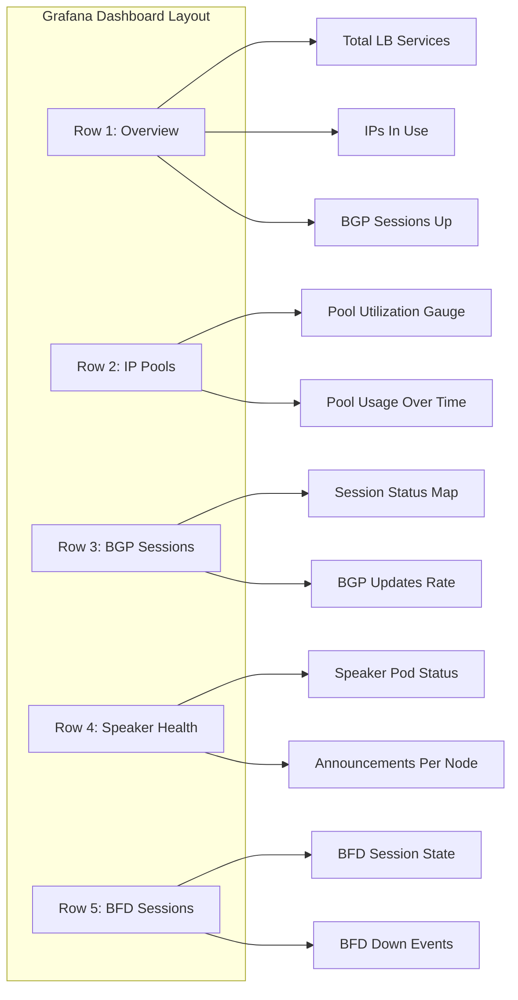

# How to Set Up Grafana Dashboards for MetalLB Health

Author: [nawazdhandala](https://www.github.com/nawazdhandala)

Tags: Kubernetes, MetalLB, Grafana, Dashboards, Monitoring

Description: Learn how to build Grafana dashboards for monitoring MetalLB health including BGP session status, IP pool utilization, and speaker metrics.

---

MetalLB exposes Prometheus metrics that give you visibility into BGP session health, IP pool usage, speaker status, and configuration state. By visualizing these metrics in Grafana dashboards, you can spot problems before they cause outages. This guide walks you through building comprehensive Grafana dashboards for MetalLB.

## Prerequisites

You need Prometheus scraping MetalLB metrics and Grafana connected to Prometheus as a data source.

```yaml
# servicemonitor.yaml
# Create a ServiceMonitor to tell Prometheus to scrape MetalLB metrics
# This assumes you are using the Prometheus Operator
apiVersion: monitoring.coreos.com/v1
kind: ServiceMonitor
metadata:
  name: metallb
  namespace: metallb-system
  labels:
    app: metallb
spec:
  selector:
    matchLabels:
      app: metallb
  endpoints:
    # Controller metrics endpoint
    - port: monitoring
      interval: 30s
      path: /metrics
```

```bash
# Verify Prometheus is scraping MetalLB targets
# Check the Prometheus UI at /targets for metallb endpoints
kubectl port-forward -n monitoring svc/prometheus 9090:9090

# Verify MetalLB metrics are available
curl -s http://localhost:9090/api/v1/label/__name__/values \
  | jq '.data[]' \
  | grep metallb
```

## MetalLB Metrics Overview

MetalLB exposes several categories of metrics. Understanding what is available helps you build useful dashboards.



## Dashboard 1: IP Pool Utilization

The first panel should show how many IPs are allocated from each pool and how many remain available.

```promql
# Total addresses available in each pool
# Use this as the denominator for utilization percentage
metallb_allocator_addresses_total

# Addresses currently assigned to services
# Use this as the numerator
metallb_allocator_addresses_in_use_total

# Pool utilization percentage
# This is the key metric for capacity planning
(metallb_allocator_addresses_in_use_total / metallb_allocator_addresses_total) * 100
```

Create a Grafana panel with these settings:

```json
{
  "title": "IP Pool Utilization",
  "type": "gauge",
  "targets": [
    {
      "expr": "(metallb_allocator_addresses_in_use_total / metallb_allocator_addresses_total) * 100",
      "legendFormat": "{{ pool }}"
    }
  ],
  "fieldConfig": {
    "defaults": {
      "unit": "percent",
      "min": 0,
      "max": 100,
      "thresholds": {
        "steps": [
          { "value": 0, "color": "green" },
          { "value": 70, "color": "yellow" },
          { "value": 90, "color": "red" }
        ]
      }
    }
  }
}
```

## Dashboard 2: BGP Session Status

For BGP mode, the session status is the most critical metric. Each BGP peer should show as "up" at all times.

```promql
# BGP session status per peer per node
# 1 = up, 0 = down
metallb_bgp_session_up

# Count of total BGP sessions that are up
count(metallb_bgp_session_up == 1)

# Count of BGP sessions that are down (should be 0)
count(metallb_bgp_session_up == 0) or vector(0)

# BGP session uptime - time since last session reset
# Use rate to detect frequent session flapping
rate(metallb_bgp_opens_sent[5m])
```

Create a status panel:

```json
{
  "title": "BGP Session Status",
  "type": "stat",
  "targets": [
    {
      "expr": "metallb_bgp_session_up",
      "legendFormat": "{{ peer }} on {{ node }}"
    }
  ],
  "fieldConfig": {
    "defaults": {
      "mappings": [
        { "type": "value", "options": { "0": { "text": "DOWN", "color": "red" } } },
        { "type": "value", "options": { "1": { "text": "UP", "color": "green" } } }
      ]
    }
  }
}
```



## Dashboard 3: Speaker Announcement Tracking

Track which speakers are announcing which services. This helps you verify load distribution in Layer 2 mode.

```promql
# Services being announced by each speaker
# The value is 1 for services being announced by this speaker
metallb_speaker_announced{protocol="layer2"}

# Count of services announced per node
count by (node) (metallb_speaker_announced == 1)

# Detect announcement changes over time
# Changes indicate failover events
changes(metallb_speaker_announced[1h])
```

## Dashboard 4: BGP Update Traffic

Monitor the rate of BGP updates to detect configuration churn or network instability.

```promql
# Rate of BGP updates sent per peer
# High rates indicate instability or frequent configuration changes
rate(metallb_bgp_updates_total[5m])

# Total BGP messages by type
# Useful for understanding BGP session behavior
rate(metallb_bgp_opens_sent[5m])
rate(metallb_bgp_notifications_sent[5m])

# BGP keepalive rate - should be steady
rate(metallb_bgp_keepalives_sent[5m])
```

## Dashboard 5: BFD Session Monitoring

If you use BFD (Bidirectional Forwarding Detection) with BGP, monitor the BFD session state:

```promql
# BFD session status
# 1 = up, 0 = down
metallb_bfd_session_up

# BFD session down events over time
# Spikes indicate network instability
rate(metallb_bfd_session_down_events[5m])

# BFD echo packet statistics
rate(metallb_bfd_echo_packets_sent[5m])
rate(metallb_bfd_echo_packets_received[5m])
```

## Conclusion

A well-built Grafana dashboard gives you instant visibility into MetalLB health. The five key areas to monitor are: IP pool utilization, BGP session status, speaker announcements, BGP update traffic, and BFD session state. By setting up these dashboards, you can catch problems early and respond before they impact your users.

Remember that dashboards are passive - someone has to be looking at them to notice a problem. For active alerting and notification, pair these dashboards with Prometheus alerting rules or use [OneUptime](https://oneuptime.com) for comprehensive monitoring. OneUptime can monitor your MetalLB-exposed services from external locations, providing an end-user perspective that complements your internal Grafana dashboards and ensures you are alerted to issues even when nobody is watching the dashboard.
