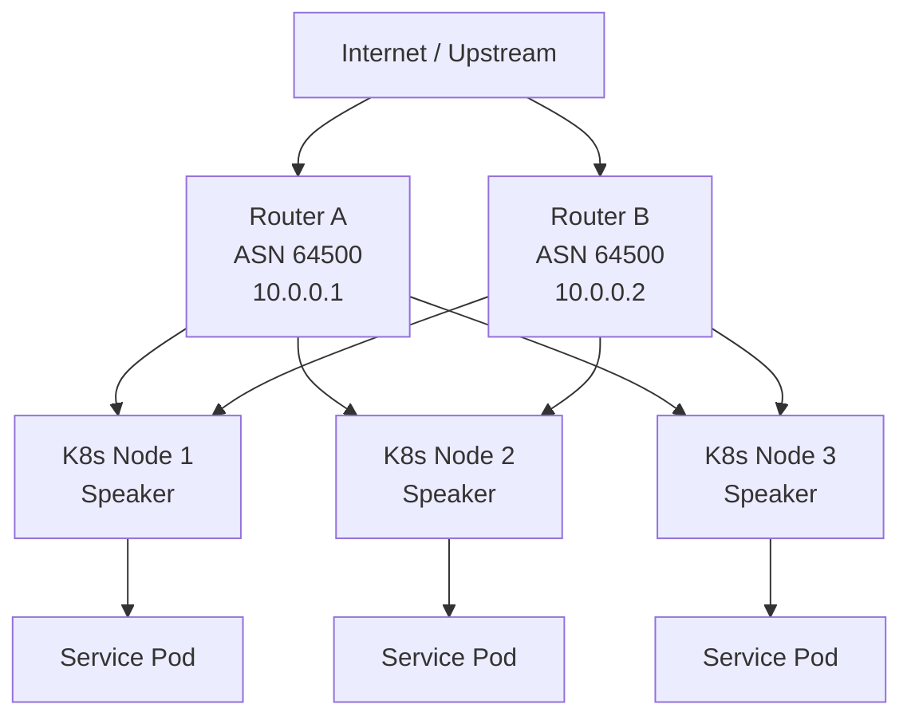

# How to Achieve High Availability with MetalLB BGP and Multiple Routers

Author: [nawazdhandala](https://www.github.com/nawazdhandala)

Tags: Kubernetes, MetalLB, BGP, High Availability, Routers

Description: Learn how to configure MetalLB with multiple BGP routers for high availability and automatic failover in production.

---

## Why BGP for High Availability?

MetalLB's Layer 2 mode is simple to set up, but it has a significant limitation: only one node at a time owns each IP address. If that node goes down, MetalLB must detect the failure, elect a new owner, and send gratuitous ARP packets. During this window, traffic is dropped.

BGP mode solves this by advertising service IPs as routes to upstream routers. Multiple nodes can advertise the same IP simultaneously, and the router distributes traffic using ECMP (Equal-Cost Multi-Path). When a node fails, the router simply removes it from the ECMP set with no ARP delays.

Adding multiple routers takes this further. If a single router fails, the surviving router continues forwarding traffic without interruption.

## High Availability Architecture



In this setup:

- Each MetalLB speaker peers with both routers
- Both routers receive the same route advertisements
- ECMP distributes traffic across all healthy nodes
- If Router A fails, Router B still has all routes
- If Node 2 fails, both routers remove it from ECMP

## Prerequisites

- Kubernetes cluster with at least 3 nodes
- MetalLB v0.13+ installed
- Two BGP-capable routers (physical or virtual)
- Private ASN numbers allocated (64512-65534 range)
- Network connectivity between all nodes and both routers

## Step 1: Configure the Upstream Routers

Configure both routers to accept BGP peering from your Kubernetes nodes. Here is an example using FRRouting (FRR), which is common on Linux-based routers:

### Router A Configuration (FRR)

```text
! /etc/frr/frr.conf on Router A
! Router A peers with all Kubernetes nodes
router bgp 64500
  bgp router-id 10.0.0.1
  no bgp ebgp-requires-policy

  ! Peer with each Kubernetes node
  neighbor 10.0.0.11 remote-as 64501
  neighbor 10.0.0.12 remote-as 64501
  neighbor 10.0.0.13 remote-as 64501

  ! Enable ECMP with up to 8 equal-cost paths
  maximum-paths 8

  address-family ipv4 unicast
    ! Accept all routes from the MetalLB ASN
    neighbor 10.0.0.11 route-map ACCEPT-ALL in
    neighbor 10.0.0.12 route-map ACCEPT-ALL in
    neighbor 10.0.0.13 route-map ACCEPT-ALL in
  exit-address-family

route-map ACCEPT-ALL permit 10
```

### Router B Configuration (FRR)

```text
! /etc/frr/frr.conf on Router B
! Identical peering setup, different router-id
router bgp 64500
  bgp router-id 10.0.0.2
  no bgp ebgp-requires-policy

  neighbor 10.0.0.11 remote-as 64501
  neighbor 10.0.0.12 remote-as 64501
  neighbor 10.0.0.13 remote-as 64501

  maximum-paths 8

  address-family ipv4 unicast
    neighbor 10.0.0.11 route-map ACCEPT-ALL in
    neighbor 10.0.0.12 route-map ACCEPT-ALL in
    neighbor 10.0.0.13 route-map ACCEPT-ALL in
  exit-address-family

route-map ACCEPT-ALL permit 10
```

## Step 2: Configure MetalLB BGP Peers

Define two BGPPeer resources, one for each router:

```yaml
# metallb-bgp-peers.yaml
# Peer with Router A
apiVersion: metallb.io/v1beta2
kind: BGPPeer
metadata:
  name: router-a
  namespace: metallb-system
spec:
  myASN: 64501
  peerASN: 64500
  peerAddress: 10.0.0.1
  # Timers control how quickly failures are detected
  holdTime: 90s
  keepaliveTime: 30s
---
# Peer with Router B
apiVersion: metallb.io/v1beta2
kind: BGPPeer
metadata:
  name: router-b
  namespace: metallb-system
spec:
  myASN: 64501
  peerASN: 64500
  peerAddress: 10.0.0.2
  holdTime: 90s
  keepaliveTime: 30s
```

## Step 3: Configure IP Pool and BGP Advertisement

```yaml
# metallb-pool.yaml
# Define the IP pool for LoadBalancer services
apiVersion: metallb.io/v1beta1
kind: IPAddressPool
metadata:
  name: production-pool
  namespace: metallb-system
spec:
  addresses:
    - 203.0.113.10-203.0.113.50
  autoAssign: true
---
# Advertise IPs via BGP to both routers
apiVersion: metallb.io/v1beta1
kind: BGPAdvertisement
metadata:
  name: production-bgp
  namespace: metallb-system
spec:
  ipAddressPools:
    - production-pool
  # Aggregate routes to reduce routing table size
  aggregationLength: 32
```

Apply all configurations:

```bash
# Apply BGP peer and pool configurations
kubectl apply -f metallb-bgp-peers.yaml
kubectl apply -f metallb-pool.yaml
```

## Step 4: Tune BGP Timers for Faster Failover

The default BGP hold time of 90 seconds means it can take up to 90 seconds to detect a failed peer. For production environments, you may want faster detection:

```yaml
# metallb-bgp-peers-fast.yaml
# Aggressive timers for faster failover
apiVersion: metallb.io/v1beta2
kind: BGPPeer
metadata:
  name: router-a-fast
  namespace: metallb-system
spec:
  myASN: 64501
  peerASN: 64500
  peerAddress: 10.0.0.1
  # Detect failures in 9 seconds instead of 90
  holdTime: 9s
  keepaliveTime: 3s
---
apiVersion: metallb.io/v1beta2
kind: BGPPeer
metadata:
  name: router-b-fast
  namespace: metallb-system
spec:
  myASN: 64501
  peerASN: 64500
  peerAddress: 10.0.0.2
  holdTime: 9s
  keepaliveTime: 3s
```

> **Warning**: Very aggressive timers (under 3 seconds) can cause route flapping if the network has intermittent latency.

## Step 5: Verify BGP Sessions

Check that all BGP sessions are established:

```bash
# Check MetalLB speaker logs for BGP session status
kubectl logs -n metallb-system -l component=speaker --tail=100 \
  | grep -i "bgp\|session\|established"

# On Router A, verify peering status using vtysh
vtysh -c "show bgp summary"

# Expected output shows Established state for all peers:
# Neighbor     AS  MsgRcvd  MsgSent  Up/Down  State/PfxRcd
# 10.0.0.11 64501      120      115 01:00:00             5
# 10.0.0.12 64501      118      114 01:00:00             5
# 10.0.0.13 64501      119      116 01:00:00             5
```

## Failover Scenarios

Here is what happens during each type of failure:

```mermaid
flowchart TD
    subgraph Scenario1["Node Failure"]
        S1A[Node 2 goes down] --> S1B[BGP hold timer expires]
        S1B --> S1C[Routers remove Node 2 from ECMP]
        S1C --> S1D[Traffic redistributed to Node 1 and Node 3]
    end

    subgraph Scenario2["Router Failure"]
        S2A[Router A goes down] --> S2B[Nodes detect lost BGP session]
        S2B --> S2C[Router B still has all routes]
        S2C --> S2D[All traffic flows through Router B]
    end

    subgraph Scenario3["Speaker Pod Crash"]
        S3A[Speaker on Node 1 crashes] --> S3B[BGP sessions from Node 1 drop]
        S3B --> S3C[Routers remove Node 1 routes]
        S3C --> S3D[Kubernetes restarts Speaker pod]
        S3D --> S3E[BGP sessions re-establish]
    end
```



## Testing Failover

Simulate failures to validate your HA setup:

```bash
# Test 1: Node failure simulation
# Cordon and drain a node to simulate failure
kubectl cordon node-2
kubectl drain node-2 --ignore-daemonsets --delete-emptydir-data

# Verify traffic still flows through remaining nodes
curl -s -o /dev/null -w "%{http_code}" http://203.0.113.10

# Uncordon after testing
kubectl uncordon node-2

# Test 2: Router failure simulation
# On Router A, shut down BGP
vtysh -c "configure terminal" -c "router bgp 64500" -c "neighbor 10.0.0.11 shutdown"

# Verify traffic routes through Router B
traceroute 203.0.113.10

# Re-enable Router A
vtysh -c "configure terminal" -c "router bgp 64500" -c "no neighbor 10.0.0.11 shutdown"

# Test 3: Speaker pod failure
# Delete a speaker pod to simulate crash
kubectl delete pod -n metallb-system -l component=speaker --field-selector spec.nodeName=node-1

# Watch the pod restart and BGP session re-establish
kubectl get pods -n metallb-system -w
```

## BFD for Sub-Second Failover

For even faster failover, enable BFD (Bidirectional Forwarding Detection). BFD runs alongside BGP and can detect link failures in milliseconds:

```yaml
# metallb-bfd-profile.yaml
# BFD detects failures much faster than BGP keepalives
apiVersion: metallb.io/v1beta1
kind: BFDProfile
metadata:
  name: fast-detect
  namespace: metallb-system
spec:
  receiveInterval: 300
  transmitInterval: 300
  detectMultiplier: 3
  # Failure detection in ~900ms (300ms x 3)
---
# Reference BFD profile in BGP peers
apiVersion: metallb.io/v1beta2
kind: BGPPeer
metadata:
  name: router-a-bfd
  namespace: metallb-system
spec:
  myASN: 64501
  peerASN: 64500
  peerAddress: 10.0.0.1
  # Link the BFD profile for sub-second detection
  bfdProfile: fast-detect
```

## Summary

Combining MetalLB BGP mode with multiple routers gives you a highly available load balancing setup that can survive node failures, router failures, and speaker pod crashes. The key components are: dual BGP peering, ECMP on the routers, tuned timers, and optional BFD for sub-second failover.

To monitor BGP session health, service availability, and failover events across your infrastructure, [OneUptime](https://oneuptime.com) provides real-time alerting and status pages that keep your team informed when failures occur and when they recover.
