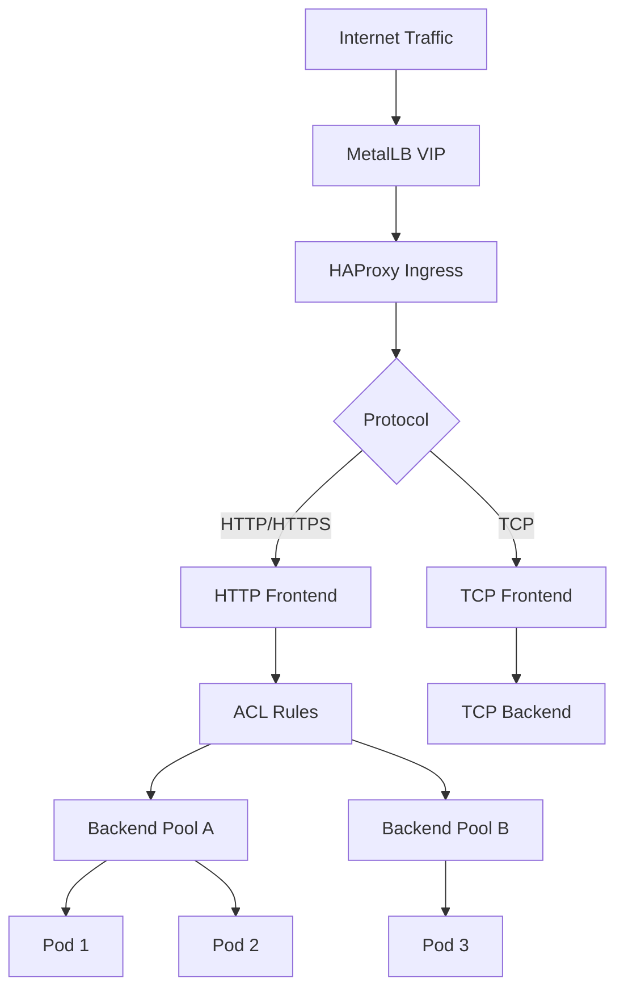
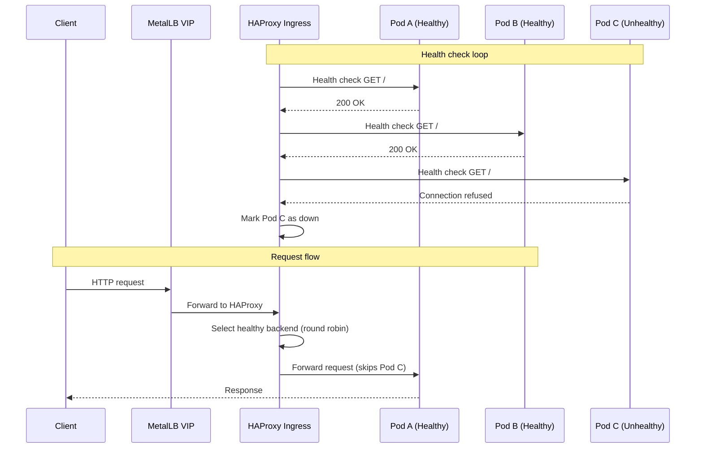

# How to Deploy MetalLB with HAProxy Ingress Controller

Author: [nawazdhandala](https://www.github.com/nawazdhandala)

Tags: Kubernetes, MetalLB, HAProxy, Ingress, Load Balancing

Description: Learn how to deploy MetalLB with the HAProxy Ingress Controller for high-performance bare-metal load balancing.

---

HAProxy is one of the most battle-tested load balancers in the industry. The HAProxy Ingress Controller brings that reliability to Kubernetes. On bare-metal clusters, pairing HAProxy Ingress with MetalLB gives you a high-performance ingress stack that can handle millions of concurrent connections.

This guide shows you how to deploy and configure MetalLB with the HAProxy Ingress Controller.

## Why HAProxy Ingress

HAProxy Ingress stands out for several reasons:

- Extremely high performance with low memory usage
- Connection draining for zero-downtime deployments
- Native support for TCP and HTTP load balancing
- Active health checks for backend pods
- Dynamic configuration updates without reloads (using HAProxy's data plane API)



## Prerequisites

- Kubernetes cluster running on bare metal
- MetalLB installed with an IP address pool configured
- Helm 3 installed
- kubectl access to the cluster

## Step 1: Configure MetalLB

If MetalLB is not yet configured, create an IP pool:

```yaml
# metallb-pool.yaml
# Reserve a range of IPs for the HAProxy Ingress Controller.
apiVersion: metallb.io/v1beta1
kind: IPAddressPool
metadata:
  name: haproxy-pool
  namespace: metallb-system
spec:
  addresses:
    # Adjust to your network range
    - 192.168.1.200-192.168.1.220
---
apiVersion: metallb.io/v1beta1
kind: L2Advertisement
metadata:
  name: haproxy-l2
  namespace: metallb-system
spec:
  ipAddressPools:
    - haproxy-pool
```

```bash
kubectl apply -f metallb-pool.yaml
```

## Step 2: Install HAProxy Ingress Controller

Install the HAProxy Ingress Controller using Helm:

```bash
# Add the HAProxy Ingress Helm repository
helm repo add haproxy-ingress https://haproxy-ingress.github.io/charts
helm repo update

# Install HAProxy Ingress Controller
helm install haproxy-ingress haproxy-ingress/haproxy-ingress \
  --namespace haproxy-ingress \
  --create-namespace \
  --set controller.service.type=LoadBalancer \
  --set controller.service.externalTrafficPolicy=Local \
  --set controller.stats.enabled=true \
  --set controller.metrics.enabled=true \
  --set controller.logs.enabled=true
```

## Step 3: Verify the Deployment

```bash
# Check that MetalLB assigned an IP
kubectl get svc -n haproxy-ingress

# Expected output shows an EXTERNAL-IP from the MetalLB pool
# NAME                        TYPE           EXTERNAL-IP     PORT(S)
# haproxy-ingress-controller  LoadBalancer   192.168.1.200   80:30080/TCP,443:30443/TCP

# Check HAProxy pods are running
kubectl get pods -n haproxy-ingress

# Test basic connectivity
curl -v http://192.168.1.200
```

## Step 4: Deploy a Sample Application

```yaml
# sample-app.yaml
# Deploy a web application behind HAProxy Ingress.
apiVersion: apps/v1
kind: Deployment
metadata:
  name: web-app
  namespace: default
spec:
  replicas: 3
  selector:
    matchLabels:
      app: web-app
  template:
    metadata:
      labels:
        app: web-app
    spec:
      containers:
        - name: web
          image: hashicorp/http-echo
          args:
            - "-text=Hello from HAProxy + MetalLB"
          ports:
            - containerPort: 5678
          # Readiness probe for HAProxy health checks
          readinessProbe:
            httpGet:
              path: /
              port: 5678
            initialDelaySeconds: 5
            periodSeconds: 10
---
apiVersion: v1
kind: Service
metadata:
  name: web-app
  namespace: default
spec:
  selector:
    app: web-app
  ports:
    - port: 80
      targetPort: 5678
---
# Ingress resource with HAProxy-specific annotations
apiVersion: networking.k8s.io/v1
kind: Ingress
metadata:
  name: web-app-ingress
  namespace: default
  annotations:
    # HAProxy-specific: configure backend balance algorithm
    haproxy-ingress.github.io/balance-algorithm: "roundrobin"
    # Enable health checks on backends
    haproxy-ingress.github.io/health-check-interval: "5s"
spec:
  ingressClassName: haproxy
  rules:
    - host: web.example.com
      http:
        paths:
          - path: /
            pathType: Prefix
            backend:
              service:
                name: web-app
                port:
                  number: 80
```

```bash
# Deploy the application
kubectl apply -f sample-app.yaml

# Test the route
curl -H "Host: web.example.com" http://192.168.1.200
```

## HAProxy-Specific Features

### Connection Draining

HAProxy Ingress supports graceful connection draining during deployments. When a pod is being terminated, HAProxy stops sending new connections but allows existing connections to complete:

```yaml
# ingress-drain.yaml
# Configure connection draining for zero-downtime deployments.
apiVersion: networking.k8s.io/v1
kind: Ingress
metadata:
  name: web-app-drain
  namespace: default
  annotations:
    # Wait up to 30 seconds for existing connections to complete
    haproxy-ingress.github.io/drain-support: "true"
    haproxy-ingress.github.io/drain-support-redispatch: "true"
spec:
  ingressClassName: haproxy
  rules:
    - host: web.example.com
      http:
        paths:
          - path: /
            pathType: Prefix
            backend:
              service:
                name: web-app
                port:
                  number: 80
```

### TCP Load Balancing

HAProxy Ingress can load balance raw TCP connections, useful for databases or other non-HTTP services:

```yaml
# tcp-service-configmap.yaml
# Configure TCP load balancing for a PostgreSQL service.
apiVersion: v1
kind: ConfigMap
metadata:
  name: haproxy-ingress-tcp
  namespace: haproxy-ingress
data:
  # Format: "external-port": "namespace/service:port"
  # Expose PostgreSQL on port 5432 through MetalLB
  "5432": "database/postgresql:5432"
  # Expose Redis on port 6379
  "6379": "cache/redis:6379"
```

### Backend Weight for Canary Deployments

HAProxy supports weighted backends for canary deployments:

```yaml
# canary-ingress.yaml
# Split traffic between stable and canary backends.
apiVersion: networking.k8s.io/v1
kind: Ingress
metadata:
  name: canary-deploy
  namespace: default
  annotations:
    # Send 90% of traffic to stable, 10% to canary
    haproxy-ingress.github.io/balance-algorithm: "roundrobin"
    haproxy-ingress.github.io/backend-server-slots-increment: "1"
spec:
  ingressClassName: haproxy
  rules:
    - host: app.example.com
      http:
        paths:
          - path: /
            pathType: Prefix
            backend:
              service:
                name: app-stable
                port:
                  number: 80
```

## Request Flow with Health Checks



## Monitoring HAProxy Metrics

HAProxy exposes a rich set of metrics. Enable the stats page and Prometheus endpoint:

```bash
# Access the HAProxy stats page
kubectl port-forward -n haproxy-ingress svc/haproxy-ingress-controller 1936:1936

# Open http://localhost:1936/metrics for Prometheus metrics
# Open http://localhost:1936/stats for the HAProxy stats dashboard
```

Key metrics for monitoring:

- `haproxy_frontend_current_sessions` - Active connections
- `haproxy_backend_response_time_average_seconds` - Backend latency
- `haproxy_backend_up` - Backend health status
- `haproxy_server_status` - Individual server status
- `haproxy_frontend_bytes_in_total` - Ingress bandwidth

```yaml
# servicemonitor-haproxy.yaml
# Scrape HAProxy metrics with Prometheus.
apiVersion: monitoring.coreos.com/v1
kind: ServiceMonitor
metadata:
  name: haproxy-ingress
  namespace: haproxy-ingress
spec:
  selector:
    matchLabels:
      app.kubernetes.io/name: haproxy-ingress
  endpoints:
    - port: metrics
      interval: 15s
```

## Troubleshooting

Common issues:

1. **503 Service Unavailable** - Backend pods are failing health checks. Check pod readiness probes
2. **Connection timeouts** - MetalLB VIP may not be reachable. Verify L2 advertisement is configured
3. **Uneven load distribution** - Check the balance algorithm. `leastconn` may work better than `roundrobin` for long-lived connections
4. **High latency** - Check HAProxy stats for backend response times and connection queuing

```bash
# Debug commands
kubectl logs -n haproxy-ingress -l app.kubernetes.io/name=haproxy-ingress
kubectl get events -n haproxy-ingress
kubectl describe ingress web-app-ingress
```

## Summary

MetalLB paired with the HAProxy Ingress Controller gives you a high-performance, production-grade ingress solution for bare-metal Kubernetes. HAProxy's connection draining, active health checks, and TCP load balancing capabilities make it an excellent choice for demanding workloads.

To monitor the health and performance of services behind your HAProxy and MetalLB stack, use [OneUptime](https://oneuptime.com). OneUptime provides endpoint monitoring, alerting, incident management, and status pages in one platform, so you can detect and respond to issues before your users notice them.
