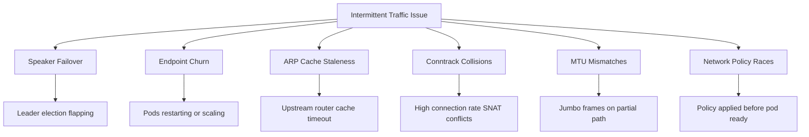
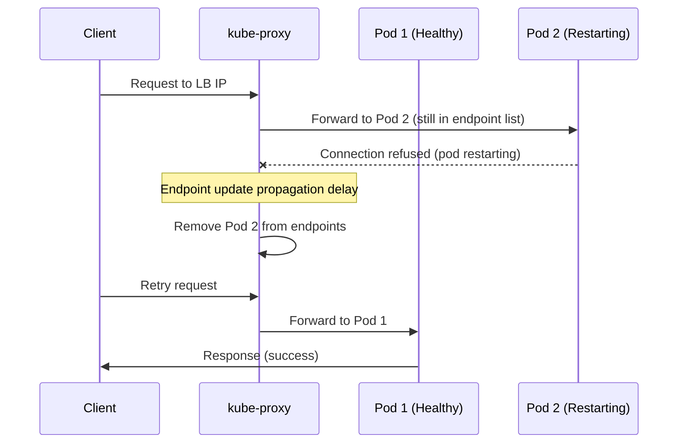

# How to Troubleshoot MetalLB Intermittent Traffic Issues

Author: [nawazdhandala](https://www.github.com/nawazdhandala)

Tags: Kubernetes, MetalLB, Intermittent, Troubleshooting, Networking

Description: Troubleshooting guide for MetalLB intermittent traffic issues including packet drops, timeouts, and flapping connections.

---

Intermittent traffic issues with MetalLB are among the hardest problems to debug. The service works most of the time, but some requests fail randomly. Connections time out, responses arrive partially, or traffic drops during certain periods. This guide covers the most common causes of intermittent MetalLB traffic issues and how to systematically identify and fix each one.

## Categories of Intermittent Issues

Intermittent traffic issues fall into several categories, and each has a different root cause.



## Issue 1: Speaker Failover Causing Traffic Gaps

In Layer 2 mode, only one speaker node handles each LoadBalancer IP. When that node fails or the speaker pod restarts, another node takes over. During the failover, there is a brief traffic gap while ARP caches update.

```bash
# Check for speaker failover events in the logs
# Look for "handling" and "lost" messages that indicate leadership changes
kubectl logs -n metallb-system \
  -l component=speaker \
  --all-containers \
  --timestamps \
  | grep -E "handling|lost|winning|assigned"

# Check if speaker pods are restarting frequently
# Restarts cause repeated failovers
kubectl get pods -n metallb-system \
  -l component=speaker \
  -o custom-columns=NAME:.metadata.name,RESTARTS:.status.containerStatuses[0].restartCount,NODE:.spec.nodeName
```

```bash
# Monitor speaker leader elections in real-time
# Run this during the period when issues occur
kubectl logs -n metallb-system \
  -l component=speaker \
  --follow \
  --timestamps \
  | grep -E "service|announce|withdraw"
```

The fix depends on why failover is happening:

```bash
# Check if nodes are becoming NotReady temporarily
# This forces speaker pods to restart on those nodes
kubectl get events -A \
  --field-selector reason=NodeNotReady \
  --sort-by=.metadata.creationTimestamp

# Check speaker pod resource limits
# If the speaker is OOM killed, it causes failover
kubectl describe pods -n metallb-system \
  -l component=speaker \
  | grep -A 5 "Last State"
```

## Issue 2: Endpoint Churn

When backend pods restart, scale, or get rescheduled, there is a window where kube-proxy has not updated its rules to reflect the new endpoints. Traffic sent to old endpoints gets dropped.

```bash
# Watch endpoint changes in real-time
# Frequent changes indicate pod instability
kubectl get endpoints my-service --watch

# Check pod readiness status and recent restarts
kubectl get pods -l app=my-app \
  -o custom-columns=NAME:.metadata.name,READY:.status.containerStatuses[0].ready,RESTARTS:.status.containerStatuses[0].restartCount

# Check if readiness probes are flapping
# A flapping readiness probe causes the pod to be added/removed from endpoints repeatedly
kubectl describe pod my-app-pod | grep -A 10 "Readiness"
```



Fix endpoint churn by improving readiness probes:

```yaml
# Properly configured readiness probe that prevents premature traffic
apiVersion: apps/v1
kind: Deployment
metadata:
  name: my-app
spec:
  template:
    spec:
      containers:
        - name: app
          # Use a readiness probe with appropriate thresholds
          # initialDelaySeconds prevents the pod from receiving traffic too early
          readinessProbe:
            httpGet:
              path: /healthz
              port: 8080
            initialDelaySeconds: 10
            periodSeconds: 5
            failureThreshold: 3
            successThreshold: 1
          # terminationGracePeriodSeconds gives the pod time to drain connections
      terminationGracePeriodSeconds: 30
```

## Issue 3: ARP Cache Staleness

In Layer 2 mode, upstream routers and switches cache the MAC address for the LoadBalancer IP. If a failover happens and the cache has not expired, traffic goes to the old node.

```bash
# Check ARP cache timeout on the node
# Default is usually 30-60 seconds on Linux
cat /proc/sys/net/ipv4/neigh/eth0/gc_stale_time

# MetalLB sends gratuitous ARP on failover to update caches
# Check if gratuitous ARP packets are being sent
kubectl logs -n metallb-system \
  -l component=speaker \
  | grep -i "gratuitous\|garp\|announce"

# Capture gratuitous ARP on the network
# Run on the new leader node after a failover
sudo tcpdump -i eth0 'arp' -nn -e \
  | grep -i "reply\|is-at"
```

If your network equipment has long ARP cache timeouts, you can reduce them or configure MetalLB to send additional gratuitous ARPs:

```bash
# Reduce the ARP cache timeout on all nodes
# This helps upstream devices learn the new MAC faster after failover
sudo sysctl -w net.ipv4.neigh.eth0.gc_stale_time=30
sudo sysctl -w net.ipv4.neigh.eth0.base_reachable_time_ms=15000
```

## Issue 4: Conntrack Table Collisions

When using `externalTrafficPolicy: Cluster`, kube-proxy performs SNAT. Under high connection rates, conntrack entries can collide, causing dropped packets.

```bash
# Check the conntrack table size and usage
cat /proc/sys/net/netfilter/nf_conntrack_count
cat /proc/sys/net/netfilter/nf_conntrack_max

# Check for conntrack insert failures
# These indicate table full or hash collisions
grep "insert_failed\|drop\|early_drop" /proc/net/stat/nf_conntrack

# Check conntrack entries for the LoadBalancer IP
sudo conntrack -L -d 192.168.1.240 | wc -l
```

Fix by increasing the conntrack table or switching to `externalTrafficPolicy: Local`:

```bash
# Increase conntrack table size on all nodes
sudo sysctl -w net.netfilter.nf_conntrack_max=524288
sudo sysctl -w net.netfilter.nf_conntrack_buckets=131072

# Make the changes permanent
echo "net.netfilter.nf_conntrack_max=524288" | sudo tee -a /etc/sysctl.conf
```

```yaml
# Switch to Local traffic policy to avoid SNAT entirely
# This preserves client IPs and avoids conntrack SNAT collisions
apiVersion: v1
kind: Service
metadata:
  name: my-service
spec:
  type: LoadBalancer
  externalTrafficPolicy: Local  # No SNAT, no conntrack collisions
  selector:
    app: my-app
  ports:
    - port: 80
      targetPort: 8080
```

## Issue 5: MTU Mismatches

Large packets that exceed the MTU on any segment of the path get silently dropped or fragmented. This causes intermittent failures, especially with large HTTP responses.

```bash
# Check MTU on the node's main interface
ip link show eth0 | grep mtu

# Check MTU on the pod network interface
ip link show cni0 | grep mtu

# Test path MTU to a client
# Replace with a client IP that is experiencing issues
ping -M do -s 1472 <client-ip>

# If ping fails with "message too long", reduce the size until it works
# The working size + 28 bytes (IP + ICMP headers) is your effective MTU
ping -M do -s 1400 <client-ip>
```


## Conclusion

Intermittent MetalLB traffic issues almost always come from one of these six categories: speaker failover, endpoint churn, ARP cache staleness, conntrack collisions, MTU mismatches, or network policy races. The key to diagnosis is collecting data during the failure window - timestamps, logs, and packet captures that coincide with the intermittent failures.

Run the monitoring script above to establish a timeline of failures, then correlate those timestamps with MetalLB speaker logs, endpoint changes, and node events to find the root cause.

For production-grade monitoring of MetalLB services, [OneUptime](https://oneuptime.com) provides continuous external health checks with detailed response time tracking. OneUptime can detect intermittent failures, measure their frequency and duration, and alert your team with full context, making it far easier to correlate failures with infrastructure events and resolve intermittent issues quickly.
