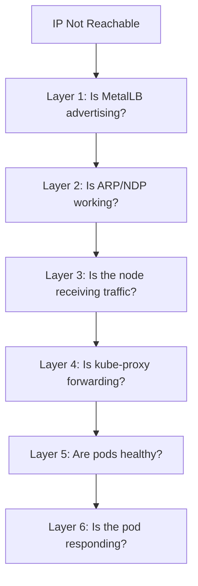
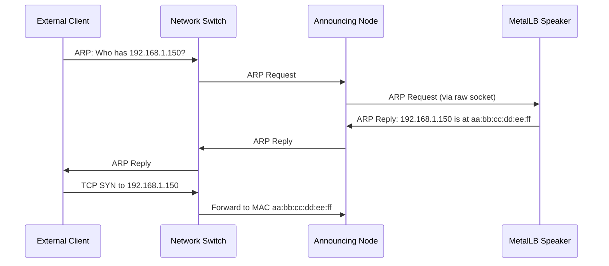

# How to Troubleshoot MetalLB Service IP Not Reachable from Outside the Cluster

Author: [nawazdhandala](https://www.github.com/nawazdhandala)

Tags: Kubernetes, MetalLB, Troubleshooting, Networking, Connectivity

Description: Systematic troubleshooting guide for when MetalLB assigns an external IP but the service is not reachable from outside the cluster.

---

Your MetalLB service has an external IP assigned, but you cannot reach it from outside the cluster. This is a different problem than a Pending service - MetalLB did its job of allocating the IP, but something is preventing traffic from flowing. This post walks through every layer of the stack to find and fix the issue.

## The Symptom

The service has an IP, but connections time out:

```bash
# Service shows an assigned IP
kubectl get svc my-service
```

```
NAME         TYPE           CLUSTER-IP     EXTERNAL-IP     PORT(S)        AGE
my-service   LoadBalancer   10.96.50.100   192.168.1.150   80:31234/TCP   10m
```

```bash
# But the IP is not reachable from an external machine
curl --connect-timeout 5 http://192.168.1.150
# curl: (28) Connection timed out
```

## Troubleshooting Layers

Network issues can occur at multiple layers. Work through them systematically:



## Layer 1: Is MetalLB Advertising the IP?

First, check if MetalLB is actually advertising the IP.

### For L2 Mode

```bash
# Check which node is announcing the service
kubectl get servicel2status -A -l metallb.io/service-name=my-service

# Check speaker logs for announcement activity
kubectl logs -n metallb-system -l component=speaker --tail=50 | grep "my-service"
```

### For BGP Mode

```bash
# Check BGP session status
kubectl get servicebgpstatus -A -l metallb.io/service-name=my-service

# Verify BGP peers are established
kubectl logs -n metallb-system -l component=speaker --tail=50 | grep -i "bgp\|session\|peer"
```

## Layer 2: Is ARP/NDP Working?

In L2 mode, MetalLB responds to ARP (IPv4) or NDP (IPv6) requests. If ARP is not working, external machines cannot find the MAC address for the virtual IP.

```bash
# From an external machine on the same subnet, check the ARP table
arp -n | grep 192.168.1.150

# Send an ARP request and see if you get a response
arping -c 3 192.168.1.150
```

If arping gets no response, MetalLB is not answering ARP requests. Common causes:

- The speaker pod on the announcing node is unhealthy
- The announcing node's network interface is down
- A firewall is blocking ARP packets



## Layer 3: Is the Node Receiving Traffic?

If ARP works but traffic still does not flow, check if the node is actually receiving packets:

```bash
# SSH into the announcing node and capture traffic for the VIP
# This shows if packets are arriving at the node
sudo tcpdump -i any host 192.168.1.150 -n -c 20
```

If you see incoming SYN packets but no responses, the issue is inside the node (kube-proxy, iptables, or pods).

If you see no packets at all, the issue is in the network between the client and the node.

## Layer 4: Is kube-proxy Forwarding Traffic?

kube-proxy creates iptables or IPVS rules to forward LoadBalancer traffic to pods. Verify these rules exist:

```bash
# Check iptables rules for the service (iptables mode)
# Look for DNAT rules that forward traffic to pod IPs
sudo iptables -t nat -L KUBE-SERVICES -n | grep 192.168.1.150

# For IPVS mode, check virtual server entries
sudo ipvsadm -ln | grep -A 5 192.168.1.150
```

If rules are missing, kube-proxy may not be functioning:

```bash
# Check kube-proxy pod status
kubectl get pods -n kube-system -l k8s-app=kube-proxy

# Check kube-proxy logs for errors
kubectl logs -n kube-system -l k8s-app=kube-proxy --tail=30
```

## Layer 5: Are Pods Healthy?

The service endpoints must have healthy pods:

```bash
# Check if the service has endpoints
kubectl get endpoints my-service

# Check if pods backing the service are running
kubectl get pods -l app=my-app

# Check pod readiness - unready pods are removed from endpoints
kubectl get pods -l app=my-app -o custom-columns=\
NAME:.metadata.name,\
READY:.status.conditions[?(@.type==\"Ready\")].status
```

If there are no endpoints, the service selector does not match any pods or all pods are unready.

```bash
# Verify the service selector matches pod labels
kubectl get svc my-service -o jsonpath='{.spec.selector}'
# Compare with pod labels
kubectl get pods --show-labels | grep my-app
```

## Layer 6: Is the Pod Responding?

Test connectivity directly to the pod:

```bash
# Get a pod IP
POD_IP=$(kubectl get pod -l app=my-app -o jsonpath='{.items[0].status.podIP}')

# Test from within the cluster using a debug pod
kubectl run test-curl --rm -it --image=curlimages/curl -- curl -v http://$POD_IP:8080
```

If the pod does not respond, the application inside may be crashed or listening on a different port.

```bash
# Check pod logs for application errors
kubectl logs -l app=my-app --tail=50

# Check what port the container is listening on
kubectl exec -it $(kubectl get pod -l app=my-app -o name | head -1) -- netstat -tlnp
```

## Firewall Checks

Firewalls on nodes or in the network can block MetalLB traffic:

```bash
# Check iptables INPUT chain for DROP rules on the announcing node
sudo iptables -L INPUT -n --line-numbers | grep -i drop

# Check if firewalld or ufw is active and blocking traffic
sudo systemctl status firewalld
sudo ufw status
```

## Quick Diagnostic Summary

```bash
#!/bin/bash
# metallb-reach-diag.sh - Diagnose unreachable MetalLB service

SVC_NAME=${1:-my-service}
SVC_NS=${2:-default}

echo "=== Service Details ==="
kubectl get svc "$SVC_NAME" -n "$SVC_NS" -o wide

echo ""
echo "=== L2 Status ==="
kubectl get servicel2status -n "$SVC_NS" -l "metallb.io/service-name=$SVC_NAME"

echo ""
echo "=== Endpoints ==="
kubectl get endpoints "$SVC_NAME" -n "$SVC_NS"

echo ""
echo "=== Pod Status ==="
SELECTOR=$(kubectl get svc "$SVC_NAME" -n "$SVC_NS" -o jsonpath='{.spec.selector}' | jq -r 'to_entries | map("\(.key)=\(.value)") | join(",")')
kubectl get pods -n "$SVC_NS" -l "$SELECTOR"

echo ""
echo "=== Recent Service Events ==="
kubectl events --for="service/$SVC_NAME" -n "$SVC_NS" 2>/dev/null || \
  kubectl describe svc "$SVC_NAME" -n "$SVC_NS" | grep -A 10 Events
```

## Monitoring with OneUptime

Reachability issues can be intermittent and hard to catch manually. [OneUptime](https://oneuptime.com) provides continuous external monitoring of your MetalLB-backed services, testing connectivity from outside the cluster just like your real users would. When a service becomes unreachable, OneUptime sends alerts immediately and tracks the incident from detection through resolution, giving you a complete picture of your service availability.
