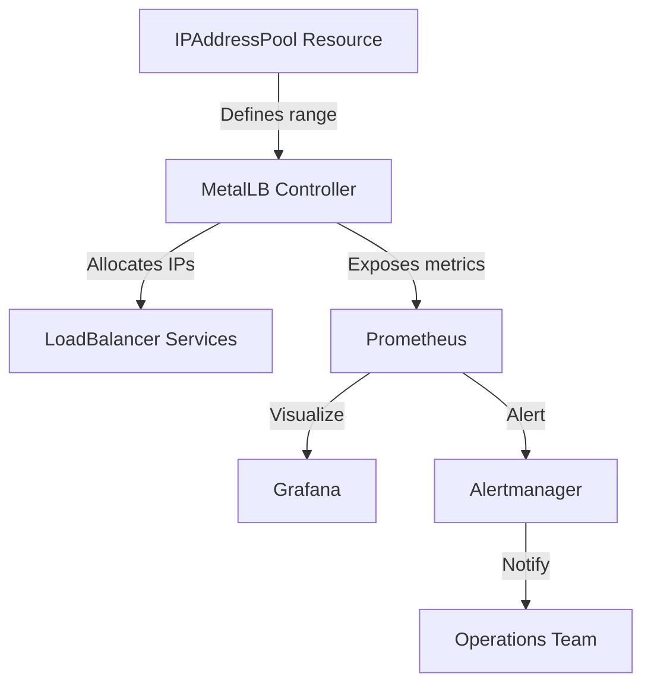
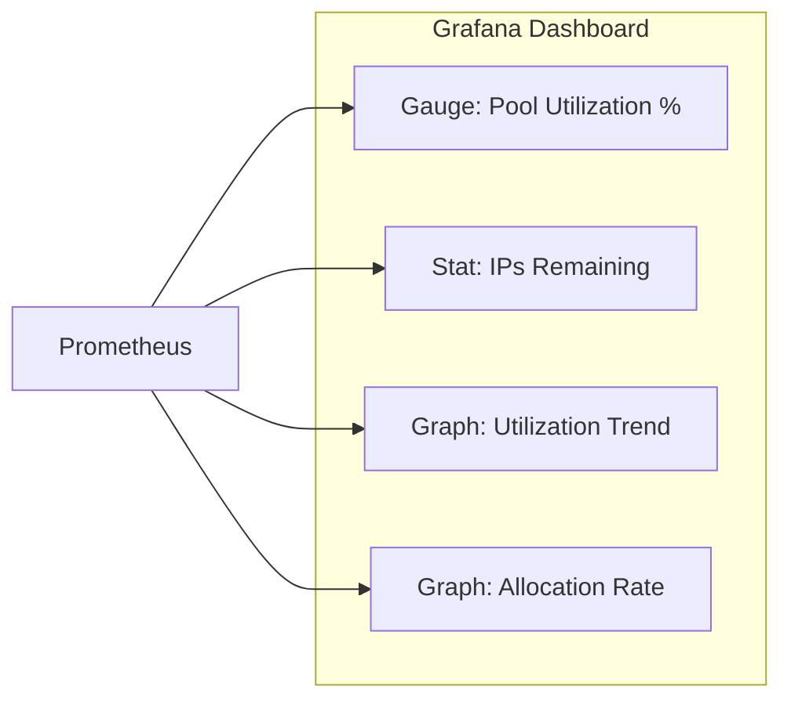

# How to Monitor MetalLB IP Pool Utilization with Prometheus

Author: [nawazdhandala](https://www.github.com/nawazdhandala)

Tags: Kubernetes, MetalLB, Prometheus, IP Pools, Monitoring

Description: Learn how to monitor MetalLB IP address pool utilization with Prometheus metrics and set up alerts for pool exhaustion.

---

Running out of IP addresses in your MetalLB pool means new LoadBalancer services stay in a pending state, unable to get an external IP. This is a silent failure - no existing services are affected, but new deployments quietly fail. Monitoring IP pool utilization with Prometheus lets you get ahead of exhaustion and plan capacity before it becomes a problem.

## Understanding MetalLB IP Pool Metrics

MetalLB's controller exposes two key metrics for IP pool monitoring:

- `metallb_allocator_addresses_total` - the total number of IP addresses available in each pool
- `metallb_allocator_addresses_in_use_total` - the number of IPs currently assigned to services



## Step 1: Configure Prometheus Scraping

Ensure Prometheus is scraping the MetalLB controller. The controller exposes metrics on its monitoring port.

```yaml
# metallb-servicemonitor.yaml
# ServiceMonitor for the MetalLB controller
# The controller is where IP allocation metrics are exposed
apiVersion: monitoring.coreos.com/v1
kind: ServiceMonitor
metadata:
  name: metallb-controller
  namespace: metallb-system
  labels:
    app: metallb
spec:
  selector:
    matchLabels:
      app.kubernetes.io/component: controller
      app.kubernetes.io/name: metallb
  namespaceSelector:
    matchNames:
      - metallb-system
  endpoints:
    - port: monitoring
      interval: 30s
      path: /metrics
---
# ServiceMonitor for MetalLB speakers
# Speakers expose per-node announcement metrics
apiVersion: monitoring.coreos.com/v1
kind: ServiceMonitor
metadata:
  name: metallb-speaker
  namespace: metallb-system
  labels:
    app: metallb
spec:
  selector:
    matchLabels:
      app.kubernetes.io/component: speaker
      app.kubernetes.io/name: metallb
  namespaceSelector:
    matchNames:
      - metallb-system
  endpoints:
    - port: monitoring
      interval: 30s
      path: /metrics
```

```bash
# Apply the ServiceMonitor resources
kubectl apply -f metallb-servicemonitor.yaml

# Verify Prometheus is scraping the targets
# Port-forward to Prometheus and check the targets page
kubectl port-forward -n monitoring svc/prometheus 9090:9090
# Visit http://localhost:9090/targets and look for metallb endpoints
```

## Step 2: Explore Available Metrics

Query Prometheus to see what IP pool metrics are available:

```bash
# Query total addresses per pool
curl -s 'http://localhost:9090/api/v1/query?query=metallb_allocator_addresses_total' \
  | jq '.data.result[] | {pool: .metric.pool, total: .value[1]}'

# Query addresses in use per pool
curl -s 'http://localhost:9090/api/v1/query?query=metallb_allocator_addresses_in_use_total' \
  | jq '.data.result[] | {pool: .metric.pool, in_use: .value[1]}'

# Calculate utilization percentage
curl -s 'http://localhost:9090/api/v1/query?query=(metallb_allocator_addresses_in_use_total/metallb_allocator_addresses_total)*100' \
  | jq '.data.result[] | {pool: .metric.pool, utilization_percent: .value[1]}'
```

## Step 3: Create Prometheus Alert Rules

Set up alerts that fire before pools are exhausted:

```yaml
# metallb-pool-alerts.yaml
# Prometheus alerting rules for MetalLB IP pool monitoring
apiVersion: monitoring.coreos.com/v1
kind: PrometheusRule
metadata:
  name: metallb-pool-alerts
  namespace: metallb-system
  labels:
    prometheus: kube-prometheus
    role: alert-rules
spec:
  groups:
    - name: metallb-ip-pools
      rules:
        # Warning: Pool is 80% utilized
        # This gives you time to plan capacity expansion
        - alert: MetalLBPoolUtilizationHigh
          expr: >
            (metallb_allocator_addresses_in_use_total
            / metallb_allocator_addresses_total) * 100 > 80
          for: 10m
          labels:
            severity: warning
          annotations:
            summary: "MetalLB IP pool {{ $labels.pool }} is {{ $value | printf \"%.0f\" }}% utilized"
            description: >
              IP address pool {{ $labels.pool }} has used more than 80%
              of its available addresses. Consider expanding the pool
              before it runs out.

        # Critical: Pool is 95% utilized
        # Immediate action needed to prevent allocation failures
        - alert: MetalLBPoolNearlyExhausted
          expr: >
            (metallb_allocator_addresses_in_use_total
            / metallb_allocator_addresses_total) * 100 > 95
          for: 5m
          labels:
            severity: critical
          annotations:
            summary: "MetalLB IP pool {{ $labels.pool }} is nearly exhausted at {{ $value | printf \"%.0f\" }}%"
            description: >
              IP address pool {{ $labels.pool }} is more than 95% utilized.
              New LoadBalancer services will fail to get an IP address
              if the pool is not expanded immediately.

        # Critical: Pool is completely exhausted
        - alert: MetalLBPoolExhausted
          expr: >
            metallb_allocator_addresses_in_use_total
            == metallb_allocator_addresses_total
          for: 1m
          labels:
            severity: critical
          annotations:
            summary: "MetalLB IP pool {{ $labels.pool }} is completely exhausted"
            description: >
              All IP addresses in pool {{ $labels.pool }} are allocated.
              New LoadBalancer services will remain in Pending state
              until addresses are freed or the pool is expanded.

        # Warning: Services stuck in pending state
        # This catches the symptom rather than the cause
        - alert: MetalLBServicePending
          expr: >
            kube_service_status_load_balancer_ingress == 0
            and kube_service_spec_type == "LoadBalancer"
          for: 10m
          labels:
            severity: warning
          annotations:
            summary: "LoadBalancer service {{ $labels.namespace }}/{{ $labels.service }} has no external IP"
            description: >
              Service {{ $labels.namespace }}/{{ $labels.service }} has been
              of type LoadBalancer for more than 10 minutes without receiving
              an external IP. This may indicate MetalLB pool exhaustion.
```

```bash
# Apply the alert rules
kubectl apply -f metallb-pool-alerts.yaml

# Verify the rules are loaded
kubectl port-forward -n monitoring svc/prometheus 9090:9090
# Check http://localhost:9090/rules
```

## Step 4: Build a Grafana Dashboard for IP Pools

```promql
# Panel 1: Current utilization per pool (gauge)
(metallb_allocator_addresses_in_use_total / metallb_allocator_addresses_total) * 100

# Panel 2: Addresses remaining per pool (stat)
metallb_allocator_addresses_total - metallb_allocator_addresses_in_use_total

# Panel 3: Utilization trend over time (time series)
(metallb_allocator_addresses_in_use_total / metallb_allocator_addresses_total) * 100

# Panel 4: Rate of IP allocation (time series)
# Positive rate means IPs are being allocated
# Negative rate means IPs are being freed
deriv(metallb_allocator_addresses_in_use_total[1h])
```



## Common Pitfalls

1. **Metrics not updating after pool change** - Restart the MetalLB controller to force metric recalculation.
2. **Orphaned IP allocations** - Deleted services sometimes leave stale IP allocations. Check with `kubectl get svc -A --field-selector type=LoadBalancer`.
3. **Pool overlap** - Overlapping pools cause incorrect utilization counts. Ensure all pools have non-overlapping address ranges.

## Conclusion

Monitoring MetalLB IP pool utilization with Prometheus is a critical part of running MetalLB in production. The three-tier alerting approach (80% warning, 95% critical, 100% exhausted) gives you progressive warnings that align with typical capacity planning timelines. The predictive alert using `predict_linear` adds an extra safety net by forecasting exhaustion based on historical trends.

For comprehensive monitoring that goes beyond infrastructure metrics, consider [OneUptime](https://oneuptime.com). While Prometheus tracks the internal state of your IP pools, OneUptime monitors the actual reachability of your LoadBalancer services from external networks. Together, they ensure that you know both when you are running low on IPs and when your services are actually unreachable, giving you complete visibility into your MetalLB-powered infrastructure.
